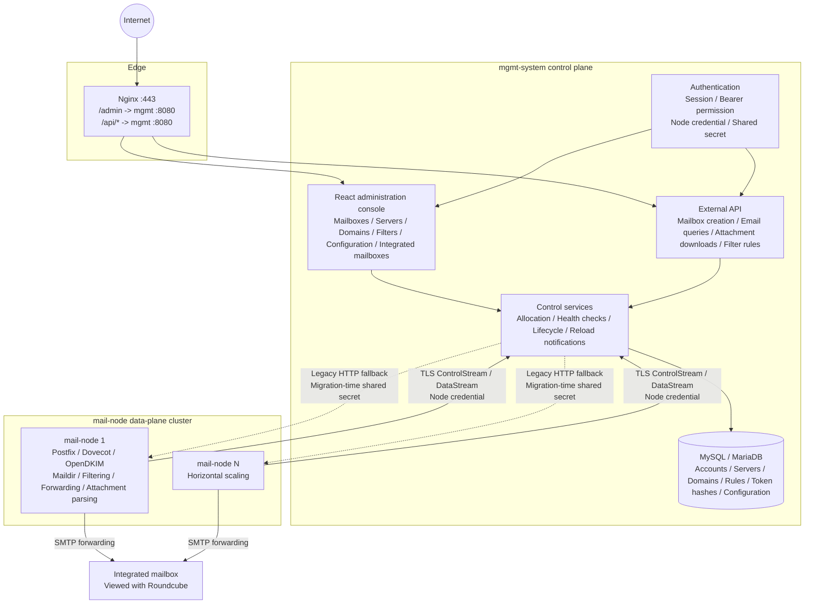

# MailHub

[简体中文](README.md) | [English](README.en.md) | [日本語](README.ja.md)

MailHub is a self-hosted mail system built on Postfix, Dovecot, and OpenDKIM. It places orchestration in the `mgmt-system` control plane, while `mail-node` data-plane servers handle actual mail delivery, Maildir storage, filtering, forwarding, and domain provisioning. It is designed for provisioning business mailboxes at scale, aggregating incoming mail, and exposing structured email through APIs to business applications or LLM-based systems.

The current codebase includes a multi-server mail pool, automated domain and DKIM management, a React administration console in Chinese, English, and Japanese, filtering and forwarding, hot-swappable integrated mailboxes, dynamic configuration, trash lifecycle management, structured email queries, attachment downloads, and inline-image compatibility.

---

## Interface

> The screenshots below use sanitized sample data. Menus and behavior reflect the current console.

### Operations overview


The dashboard brings node health, mailbox growth, capacity, and operational alerts together, with direct access to mailbox creation, email queries, and server management.

### Mailbox management


The mailbox page filters accounts by domain, server, and status and provides single or batch provisioning, credential export, password changes, trash recovery, and integrated-mailbox switching.

## Basic workflow

1. **Deploy and sign in**: follow the [control-plane deployment guide](docs/control-plane-deployment.md) to prepare the database, configuration, and administrator bootstrap, then open `https://<management-domain>/admin/login`. If bootstrap used `--must-change-password`, change the password on first sign-in.
2. **Connect mail resources**: register each `mail-node` in **Server Pool**, bind its domains, and complete DNS, Postfix, Dovecot, and OpenDKIM setup using the [data-plane deployment guide](docs/design/deployment-guide.md). Migrate existing Legacy nodes in place, one at a time, with the canary and rollback procedure in the [node enrollment and dual-migration production runbook](docs/node-registration-operations-runbook.md). Only healthy nodes become eligible for automatic allocation.
3. **Create mailboxes**: open **Mailbox Accounts > Create Mailbox**. Let MailHub choose a healthy node and domain or select them explicitly; provision one account, paste a batch, or import CSV/TXT.
4. **Receive and inspect email**: enter a full mailbox address under **Email Query** to inspect bodies, HTML previews, and attachments. To aggregate delivery, select the active forwarding target under **Mailbox Accounts > Integrated Mailbox**.
5. **Expose the business API**: create a caller under **External Access**, grant only the required capabilities, and issue a token. The complete token is shown once; send it as `Authorization: Bearer <token>`. See the [external API guide](docs/api/external-api.md) for endpoints and permissions.

### Rotating node credentials

Initial enrollment and credential rotation both issue a new node credential, but delivery differs. `mail-node enroll` writes the initial credential to the node automatically. A rotation shows the new credential once in System and does not deliver it to the node.

1. Open **Server Pool**, select the key icon for the target node, and choose **Rotate credential**.
2. Copy the one-time credential immediately. Do not place it in chat, screenshots, command arguments, or shell history.
3. Securely replace `management.credential_file` on the target node. The default path is `/var/lib/mail-node/identity/credential`.
4. Restart `mail-node`. Confirm in System that the node returns to `connected / ready` and that the new active credential has a recent last-used time.
5. End the old-credential overlap only after confirming the new credential is in use, then remove revoked or expired records as needed.

System stores only credential hashes and metadata. Plaintext cannot be recovered after closing the one-time dialog; rotate again if it is lost or exposed. Do not use **Revoke all credentials** as a replacement for rotation because that removes the node from its enrolled state. See [credential rotation and installation](docs/node-registration-operations-runbook.md#12-凭证轮转与安装) for secure write commands, failure recovery, and acceptance gates.

---

## Features

### Control plane: `mgmt-system`

- Administration console: React SPA under `/admin/*`, protected by session authentication.
- External APIs: `/api/v1/mailboxes`, `/api/v1/orders/*/emails`, `/api/v1/mailboxes/*/messages`, and `/api/v1/emails/*`. Administrators create external applications, grant individual capabilities, and issue Bearer tokens from the console.
- Node communication: enrolled nodes establish outbound ControlStream/DataStream connections with independent credentials. During migration, `/api/v1/internal/*` and node port `8081` retain compatible shared-secret/node-credential authentication; the shared secret is removed only after final convergence.
- Resource management: mailbox accounts, server pool, domain pool, filter rules, system configuration, and integrated mailboxes.
- Scheduling: health checks, heartbeat ingestion, lifecycle watchdogs, soft-deletion expiry, and configuration/rule reload notifications.
- Storage: MySQL or MariaDB. The control plane uses GORM AutoMigrate on startup to create or update current tables and retains the migration path from historical `order_mailboxes` records to the current account model.

### Data plane: `mail-node`

- Co-located mail services: Postfix for receiving mail, Dovecot for storage, and OpenDKIM for signing configuration.
- Mailbox operations: create mailboxes, change passwords, delete safely, and restore from `.trash`.
- Domain operations: provision Postfix virtual domains and write DKIM keys, SigningTable, and KeyTable entries.
- Mail processing: scan Maildir `new/` and `cur/`, apply `pass / flag / block` rules, and forward via SMTP to the active integrated mailbox.
- Email access: parse MIME into structured headers, bodies, and attachment metadata. A bounded local-path index supports body reads, previews, and binary attachment downloads.
- Compatibility: infer types and extensions from magic bytes for inline images with missing filenames, missing extensions, or incorrect `application/octet-stream` types. API reads, HTML previews, and SMTP forwarding use the same behavior.
- Node identity: permanent `node_uuid`, independent per-node credentials, outbound ControlStream/DataStream connections, and per-node `legacy_http / dual / control_stream` transport gates.

---

## Architecture



See the [architecture overview](docs/architecture-overview.md) for the complete data model, API flows, and runtime constraints.

---

## Technology

| Layer | Technology | Purpose |
|------|------|----------|
| Backend | Go 1.22+, Gin, GORM | Control-plane and data-plane services |
| Database | MySQL 8.0 / MariaDB 10.5+ | Control-plane metadata |
| Mail services | Postfix, Dovecot, OpenDKIM | Data-plane mail delivery, storage, and signing |
| Administration console | React, Vite, i18next | `/admin/*` SPA with Chinese, English, and Japanese |
| Webmail | Roundcube 1.6+ | View aggregated mail in the integrated mailbox |
| Deployment | systemd, Nginx | Bare-metal and cloud deployments |

---

## Repository Layout

```text
.
├── mgmt-system/
│   ├── cmd/server/                 # Control-plane entry point
│   ├── internal/
│   │   ├── handler/                # HTTP handlers
│   │   ├── service/                # Mailbox creation, account import, allocation
│   │   ├── store/                  # GORM data access, dynamic configuration, migrations
│   │   ├── middleware/             # Session / Bearer / Shared-secret authentication
│   │   ├── healthcheck/            # Active health checks
│   │   └── lifecycle/              # Lifecycle watchdog / purge
│   ├── web/                        # React SPA source
│   ├── template/static/admin-app/  # Built SPA assets
│   └── config.example.yaml
├── mail-node/
│   ├── cmd/node/                   # Data-plane entry point
│   ├── internal/
│   │   ├── mailbox/                # Maildir, account configuration, passwords
│   │   ├── forward/                # Scanning, filtering, SMTP forwarding, lifecycle
│   │   ├── handler/                # Internal APIs, MIME parsing, attachment downloads
│   │   ├── domain/                 # Virtual domains and DKIM
│   │   ├── filter/                 # Filter engine
│   │   └── config/                 # YAML and remote dynamic configuration
│   └── config.example.yaml
└── docs/
    ├── architecture-overview.md    # Current architecture source of truth
    ├── api/external-api.md         # External API contract source of truth
    └── design/                     # Topic designs, historical designs, deployment docs
```

---

## Development and Operation

### Choose the runtime scope first

MailHub is not a monolithic application that can perform real mail delivery by starting only its Go processes. A complete system consists of:

```text
MariaDB/MySQL
  -> mgmt-system control plane and administration console
  -> at least one mail-node data plane
  -> Postfix + Dovecot + OpenDKIM
  -> DNS, SMTP ports 25/587, and optional Roundcube
```

Starting the control plane is enough for administration-console development, control-plane API work, and unit tests. Real inbound mail, Maildir, DKIM, SMTP forwarding, and IMAP verification also require a Linux data plane.

### What must be done manually for the database

**No deployment mode requires manually creating business tables.** On every startup, `mgmt-server` runs GORM AutoMigrate to create or update the current schema and seed required defaults.

| Item | Recommended Docker Compose deployment | Self-managed MySQL/MariaDB |
|------|---------------------------------------|----------------------------|
| Database service | Compose pulls and starts MariaDB automatically | Install the service or start a container yourself |
| `email_mgmt` database | Created by the MariaDB container on first startup | Create an empty database and application account first |
| Business tables and columns | Created/upgraded by `mgmt-server` | Created/upgraded by `mgmt-server` |
| DDL permissions | Granted to the application account by Compose | Keep `CREATE`, `ALTER`, `INDEX`, `DROP`, `REFERENCES`, and normal read/write privileges |
| Administrator initialization | Performed by the Compose `bootstrap` service | Run `admin bootstrap` once before first startup |

With the repository Compose deployment, you do not run `CREATE DATABASE` or `CREATE TABLE`, and you do not need to run `docker pull mariadb` in advance. When running the Go program directly against an external database, create the empty `email_mgmt` database and its application account first; the application always manages the tables.

### Path 1: start the control plane quickly

This is the recommended path for trying the administration console locally and deploying the control plane. It requires Docker Engine and Docker Compose v2.

From the repository root:

```bash
cd deploy/docker
cp .env.example .env
cp secrets/admin_password.example secrets/admin_password
chmod 600 .env secrets/admin_password
```

On Windows PowerShell:

```powershell
Set-Location deploy/docker
Copy-Item .env.example .env
Copy-Item secrets/admin_password.example secrets/admin_password
```

Edit the following files:

- `.env`: set different values for `MAILHUB_DB_PASSWORD` and `MAILHUB_DB_ROOT_PASSWORD`, plus a sufficiently long `MAILHUB_SHARED_SECRET`.
- `secrets/admin_password`: store only the initial administrator password; release mode requires at least 12 characters.
- `mgmt-config.yaml`: replace `domains` with the real mail domain. A test domain is sufficient when only evaluating the local interface.

Never commit `.env`, `secrets/admin_password`, or a real `config.yaml` file.

Validate and start:

```bash
docker compose config --quiet
docker compose up -d --build
docker compose ps
```

Compose starts services in this order:

```text
MariaDB healthy
  -> bootstrap initializes the administrator and exits 0
  -> mgmt-system starts
```

Verify the deployment:

```bash
curl -fsS http://127.0.0.1:8080/health
curl -fsS http://127.0.0.1:8080/health/ready
docker compose logs --no-log-prefix bootstrap
docker compose logs --tail=100 mgmt
```

Open the administration console at `http://127.0.0.1:8080/admin/`. Compose binds only to the loopback interface by default. Use a TLS reverse proxy for remote access instead of exposing the control-plane port directly to the Internet.

The current Compose stack contains only MariaDB and `mgmt-system`. It does not include `mail-node`, Postfix, Dovecot, or OpenDKIM, so it runs the complete control plane but cannot deliver real mail by itself.

### Path 2: run the control plane from source

Use this path to debug the Go API or React interface. It requires Go 1.22+, Node.js 20+, and a reachable MySQL 8.0 or MariaDB 10.5+ instance.

When not using the Compose deployment above, create an empty database and application account first. **Create and grant access to the database only; do not create business tables manually.** See the [control-plane deployment guide](docs/control-plane-deployment.md#3-裸机systemd-新部署) for the standard SQL and permission list.

Prepare the configuration:

```bash
cp mgmt-system/config.example.yaml mgmt-system/config.yaml
```

At minimum, update:

- `database.dsn`: point to an existing `email_mgmt` database.
- `auth.shared_secret`: use a long random value. A mail-node in the Legacy/dual phase must use the same value.
- `domains`: set the real domain or a development test domain.
- `node_control.enabled`: keep this `false` for basic local development.

Build and initialize the administrator:

```bash
cd mgmt-system
go build -o mgmt-server ./cmd/server
./mgmt-server admin bootstrap \
  --config ./config.yaml \
  --username admin \
  --password-file /path/to/initial-admin-password \
  --must-change-password
./mgmt-server serve
```

In release mode, `serve` refuses to start until bootstrap is complete. Administrator login validates only the bcrypt hash stored in the database; `auth.admin_user` and `auth.admin_pass` are deprecated. Use `admin reset-password` for recovery. Existing deployments can perform a one-time legacy credential migration with:

```bash
./mgmt-server admin bootstrap-from-config --config ./config.yaml
```

For React development, start a second terminal:

```bash
cd mgmt-system/web
npm ci
npm run dev
```

Vite listens at `http://127.0.0.1:5173/` by default. The production image builds the frontend during the Docker build and packages the assets into `mgmt-system`, so Vite does not run separately in production.

### Path 3: add mail-node for real mail delivery

Deploy the data plane on Linux. Windows can start `mail-node` for configuration, HTTP API, and partial business-logic debugging, but it cannot replace production Postfix, Dovecot, and OpenDKIM.

Prepare the following first:

- A Linux host supporting Postfix, Dovecot, and OpenDKIM, with a fixed `vmail` UID/GID.
- A manageable mail domain with correct A, MX, SPF, DKIM, and DMARC records.
- A usable SMTP port 25. Open authenticated, TLS-protected port 587 when clients must send mail.
- A `mgmt-system` instance whose `/health/ready` endpoint succeeds.

Copy and edit the node configuration:

```bash
cp mail-node/config.example.yaml mail-node/config.yaml
```

Review these settings carefully:

- `management.api_url`: a control-plane URL reachable from mail-node; do not leave `127.0.0.1` when deploying across hosts.
- `shared_secret`: must match the control plane during the Legacy/dual phase.
- `maildir.base_path`, `vmail_uid`, and `vmail_gid`: must match the Postfix/Dovecot virtual-user configuration.
- `forward.smtp_*`: SMTP settings for the integrated mailbox. Never commit real credentials.
- `filter.outbox_path` and `filter.quarantine_base`: use persistent paths; quarantine must remain outside Maildir and the Dovecot namespace.
- `postfix.*` and `dkim.*`: point to the Postfix map files, OpenDKIM key directory, and SigningTable/KeyTable.
- `management.transport_mode`: register a new node before enabling its control transport. During migration, preserve the `legacy_http -> dual -> control_stream` canary and rollback gates.

Build a Linux binary:

```bash
cd mail-node
CGO_ENABLED=0 GOOS=linux GOARCH=amd64 go build -o mail-node ./cmd/node
```

After installing Postfix, Dovecot, OpenDKIM, the systemd unit, and required file permissions, start the services:

```bash
systemctl enable postfix dovecot opendkim mail-node
systemctl restart postfix dovecot opendkim mail-node
systemctl status postfix dovecot opendkim mail-node
curl -fsS http://127.0.0.1:8081/internal/health
```

Next, create an enrollment invitation from Server Pool and run `mail-node enroll` on the node. The administrator verifies the UUID, Request ID, machine fingerprint, and source before approval. The node may participate in automatic mailbox allocation only after it receives its independent credential, establishes the Control/Data channels, and passes ready/lease checks.

Postfix, Dovecot, OpenDKIM, DNS, systemd, enrollment, and acceptance require additional commands. Follow all of these documents:

- [Data-plane deployment guide](docs/design/deployment-guide.md)
- [Node enrollment guide](docs/node-registration-guide.md)
- [Node enrollment and dual-migration production runbook](docs/node-registration-operations-runbook.md)

Roundcube is optional and does not affect startup of the MailHub control plane or mail-node. Install it from the data-plane guide only when Webmail is required.

### Database upgrade boundaries

- New deployments create all current business tables automatically and do not create the historical plaintext `api_tokens` table.
- On the first upgrade from an older version, the service updates the schema before migrating enabled plaintext tokens from the database and old configuration to hashed credentials. Any failure prevents startup.
- After confirming the external APIs work and `api_tokens` no longer exists, remove `auth.tokens` from the actual configuration.
- After `api_tokens` is deleted, do not roll back only the binary. Restore both the pre-upgrade database backup and its matching configuration file.

### Development verification

```bash
go test -C mgmt-system ./...
go vet -C mgmt-system ./...
go test -C mail-node ./...
go vet -C mail-node ./...
go test -C filter-contract ./...
go test -C node-contract ./...

cd mgmt-system/web
npm ci
npm test
npm run build
```

A real release also requires smoke and acceptance evidence for control-plane `/health` and `/health/ready`, mail-node `/internal/health`, SMTP reception, IMAP reads, DKIM signatures, forwarding, and attachment downloads.

---

## Documentation

### Current Sources of Truth

| Document | Purpose |
|------|------|
| [Architecture overview](docs/architecture-overview.md) | Current component responsibilities, data model, API flows, and state machines |
| [Database dictionary](docs/database-schema.md) | Current control-plane tables, fields, relationships, state values, and comments |
| [External API guide](docs/api/external-api.md) | Interfaces, authentication, response envelopes, and attachment downloads for external clients |
| [Control-plane deployment guide](docs/control-plane-deployment.md) | Docker Compose, systemd, administrator bootstrap, upgrades, and recovery |
| [Data-plane deployment guide](docs/design/deployment-guide.md) | DNS, Postfix, Dovecot, OpenDKIM, and Roundcube for a new mail-node |
| [Deployment capacity and attachment-storage boundaries](docs/deployment-capacity.md) | Server sizing, performance boundaries, disk planning, and the future MinIO baseline for the current local-storage architecture |
| [Node enrollment and dual-migration production runbook](docs/node-registration-operations-runbook.md) | Per-node enrollment, credential rotation, connectivity, canary, rollback, final convergence, and handoff checklists |

### Current Topic Designs

| Document | Purpose |
|------|------|
| [Dynamic configuration](docs/design/dynamic-config-design.md) | `system_configs`, administration UI, and hot reload |
| [Integrated mailboxes](docs/design/integrated-mailbox-design.md) | Forwarding target pool and the active integrated mailbox |
| [Attachment downloads](docs/design/attachment-download-design.md) | Attachment proxy, binary responses, and safe HTML previews |
| [Maildir message path index](docs/design/maildir-message-index-design.md) | Lightweight local index, cold lookup, invalidation, and targeted single-pass parsing |
| [MIME body projection, media detection, and safe preview](docs/design/mime-media-detection-and-safe-preview-design.md) | Authoritative v2 contract for MIME trees, body selection, CID scope, media policy, Range/HEAD, forwarding, and safe rendering |
| [MIME body projection, media detection, and safe-preview implementation plan](docs/design/mime-media-detection-implementation-plan.md) | Real fixtures, shared DAG, test gates, rollback, and persistence prerequisites |
| [Asynchronous MIME parsing and persistent read model](docs/design/async-mime-read-model-design.md) | Parse-once ingestion, read model, blob storage, consistency, and migration boundaries |
| [Inline-image compatibility](docs/design/inline-image-filename-inference-design.md) | Type/extension inference and Roundcube compatibility |
| [Lifecycle recovery](docs/design/t9-restore-design.md) | `.trash` recovery and conflict handling |
| [Server and domain pool](docs/design/t4-t5-server-domain-pool-design.md) | Server-domain binding, DKIM, and DNS records |
| [Authentication](docs/design/t6-auth-design.md) | Session, Bearer scope, and shared-secret authentication |
| [Health checks](docs/design/t7-healthcheck-design.md) | Active probes, passive heartbeats, and status transitions |
| [Administrator bootstrap and recovery](docs/design/ui-second-optimization-p5-admin-bootstrap-design.md) | First-time initialization, database login, password changes, CLI recovery, and login UI |

### Node Architecture Evolution

The following documents cover completed NR-P0-NR-P6 work, implemented NR-P7 code, and the remaining remote acceptance. Use the node enrollment guide for current operations; capabilities without remote acceptance are not considered complete production cutovers.

| Document | Purpose |
|------|------|
| [Node enrollment, identity, and outbound control-channel design](docs/design/node-enrollment-control-channel-design.md) | Permanent UUID, one-time enrollment, per-node credentials, outbound control channels, and migration strategy |
| [Node enrollment discovery and outbound control-channel implementation plan](docs/design/node-registration-control-channel-implementation-plan.md) | Scope, protocol, data model, phases, tests, and completion criteria for the current P0 track |
| [NR-P6 DataStream migration acceptance record](docs/design/node-registration-p6-data-stream.md) | DataStream sessions, streaming reads, cancellation, rate limits, and Control/Data isolation evidence |
| [Node enrollment and cluster-join guide](docs/node-registration-guide.md) | Standard approval, strict UUID prebinding, enrollment verification, recovery, and security checks |
| [NR-P7 canary and Legacy rollback status](docs/design/node-registration-p7-canary-rollback.md) | Transport gates, current production acceptance boundary, and remaining convergence conditions |
| [Node enrollment and dual-migration production runbook](docs/node-registration-operations-runbook.md) | Frontline enrollment and credential rotation, success gates, troubleshooting, rollback, and handoff templates |

### Historical and Planning Documents

These files preserve decision history and earlier proposals. They are not current implementation sources of truth. When they conflict with current code, the [architecture overview](docs/architecture-overview.md), or the [external API guide](docs/api/external-api.md), follow the current code and source-of-truth documents.

| Document | Description |
|------|------|
| [Technical implementation](docs/design/technical-implementation.md) | Current implementation summary replacing the early Phase 1 draft |
| [Phase 1 design](docs/design/phase1-design.md) | Initial design record |
| [Phase 3 completion plan](docs/design/phase3-mgmt-completion-plan.md) | Phase 3 planning and acceptance record |
| [Forwarding design](docs/design/forwarding-design.md) | Early forwarding design and later notes |
| [Roundcube reference](docs/roundcube-analysis.md) | Roundcube technical reference |

---

## Project Status

| Module | Status |
|------|------|
| Mailbox account management, batch creation, CSV upload | Complete |
| Multi-server pool, domain pool, DKIM, DNS records | Complete |
| React administration console (简体中文 / English / 日本語) | Complete |
| Three-layer authentication | Complete |
| UUID enrollment, per-node credentials, outbound ControlStream/DataStream, leases, and durable commands | NR-P0-NR-P7 code complete; the first production node is in `dual`; full business canary, rollback drill, remaining nodes, and final port `8081` shutdown are pending |
| Filter rules, active reloads, Maildir forwarding | Complete |
| Integrated mailbox management and SMTP credential hot reload | Complete |
| Basic structured MIME parsing, body queries, attachment downloads | Complete; complex body-tree projection and safe rendering are now the highest-priority redesign |
| Maildir Message-ID path index and targeted single-pass parsing | Complete |
| Trash, restore, purge, deletion recovery after restart | Complete |
| Inline-image MIME, filename, and extension compatibility | Complete |
| Administrator bootstrap, database login, password changes, and CLI recovery | Complete |

### Current Backlog

| Priority | Item | Status |
|--------|------|------|
| P0 (development) | MIME body projection and safe rendering | Design and implementation contracts are ready; fix real fixtures, body-tree semantics, and safe CID rendering before asynchronous persistence |
| P0 (operations) | Node enrollment discovery and outbound control channel | NR-P7 code complete; the first production Legacy node is enrolled in place with Control/Data connected and `dual` enabled; full business canary, rollback drill, remaining nodes, and final control_stream convergence are pending |
| P1 | General node-configuration overrides and observability | Design draft; implementation follows MIME P0 and current node-operations convergence |
| Paused | Advertising-mail filter refactor S11/S12 | Keep `dual_shadow/false`; do not continue policy, sample, or automatic-quarantine work before node enrollment converges |
| Candidate | Allow external mailbox creation API to select `server_id` | Not scheduled; client permissions and node-allocation policy must be decided first |
| Candidate | MinIO attachment object storage and presigned URLs | Build after capacity triggers are reached; use the deployment-capacity document as the server baseline |
