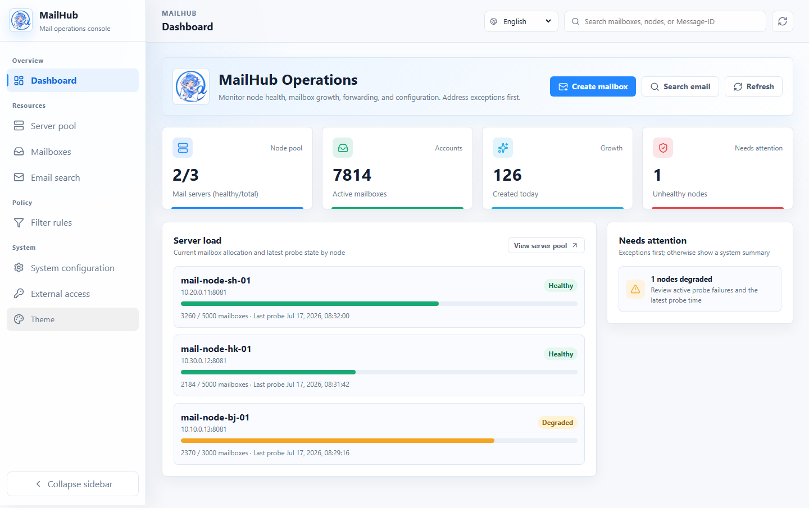
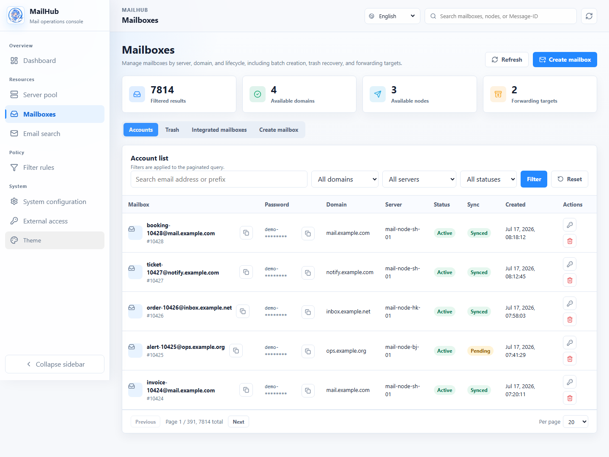
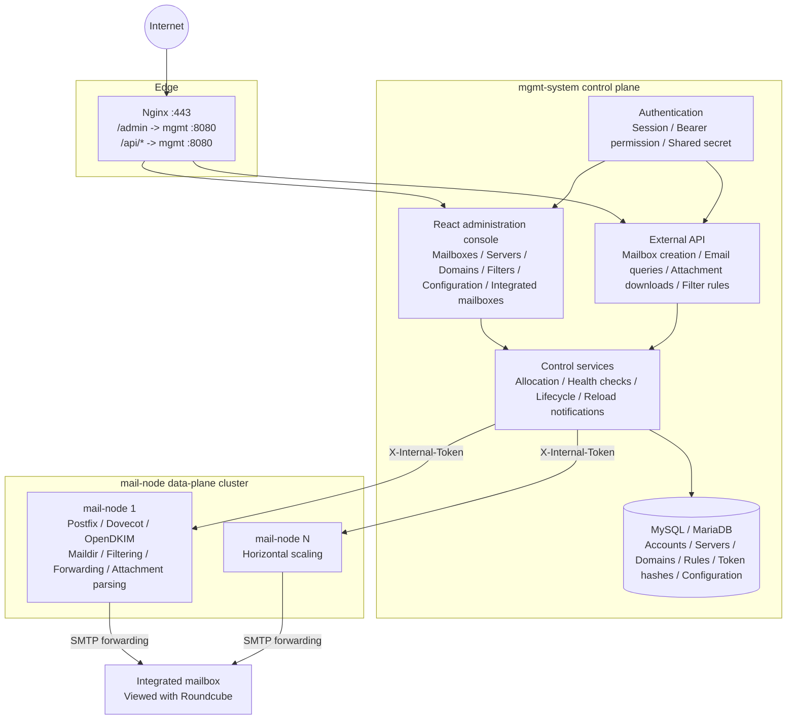

# MailHub

[简体中文](README.md) | [English](README.en.md) | [日本語](README.ja.md)

MailHub is a self-hosted mail system built on Postfix, Dovecot, and OpenDKIM. It places orchestration in the `mgmt-system` control plane, while `mail-node` data-plane servers handle actual mail delivery, Maildir storage, filtering, forwarding, and domain provisioning. It is designed for provisioning business mailboxes at scale, aggregating incoming mail, and exposing structured email through APIs to business applications or LLM-based systems.

The current codebase includes a multi-server mail pool, automated domain and DKIM management, a React administration console in Chinese, English, and Japanese, filtering and forwarding, hot-swappable integrated mailboxes, dynamic configuration, trash lifecycle management, structured email queries, attachment downloads, and inline-image compatibility.

---

## Interface

> The screenshots below use sanitized sample data. Menus and behavior reflect the current console.

### Operations overview



The dashboard brings node health, mailbox growth, capacity, and operational alerts together, with direct access to mailbox creation, email queries, and server management.

### Mailbox management



The mailbox page filters accounts by domain, server, and status and provides single or batch provisioning, credential export, password changes, trash recovery, and integrated-mailbox switching.

## Basic workflow

1. **Deploy and sign in**: follow the [control-plane deployment guide](docs/control-plane-deployment.md) to prepare the database, configuration, and administrator bootstrap, then open `https://<management-domain>/admin/login`. If bootstrap used `--must-change-password`, change the password on first sign-in.
2. **Connect mail resources**: register each `mail-node` in **Server Pool**, bind its domains, and complete DNS, Postfix, Dovecot, and OpenDKIM setup using the [data-plane deployment guide](docs/design/deployment-guide.md). Healthy nodes become eligible for automatic allocation.
3. **Create mailboxes**: open **Mailbox Accounts > Create Mailbox**. Let MailHub choose a healthy node and domain or select them explicitly; provision one account, paste a batch, or import CSV/TXT.
4. **Receive and inspect email**: enter a full mailbox address under **Email Query** to inspect bodies, HTML previews, and attachments. To aggregate delivery, select the active forwarding target under **Mailbox Accounts > Integrated Mailbox**.
5. **Expose the business API**: create a caller under **External Access**, grant only the required capabilities, and issue a token. The complete token is shown once; send it as `Authorization: Bearer <token>`. See the [external API guide](docs/api/external-api.md) for endpoints and permissions.

---

## Features

### Control plane: `mgmt-system`

- Administration console: React SPA under `/admin/*`, protected by session authentication.
- External APIs: `/api/v1/mailboxes`, `/api/v1/orders/*/emails`, `/api/v1/mailboxes/*/messages`, and `/api/v1/emails/*`. Administrators create external applications, grant individual capabilities, and issue Bearer tokens from the console.
- Internal APIs: `/api/v1/internal/*`, authenticated between mgmt-system and mail-node with a shared `X-Internal-Token` secret.
- Resource management: mailbox accounts, server pool, domain pool, filter rules, system configuration, and integrated mailboxes.
- Scheduling: health checks, heartbeat ingestion, lifecycle watchdogs, soft-deletion expiry, and configuration/rule reload notifications.
- Storage: MySQL or MariaDB. The control plane uses GORM AutoMigrate on startup to create or update current tables and retains the migration path from historical `order_mailboxes` records to the current account model.

### Data plane: `mail-node`

- Co-located mail services: Postfix for receiving mail, Dovecot for storage, and OpenDKIM for signing configuration.
- Mailbox operations: create mailboxes, change passwords, delete safely, and restore from `.trash`.
- Domain operations: provision Postfix virtual domains and write DKIM keys, SigningTable, and KeyTable entries.
- Mail processing: scan Maildir `new/` and `cur/`, apply `pass / flag / block` rules, and forward via SMTP to the active integrated mailbox.
- Email access: parse MIME into structured headers, bodies, and attachment metadata, with binary attachment downloads.
- Compatibility: infer types and extensions from magic bytes for inline images with missing filenames, missing extensions, or incorrect `application/octet-stream` types. API reads, HTML previews, and SMTP forwarding use the same behavior.

---

## Architecture



See the [architecture overview](docs/architecture-overview.md) for the complete data model, API flows, and runtime constraints.

---

## Technology

| Layer | Technology | Purpose |
|------|------|----------|
| Backend | Go 1.22+, Gin, GORM | Control-plane and data-plane services |
| Database | MySQL 8.0 / MariaDB 10.5+ | Control-plane metadata |
| Mail services | Postfix, Dovecot, OpenDKIM | Data-plane mail delivery, storage, and signing |
| Administration console | React, Vite, i18next | `/admin/*` SPA with Chinese, English, and Japanese |
| Webmail | Roundcube 1.6+ | View aggregated mail in the integrated mailbox |
| Deployment | systemd, Nginx | Bare-metal and cloud deployments |

---

## Repository Layout

```text
.
├── mgmt-system/
│   ├── cmd/server/                 # Control-plane entry point
│   ├── internal/
│   │   ├── handler/                # HTTP handlers
│   │   ├── service/                # Mailbox creation, account import, allocation
│   │   ├── store/                  # GORM data access, dynamic configuration, migrations
│   │   ├── middleware/             # Session / Bearer / Shared-secret authentication
│   │   ├── healthcheck/            # Active health checks
│   │   └── lifecycle/              # Lifecycle watchdog / purge
│   ├── web/                        # React SPA source
│   ├── template/static/admin-app/  # Built SPA assets
│   └── config.example.yaml
├── mail-node/
│   ├── cmd/node/                   # Data-plane entry point
│   ├── internal/
│   │   ├── mailbox/                # Maildir, account configuration, passwords
│   │   ├── forward/                # Scanning, filtering, SMTP forwarding, lifecycle
│   │   ├── handler/                # Internal APIs, MIME parsing, attachment downloads
│   │   ├── domain/                 # Virtual domains and DKIM
│   │   ├── filter/                 # Filter engine
│   │   └── config/                 # YAML and remote dynamic configuration
│   └── config.example.yaml
└── docs/
    ├── architecture-overview.md    # Current architecture source of truth
    ├── api/external-api.md         # External API contract source of truth
    └── design/                     # Topic designs, historical designs, deployment docs
```

---

## Quick Start

### 1. Prerequisites

- Control-plane host: MySQL 8.0 or MariaDB 10.5+.
- At least one data-plane host with SMTP port 25 open and Postfix, Dovecot, and OpenDKIM installed.
- A mail domain with manageable DNS records.

### 2. Configuration

```bash
cp mgmt-system/config.example.yaml mgmt-system/config.yaml
cp mail-node/config.example.yaml mail-node/config.yaml
```

Important settings:

- `database.dsn`: control-plane database connection.
- Administrator credentials: write the bcrypt hash to the database with `mgmt-server admin bootstrap`. `auth.admin_user` and `auth.admin_pass` are deprecated and are not used for runtime login.
- `auth.shared_secret`: must match between mgmt-system and every mail-node.
- External API tokens: create them from the External Access page after the control plane starts. Do not configure `auth.tokens` for new deployments.
- `management.api_url`: mgmt-system URL used by mail-node.
- `forward.smtp_*`: SMTP connection settings for forwarding. The forwarding target is managed through Integrated Mailboxes and synchronized into dynamic configuration.
- `dkim.*`, `postfix.*`, and `maildir.*`: paths used to provision Postfix, Dovecot, and OpenDKIM on data-plane hosts.

#### Automatic Database Setup and Upgrades

`mgmt-server` automatically creates and updates table structures, but it does not create the database named in the DSN. Create the database before deployment and grant the database account `CREATE`, `ALTER`, `INDEX`, `DROP`, and normal read/write privileges. The service refuses to start when required permissions are missing.

- New deployments: create `api_applications`, `api_credentials`, `api_permissions`, `api_resources`, `api_application_permissions`, `api_access_logs`, and other current tables. The historical plaintext `api_tokens` table is not created.
- Upgrades from older versions: on first startup, create or update current tables, then import enabled tokens from `api_tokens` and existing `auth.tokens` entries as hashed credentials. Each credential must be verified successfully before `api_tokens` is deleted. Any failure prevents service startup.
- After a successful upgrade: verify external APIs and confirm that `api_tokens` no longer exists, then remove `auth.tokens` from the actual configuration file. New external credentials can only be issued from the administration console.
- Rollback restriction: do not run an old binary after `api_tokens` has been deleted. Older versions may recreate the plaintext table and restore tokens from old configuration. A rollback must restore both the pre-upgrade database backup and its matching configuration file.

Initialize the administrator before starting the control plane for the first time:

```bash
./mgmt-server admin bootstrap \
  --config ./config.yaml \
  --username admin \
  --password-file /run/secrets/mailhub_initial_admin_password \
  --must-change-password

./mgmt-server serve
```

Use `admin reset-password` for explicit account recovery. In production mode, `serve` refuses to start until bootstrap is complete. Runtime login only validates the bcrypt hash stored in the database. See [O2-P5 administrator bootstrap and recovery design](docs/design/ui-second-optimization-p5-admin-bootstrap-design.md) for migration and recovery details.

Existing deployments can perform a one-time import from legacy configuration. It only applies when no administrator has been initialized and forces a password change on first login:

```bash
./mgmt-server admin bootstrap-from-config --config ./config.yaml
```

### 3. Build

```bash
cd mgmt-system
go build -o mgmt-server ./cmd/server

cd ../mail-node
CGO_ENABLED=0 GOOS=linux GOARCH=amd64 go build -o mail-node ./cmd/node
```

### 4. Deploy

See the [data-plane deployment guide](docs/design/deployment-guide.md) for DNS, Postfix, Dovecot, OpenDKIM, and Roundcube setup on a new mail-node. Basic control-plane configuration is documented here and in `mgmt-system/config.example.yaml`.

---

## Documentation

### Current Sources of Truth

| Document | Purpose |
|------|------|
| [Architecture overview](docs/architecture-overview.md) | Current component responsibilities, data model, API flows, and state machines |
| [Database dictionary](docs/database-schema.md) | Current control-plane tables, fields, relationships, state values, and comments |
| [External API guide](docs/api/external-api.md) | Interfaces, authentication, response envelopes, and attachment downloads for external clients |
| [Control-plane deployment guide](docs/control-plane-deployment.md) | Docker Compose, systemd, administrator bootstrap, upgrades, and recovery |
| [Data-plane deployment guide](docs/design/deployment-guide.md) | DNS, Postfix, Dovecot, OpenDKIM, and Roundcube for a new mail-node |

### Current Topic Designs

| Document | Purpose |
|------|------|
| [Dynamic configuration](docs/design/dynamic-config-design.md) | `system_configs`, administration UI, and hot reload |
| [Integrated mailboxes](docs/design/integrated-mailbox-design.md) | Forwarding target pool and the active integrated mailbox |
| [Attachment downloads](docs/design/attachment-download-design.md) | Attachment proxy, binary responses, and safe HTML previews |
| [Inline-image compatibility](docs/design/inline-image-filename-inference-design.md) | Type/extension inference and Roundcube compatibility |
| [Lifecycle recovery](docs/design/t9-restore-design.md) | `.trash` recovery and conflict handling |
| [Server and domain pool](docs/design/t4-t5-server-domain-pool-design.md) | Server-domain binding, DKIM, and DNS records |
| [Authentication](docs/design/t6-auth-design.md) | Session, Bearer scope, and shared-secret authentication |
| [Health checks](docs/design/t7-healthcheck-design.md) | Active probes, passive heartbeats, and status transitions |
| [Administrator bootstrap and recovery](docs/design/ui-second-optimization-p5-admin-bootstrap-design.md) | First-time initialization, database login, password changes, CLI recovery, and login UI |

### Historical and Planning Documents

These files preserve decision history and earlier proposals. They are not current implementation sources of truth. When they conflict with current code, the [architecture overview](docs/architecture-overview.md), or the [external API guide](docs/api/external-api.md), follow the current code and source-of-truth documents.

| Document | Description |
|------|------|
| [Technical implementation](docs/design/technical-implementation.md) | Current implementation summary replacing the early Phase 1 draft |
| [Phase 1 design](docs/design/phase1-design.md) | Initial design record |
| [Phase 3 completion plan](docs/design/phase3-mgmt-completion-plan.md) | Phase 3 planning and acceptance record |
| [Forwarding design](docs/design/forwarding-design.md) | Early forwarding design and later notes |
| [Roundcube reference](docs/roundcube-analysis.md) | Roundcube technical reference |

---

## Project Status

| Module | Status |
|------|------|
| Mailbox account management, batch creation, CSV upload | Complete |
| Multi-server pool, domain pool, DKIM, DNS records | Complete |
| React administration console (简体中文 / English / 日本語) | Complete |
| Three-layer authentication | Complete |
| Health checks, heartbeats, node discovery | Complete |
| Filter rules, active reloads, Maildir forwarding | Complete |
| Integrated mailbox management and SMTP credential hot reload | Complete |
| Structured MIME parsing, body queries, attachment downloads | Complete |
| Trash, restore, purge, deletion recovery after restart | Complete |
| Inline-image MIME, filename, and extension compatibility | Complete |
| Administrator bootstrap, database login, password changes, and CLI recovery | Complete |

### Current Backlog

| Priority | Item | Status |
|--------|------|------|
| P1 | General node-configuration overrides and observability | Design draft; first align NC-P0 retention semantics, ownership, and actual key names |
| Candidate | Allow external mailbox creation API to select `server_id` | Not scheduled; client permissions and node-allocation policy must be decided first |
