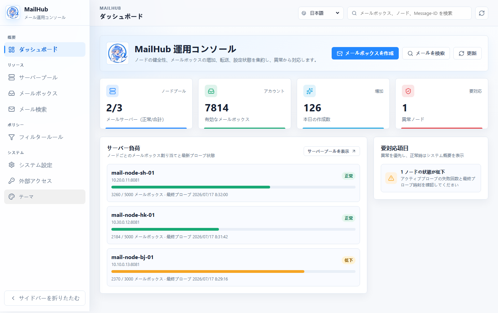
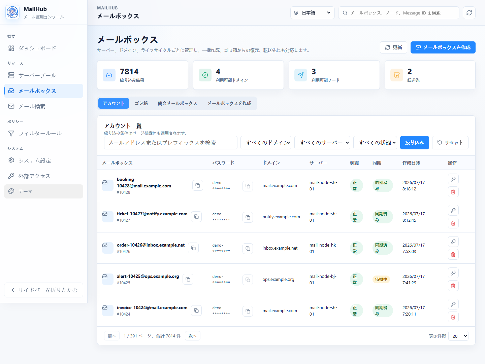
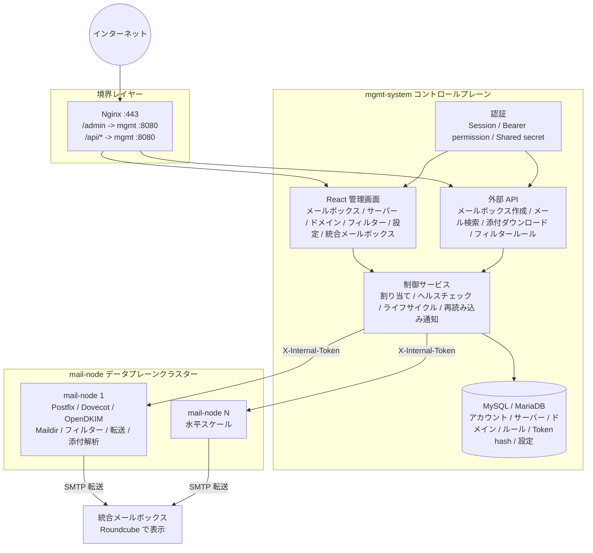

# MailHub

[简体中文](README.md) | [English](README.en.md) | [日本語](README.ja.md)

MailHub は Postfix、Dovecot、OpenDKIM を基盤とするセルフホスト型メールシステムです。管理とオーケストレーションを `mgmt-system` コントロールプレーンに配置し、実際のメール受信、Maildir ストレージ、フィルタリング、転送、ドメイン設定を `mail-node` データプレーンで処理します。業務用メールボックスの一括作成、メールの集約、業務システムや LLM システム向けの構造化メール API に適しています。

現在のコードには、複数サーバーのメールプール、ドメインと DKIM の自動管理、中国語・英語・日本語対応の React 管理画面、フィルタリングと転送、統合メールボックスのホット切り替え、動的設定、ゴミ箱のライフサイクル管理、構造化メール検索、添付ファイルのダウンロード、インライン画像の互換処理が実装されています。

---

## 画面イメージ

> 以下の画面では匿名化したサンプルデータを使用しています。メニューと機能は現在の管理画面に基づいています。

### 運用ダッシュボード



ノードの状態、メールボックスの増加、容量、対応が必要な異常を一画面で確認し、メールボックス作成、メール検索、サーバー管理へ直接移動できます。

### メールボックス管理



ドメイン、サーバー、状態による絞り込みに加え、単一・一括作成、認証情報のエクスポート、パスワード変更、ゴミ箱からの復元、統合メールボックスの切り替えに対応します。

## 基本的な使い方

1. **デプロイしてログイン**：[コントロールプレーン導入ガイド](docs/control-plane-deployment.md)に従ってデータベース、設定、管理者 bootstrap を準備し、`https://<管理ドメイン>/admin/login` を開きます。bootstrap で `--must-change-password` を指定した場合は、初回ログイン時にパスワードを変更します。
2. **メールリソースを接続**：「サーバープール」で `mail-node` を登録してドメインを関連付け、[データプレーン導入ガイド](docs/design/deployment-guide.md)に従って DNS、Postfix、Dovecot、OpenDKIM を設定します。正常なノードは自動割り当ての対象になります。
3. **メールボックスを作成**：「メールボックス > メールボックス作成」を開きます。正常なノードとドメインの自動選択、または手動指定が可能で、単一作成、一括貼り付け、CSV/TXT インポートに対応します。
4. **メールを受信・確認**：「メール検索」で完全なメールアドレスを入力すると、本文、HTML プレビュー、添付ファイルを確認できます。集約転送を使う場合は、「メールボックス > 統合メールボックス」で有効な転送先を選択します。
5. **業務 API を公開**：「外部アクセス」で呼び出し元を作成し、必要な機能だけを許可して Token を発行します。完全な Token が表示されるのは一度だけです。`Authorization: Bearer <token>` として送信してください。エンドポイントと権限は[外部 API ガイド](docs/api/external-api.md)を参照してください。

---

## 主な機能

### コントロールプレーン `mgmt-system`

- 管理画面：`/admin/*` で提供される React SPA。Session 認証で保護されます。
- 外部 API：`/api/v1/mailboxes`、`/api/v1/orders/*/emails`、`/api/v1/mailboxes/*/messages`、`/api/v1/emails/*`、`/api/v1/filters`。管理画面から外部アプリを作成し、機能を選択して Bearer Token を発行します。
- 内部 API：`/api/v1/internal/*`。mgmt-system と mail-node は共有の `X-Internal-Token` シークレットで相互認証します。
- リソース管理：メールボックス、サーバープール、ドメインプール、フィルタールール、システム設定、統合メールボックス。
- スケジューリング：ヘルスチェック、ハートビート受信、ライフサイクル Watchdog、論理削除の期限処理、設定とルールの再読み込み通知。
- データストレージ：MySQL または MariaDB。起動時に GORM AutoMigrate で現在のテーブルを作成・更新し、従来の `order_mailboxes` から現在のアカウントモデルへの移行経路も保持します。

### データプレーン `mail-node`

- 同一ホストのメールサービス：Postfix による受信、Dovecot による保存、OpenDKIM の署名設定。
- メールボックス管理：作成、パスワード変更、安全な削除、`.trash` からの復元。
- ドメイン管理：Postfix 仮想ドメインの反映、DKIM key、SigningTable、KeyTable の書き込み。
- メール処理：Maildir の `new/` と `cur/` をスキャンし、`pass / flag / block` ルールを適用して、有効な統合メールボックスへ SMTP 転送します。
- メール参照：MIME を構造化して本文、ヘッダー、添付メタデータを返し、添付ファイルをバイナリでダウンロードできます。
- 互換処理：filename や拡張子がない、または誤って `application/octet-stream` とされたインライン画像をマジックバイトから推定します。API、HTML プレビュー、SMTP 転送で同じ処理を使用します。

---

## アーキテクチャ



詳細なデータモデル、API フロー、実行時の制約は [アーキテクチャ概要](docs/architecture-overview.md) を参照してください。

---

## 技術スタック

| レイヤー | 技術 | 用途 |
|------|------|----------|
| バックエンド | Go 1.22+、Gin、GORM | コントロールプレーンとデータプレーン |
| データベース | MySQL 8.0 / MariaDB 10.5+ | コントロールプレーンのメタデータ |
| メールサービス | Postfix、Dovecot、OpenDKIM | データプレーンのメール配送、保存、署名 |
| 管理画面 | React、Vite、i18next | 中国語・英語・日本語対応の `/admin/*` SPA |
| Webmail | Roundcube 1.6+ | 統合メールボックスの集約メールを表示 |
| デプロイ | systemd、Nginx | ベアメタル、クラウドホスト |

---

## ディレクトリ構成

```text
.
├── mgmt-system/
│   ├── cmd/server/                 # コントロールプレーンのエントリーポイント
│   ├── internal/
│   │   ├── handler/                # HTTP handlers
│   │   ├── service/                # メールボックス作成、アカウント移行、割り当て
│   │   ├── store/                  # GORM、動的設定、マイグレーション
│   │   ├── middleware/             # Session / Bearer / Shared-secret 認証
│   │   ├── healthcheck/            # アクティブヘルスチェック
│   │   └── lifecycle/              # ライフサイクル Watchdog / purge
│   ├── web/                        # React SPA ソース
│   ├── template/static/admin-app/  # SPA ビルド成果物
│   └── config.example.yaml
├── mail-node/
│   ├── cmd/node/                   # データプレーンのエントリーポイント
│   ├── internal/
│   │   ├── mailbox/                # Maildir、アカウント設定、パスワード
│   │   ├── forward/                # スキャン、フィルター、SMTP 転送、ライフサイクル
│   │   ├── handler/                # 内部 API、MIME 解析、添付ダウンロード
│   │   ├── domain/                 # 仮想ドメイン、DKIM
│   │   ├── filter/                 # フィルターエンジン
│   │   └── config/                 # YAML とリモート動的設定
│   └── config.example.yaml
└── docs/
    ├── architecture-overview.md    # 現在のアーキテクチャの正本
    ├── api/external-api.md         # 外部 API 契約の正本
    └── design/                     # 設計、履歴、デプロイ文書
```

---

## クイックスタート

### 1. 前提条件

- コントロールプレーン：MySQL 8.0 または MariaDB 10.5+。
- 1台以上のデータプレーン：SMTP 25番ポートを開放し、Postfix、Dovecot、OpenDKIM をインストールします。
- DNS を管理できるメールドメイン。

### 2. 設定

```bash
cp mgmt-system/config.example.yaml mgmt-system/config.yaml
cp mail-node/config.example.yaml mail-node/config.yaml
```

主な設定：

- `database.dsn`：コントロールプレーンのデータベース接続。
- 管理者認証情報：`mgmt-server admin bootstrap` で bcrypt hash をデータベースへ書き込みます。`auth.admin_user` と `auth.admin_pass` は廃止され、実行時ログインには使用されません。
- `auth.shared_secret`：mgmt-system とすべての mail-node で同じ値を設定します。
- 外部 API Token：コントロールプレーン起動後、管理画面の「外部アクセス」で作成します。新規デプロイでは `auth.tokens` を設定しないでください。
- `management.api_url`：mail-node が接続する mgmt-system の URL。
- `forward.smtp_*`：転送用 SMTP 接続設定。転送先は「統合メールボックス」で管理され、動的設定へ同期されます。
- `dkim.*`、`postfix.*`、`maildir.*`：データプレーンで Postfix、Dovecot、OpenDKIM を反映するためのパス。

#### データベースの自動作成とアップグレード

`mgmt-server` はテーブルを自動作成・更新しますが、DSN で指定したデータベース自体は作成しません。デプロイ前にデータベースを作成し、接続アカウントに `CREATE`、`ALTER`、`INDEX`、`DROP` と通常の読み書き権限を付与してください。必要な権限がない場合、サービスは起動を拒否します。

- 新規デプロイ：`api_applications`、`api_credentials`、`api_permissions`、`api_resources`、`api_application_permissions`、`api_access_logs` など現在のテーブルを作成します。従来の平文 `api_tokens` テーブルは作成しません。
- 旧バージョンからのアップグレード：初回起動時に現在のテーブルを作成・更新した後、有効な `api_tokens` と既存の `auth.tokens` を hash 化した認証情報として移行します。各認証情報の検証が成功してから `api_tokens` を削除します。途中で失敗した場合はサービスを起動しません。
- アップグレード後：外部 API が正常で `api_tokens` が存在しないことを確認し、実際の設定ファイルから `auth.tokens` を削除します。以降の外部認証情報は管理画面からのみ発行できます。
- ロールバック制約：`api_tokens` 削除後に旧バイナリだけを起動しないでください。旧版が平文テーブルを再作成し、古い設定から Token を復元する可能性があります。ロールバックでは、アップグレード前のデータベースバックアップと対応する設定ファイルを同時に復元してください。

初回起動前に管理者を初期化します：

```bash
./mgmt-server admin bootstrap \
  --config ./config.yaml \
  --username admin \
  --password-file /run/secrets/mailhub_initial_admin_password \
  --must-change-password

./mgmt-server serve
```

パスワードを忘れた場合は `admin reset-password` で明示的に復旧します。本番モードでは bootstrap 完了前の `serve` は起動を拒否し、実行時ログインはデータベースの bcrypt hash のみを検証します。移行と復旧の詳細は [O2-P5 管理者 Bootstrap・復旧設計](docs/design/ui-second-optimization-p5-admin-bootstrap-design.md) を参照してください。

既存環境では、旧設定から一度だけ認証情報を移行できます。管理者が未初期化の場合のみ実行され、初回ログイン時にパスワード変更を要求します：

```bash
./mgmt-server admin bootstrap-from-config --config ./config.yaml
```

### 3. ビルド

```bash
cd mgmt-system
go build -o mgmt-server ./cmd/server

cd ../mail-node
CGO_ENABLED=0 GOOS=linux GOARCH=amd64 go build -o mail-node ./cmd/node
```

### 4. デプロイ

新しい mail-node の DNS、Postfix、Dovecot、OpenDKIM、Roundcube の設定は [データプレーンデプロイガイド](docs/design/deployment-guide.md) を参照してください。コントロールプレーンの基本設定は本書と `mgmt-system/config.example.yaml` に記載しています。

---

## ドキュメント

### 現在の正本

| ドキュメント | 用途 |
|------|------|
| [アーキテクチャ概要](docs/architecture-overview.md) | コンポーネント責務、データモデル、API フロー、状態遷移 |
| [データベース辞書](docs/database-schema.md) | コントロールプレーンのテーブル、フィールド、関連、状態値、コメント |
| [外部 API ガイド](docs/api/external-api.md) | 外部クライアント向け API、認証、レスポンス、添付ダウンロード |
| [コントロールプレーンデプロイガイド](docs/control-plane-deployment.md) | Docker Compose、systemd、管理者 bootstrap、アップグレード、復旧 |
| [データプレーンデプロイガイド](docs/design/deployment-guide.md) | 新しい mail-node の DNS、Postfix、Dovecot、OpenDKIM、Roundcube |

### 現在の設計文書

| ドキュメント | 用途 |
|------|------|
| [動的設定](docs/design/dynamic-config-design.md) | `system_configs`、管理画面、ホットリロード |
| [統合メールボックス](docs/design/integrated-mailbox-design.md) | 転送先プールと有効な統合メールボックス |
| [添付ダウンロード](docs/design/attachment-download-design.md) | 添付プロキシ、バイナリレスポンス、安全な HTML プレビュー |
| [インライン画像互換](docs/design/inline-image-filename-inference-design.md) | タイプ・拡張子推定と Roundcube 互換 |
| [ライフサイクル復元](docs/design/t9-restore-design.md) | `.trash` 復元と競合処理 |
| [サーバー・ドメインプール](docs/design/t4-t5-server-domain-pool-design.md) | サーバーとドメインの関連、DKIM、DNS レコード |
| [認証](docs/design/t6-auth-design.md) | Session、Bearer scope、Shared-secret 認証 |
| [ヘルスチェック](docs/design/t7-healthcheck-design.md) | アクティブプローブ、パッシブハートビート、状態遷移 |
| [管理者 Bootstrap と復旧](docs/design/ui-second-optimization-p5-admin-bootstrap-design.md) | 初期化、DB ログイン、パスワード変更、CLI 復旧、ログイン UI |

### 履歴・計画文書

これらの文書は意思決定の履歴と初期案を保存するもので、現在の実装の正本ではありません。現在のコード、[アーキテクチャ概要](docs/architecture-overview.md)、[外部 API ガイド](docs/api/external-api.md) と矛盾する場合は、現在のコードと正本文書を優先してください。

| ドキュメント | 説明 |
|------|------|
| [技術実装](docs/design/technical-implementation.md) | 初期 Phase 1 草案を置き換える現在の実装概要 |
| [Phase 1 設計](docs/design/phase1-design.md) | 初期設計の記録 |
| [Phase 3 完了計画](docs/design/phase3-mgmt-completion-plan.md) | Phase 3 の計画と受け入れ記録 |
| [転送モジュール設計](docs/design/forwarding-design.md) | 初期転送案と後続メモ |
| [Roundcube 参考](docs/roundcube-analysis.md) | Roundcube 技術資料 |

---

## 現在の状態

| モジュール | 状態 |
|------|------|
| メールボックス管理、一括作成、CSV アップロード | 完了 |
| 複数サーバー、ドメインプール、DKIM、DNS レコード | 完了 |
| React 管理画面（简体中文 / English / 日本語） | 完了 |
| 3層認証 | 完了 |
| ヘルスチェック、ハートビート、ノード検出 | 完了 |
| フィルタールール、即時再読み込み、Maildir 転送 | 完了 |
| 統合メールボックス管理、SMTP 認証情報のホットリロード | 完了 |
| MIME 構造化解析、本文検索、添付ダウンロード | 完了 |
| ゴミ箱、復元、purge、再起動後の削除タスク復旧 | 完了 |
| インライン画像の MIME、filename、拡張子互換 | 完了 |
| 管理者 Bootstrap、DB ログイン、パスワード変更、CLI 復旧 | 完了 |

### 現在のバックログ

| 優先度 | 項目 | 状態 |
|--------|------|------|
| P1 | ノード設定の可観測性と汎用上書き | 設計草案。まず NC-P0 の保持期間セマンティクス、所有権、実際のキー名を整合する |
| 候補 | 外部メールボックス作成 API で `server_id` を指定 | 未計画。呼び出し元の権限とノード割り当てポリシーを先に決定する |
