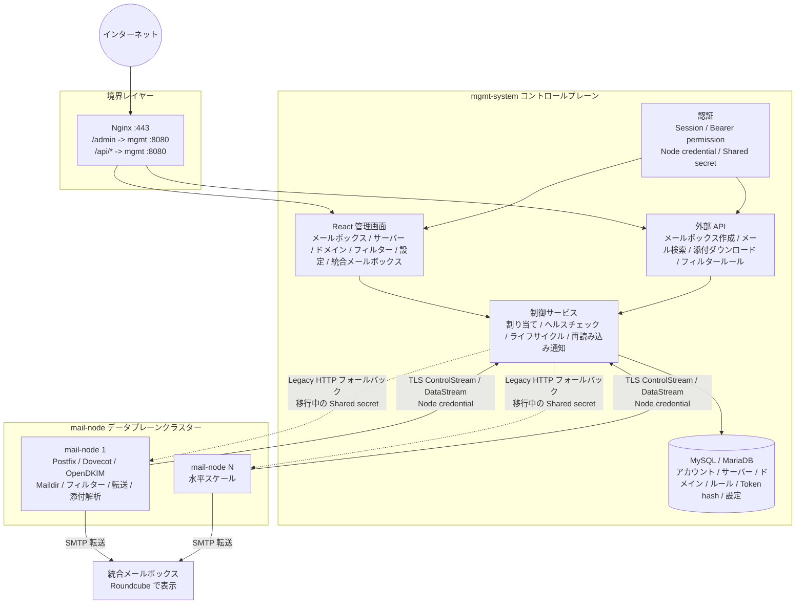

# MailHub

[简体中文](README.md) | [English](README.en.md) | [日本語](README.ja.md)

MailHub は Postfix、Dovecot、OpenDKIM を基盤とするセルフホスト型メールシステムです。管理とオーケストレーションを `mgmt-system` コントロールプレーンに配置し、実際のメール受信、Maildir ストレージ、フィルタリング、転送、ドメイン設定を `mail-node` データプレーンで処理します。業務用メールボックスの一括作成、メールの集約、業務システムや LLM システム向けの構造化メール API に適しています。

現在のコードには、複数サーバーのメールプール、ドメインと DKIM の自動管理、中国語・英語・日本語対応の React 管理画面、フィルタリングと転送、統合メールボックスのホット切り替え、動的設定、ゴミ箱のライフサイクル管理、構造化メール検索、添付ファイルのダウンロード、インライン画像の互換処理が実装されています。

---

## 画面イメージ

> 以下の画面では匿名化したサンプルデータを使用しています。メニューと機能は現在の管理画面に基づいています。

### 運用ダッシュボード


ノードの状態、メールボックスの増加、容量、対応が必要な異常を一画面で確認し、メールボックス作成、メール検索、サーバー管理へ直接移動できます。

### メールボックス管理


ドメイン、サーバー、状態による絞り込みに加え、単一・一括作成、認証情報のエクスポート、パスワード変更、ゴミ箱からの復元、統合メールボックスの切り替えに対応します。

## 基本的な使い方

1. **デプロイしてログイン**：[コントロールプレーン導入ガイド](docs/control-plane-deployment.md)に従ってデータベース、設定、管理者 bootstrap を準備し、`https://<管理ドメイン>/admin/login` を開きます。bootstrap で `--must-change-password` を指定した場合は、初回ログイン時にパスワードを変更します。
2. **メールリソースを接続**：「サーバープール」で `mail-node` を登録してドメインを関連付け、[データプレーン導入ガイド](docs/design/deployment-guide.md)に従って DNS、Postfix、Dovecot、OpenDKIM を設定します。既存の Legacy ノードは[ノード登録と dual 移行の本番運用 Runbook](docs/node-registration-operations-runbook.md)に従い、1台ずつインプレース移行、canary、ロールバックを行います。正常なノードだけが自動割り当ての対象になります。
3. **メールボックスを作成**：「メールボックス > メールボックス作成」を開きます。正常なノードとドメインの自動選択、または手動指定が可能で、単一作成、一括貼り付け、CSV/TXT インポートに対応します。
4. **メールを受信・確認**：「メール検索」で完全なメールアドレスを入力すると、本文、HTML プレビュー、添付ファイルを確認できます。集約転送を使う場合は、「メールボックス > 統合メールボックス」で有効な転送先を選択します。
5. **業務 API を公開**：「外部アクセス」で呼び出し元を作成し、必要な機能だけを許可して Token を発行します。完全な Token が表示されるのは一度だけです。`Authorization: Bearer <token>` として送信してください。エンドポイントと権限は[外部 API ガイド](docs/api/external-api.md)を参照してください。

### ノード credential のローテーション

初回登録と credential ローテーションはいずれも新しいノード credential を発行しますが、配布方法が異なります。初回登録では `mail-node enroll` が credential をノードへ自動保存します。ローテーションでは System に新しい credential が一度だけ表示され、ノードへ自動配布されません。

1. 「サーバープール」を開き、対象ノードの鍵アイコンから「credential をローテーション」を選択します。
2. 一度だけ表示される新しい credential をすぐにコピーします。チャット、スクリーンショット、コマンド引数、Shell 履歴へ残さないでください。
3. 対象ノードの `management.credential_file` を安全に置き換えます。デフォルトは `/var/lib/mail-node/identity/credential` です。
4. `mail-node` を再起動し、System でノードが `connected / ready` に戻り、新しい active credential に最終使用時刻が表示されることを確認します。
5. 新しい credential の使用を確認してから旧 credential の重複期間を終了し、必要に応じて revoked または expired の記録を削除します。

System が保存するのは credential の hash とメタデータだけです。一度だけ表示されるダイアログを閉じた後は平文を復元できません。紛失または漏えいした場合は再度ローテーションしてください。「すべての credential を revoke」はローテーションの代替ではなく、ノードを登録済み状態から外します。安全な書き込みコマンド、失敗時の復旧、受け入れゲートは[credential のローテーションとインストール](docs/node-registration-operations-runbook.md#12-凭证轮转与安装)を参照してください。

---

## 主な機能

### コントロールプレーン `mgmt-system`

- 管理画面：`/admin/*` で提供される React SPA。Session 認証で保護されます。
- 外部 API：`/api/v1/mailboxes`、`/api/v1/orders/*/emails`、`/api/v1/mailboxes/*/messages`、`/api/v1/emails/*`。管理画面から外部アプリを作成し、機能を選択して Bearer Token を発行します。
- ノード通信：登録済みノードは個別 credential を使用して outbound ControlStream/DataStream を確立します。移行中は `/api/v1/internal/*` と node `8081` に shared secret/node credential の互換認証を残し、最終収束後に shared secret を削除します。
- リソース管理：メールボックス、サーバープール、ドメインプール、フィルタールール、システム設定、統合メールボックス。
- スケジューリング：ヘルスチェック、ハートビート受信、ライフサイクル Watchdog、論理削除の期限処理、設定とルールの再読み込み通知。
- データストレージ：MySQL または MariaDB。起動時に GORM AutoMigrate で現在のテーブルを作成・更新し、従来の `order_mailboxes` から現在のアカウントモデルへの移行経路も保持します。

### データプレーン `mail-node`

- 同一ホストのメールサービス：Postfix による受信、Dovecot による保存、OpenDKIM の署名設定。
- メールボックス管理：作成、パスワード変更、安全な削除、`.trash` からの復元。
- ドメイン管理：Postfix 仮想ドメインの反映、DKIM key、SigningTable、KeyTable の書き込み。
- メール処理：Maildir の `new/` と `cur/` をスキャンし、`pass / flag / block` ルールを適用して、有効な統合メールボックスへ SMTP 転送します。
- メール参照：MIME を構造化して本文、ヘッダー、添付メタデータを返します。制限付きローカルパスインデックスにより、本文、プレビュー、添付ファイルのバイナリを読み取ります。
- 互換処理：filename や拡張子がない、または誤って `application/octet-stream` とされたインライン画像をマジックバイトから推定します。API、HTML プレビュー、SMTP 転送で同じ処理を使用します。
- ノード ID：永続的な `node_uuid`、ノードごとの独立 credential、outbound ControlStream/DataStream、ノード単位の `legacy_http / dual / control_stream` transport ゲート。

---

## アーキテクチャ



詳細なデータモデル、API フロー、実行時の制約は [アーキテクチャ概要](docs/architecture-overview.md) を参照してください。

---

## 技術スタック

| レイヤー | 技術 | 用途 |
|------|------|----------|
| バックエンド | Go 1.22+、Gin、GORM | コントロールプレーンとデータプレーン |
| データベース | MySQL 8.0 / MariaDB 10.5+ | コントロールプレーンのメタデータ |
| メールサービス | Postfix、Dovecot、OpenDKIM | データプレーンのメール配送、保存、署名 |
| 管理画面 | React、Vite、i18next | 中国語・英語・日本語対応の `/admin/*` SPA |
| Webmail | Roundcube 1.6+ | 統合メールボックスの集約メールを表示 |
| デプロイ | systemd、Nginx | ベアメタル、クラウドホスト |

---

## ディレクトリ構成

```text
.
├── mgmt-system/
│   ├── cmd/server/                 # コントロールプレーンのエントリーポイント
│   ├── internal/
│   │   ├── handler/                # HTTP handlers
│   │   ├── service/                # メールボックス作成、アカウント移行、割り当て
│   │   ├── store/                  # GORM、動的設定、マイグレーション
│   │   ├── middleware/             # Session / Bearer / Shared-secret 認証
│   │   ├── healthcheck/            # アクティブヘルスチェック
│   │   └── lifecycle/              # ライフサイクル Watchdog / purge
│   ├── web/                        # React SPA ソース
│   ├── template/static/admin-app/  # SPA ビルド成果物
│   └── config.example.yaml
├── mail-node/
│   ├── cmd/node/                   # データプレーンのエントリーポイント
│   ├── internal/
│   │   ├── mailbox/                # Maildir、アカウント設定、パスワード
│   │   ├── forward/                # スキャン、フィルター、SMTP 転送、ライフサイクル
│   │   ├── handler/                # 内部 API、MIME 解析、添付ダウンロード
│   │   ├── domain/                 # 仮想ドメイン、DKIM
│   │   ├── filter/                 # フィルターエンジン
│   │   └── config/                 # YAML とリモート動的設定
│   └── config.example.yaml
└── docs/
    ├── architecture-overview.md    # 現在のアーキテクチャの正本
    ├── api/external-api.md         # 外部 API 契約の正本
    └── design/                     # 設計、履歴、デプロイ文書
```

---

## 開発と運用

### 最初に実行範囲を選ぶ

MailHub は、Go プロセスだけを起動すれば実際のメール配送まで行える単体アプリケーションではありません。完全なシステムは次の要素で構成されます。

```text
MariaDB/MySQL
  -> mgmt-system コントロールプレーンと管理画面
  -> 1台以上の mail-node データプレーン
  -> Postfix + Dovecot + OpenDKIM
  -> DNS、SMTP 25/587、任意の Roundcube
```

管理画面、コントロールプレーン API、単体テストの開発では、コントロールプレーンだけを起動すれば十分です。実際の受信、Maildir、DKIM、SMTP 転送、IMAP を検証するには Linux データプレーンも必要です。

### データベースで手作業が必要な範囲

**どのデプロイ方式でも業務テーブルを手作業で作成する必要はありません。** `mgmt-server` は起動するたびに GORM AutoMigrate を実行し、現在のスキーマを自動作成・更新して必要な初期データを書き込みます。

| 項目 | 推奨 Docker Compose デプロイ | 自前の MySQL/MariaDB |
|------|-----------------------------|----------------------|
| データベースサービス | Compose が MariaDB を自動取得・起動 | 自分でサービスをインストールするかコンテナを起動 |
| `email_mgmt` データベース | MariaDB コンテナの初回起動時に自動作成 | 空のデータベースと業務アカウントを事前作成 |
| 業務テーブルとカラム | `mgmt-server` が自動作成・更新 | `mgmt-server` が自動作成・更新 |
| DDL 権限 | Compose が業務アカウントへ付与 | `CREATE`、`ALTER`、`INDEX`、`DROP`、`REFERENCES` と通常の読み書き権限を維持 |
| 管理者初期化 | Compose の `bootstrap` サービスが実行 | 初回起動前に `admin bootstrap` を一度実行 |

リポジトリ付属の Compose を使う場合、`CREATE DATABASE` や `CREATE TABLE` を手作業で実行する必要はなく、事前の `docker pull mariadb` も不要です。Go プログラムを直接起動して外部データベースへ接続する場合は、空の `email_mgmt` データベースと業務アカウントだけを先に作成してください。テーブルは常にアプリケーションが管理します。

### パス1：コントロールプレーンを最短で起動する

ローカルで管理画面を試す場合や、コントロールプレーンをデプロイする場合の推奨手順です。Docker Engine と Docker Compose v2 が必要です。

リポジトリルートから実行します。

```bash
cd deploy/docker
cp .env.example .env
cp secrets/admin_password.example secrets/admin_password
chmod 600 .env secrets/admin_password
```

Windows PowerShell の場合：

```powershell
Set-Location deploy/docker
Copy-Item .env.example .env
Copy-Item secrets/admin_password.example secrets/admin_password
```

次のファイルを編集します。

- `.env`：`MAILHUB_DB_PASSWORD` と `MAILHUB_DB_ROOT_PASSWORD` に異なる値を設定し、十分に長い `MAILHUB_SHARED_SECRET` を設定します。
- `secrets/admin_password`：初期管理者パスワードだけを書き込みます。release モードでは 12 文字以上が必要です。
- `mgmt-config.yaml`：`domains` を実際のメールドメインへ変更します。ローカル画面だけを確認する場合はテスト用ドメインでも構いません。

`.env`、`secrets/admin_password`、実際の `config.yaml` を Git へコミットしないでください。

検証して起動します。

```bash
docker compose config --quiet
docker compose up -d --build
docker compose ps
```

Compose は次の順序でサービスを起動します。

```text
MariaDB healthy
  -> bootstrap が管理者を初期化して終了コード 0 で終了
  -> mgmt-system が起動
```

デプロイを確認します。

```bash
curl -fsS http://127.0.0.1:8080/health
curl -fsS http://127.0.0.1:8080/health/ready
docker compose logs --no-log-prefix bootstrap
docker compose logs --tail=100 mgmt
```

管理画面は `http://127.0.0.1:8080/admin/` です。Compose はデフォルトでループバックアドレスだけに bind します。コントロールプレーンのポートをインターネットへ直接公開せず、リモートアクセスには TLS リバースプロキシを使用してください。

現在の Compose に含まれるのは MariaDB と `mgmt-system` だけです。`mail-node`、Postfix、Dovecot、OpenDKIM は含まれないため、コントロールプレーン全体は実行できますが、それだけでは実際のメール配送はできません。

### パス2：ソースからコントロールプレーンを実行する

Go API や React 画面のデバッグに使用します。Go 1.22+、Node.js 20+、接続可能な MySQL 8.0 または MariaDB 10.5+ が必要です。

上記の Compose を使わない場合は、最初に空のデータベースと業務アカウントを作成します。**データベースの作成と権限付与だけを行い、業務テーブルは手作業で作成しないでください。** 標準 SQL と権限一覧は[コントロールプレーンデプロイガイド](docs/control-plane-deployment.md#3-裸机systemd-新部署)を参照してください。

設定を準備します。

```bash
cp mgmt-system/config.example.yaml mgmt-system/config.yaml
```

最低限、次の項目を変更します。

- `database.dsn`：既存の `email_mgmt` データベースを指定します。
- `auth.shared_secret`：長いランダム値を使用します。Legacy/dual 段階の mail-node には同じ値が必要です。
- `domains`：実際のドメインまたは開発用テストドメインを設定します。
- `node_control.enabled`：基本的なローカル開発では `false` のままにします。

ビルドして管理者を初期化します。

```bash
cd mgmt-system
go build -o mgmt-server ./cmd/server
./mgmt-server admin bootstrap \
  --config ./config.yaml \
  --username admin \
  --password-file /path/to/initial-admin-password \
  --must-change-password
./mgmt-server serve
```

release モードでは、bootstrap が完了するまで `serve` は起動を拒否します。管理者ログインで検証するのはデータベースに保存された bcrypt hash だけで、`auth.admin_user` と `auth.admin_pass` は廃止されています。復旧には `admin reset-password` を使用します。既存環境の旧認証情報を一度だけ移行する場合は次を実行します。

```bash
./mgmt-server admin bootstrap-from-config --config ./config.yaml
```

React を開発する場合は別のターミナルを起動します。

```bash
cd mgmt-system/web
npm ci
npm run dev
```

Vite のデフォルト URL は `http://127.0.0.1:5173/` です。本番イメージは Docker build 中にフロントエンドをビルドして `mgmt-system` へ組み込むため、本番で Vite を別途起動する必要はありません。

### パス3：mail-node を接続して実際にメールを配送する

データプレーンは Linux へデプロイしてください。Windows でも設定、HTTP API、一部の業務ロジックをデバッグするために `mail-node` を起動できますが、本番の Postfix、Dovecot、OpenDKIM の代替にはなりません。

最初に次を準備します。

- Postfix、Dovecot、OpenDKIM を利用でき、固定の `vmail` UID/GID を持つ Linux ホスト。
- 正しい A、MX、SPF、DKIM、DMARC レコードを設定できるメールドメイン。
- 利用可能な SMTP 25 番ポート。クライアント送信が必要な場合は認証と TLS を設定した 587 番ポートも開放します。
- `/health/ready` が成功する `mgmt-system`。

ノード設定をコピーして編集します。

```bash
cp mail-node/config.example.yaml mail-node/config.yaml
```

特に次の設定を確認してください。

- `management.api_url`：mail-node から到達できるコントロールプレーン URL。別ホストへデプロイする場合は `127.0.0.1` のままにしないでください。
- `shared_secret`：Legacy/dual 段階ではコントロールプレーンと一致させます。
- `maildir.base_path`、`vmail_uid`、`vmail_gid`：Postfix/Dovecot の仮想ユーザー設定と一致させます。
- `forward.smtp_*`：統合メールボックスの SMTP 設定。実際の認証情報をコミットしないでください。
- `filter.outbox_path`、`filter.quarantine_base`：永続パスを使用し、隔離領域は Maildir と Dovecot namespace の外に置きます。
- `postfix.*`、`dkim.*`：Postfix map ファイル、OpenDKIM 鍵ディレクトリ、SigningTable/KeyTable を指定します。
- `management.transport_mode`：新規ノードは control transport を有効にする前に登録します。移行時は `legacy_http -> dual -> control_stream` の canary とロールバックゲートを維持してください。

Linux バイナリをビルドします。

```bash
cd mail-node
CGO_ENABLED=0 GOOS=linux GOARCH=amd64 go build -o mail-node ./cmd/node
```

Postfix、Dovecot、OpenDKIM、systemd unit、必要なファイル権限を設定してからサービスを起動します。

```bash
systemctl enable postfix dovecot opendkim mail-node
systemctl restart postfix dovecot opendkim mail-node
systemctl status postfix dovecot opendkim mail-node
curl -fsS http://127.0.0.1:8081/internal/health
```

次に管理画面の「サーバープール」で登録招待を作成し、ノード上で `mail-node enroll` を実行します。管理者は UUID、Request ID、マシンフィンガープリント、送信元を確認して承認します。ノードが個別 credential を取得し、Control/Data チャネルを確立し、ready/lease チェックに合格してから自動メールボックス割り当てへ参加できます。

Postfix、Dovecot、OpenDKIM、DNS、systemd、ノード登録、受け入れ確認には追加のコマンドが必要です。次の文書をすべて参照してください。

- [データプレーンデプロイガイド](docs/design/deployment-guide.md)
- [ノード登録ガイド](docs/node-registration-guide.md)
- [ノード登録と dual 移行の本番運用 Runbook](docs/node-registration-operations-runbook.md)

Roundcube は任意であり、MailHub コントロールプレーンや mail-node の起動には影響しません。Webmail が必要な場合だけデータプレーンガイドに従ってインストールしてください。

### データベースアップグレードの境界

- 新規デプロイは現在の業務テーブルをすべて自動作成し、従来の平文 `api_tokens` テーブルは作成しません。
- 旧バージョンからの初回アップグレードでは、スキーマ更新後に、データベースと旧設定にある有効な平文 Token を hash 化した認証情報へ移行します。途中で失敗した場合は起動しません。
- 外部 API が正常で `api_tokens` が存在しないことを確認してから、実際の設定から `auth.tokens` を削除します。
- `api_tokens` の削除後はバイナリだけをロールバックしないでください。アップグレード前のデータベースバックアップと対応する設定ファイルを同時に復元します。

### 開発時の検証

```bash
go test -C mgmt-system ./...
go vet -C mgmt-system ./...
go test -C mail-node ./...
go vet -C mail-node ./...
go test -C filter-contract ./...
go test -C node-contract ./...

cd mgmt-system/web
npm ci
npm test
npm run build
```

実際のリリースでは、コントロールプレーンの `/health` と `/health/ready`、mail-node の `/internal/health`、SMTP 受信、IMAP 読み取り、DKIM 署名、転送、添付ファイルダウンロードについて smoke/acceptance 証跡も必要です。

---

## ドキュメント

### 現在の正本

| ドキュメント | 用途 |
|------|------|
| [アーキテクチャ概要](docs/architecture-overview.md) | コンポーネント責務、データモデル、API フロー、状態遷移 |
| [データベース辞書](docs/database-schema.md) | コントロールプレーンのテーブル、フィールド、関連、状態値、コメント |
| [外部 API ガイド](docs/api/external-api.md) | 外部クライアント向け API、認証、レスポンス、添付ダウンロード |
| [コントロールプレーンデプロイガイド](docs/control-plane-deployment.md) | Docker Compose、systemd、管理者 bootstrap、アップグレード、復旧 |
| [データプレーンデプロイガイド](docs/design/deployment-guide.md) | 新しい mail-node の DNS、Postfix、Dovecot、OpenDKIM、Roundcube |
| [デプロイ容量と添付ストレージの境界](docs/deployment-capacity.md) | 現在のローカルストレージ構成におけるサーバー構成、性能境界、ディスク計画、将来の MinIO 基準 |
| [ノード登録と dual 移行の本番運用 Runbook](docs/node-registration-operations-runbook.md) | ノード単位の登録、credential ローテーション、接続、canary、ロールバック、最終収束、引き継ぎチェックリスト |

### 現在の設計文書

| ドキュメント | 用途 |
|------|------|
| [動的設定](docs/design/dynamic-config-design.md) | `system_configs`、管理画面、ホットリロード |
| [統合メールボックス](docs/design/integrated-mailbox-design.md) | 転送先プールと有効な統合メールボックス |
| [添付ダウンロード](docs/design/attachment-download-design.md) | 添付プロキシ、バイナリレスポンス、安全な HTML プレビュー |
| [Maildir メッセージパスインデックス](docs/design/maildir-message-index-design.md) | 軽量ローカルインデックス、コールド検索、無効化、対象メッセージの単一パス解析 |
| [MIME 本文投影、メディア検出、安全なプレビュー](docs/design/mime-media-detection-and-safe-preview-design.md) | MIME ツリー、本文選択、CID scope、メディアポリシー、Range/HEAD、転送、安全表示の v2 正本契約 |
| [MIME 本文投影、メディア検出、安全なプレビューの実装計画](docs/design/mime-media-detection-implementation-plan.md) | 実 fixture、共有 DAG、テストゲート、ロールバック、永続化の前提条件 |
| [非同期 MIME 解析と永続 read model](docs/design/async-mime-read-model-design.md) | 受信後の一度だけの解析、read model、blob ストレージ、整合性、移行境界 |
| [インライン画像互換](docs/design/inline-image-filename-inference-design.md) | タイプ・拡張子推定と Roundcube 互換 |
| [ライフサイクル復元](docs/design/t9-restore-design.md) | `.trash` 復元と競合処理 |
| [サーバー・ドメインプール](docs/design/t4-t5-server-domain-pool-design.md) | サーバーとドメインの関連、DKIM、DNS レコード |
| [認証](docs/design/t6-auth-design.md) | Session、Bearer scope、Shared-secret 認証 |
| [ヘルスチェック](docs/design/t7-healthcheck-design.md) | アクティブプローブ、パッシブハートビート、状態遷移 |
| [管理者 Bootstrap と復旧](docs/design/ui-second-optimization-p5-admin-bootstrap-design.md) | 初期化、DB ログイン、パスワード変更、CLI 復旧、ログイン UI |

### ノードアーキテクチャの進化

次の文書は、完了済みの NR-P0-NR-P6、実装済みの NR-P7 コード、残っているリモート受け入れを記録します。現在の操作はノード登録ガイドに従ってください。リモート受け入れが終わっていない機能は、本番切り替え完了とは扱いません。

| ドキュメント | 用途 |
|------|------|
| [ノード登録、ID、outbound control channel 設計](docs/design/node-enrollment-control-channel-design.md) | 永続 UUID、一度だけの登録、ノードごとの credential、outbound control channel、移行戦略 |
| [ノード登録検出と outbound control channel 実装計画](docs/design/node-registration-control-channel-implementation-plan.md) | 現在の P0 における範囲、プロトコル、データモデル、段階、テスト、完了条件 |
| [NR-P6 DataStream 移行受け入れ記録](docs/design/node-registration-p6-data-stream.md) | DataStream session、streaming read、キャンセル、レート制限、Control/Data 分離の検証 |
| [ノード登録とクラスター参加ガイド](docs/node-registration-guide.md) | 標準承認、厳格な UUID 事前 bind、登録検証、異常復旧、セキュリティ確認 |
| [NR-P7 canary と Legacy ロールバック状態](docs/design/node-registration-p7-canary-rollback.md) | transport ゲート、現在の本番受け入れ境界、残りの収束条件 |
| [ノード登録と dual 移行の本番運用 Runbook](docs/node-registration-operations-runbook.md) | 現場の登録と credential ローテーション、成功ゲート、障害対応、ロールバック、引き継ぎテンプレート |

### 履歴・計画文書

これらの文書は意思決定の履歴と初期案を保存するもので、現在の実装の正本ではありません。現在のコード、[アーキテクチャ概要](docs/architecture-overview.md)、[外部 API ガイド](docs/api/external-api.md) と矛盾する場合は、現在のコードと正本文書を優先してください。

| ドキュメント | 説明 |
|------|------|
| [技術実装](docs/design/technical-implementation.md) | 初期 Phase 1 草案を置き換える現在の実装概要 |
| [Phase 1 設計](docs/design/phase1-design.md) | 初期設計の記録 |
| [Phase 3 完了計画](docs/design/phase3-mgmt-completion-plan.md) | Phase 3 の計画と受け入れ記録 |
| [転送モジュール設計](docs/design/forwarding-design.md) | 初期転送案と後続メモ |
| [Roundcube 参考](docs/roundcube-analysis.md) | Roundcube 技術資料 |

---

## 現在の状態

| モジュール | 状態 |
|------|------|
| メールボックス管理、一括作成、CSV アップロード | 完了 |
| 複数サーバー、ドメインプール、DKIM、DNS レコード | 完了 |
| React 管理画面（简体中文 / English / 日本語） | 完了 |
| 3層認証 | 完了 |
| UUID 登録、ノードごとの credential、outbound ControlStream/DataStream、lease、永続コマンド | NR-P0-NR-P7 のコードは完了。最初の本番ノードは `dual` に移行済み。全業務 canary、ロールバック演習、残りのノード、最終的な `8081` 停止は未完了 |
| フィルタールール、即時再読み込み、Maildir 転送 | 完了 |
| 統合メールボックス管理、SMTP 認証情報のホットリロード | 完了 |
| 基本 MIME 構造化解析、本文検索、添付ダウンロード | 完了。複雑な本文ツリー投影と安全表示を最優先で再設計中 |
| Maildir Message-ID パスインデックスと対象メッセージの単一パス解析 | 完了 |
| ゴミ箱、復元、purge、再起動後の削除タスク復旧 | 完了 |
| インライン画像の MIME、filename、拡張子互換 | 完了 |
| 管理者 Bootstrap、DB ログイン、パスワード変更、CLI 復旧 | 完了 |

### 現在のバックログ

| 優先度 | 項目 | 状態 |
|--------|------|------|
| P0（開発） | MIME 本文投影と安全表示 | 設計・実装契約は作成済み。非同期永続化の前に実 fixture、本文ツリーの意味、CID の安全表示を修正する |
| P0（運用収束） | ノード登録検出と outbound control channel | NR-P7 コードは完了。最初の本番 Legacy ノードはインプレース登録、Control/Data 接続、`dual` 移行済み。全業務 canary、ロールバック演習、残りのノード、最終 control_stream 収束は未完了 |
| P1 | ノード設定の可観測性と汎用上書き | 設計草案。MIME P0 と現在のノード運用収束後に実装する |
| 一時停止 | 広告メールフィルター再設計 S11/S12 | `dual_shadow/false` を維持。ノード登録収束前はポリシー、サンプル、自動隔離の開発を進めない |
| 候補 | 外部メールボックス作成 API で `server_id` を指定 | 未計画。呼び出し元の権限とノード割り当てポリシーを先に決定する |
| 候補 | MinIO 添付オブジェクトストレージと署名付き URL | 容量トリガー到達後に開発。サーバー基準はデプロイ容量文書を参照 |
