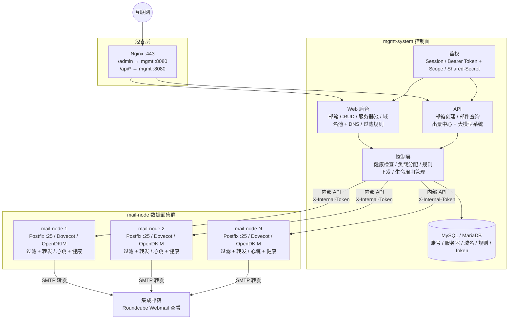

# MailHub

> 基于 Postfix + Dovecot 的自建邮局管理系统 —— 融合「宝塔邮局管理器」的多机管理能力与 Roundcube Webmail，统一管理多台邮件服务器、批量开通邮箱、自动配置域名 DNS / DKIM，并将订单邮件自动汇总转发。

面向国际订票等需要与外部航司 / 供应商 / OTA 邮件通信的场景：为每个业务邮箱提供独立收发能力，非垃圾邮件统一汇总到集成邮箱供运营查看，同时对外提供 API 供大模型系统拉取邮件原件做后续解析。

---

## 核心特性

### 邮局管理
- **多服务器邮局池**：一台控制面调度 N 台数据面邮件服务器，横向扩容；服务器按健康度参与邮箱分配，宕机自动摘除。
- **域名池 + DNS 一键生成**：每台服务器管理自己的域名，添加域名时自动配置 Postfix 虚拟域、生成 DKIM 密钥并返回 A / MX / SPF / DKIM / DMARC 完整 DNS 清单，运营只需到 DNS 控制台粘贴。
- **邮箱账号全生命周期**：单个 / 批量 / CSV 创建，密码持久化、远端同步状态追踪；安全软删除（回收站 + 定时 GC）。
- **健康检查与心跳**：控制面主动探测 + 数据面被动心跳，连续失败自动降级→摘除，仪表盘可观测。

### 邮件处理
- **过滤引擎**：可配置规则（按发件人 / 主题等匹配 pass / flag / block），数据面定时拉取，热生效。
- **自动转发汇总**：数据面异步扫描 Maildir，按规则过滤后 SMTP 转发到集成邮箱；正文原样透传，仅改 Subject 加来源标识，内置防循环。
- **Roundcube Webmail**：集成邮箱可选的 Webmail 前端，运营统一登录查看汇总邮件。

### 安全与 API
- **三层鉴权体系**：后台 Session 登录 + 外部 API Bearer Token (Scope) + 内部 Shared-Secret 互信。
- **对外 API**：出票中心 / 大模型系统通过 Token 鉴权创建邮箱、按 scope 拉取邮件原件。

---

## 系统架构



- **控制面 `mgmt-system`**：Go + gin + gorm，Web 后台（Go template + htmx）+ 对外/内部 API，负责编排、鉴权、健康检查，不直接处理邮件正文投递。
- **数据面 `mail-node`**：与 Postfix / Dovecot / OpenDKIM 同机部署，负责真实收发、Maildir 管理、过滤转发、域名 DKIM 落地、心跳上报。

---

## 技术栈

| 层面 | 选型 | 说明 |
|------|------|------|
| 后端 | Go 1.22+（gin + gorm） | 控制面 + 数据面统一语言 |
| 数据库 | MySQL 8.0 / MariaDB 10.5 | 控制面管理数据 |
| 邮件服务 | Postfix + Dovecot + OpenDKIM | 数据面自建 |
| 前端（后台） | Go template + htmx | 无前后端分离，低依赖 |
| Webmail | Roundcube 1.6 | PHP + SQLite，可选 |
| 部署 | 裸机 systemd + Nginx 反代 | 2C2G10M 低配友好 |

---

## 目录结构

```
.
├── mgmt-system/                # 控制面：管理后台 + API
│   ├── cmd/server/             # 程序入口
│   ├── internal/
│   │   ├── handler/            # HTTP handler（auth / admin / mailbox / server / email / filter）
│   │   ├── service/            # 业务层（邮箱创建、账号导入、分配器、健康检查）
│   │   ├── store/              # gorm 数据访问
│   │   ├── middleware/         # 中间件（Session / Bearer Token / Shared-Secret）
│   │   ├── model/              # 数据模型
│   │   ├── config/             # 配置加载
│   │   └── healthcheck/        # 主动健康检查调度器
│   ├── template/               # Go template + htmx 后台页面
│   └── config.example.yaml     # 配置模板
├── mail-node/                  # 数据面：邮局 agent
│   ├── cmd/node/
│   ├── internal/
│   │   ├── mailbox/            # Maildir 管理、邮箱创建、生命周期
│   │   ├── forward/            # 过滤 + SMTP 转发 + 防循环
│   │   ├── middleware/         # Shared-Secret 鉴权
│   │   └── config/
│   └── config.example.yaml
└── docs/                       # 设计文档 / 架构概览 / 部署指南
```

---

## 快速开始

### 1. 准备

- 一台控制面机器（MySQL 8.0+ / MariaDB 10.5+）、至少一台数据面机器（开放 25 端口）
- 一个邮件域名，可在 DNS 控制台管理解析

### 2. 配置

复制并填写配置模板：

```bash
cp mgmt-system/config.example.yaml  mgmt-system/config.yaml   # 改 DSN、API Token、域名
cp mail-node/config.example.yaml    mail-node/config.yaml     # 改控制面地址、SMTP、转发目标
```

关键配置项：
- **DSN**：MySQL/MariaDB 连接串
- **auth**：admin 账号密码、shared_secret（mgmt 与 mail-node 一致）、API tokens (scope)
- **smtp**：转发目标的 SMTP 服务器、用户名、密码
- **dkim**：selector、key_dir、signing_table、key_table

### 3. 构建

```bash
# 控制面
cd mgmt-system && go build -o mgmt-server ./cmd/server

# 数据面（交叉编译到 Linux）
cd mail-node && CGO_ENABLED=0 GOOS=linux GOARCH=amd64 go build -o mail-node ./cmd/node
```

### 4. 部署数据面邮件服务

在数据面机器安装 Postfix + Dovecot + OpenDKIM 并注册到控制面。完整步骤见 **[部署指南](docs/design/deployment-guide.md)**。

### 5. 启动

两台机器分别用 systemd 启动（服务文件模板见部署指南），访问管理后台即可开始添加域名、开通邮箱。

---

## 文档

| 文档 | 说明 |
|------|------|
| [架构概览](docs/architecture-overview.md) | 系统架构、数据模型、接口流向 |
| [部署指南](docs/design/deployment-guide.md) | 完整部署步骤、配置项说明 |
| [技术实现方案](docs/design/technical-implementation.md) | Phase 1A 实现细节 |
| [转发模块设计](docs/design/forwarding-design.md) | Maildir 扫描、过滤、SMTP 转发、防循环 |
| [服务器域名池设计](docs/design/t4-t5-server-domain-pool-design.md) | 域名池、Postfix 虚拟域、DKIM、DNS 清单 |
| [鉴权体系设计](docs/design/t6-auth-design.md) | 三层鉴权：Session / Bearer Scope / Shared-Secret |
| [健康检查设计](docs/design/t7-healthcheck-design.md) | 主动探测、心跳、降级摘除 |
| [Phase 1 设计文档](docs/design/phase1-design.md) | 初始 DB Schema、API 设计 |
| [Phase 3 补全计划](docs/design/phase3-mgmt-completion-plan.md) | 控制面补全执行计划 |
| [Roundcube 参考分析](docs/roundcube-analysis.md) | Roundcube 技术评估 |

---

## 项目状态

**当前进度：Phase 3 全部闭环，T1–T10 全部完成。**

| 阶段 | 内容 | 状态 |
|------|------|------|
| Phase 1A | 项目骨架 + 管理后台 CRUD | ✅ |
| Phase 1B | 国际机部署 + DNS + 收发验证 | ✅ |
| Phase 2 | 自动转发 + Roundcube Webmail | ✅ |
| Phase 3 T4/T5 | 服务器域名池 + Postfix 虚拟域 + DKIM | ✅ |
| Phase 3 T6 | 三层鉴权体系 | ✅ |
| Phase 3 T7 | 健康检查与心跳 | ✅ |
| Phase 3 T8 | MIME 预处理（结构化邮件） | ✅ |
| Phase 3 T9 | 邮箱生命周期与恢复闭环 | ✅ |
| Phase 3 T10 | 收尾（filter 主动推送、今日创建数、message_id 兼容、TLS 部署文档） | ✅ |

已就绪：邮箱账号管理、多服务器域名池、DKIM 自动配置、自动转发、Webmail、管理后台鉴权、服务器健康检查、结构化邮件查询、邮箱生命周期恢复、filter 主动推送、TLS 部署文档。后续运维：IPv4 配置、Let's Encrypt 证书实际申请、临时机清理。
