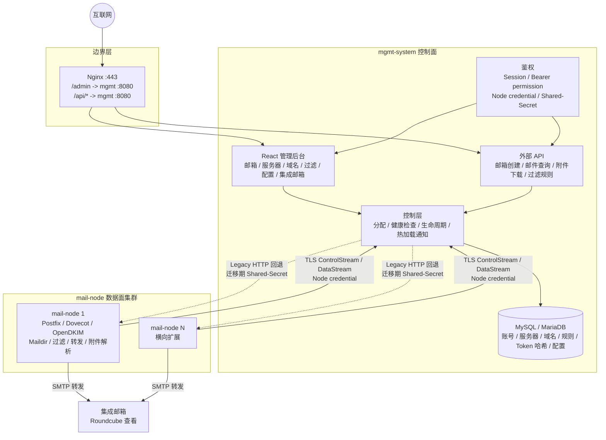

# MailHub

[简体中文](README.md) | [English](README.en.md) | [日本語](README.ja.md)

MailHub 是一套基于 Postfix + Dovecot + OpenDKIM 的自建邮局管理系统。它把管理编排放在 `mgmt-system` 控制面，把真实收信、Maildir 存储、过滤转发和域名落地放在 `mail-node` 数据面，适合批量开通业务邮箱、统一汇总邮件，并通过 API 向业务系统或大模型系统提供结构化邮件读取能力。

当前代码已经完成多服务器邮局池、域名/DKIM 自动化、支持中英日切换的 React 管理后台、过滤转发、集成邮箱热切换、动态配置、回收站生命周期、结构化邮件查询、附件下载和 inline 图片兼容处理。

---

## 界面展示

> 以下界面使用脱敏示例数据，实际菜单和功能以当前版本为准。

### 运维总览


仪表盘集中展示节点健康、邮箱增长、容量水位和待处理异常，可直接进入邮箱创建、邮件查询和服务器管理。

### 邮箱账户管理


邮箱账户页支持按域名、服务器和状态筛选，统一处理单个/批量创建、账密导出、密码修改、回收站恢复和集成邮箱切换。

## 使用流程

1. **部署并登录**：按[控制面部署指南](docs/control-plane-deployment.md)完成数据库、配置和管理员 bootstrap，访问 `https://<管理域名>/admin/login`；若初始化时启用了 `--must-change-password`，首次登录需先修改密码。
2. **接入邮件资源**：在“服务器池”注册 `mail-node`、绑定可用域名，并按[数据面部署指南](docs/design/deployment-guide.md)完成 DNS、Postfix、Dovecot 和 OpenDKIM 配置；现有 Legacy 节点按[节点注册与 dual 迁移生产运维手册](docs/node-registration-operations-runbook.md)逐台原位迁移、canary 和回滚，节点健康后才参与自动分配。
3. **创建邮箱**：进入“邮箱账户 > 创建邮箱”，可让系统自动选择健康节点和域名，也可手动指定；支持单个创建、批量粘贴以及 CSV/TXT 导入。
4. **收取与查询**：邮件到达后，在“邮件查询”输入完整邮箱地址查看正文、HTML 预览和附件；需要统一汇总时，在“邮箱账户 > 集成邮箱”设置当前转发目标。
5. **开放业务 API**：在“外部访问”创建调用方、按需授权并签发 Token。完整 Token 只展示一次，调用时通过 `Authorization: Bearer <token>` 传入；接口和权限说明见[外部 API 对接文档](docs/api/external-api.md)。

### 节点凭证轮转

首次注册和凭证轮转都会签发新的节点 credential，但交付方式不同：首次注册由 `mail-node enroll` 自动把 credential 写入节点；轮转只在 System 中展示一次新 credential，不会自动下发到节点。

1. 进入“服务器池”，在目标节点的操作栏点击钥匙图标，再点击“轮换凭证”。
2. 立即复制仅显示一次的新 credential，不要把它放入聊天、截图、命令参数或 Shell 历史。
3. 在目标节点把新 credential 安全替换到 `management.credential_file`；默认路径为 `/var/lib/mail-node/identity/credential`。
4. 重启 `mail-node`，在 System 确认节点恢复 `connected / ready`，并且新 active credential 出现“最近使用时间”。
5. 确认新凭证已使用后，才结束旧凭证重叠期，并按需删除已撤销或已过期的记录。

System 只保存 credential 哈希和元数据，关闭一次性弹窗后不能找回明文；明文丢失或暴露时必须再次轮转。不要使用“撤销全部凭证”代替轮转，该操作会让节点退出注册状态。安全写入命令、失败恢复和验收门禁见[凭证轮转与安装](docs/node-registration-operations-runbook.md#12-凭证轮转与安装)。

---

## 当前能力

### 控制面 `mgmt-system`

- 管理后台：React SPA，入口为 `/admin/*`，Session 鉴权。
- 外部 API：`/api/v1/mailboxes`、`/api/v1/orders/*/emails`、`/api/v1/mailboxes/*/messages`、`/api/v1/emails/*`，由管理端创建外部应用、勾选功能并签发 Bearer Token。
- 节点通信：已注册节点使用独立 credential 建立出站 ControlStream/DataStream；迁移期 `/api/v1/internal/*` 和 node `8081` 保留 shared secret/节点 credential 兼容鉴权，最终收口后移除 shared secret。
- 资源管理：邮箱账号、服务器池、域名池、过滤规则、系统配置、集成邮箱。
- 调度能力：健康检查、心跳接收、生命周期 Watchdog、软删除过期标记、配置/规则热加载通知。
- 数据存储：MySQL / MariaDB；控制面启动时使用 GORM AutoMigrate 自动创建/更新当前表，并保留历史 `order_mailboxes` 到新账号模型的迁移路径。

### 数据面 `mail-node`

- 邮件服务同机组件：Postfix 收信、Dovecot 存储、OpenDKIM 签名配置。
- 邮箱管理：创建邮箱、修改密码、安全删除、从 `.trash` 恢复。
- 域名管理：Postfix 虚拟域落地、DKIM key / SigningTable / KeyTable 写入。
- 邮件处理：扫描 Maildir `new/` 和 `cur/`，按规则 `pass / flag / block` 处理，SMTP 转发到当前 active 集成邮箱。
- 邮件读取：结构化解析 MIME，返回正文、头部、附件元数据，并通过有界本地路径索引支持正文、预览和附件二进制下载。
- 兼容处理：对缺 filename、缺后缀、错误 `application/octet-stream` 的 inline 图片按魔数推断类型和扩展名；API 读取、HTML 预览、SMTP 转发链路保持一致。
- 节点身份：永久 `node_uuid`、每节点独立 credential、出站 ControlStream/DataStream，以及 `legacy_http / dual / control_stream` 逐节点 transport 门禁。

---

## 架构


```mermaid
flowchart TB
    internet((互联网))

    subgraph edge["边界层"]
        nginx["Nginx :443<br/>/admin -> mgmt :8080<br/>/api/* -> mgmt :8080"]
    end

    subgraph mgmt["mgmt-system 控制面"]
        web["React 管理后台<br/>邮箱 / 服务器 / 域名 / 过滤 / 配置 / 集成邮箱"]
        api["外部 API<br/>邮箱创建 / 邮件查询 / 附件下载 / 过滤规则"]
        control["控制层<br/>分配 / 健康检查 / 生命周期 / 热加载通知"]
        auth["鉴权<br/>Session / Bearer permission<br/>Node credential / Shared-Secret"]
        db[("MySQL / MariaDB<br/>账号 / 服务器 / 域名 / 规则 / Token 哈希 / 配置")]
    end

    subgraph nodes["mail-node 数据面集群"]
        node1["mail-node 1<br/>Postfix / Dovecot / OpenDKIM<br/>Maildir / 过滤 / 转发 / 附件解析"]
        nodeN["mail-node N<br/>横向扩展"]
    end

    union["集成邮箱<br/>Roundcube 查看"]

    internet --> nginx
    nginx --> web
    nginx --> api
    web --> control
    api --> control
    auth --> web
    auth --> api
    control --> db
    node1 -->|"TLS ControlStream / DataStream<br/>Node credential"| control
    nodeN -->|"TLS ControlStream / DataStream<br/>Node credential"| control
    control -.->|"Legacy HTTP 回退<br/>迁移期 Shared-Secret"| node1
    control -.->|"Legacy HTTP 回退<br/>迁移期 Shared-Secret"| nodeN
    node1 -->|"SMTP 转发"| union
    nodeN -->|"SMTP 转发"| union
```

更完整的数据模型、接口流向和运行约束见 [架构概览](docs/architecture-overview.md)。

---

## 技术栈

| 层面 | 选型 | 当前用途 |
|------|------|----------|
| 后端 | Go 1.22+、Gin、GORM | 控制面和数据面服务 |
| 数据库 | MySQL 8.0 / MariaDB 10.5+ | 控制面元数据 |
| 邮件服务 | Postfix、Dovecot、OpenDKIM | 数据面真实收发和签名 |
| 管理后台 | React、Vite | `/admin/*` SPA |
| Webmail | Roundcube 1.6+ | 查看集成邮箱汇总邮件 |
| 部署 | systemd、Nginx | 裸机/云主机部署 |

---

## 目录结构

```text
.
├── mgmt-system/
│   ├── cmd/server/                 # 控制面入口
│   ├── internal/
│   │   ├── handler/                # HTTP handlers
│   │   ├── service/                # 邮箱创建、账号导入、分配器
│   │   ├── store/                  # GORM 数据访问、动态配置、迁移
│   │   ├── middleware/             # Session / Bearer / Shared-Secret
│   │   ├── healthcheck/            # 主动健康检查
│   │   └── lifecycle/              # 生命周期 Watchdog / purge
│   ├── web/                        # React SPA 源码
│   ├── template/static/admin-app/  # SPA 构建产物
│   └── config.example.yaml
├── mail-node/
│   ├── cmd/node/                   # 数据面入口
│   ├── internal/
│   │   ├── mailbox/                # Maildir、账号配置、密码
│   │   ├── forward/                # 扫描、过滤、SMTP 转发、生命周期
│   │   ├── handler/                # 内部 API、MIME 解析、附件下载
│   │   ├── domain/                 # 虚拟域、DKIM
│   │   ├── filter/                 # 过滤引擎
│   │   └── config/                 # YAML + 远程动态配置
│   └── config.example.yaml
├── filter-contract/                # 过滤策略与邮件解析共享契约
├── node-contract/                  # 节点注册、Control/Data gRPC V1 契约
└── docs/
    ├── architecture-overview.md    # 当前架构事实源
    ├── api/external-api.md         # 外部 API 契约事实源
    └── design/                     # 专题设计、历史设计和部署文档
```

---

## 开发与运行

### 先确认运行目标

MailHub 不是一个只启动 Go 进程就能完成真实收发的单体应用。完整系统由以下部分组成：

```text
MariaDB/MySQL
  -> mgmt-system 控制面和管理后台
  -> 至少一个 mail-node 数据面
  -> Postfix + Dovecot + OpenDKIM
  -> DNS、SMTP 25/587、可选 Roundcube
```

只开发管理后台、控制面 API 或运行单元测试时，启动控制面即可。需要验证真实收信、Maildir、DKIM、SMTP 转发和 IMAP 时，必须再准备 Linux 数据面。

### 数据库需要手工做什么

**任何部署方式都不需要手工建表。** `mgmt-server` 每次启动都会执行 GORM AutoMigrate，自动创建或更新当前表结构并写入必要的默认数据。

| 项目 | 推荐的 Docker Compose 部署 | 自备 MySQL/MariaDB |
|------|---------------------------|-------------------|
| 数据库服务 | Compose 自动拉取并启动 MariaDB | 开发者自行安装或启动容器 |
| `email_mgmt` 数据库 | MariaDB 容器首次启动时自动创建 | 需要预先创建空数据库和业务账号 |
| 业务表和字段 | `mgmt-server` 自动创建/升级 | `mgmt-server` 自动创建/升级 |
| DDL 权限 | Compose 已授予业务账号 | 业务账号需保留 `CREATE`、`ALTER`、`INDEX`、`DROP`、`REFERENCES` 和读写权限 |
| 管理员初始化 | Compose 的 `bootstrap` 服务自动完成 | 首次启动前手工执行一次 `admin bootstrap` |

因此，使用仓库提供的 Compose 时，不需要手工执行 `CREATE DATABASE` 或 `CREATE TABLE`，也不需要提前执行 `docker pull mariadb`。如果直接运行 Go 程序并连接外部数据库，则仍需先创建空的 `email_mgmt` 数据库和业务账号，但表结构始终由程序管理。

### 路径一：最快启动控制面

这是本地体验管理后台和部署控制面的推荐方式。要求已安装 Docker Engine 和 Docker Compose v2。

在仓库根目录执行：

```bash
cd deploy/docker
cp .env.example .env
cp secrets/admin_password.example secrets/admin_password
chmod 600 .env secrets/admin_password
```

Windows PowerShell 使用：

```powershell
Set-Location deploy/docker
Copy-Item .env.example .env
Copy-Item secrets/admin_password.example secrets/admin_password
```

修改以下文件：

- `.env`：设置不同的 `MAILHUB_DB_PASSWORD`、`MAILHUB_DB_ROOT_PASSWORD`，以及足够长的 `MAILHUB_SHARED_SECRET`。
- `secrets/admin_password`：只写初始管理员密码，release 模式至少 12 位。
- `mgmt-config.yaml`：把 `domains` 改成实际邮件域名；本地只看界面时可暂时使用测试域名。

不要把 `.env`、`secrets/admin_password` 或真实 `config.yaml` 提交到 Git。

校验并启动：

```bash
docker compose config --quiet
docker compose up -d --build
docker compose ps
```

Compose 按以下顺序启动：

```text
MariaDB healthy
  -> bootstrap 初始化管理员并退出 0
  -> mgmt-system 启动
```

验证：

```bash
curl -fsS http://127.0.0.1:8080/health
curl -fsS http://127.0.0.1:8080/health/ready
docker compose logs --no-log-prefix bootstrap
docker compose logs --tail=100 mgmt
```

管理后台地址为 `http://127.0.0.1:8080/admin/`。Compose 默认只绑定本机回环地址；远程访问应通过带 TLS 的反向代理暴露，不要直接把控制面端口开放到公网。

当前 Compose 只包含 MariaDB 和 `mgmt-system`，不包含 `mail-node`、Postfix、Dovecot 或 OpenDKIM，因此它能完整运行控制面，但不能单独完成真实邮件收发。

### 路径二：从源码运行控制面

适合调试 Go API 或 React 页面。需要 Go 1.22+、Node.js 20+，以及已经可连接的 MySQL 8.0 / MariaDB 10.5+。

如果没有使用上面的 Compose，就先创建空数据库和业务账号。**只创建数据库和授权，不要手工创建业务表。** 标准 SQL 和权限列表见[控制面部署指南](docs/control-plane-deployment.md#3-裸机systemd-新部署)。

准备配置：

```bash
cp mgmt-system/config.example.yaml mgmt-system/config.yaml
```

至少修改：

- `database.dsn`：指向已存在的 `email_mgmt` 数据库。
- `auth.shared_secret`：使用长随机值；后续 Legacy/dual 阶段的 mail-node 必须配置相同值。
- `domains`：填写实际域名或开发测试域名。
- `node_control.enabled`：本地基础开发保持 `false`。

构建并初始化管理员：

```bash
cd mgmt-system
go build -o mgmt-server ./cmd/server
./mgmt-server admin bootstrap \
  --config ./config.yaml \
  --username admin \
  --password-file /path/to/initial-admin-password \
  --must-change-password
./mgmt-server serve
```

生产模式未完成 bootstrap 时，`serve` 会拒绝启动。管理员登录只验证数据库中的 bcrypt hash，`auth.admin_user` 和 `auth.admin_pass` 已废弃。忘记密码使用 `admin reset-password`，旧部署的一次性凭据迁移使用：

```bash
./mgmt-server admin bootstrap-from-config --config ./config.yaml
```

开发 React 页面时另开终端：

```bash
cd mgmt-system/web
npm ci
npm run dev
```

Vite 开发地址默认为 `http://127.0.0.1:5173/`。生产镜像会在 Docker 构建阶段执行前端构建并把产物打入 `mgmt-system`，不需要单独运行 Vite。

### 路径三：接入 mail-node 完成真实收发

数据面建议部署在 Linux。Windows 可以启动 `mail-node` 以调试配置、HTTP API 和部分业务逻辑，但不能替代生产 Postfix、Dovecot 和 OpenDKIM。

开始前准备：

- 一台支持 Postfix、Dovecot、OpenDKIM 的 Linux 主机；创建固定的 `vmail` UID/GID。
- 可管理的邮件域名和正确的 A、MX、SPF、DKIM、DMARC 记录。
- 可用的 SMTP 25 端口；需要客户端发信时再开放带认证和 TLS 的 587。
- 已通过 `/health/ready` 的 `mgmt-system`。

复制并修改节点配置：

```bash
cp mail-node/config.example.yaml mail-node/config.yaml
```

重点配置项：

- `management.api_url`：mail-node 能访问的控制面地址，不能在跨主机部署时保留 `127.0.0.1`。
- `shared_secret`：Legacy/dual 阶段与控制面一致。
- `maildir.base_path`、`vmail_uid`、`vmail_gid`：必须与 Dovecot/Postfix 的虚拟用户配置一致。
- `forward.smtp_*`：集成邮箱的 SMTP 连接；真实密码不要提交到仓库。
- `filter.outbox_path`、`filter.quarantine_base`：必须位于正确的持久化路径，隔离区不能放在 Maildir/Dovecot namespace 内。
- `postfix.*`、`dkim.*`：指向 Postfix 映射文件、OpenDKIM 密钥目录和 SigningTable/KeyTable。
- `management.transport_mode`：新环境先按节点注册文档完成身份注册；迁移期不要跳过 `legacy_http -> dual -> control_stream` 的 canary 和回滚门禁。

构建 Linux 二进制：

```bash
cd mail-node
CGO_ENABLED=0 GOOS=linux GOARCH=amd64 go build -o mail-node ./cmd/node
```

安装 Postfix、Dovecot、OpenDKIM、systemd 服务和文件权限后启动：

```bash
systemctl enable postfix dovecot opendkim mail-node
systemctl restart postfix dovecot opendkim mail-node
systemctl status postfix dovecot opendkim mail-node
curl -fsS http://127.0.0.1:8081/internal/health
```

随后在管理后台“服务器池”创建注册邀请，由节点执行 `mail-node enroll`，管理员核对 UUID、Request ID、机器指纹和来源后批准。节点领取独立 credential、建立 Control/Data 通道并通过 ready/lease 检查后，才能参与邮箱自动分配。

Postfix、Dovecot、OpenDKIM、DNS、systemd、节点注册和验收命令较多，必须继续按以下文档执行：

- [数据面部署指南](docs/design/deployment-guide.md)
- [节点注册指南](docs/node-registration-guide.md)
- [节点注册与 dual 迁移生产运维手册](docs/node-registration-operations-runbook.md)

Roundcube 是可选组件，不影响 MailHub 控制面和 mail-node 启动；需要 Webmail 时再按数据面部署指南安装。

### 升级数据库时的边界

- 新部署会自动创建当前业务表，不会创建历史明文表 `api_tokens`。
- 旧版本首次升级会先更新表结构，再把数据库和旧配置中仍启用的明文 Token 迁移为哈希凭证；任一步失败都会阻止服务启动。
- 确认外部 API 正常且数据库中已无 `api_tokens` 后，再从实际配置删除 `auth.tokens`。
- `api_tokens` 删除后不能只回滚旧二进制；必须同时恢复升级前数据库备份和匹配的配置文件。

### 开发验证

```bash
go test -C mgmt-system ./...
go vet -C mgmt-system ./...
go test -C mail-node ./...
go vet -C mail-node ./...
go test -C filter-contract ./...
go test -C node-contract ./...

cd mgmt-system/web
npm ci
npm test
npm run build
```

真实发布还需要控制面 `/health`、`/health/ready`、mail-node `/internal/health`、SMTP 收信、IMAP 读取、DKIM 签名、转发和附件下载的 smoke/acceptance 证据。

---

## 文档导航

### 当前事实源

| 文档 | 用途 |
|------|------|
| [架构概览](docs/architecture-overview.md) | 当前组件职责、数据模型、接口流向、状态机 |
| [数据库字典](docs/database-schema.md) | 当前 20 张控制面表、字段、关系、状态值和中文注释 |
| [外部 API 对接文档](docs/api/external-api.md) | 外部调用方接口、鉴权、响应结构、附件下载 |
| [控制面部署指南](docs/control-plane-deployment.md) | Docker Compose、systemd、管理员 bootstrap、升级和恢复 |
| [数据面部署指南](docs/design/deployment-guide.md) | 新 mail-node 的 DNS、Postfix、Dovecot、OpenDKIM 和 Roundcube 部署 |
| [部署容量与附件存储边界](docs/deployment-capacity.md) | 当前无对象存储版本的服务器配置、性能边界、磁盘规划及后续 MinIO 基线 |
| [节点注册与 dual 迁移生产运维手册](docs/node-registration-operations-runbook.md) | 逐节点注册、凭证轮转、建连、canary、回滚、最终收口和交接清单 |

### 当前专题设计

| 文档 | 用途 |
|------|------|
| [动态配置化设计](docs/design/dynamic-config-design.md) | `system_configs`、后台配置页、热加载 |
| [集成邮箱设计](docs/design/integrated-mailbox-design.md) | 转发目标池和 active 集成邮箱 |
| [附件下载设计](docs/design/attachment-download-design.md) | 附件代理、二进制响应、safe HTML 预览 |
| [Maildir 邮件路径索引设计](docs/design/maildir-message-index-design.md) | 轻量本地索引、冷查找、失效规则和单次完整解析 |
| [MIME 正文投影、媒体识别与安全预览设计](docs/design/mime-media-detection-and-safe-preview-design.md) | MIME 树、正文选择、CID scope、媒体策略、Range/HEAD、转发和安全展示的 v2 权威契约 |
| [MIME 正文投影、媒体识别与安全预览实施计划](docs/design/mime-media-detection-implementation-plan.md) | 真实 fixture、共享 DAG、测试门槛、回滚及持久化前置条件 |
| [邮件异步 MIME 解析与持久化读模型设计](docs/design/async-mime-read-model-design.md) | 收信后单次解析、读模型、Blob 存储、一致性与迁移边界 |
| [inline 图片兼容设计](docs/design/inline-image-filename-inference-design.md) | inline 图片类型/后缀推断和 Roundcube 兼容 |
| [生命周期恢复设计](docs/design/t9-restore-design.md) | `.trash` 恢复路径和冲突处理 |
| [服务器域名池设计](docs/design/t4-t5-server-domain-pool-design.md) | 服务器-域名绑定、DKIM、DNS 清单 |
| [鉴权体系设计](docs/design/t6-auth-design.md) | Session、Bearer scope、Shared-Secret |
| [健康检查设计](docs/design/t7-healthcheck-design.md) | 主动探测、被动心跳、状态升降级 |
| [管理账号 Bootstrap 与恢复设计](docs/design/ui-second-optimization-p5-admin-bootstrap-design.md) | 管理员首次初始化、数据库登录、后台改密、CLI 恢复与登录页 UI |

### 节点架构演进

以下文档记录已完成的 NR-P0–NR-P6、NR-P7 已实现代码和仍待执行的远程验收。当前操作以节点注册指南为准；未经远程验收的能力不作为生产切换完成。

| 文档 | 用途 |
|------|------|
| [节点注册、身份与出站控制通道设计](docs/design/node-enrollment-control-channel-design.md) | 永久 UUID、一次性注册、节点独立凭证、出站控制通道和迁移方案 |
| [节点注册发现与出站控制通道实施计划](docs/design/node-registration-control-channel-implementation-plan.md) | 当前 P0 主线的范围、协议、数据模型、阶段、测试和完成定义 |
| [NR-P6 DataStream 迁移验收记录](docs/design/node-registration-p6-data-stream.md) | DataStream 会话、流式读取、取消、限流和 Control/Data 隔离验证 |
| [节点注册与加入集群指南](docs/node-registration-guide.md) | 标准审批、严格预绑定 UUID、注册验证、异常恢复和安全检查 |
| [NR-P7 Canary 与 Legacy 回滚状态](docs/design/node-registration-p7-canary-rollback.md) | transport 门禁、当前生产验收边界和剩余收口条件 |
| [节点注册与 dual 迁移生产运维手册](docs/node-registration-operations-runbook.md) | 一线注册与凭证轮转、成功门禁、故障处理、回滚和交接模板 |

### 历史/规划记录

这些文档保留决策过程和早期方案，不作为当前实现事实源。若与当前代码、[架构概览](docs/architecture-overview.md) 或 [外部 API 文档](docs/api/external-api.md) 冲突，以当前代码和事实源文档为准。

| 文档 | 说明 |
|------|------|
| [技术实现方案](docs/design/technical-implementation.md) | 已整理为当前实现摘要，替代早期 Phase 1 草稿 |
| [Phase 1 设计文档](docs/design/phase1-design.md) | 初始设计记录 |
| [Phase 3 补全计划](docs/design/phase3-mgmt-completion-plan.md) | Phase 3 规划和验收记录 |
| [转发模块设计](docs/design/forwarding-design.md) | 早期转发方案和后续补充记录 |
| [Roundcube 参考分析](docs/roundcube-analysis.md) | Roundcube 技术参考 |

---

## 当前状态

| 模块 | 状态 |
|------|------|
| 邮箱账号管理、批量创建、CSV 上传 | 已完成 |
| 多服务器、域名池、DKIM、DNS 清单 | 已完成 |
| React 管理后台（简体中文 / English / 日本語） | 已完成 |
| 三层鉴权 | 已完成 |
| UUID 注册、节点独立凭证、出站 ControlStream/DataStream、lease 与持久化命令 | NR-P0–NR-P7 代码完成；首个生产节点已进入 `dual`，全业务 canary、回滚演练、其余节点和最终关闭 `8081` 待完成 |
| 过滤规则、主动重载、Maildir 转发 | 已完成 |
| 集成邮箱管理和 SMTP 凭据热加载 | 已完成 |
| 基础 MIME 结构化解析、正文查询、附件下载 | 已完成；复杂正文树投影与安全展示进入最高优先级改造 |
| Maildir Message-ID 路径索引与目标单次完整解析 | 已完成 |
| 回收站、恢复、purge、重启删除任务恢复 | 已完成 |
| inline 图片 MIME / filename / 后缀兼容 | 已完成 |
| 管理账号 Bootstrap、数据库登录、后台改密与 CLI 恢复 | 已完成 |

### 当前待办

| 优先级 | 事项 | 状态 |
|--------|------|------|
| P0（研发） | 正文 MIME 投影与安全展示 | 设计和实施契约已形成，列为当前最高研发优先级；先修复真实 fixture、正文树语义和 CID 安全展示，再实施异步持久化 |
| P0（运维收口） | 节点注册发现与出站控制通道 | NR-P7 代码完成；首个生产 Legacy 节点已原位注册、Control/Data 建连并进入 `dual`，全业务 canary、回滚演练、其余节点和最终 control_stream 收口仍待完成 |
| P1 | 节点配置可观测与通用覆盖 | 设计草案；正文 MIME P0 和现有节点运维收口之后再进入实施 |
| 暂停 | 广告邮件过滤重构 S11/S12 | 保留当前 `dual_shadow/false`，节点注册主线完成前不继续策略、样本和自动隔离开发 |
| 候选 | 外部创建邮箱 API 支持指定 `server_id` | 尚未排期，需先确认调用方权限与节点分配策略 |
| 候选 | MinIO 附件对象存储与预签名 URL | 达到容量触发条件后开发；服务器基线见部署容量文档 |
