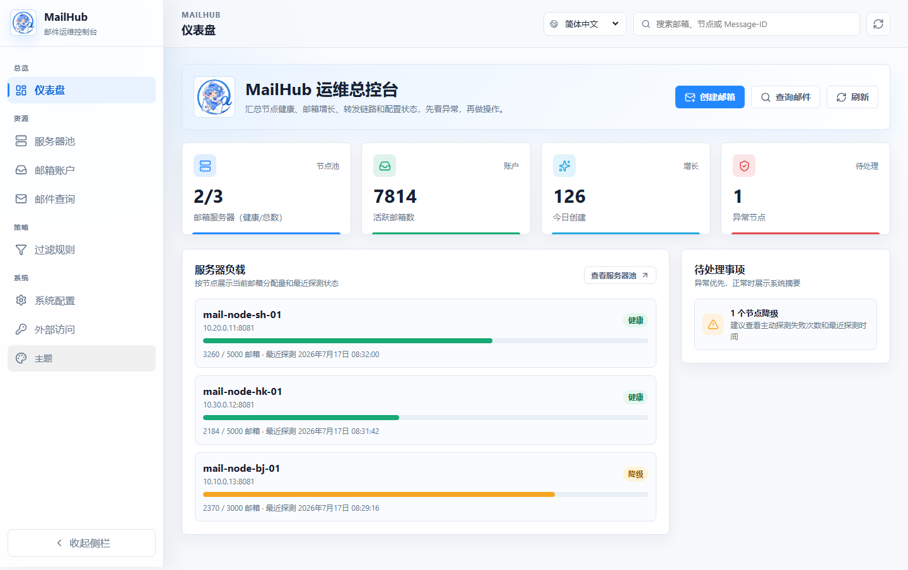
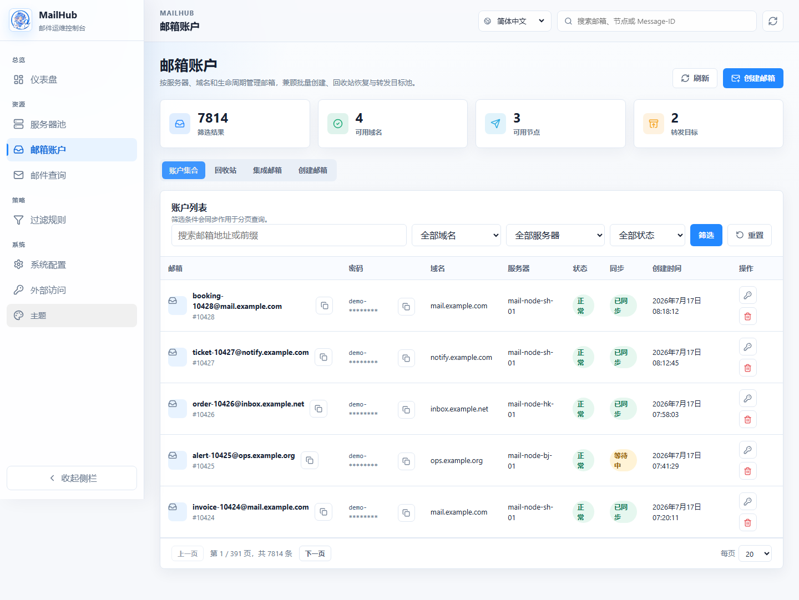
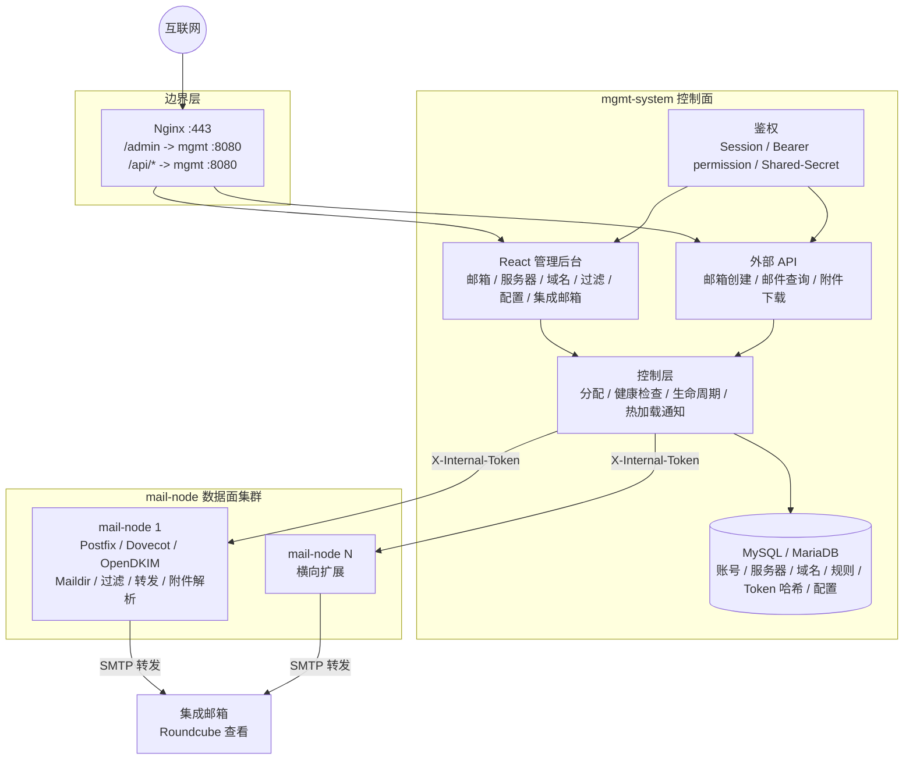

# MailHub

[简体中文](README.md) | [English](README.en.md) | [日本語](README.ja.md)

MailHub 是一套基于 Postfix + Dovecot + OpenDKIM 的自建邮局管理系统。它把管理编排放在 `mgmt-system` 控制面，把真实收信、Maildir 存储、过滤转发和域名落地放在 `mail-node` 数据面，适合批量开通业务邮箱、统一汇总邮件，并通过 API 向业务系统或大模型系统提供结构化邮件读取能力。

当前代码已经完成多服务器邮局池、域名/DKIM 自动化、支持中英日切换的 React 管理后台、过滤转发、集成邮箱热切换、动态配置、回收站生命周期、结构化邮件查询、附件下载和 inline 图片兼容处理。

---

## 界面展示

> 以下界面使用脱敏示例数据，实际菜单和功能以当前版本为准。

### 运维总览



仪表盘集中展示节点健康、邮箱增长、容量水位和待处理异常，可直接进入邮箱创建、邮件查询和服务器管理。

### 邮箱账户管理



邮箱账户页支持按域名、服务器和状态筛选，统一处理单个/批量创建、账密导出、密码修改、回收站恢复和集成邮箱切换。

## 使用流程

1. **部署并登录**：按[控制面部署指南](docs/control-plane-deployment.md)完成数据库、配置和管理员 bootstrap，访问 `https://<管理域名>/admin/login`；若初始化时启用了 `--must-change-password`，首次登录需先修改密码。
2. **接入邮件资源**：在“服务器池”注册 `mail-node`、绑定可用域名，并按[数据面部署指南](docs/design/deployment-guide.md)完成 DNS、Postfix、Dovecot 和 OpenDKIM 配置；节点健康后即可参与自动分配。
3. **创建邮箱**：进入“邮箱账户 > 创建邮箱”，可让系统自动选择健康节点和域名，也可手动指定；支持单个创建、批量粘贴以及 CSV/TXT 导入。
4. **收取与查询**：邮件到达后，在“邮件查询”输入完整邮箱地址查看正文、HTML 预览和附件；需要统一汇总时，在“邮箱账户 > 集成邮箱”设置当前转发目标。
5. **开放业务 API**：在“外部访问”创建调用方、按需授权并签发 Token。完整 Token 只展示一次，调用时通过 `Authorization: Bearer <token>` 传入；接口和权限说明见[外部 API 对接文档](docs/api/external-api.md)。

---

## 当前能力

### 控制面 `mgmt-system`

- 管理后台：React SPA，入口为 `/admin/*`，Session 鉴权。
- 外部 API：`/api/v1/mailboxes`、`/api/v1/orders/*/emails`、`/api/v1/mailboxes/*/messages`、`/api/v1/emails/*`，由管理端创建外部应用、勾选功能并签发 Bearer Token。
- 内部 API：`/api/v1/internal/*`，与 mail-node 通过 `X-Internal-Token` Shared-Secret 互信。
- 资源管理：邮箱账号、服务器池、域名池、过滤规则、系统配置、集成邮箱。
- 调度能力：健康检查、心跳接收、生命周期 Watchdog、软删除过期标记、配置/规则热加载通知。
- 数据存储：MySQL / MariaDB；控制面启动时使用 GORM AutoMigrate 自动创建/更新当前表，并保留历史 `order_mailboxes` 到新账号模型的迁移路径。

### 数据面 `mail-node`

- 邮件服务同机组件：Postfix 收信、Dovecot 存储、OpenDKIM 签名配置。
- 邮箱管理：创建邮箱、修改密码、安全删除、从 `.trash` 恢复。
- 域名管理：Postfix 虚拟域落地、DKIM key / SigningTable / KeyTable 写入。
- 邮件处理：扫描 Maildir `new/` 和 `cur/`，按规则 `pass / flag / block` 处理，SMTP 转发到当前 active 集成邮箱。
- 邮件读取：结构化解析 MIME，返回正文、头部、附件元数据，并通过有界本地路径索引支持正文、预览和附件二进制下载。
- 兼容处理：对缺 filename、缺后缀、错误 `application/octet-stream` 的 inline 图片按魔数推断类型和扩展名；API 读取、HTML 预览、SMTP 转发链路保持一致。

---

## 架构


```mermaid
flowchart TB
    internet((互联网))

    subgraph edge["边界层"]
        nginx["Nginx :443<br/>/admin -> mgmt :8080<br/>/api/* -> mgmt :8080"]
    end

    subgraph mgmt["mgmt-system 控制面"]
        web["React 管理后台<br/>邮箱 / 服务器 / 域名 / 过滤 / 配置 / 集成邮箱"]
        api["外部 API<br/>邮箱创建 / 邮件查询 / 附件下载"]
        control["控制层<br/>分配 / 健康检查 / 生命周期 / 热加载通知"]
        auth["鉴权<br/>Session / Bearer permission / Shared-Secret"]
        db[("MySQL / MariaDB<br/>账号 / 服务器 / 域名 / 规则 / Token 哈希 / 配置")]
    end

    subgraph nodes["mail-node 数据面集群"]
        node1["mail-node 1<br/>Postfix / Dovecot / OpenDKIM<br/>Maildir / 过滤 / 转发 / 附件解析"]
        nodeN["mail-node N<br/>横向扩展"]
    end

    union["集成邮箱<br/>Roundcube 查看"]

    internet --> nginx
    nginx --> web
    nginx --> api
    web --> control
    api --> control
    auth --> web
    auth --> api
    control --> db
    control -->|"X-Internal-Token"| node1
    control -->|"X-Internal-Token"| nodeN
    node1 -->|"SMTP 转发"| union
    nodeN -->|"SMTP 转发"| union
```

更完整的数据模型、接口流向和运行约束见 [架构概览](docs/architecture-overview.md)。

---

## 技术栈

| 层面 | 选型 | 当前用途 |
|------|------|----------|
| 后端 | Go 1.22+、Gin、GORM | 控制面和数据面服务 |
| 数据库 | MySQL 8.0 / MariaDB 10.5+ | 控制面元数据 |
| 邮件服务 | Postfix、Dovecot、OpenDKIM | 数据面真实收发和签名 |
| 管理后台 | React、Vite | `/admin/*` SPA |
| Webmail | Roundcube 1.6+ | 查看集成邮箱汇总邮件 |
| 部署 | systemd、Nginx | 裸机/云主机部署 |

---

## 目录结构

```text
.
├── mgmt-system/
│   ├── cmd/server/                 # 控制面入口
│   ├── internal/
│   │   ├── handler/                # HTTP handlers
│   │   ├── service/                # 邮箱创建、账号导入、分配器
│   │   ├── store/                  # GORM 数据访问、动态配置、迁移
│   │   ├── middleware/             # Session / Bearer / Shared-Secret
│   │   ├── healthcheck/            # 主动健康检查
│   │   └── lifecycle/              # 生命周期 Watchdog / purge
│   ├── web/                        # React SPA 源码
│   ├── template/static/admin-app/  # SPA 构建产物
│   └── config.example.yaml
├── mail-node/
│   ├── cmd/node/                   # 数据面入口
│   ├── internal/
│   │   ├── mailbox/                # Maildir、账号配置、密码
│   │   ├── forward/                # 扫描、过滤、SMTP 转发、生命周期
│   │   ├── handler/                # 内部 API、MIME 解析、附件下载
│   │   ├── domain/                 # 虚拟域、DKIM
│   │   ├── filter/                 # 过滤引擎
│   │   └── config/                 # YAML + 远程动态配置
│   └── config.example.yaml
└── docs/
    ├── architecture-overview.md    # 当前架构事实源
    ├── api/external-api.md         # 外部 API 契约事实源
    └── design/                     # 专题设计、历史设计和部署文档
```

---

## 快速开始

### 1. 准备

- 控制面机器：MySQL 8.0 / MariaDB 10.5+。
- 至少一台数据面机器：开放 SMTP 25 端口，并安装 Postfix、Dovecot、OpenDKIM。
- 一个可管理 DNS 的邮件域名。
- 服务器最低/推荐配置、Maildir 附件性能边界和磁盘公式见[部署容量与附件存储边界](docs/deployment-capacity.md)。2C2G 仅作为低并发基线，不代表大附件并发容量。

### 2. 配置

```bash
cp mgmt-system/config.example.yaml mgmt-system/config.yaml
cp mail-node/config.example.yaml mail-node/config.yaml
```

关键配置：

- `database.dsn`：控制面数据库连接。
- 管理员凭据：通过 `mgmt-server admin bootstrap` 写入数据库 hash；`auth.admin_user` / `auth.admin_pass` 已废弃且不参与运行期登录。
- `auth.shared_secret`：mgmt-system 与 mail-node 必须一致。
- 外部 API Token：控制面启动后在管理端“外部访问”页面创建；新部署不要配置 `auth.tokens`。
- `management.api_url`：mail-node 访问 mgmt-system 的地址。
- `forward.smtp_*`：转发用 SMTP 连接参数；转发目标地址由后台“集成邮箱”管理，并同步到动态配置。
- `dkim.*`、`postfix.*`、`maildir.*`：数据面落地 Postfix / Dovecot / OpenDKIM 所需路径。

#### 数据库自动建表与升级

`mgmt-server` 会自动创建和更新表结构，但不会创建 DSN 中指定的数据库本身。部署前需先创建数据库，并确保连接账号在该库拥有 `CREATE`、`ALTER`、`INDEX`、`DROP` 及常规读写权限；缺少权限时服务会拒绝启动。

- 新部署：自动创建 `api_applications`、`api_credentials`、`api_permissions`、`api_resources`、`api_application_permissions`、`api_access_logs` 等当前表；不会创建历史明文表 `api_tokens`。
- 旧版本升级：首次启动新版本时，先自动创建/更新当前表，再把 `api_tokens` 中仍启用的 Token 和已有 `auth.tokens` 导入为哈希凭证。每个凭证验证成功后才删除 `api_tokens`；任一步失败都会阻止服务启动。
- 升级成功后：确认外部 API 正常且数据库中已无 `api_tokens`，再从实际配置文件删除 `auth.tokens`。之后新增外部凭证只能通过管理端签发。
- 回滚限制：`api_tokens` 删除后不要直接回滚旧二进制；旧版本可能重新创建明文表并从旧配置恢复 Token。回滚必须同时恢复升级前数据库备份和匹配的配置文件。

首次启动控制面前初始化管理员：

```bash
./mgmt-server admin bootstrap \
  --config ./config.yaml \
  --username admin \
  --password-file /run/secrets/mailhub_initial_admin_password \
  --must-change-password

./mgmt-server serve
```

忘记密码时使用 `admin reset-password` 显式恢复。生产模式未完成 bootstrap 时，`serve` 会拒绝启动；运行期登录只验证数据库中的 bcrypt hash。完整迁移与恢复口径见 [O2-P5 管理账号 Bootstrap 与恢复设计](docs/design/ui-second-optimization-p5-admin-bootstrap-design.md)。

已有部署可执行一次性迁移命令读取旧配置凭据；该路径只在未初始化时生效，并强制首次登录改密：

```bash
./mgmt-server admin bootstrap-from-config --config ./config.yaml
```

### 3. 构建

```bash
cd mgmt-system
go build -o mgmt-server ./cmd/server

cd ../mail-node
CGO_ENABLED=0 GOOS=linux GOARCH=amd64 go build -o mail-node ./cmd/node
```

### 4. 部署

新 mail-node 的 DNS、Postfix、Dovecot、OpenDKIM 与 Roundcube 部署步骤见 [数据面部署指南](docs/design/deployment-guide.md)。控制面基础配置见本页和 `mgmt-system/config.example.yaml`。

---

## 文档导航

### 当前事实源

| 文档 | 用途 |
|------|------|
| [架构概览](docs/architecture-overview.md) | 当前组件职责、数据模型、接口流向、状态机 |
| [数据库字典](docs/database-schema.md) | 当前 20 张控制面表、字段、关系、状态值和中文注释 |
| [外部 API 对接文档](docs/api/external-api.md) | 外部调用方接口、鉴权、响应结构、附件下载 |
| [控制面部署指南](docs/control-plane-deployment.md) | Docker Compose、systemd、管理员 bootstrap、升级和恢复 |
| [数据面部署指南](docs/design/deployment-guide.md) | 新 mail-node 的 DNS、Postfix、Dovecot、OpenDKIM 和 Roundcube 部署 |
| [部署容量与附件存储边界](docs/deployment-capacity.md) | 当前无对象存储版本的服务器配置、性能边界、磁盘规划及后续 MinIO 基线 |

### 当前专题设计

| 文档 | 用途 |
|------|------|
| [动态配置化设计](docs/design/dynamic-config-design.md) | `system_configs`、后台配置页、热加载 |
| [集成邮箱设计](docs/design/integrated-mailbox-design.md) | 转发目标池和 active 集成邮箱 |
| [附件下载设计](docs/design/attachment-download-design.md) | 附件代理、二进制响应、safe HTML 预览 |
| [Maildir 邮件路径索引设计](docs/design/maildir-message-index-design.md) | 轻量本地索引、冷查找、失效规则和单次完整解析 |
| [inline 图片兼容设计](docs/design/inline-image-filename-inference-design.md) | inline 图片类型/后缀推断和 Roundcube 兼容 |
| [生命周期恢复设计](docs/design/t9-restore-design.md) | `.trash` 恢复路径和冲突处理 |
| [服务器域名池设计](docs/design/t4-t5-server-domain-pool-design.md) | 服务器-域名绑定、DKIM、DNS 清单 |
| [鉴权体系设计](docs/design/t6-auth-design.md) | Session、Bearer scope、Shared-Secret |
| [健康检查设计](docs/design/t7-healthcheck-design.md) | 主动探测、被动心跳、状态升降级 |
| [管理账号 Bootstrap 与恢复设计](docs/design/ui-second-optimization-p5-admin-bootstrap-design.md) | 管理员首次初始化、数据库登录、后台改密、CLI 恢复与登录页 UI |

### 历史/规划记录

这些文档保留决策过程和早期方案，不作为当前实现事实源。若与当前代码、[架构概览](docs/architecture-overview.md) 或 [外部 API 文档](docs/api/external-api.md) 冲突，以当前代码和事实源文档为准。

| 文档 | 说明 |
|------|------|
| [技术实现方案](docs/design/technical-implementation.md) | 已整理为当前实现摘要，替代早期 Phase 1 草稿 |
| [Phase 1 设计文档](docs/design/phase1-design.md) | 初始设计记录 |
| [Phase 3 补全计划](docs/design/phase3-mgmt-completion-plan.md) | Phase 3 规划和验收记录 |
| [转发模块设计](docs/design/forwarding-design.md) | 早期转发方案和后续补充记录 |
| [Roundcube 参考分析](docs/roundcube-analysis.md) | Roundcube 技术参考 |

---

## 当前状态

| 模块 | 状态 |
|------|------|
| 邮箱账号管理、批量创建、CSV 上传 | 已完成 |
| 多服务器、域名池、DKIM、DNS 清单 | 已完成 |
| React 管理后台（简体中文 / English / 日本語） | 已完成 |
| 三层鉴权 | 已完成 |
| 健康检查、心跳、节点发现 | 已完成 |
| 过滤规则、主动重载、Maildir 转发 | 已完成 |
| 集成邮箱管理和 SMTP 凭据热加载 | 已完成 |
| MIME 结构化解析、正文查询、附件下载 | 已完成 |
| Maildir Message-ID 路径索引与目标单次完整解析 | 已完成 |
| 回收站、恢复、purge、重启删除任务恢复 | 已完成 |
| inline 图片 MIME / filename / 后缀兼容 | 已完成 |
| 管理账号 Bootstrap、数据库登录、后台改密与 CLI 恢复 | 已完成 |

### 当前待办

| 优先级 | 事项 | 状态 |
|--------|------|------|
| P1 | 节点配置可观测与通用覆盖 | 设计草案；先完成 NC-P0 的保留期语义、所有权和真实键名核对 |
| 候选 | 外部创建邮箱 API 支持指定 `server_id` | 尚未排期，需先确认调用方权限与节点分配策略 |
| 候选 | MinIO 附件对象存储与预签名 URL | 达到容量触发条件后开发；服务器基线见部署容量文档 |
