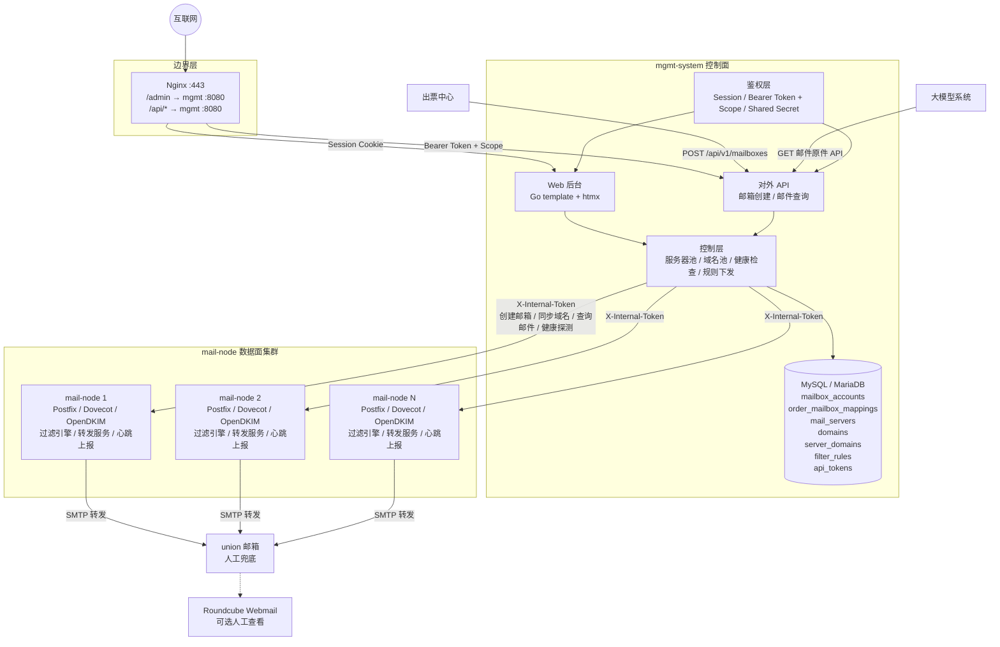
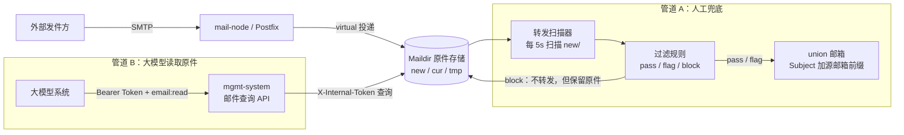
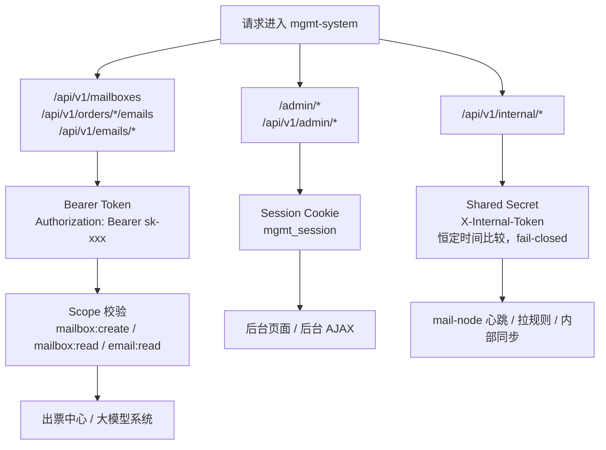
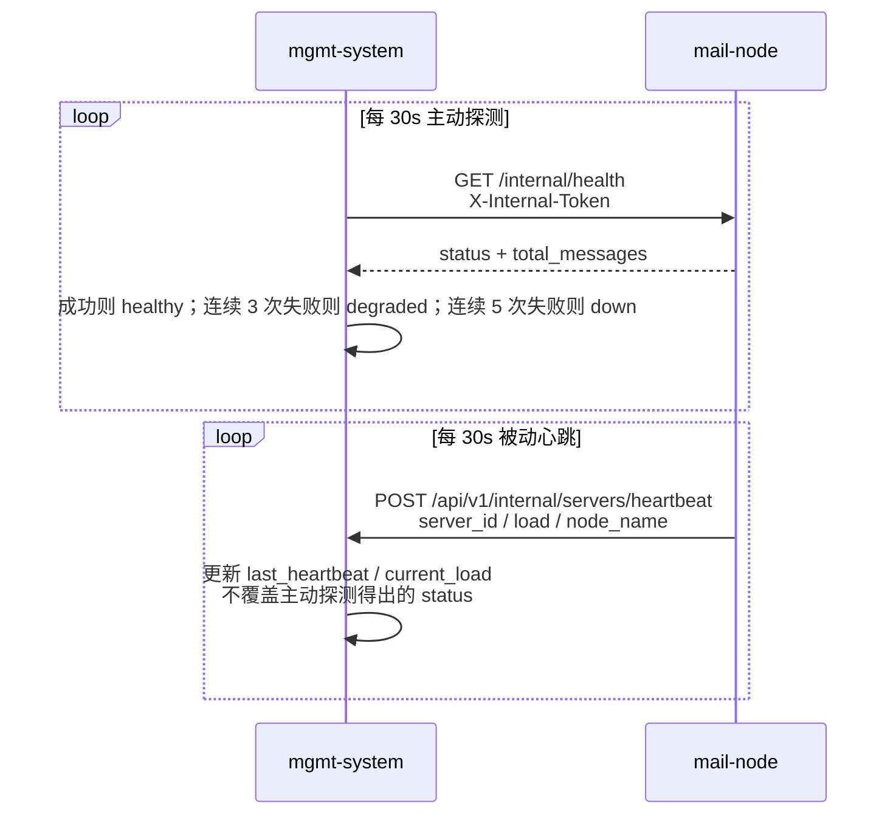

# 系统架构概览

> 版本: v1.1 | 日期: 2026-06-26 | 状态: 反映 Phase 3 T4–T7 闭环后的当前架构

---

## 1. 全局架构

> 说明：本图只表达系统边界、组件关系和主调用方向；详细接口与数据模型放在后续表格中，避免一张图承载过多信息。



### 接口流向

| # | 方向 | 鉴权 | 说明 |
|---|------|------|------|
| ① | 运营人员 → mgmt-system | Session Cookie | Web 后台操作（创建邮箱、管理域名、编辑规则） |
| ② | 出票中心 → mgmt-system | Bearer Token + Scope | 创建邮箱 |
| ③ | 大模型系统 → mgmt-system | Bearer Token + Scope | HTTP API 拉取邮件原件 |
| ④ | mgmt-system → mail-node | `X-Internal-Token` Shared-Secret | 创建邮箱、查询邮件、同步域名、健康探测 |
| ⑤ | mail-node → mgmt-system | `X-Internal-Token` Shared-Secret | 心跳上报、拉取过滤规则、拉取删除任务 |
| ⑥ | mail-node → union 邮箱 | SMTP AUTH | 自动转发（Subject 加源邮箱前缀，正文原样透传） |

---

## 2. 管理系统（mgmt-system）

### 2.1 职责

```
mgmt-system = 控制面（Control Plane）
```

| 职责 | 说明 |
|------|------|
| **邮箱账号管理** | 单个/批量/CSV 创建，密码持久化，远端同步状态追踪，账号台账页面 |
| **服务器池管理** | 注册/编辑/删除邮箱服务器，维护健康状态（healthy/degraded/down/draining） |
| **域名池管理** | 在服务器上下文中添加/移除域名，触发远端 Postfix 虚拟域 + DKIM 配置，返回 DNS 清单 |
| **健康检查** | 每 30s 主动探测 mail-node `/internal/health`，连续失败降级→摘除 |
| **分配策略** | 域名感知 + 最少连接优先：按 `server_domains` 筛选 active/synced/healthy 服务器，选负载最轻 |
| **过滤规则管理** | 增删改查规则，mail-node 定时拉取热生效 |
| **邮件查询 API** | 按订单或邮箱定位 mail-node，透传查询 Maildir 原件 |
| **鉴权** | 三层鉴权：后台 Session + 外部 API Bearer Token (Scope) + 内部 Shared-Secret |

### 2.2 核心数据模型

```
mailbox_accounts 表（账号资产主表）：
  id              → 账号 ID（主键）
  email_address   → 邮箱地址（唯一）
  local_part      → 邮箱本地部分
  password        → 邮箱密码
  domain_id       → 绑定域名
  server_id       → 所在服务器
  status          → active / disabled / recycled
  sync_status     → synced / pending / sync_failed
  sync_error      → 同步失败原因
  retention_days  → 保留天数
  synced_at       → 最后同步时间
  expires_at      → 过期时间
  disabled_at     → 禁用时间
  recycled_at     → 回收时间
  created_at / updated_at

order_mailbox_mappings 表（订单 ↔ 邮箱账号绑定）：
  id                 → 绑定 ID
  order_id           → 订单号
  mailbox_account_id → 邮箱账号 ID
  created_at         → 绑定时间

mail_servers 表：
  id              → 服务器 ID
  name            → 名称标识
  api_host        → mail-node API 地址（IP:Port）
  smtp_host       → SMTP 地址
  imap_host       → IMAP 地址
  public_host     → 公网主机名（DNS A 记录指向）
  status          → healthy / degraded / down / draining
  capacity        → 最大邮箱数
  current_load    → 当前邮箱数
  last_heartbeat  → 最后心跳时间
  last_probe_at   → 最后探测时间
  probe_fail_count → 连续探测失败次数

server_domains 表（服务器 ↔ 域名绑定）：
  id              → 绑定 ID
  server_id       → 服务器
  domain_id       → 域名
  status          → active / inactive
  sync_status     → synced / pending / sync_failed / partial
  postfix_status  → synced / pending / sync_failed
  dkim_status     → synced / pending / sync_failed
  dkim_selector   → DKIM selector（如 mail-s2）
  dkim_public_key → DKIM 公钥
  sync_error      → 同步错误信息

domains 表：
  id              → 域名 ID
  name            → 域名（如 example.com）
  mx_server       → MX 指向的主机名
  status          → active / inactive
  created_at / updated_at

order_mailboxes 表（历史兼容表）：
  order_id        → 订单号
  email_address   → 邮箱地址
  server_id       → 所在服务器
  status          → active / disabled / recycled
  sync_status     → synced / pending / sync_failed
  created_at / synced_at / expires_at / disabled_at / recycled_at

filter_rules 表：
  id / name / rule_type / pattern / action / priority / enabled

api_tokens 表：
  id / name / token / scopes / enabled / created_at / last_used_at
```

### 2.3 对外 API

```
# 出票中心
POST   /api/v1/mailboxes                    → 创建邮箱（scope: mailbox:create）
GET    /api/v1/mailboxes/{order_id}         → 按订单查询邮箱信息（scope: mailbox:read）
POST   /api/v1/mailboxes/{order_id}/disable → 禁用/回收邮箱（scope: mailbox:create）

# 大模型系统
GET    /api/v1/orders/{order_id}/emails     → 按订单查询邮件列表（scope: email:read）
GET    /api/v1/emails/{message_id}/body?mailbox={email}
                                             → 查询单封邮件正文（scope: email:read）

# 管理后台
GET    /admin/*                             → Web 后台页面（Session 鉴权）
GET    /api/v1/admin/*                      → 后台 AJAX API（Session 鉴权）

# 内部接口（mail-node → mgmt）
POST   /api/v1/internal/servers/heartbeat   → 心跳上报
GET    /api/v1/internal/filters             → 过滤规则拉取
GET    /api/v1/internal/sync/deleting       → 拉取待删除任务（T9/T10 对接）
```

---

## 3. 邮箱服务器（mail-node）

### 3.1 职责

```
mail-node = 数据面（Data Plane）
```

| 职责 | 说明 |
|------|------|
| **邮箱创建** | 写 Dovecot `users.conf` + Postfix `vmailbox` + 创建 Maildir + postmap/reload |
| **域名管理** | 添加/移除虚拟域（`postconf -e virtual_mailbox_domains`）、生成 DKIM 密钥对、写入 SigningTable/KeyTable、opendkim reload |
| **SMTP 收信** | Postfix 接收外部邮件 → virtual 投递到 Maildir |
| **邮件存储** | Maildir 格式：`/var/mail/vhosts/%d/%n/{new,cur,tmp}` |
| **过滤引擎** | 定时从 mgmt 拉取过滤规则，扫描时匹配 pass/flag/block |
| **自动转发** | 每 5s 扫描 Maildir `new/` → 过滤 → SMTP STARTTLS 转发到 union → 移入 `cur/` |
| **防循环** | 转发注入 `X-Forwarded-By: mail-node`，扫描时检测跳过 |
| **安全删除** | `os.Rename` 到 `.trash/` + 摘除 Postfix/Dovecot 配置 + 定时 GC（24h 冷却） |
| **心跳上报** | 每 30s POST 到 mgmt `/api/v1/internal/servers/heartbeat`，上报负载 |
| **健康检查** | `GET /internal/health` 返回节点状态、邮件总数 |

### 3.2 对内 API

```
POST   /internal/mailboxes                       → 创建邮箱
DELETE /internal/mailboxes/{addr}                → 安全删除（移入 .trash）
PUT    /internal/mailboxes/{email}/password      → 修改密码
GET    /internal/mailboxes/{addr}/messages       → 获取邮件列表
GET    /internal/messages/{message_id}?mailbox={email}
                                                  → 获取单封邮件
POST   /internal/domains                         → 添加虚拟域 + DKIM
GET    /internal/domains                         → 列出虚拟域
DELETE /internal/domains/{domain}                → 移除虚拟域 + 清理 DKIM
GET    /internal/health                          → 健康检查
```

所有 `/internal/*` 接口均需 `X-Internal-Token` Shared-Secret 鉴权。

---

## 4. 邮件处理双管道



### 4.1 邮件处理流水线

```
SMTP 收信（Postfix :25）
  → virtual 投递到 Maildir new/
    → 转发扫描器（每 5s）
      → 过滤引擎匹配规则（从 mgmt 定时拉取）
        ├── pass → SMTP 转发到 union（Subject 加 [源邮箱: xxx] 前缀）
        ├── flag → SMTP 转发到 union（Subject 加 [疑似][源邮箱: xxx] 前缀）
        └── block → 保留原件在 Maildir，不转发
      → 转发成功后移入 cur/
    → mgmt 按需查询 Maildir → 返回大模型系统
```

---

## 5. 鉴权体系（T6）



mail-node `/internal/*` 接口同样使用 Shared-Secret 鉴权，两边 `shared_secret` 配置一致。

---

## 6. 健康检查与心跳（T7）



---

## 7. 关键设计约束

| 约束 | 说明 |
|------|------|
| **mgmt 1:N mail-node** | mgmt 是单点（可做主备），mail-node 可横向扩展 |
| **mail-node 无状态倾向** | 邮箱分配由 mgmt 决策，mail-node 只负责执行，便于替换和扩容 |
| **大模型系统解耦** | 邮件原件通过 API 拉取，不在本项目做 LLM 调用 |
| **union 邮箱只供人工** | 邮件已被标签修改（Subject 前缀），仅供运营人工兜底，不供 LLM 消费 |
| **管道 A vs B 分离** | 管道 A：mail-node → SMTP 转发 → union（人工查看）；管道 B：大模型系统 → mgmt API → mail-node Maildir（原始数据） |
| **过滤铁律** | 宁可错放，不可错杀。block 仅不转发，原件保留在 Maildir |
| **UID 体系** | vmail=5000:5000 标准，可通过 config 调整；部署前必须 `id vmail` 验证 |

---

## 8. 项目演进

| 阶段 | 内容 | 状态 |
|------|------|------|
| Phase 1A | 项目骨架 + mgmt CRUD API + Web 后台 | ✅ |
| Phase 1B | 国际机部署（Postfix + Dovecot + mail-node）+ DNS + 收发验证 | ✅ |
| Phase 2 | 自动转发模块 + Roundcube Webmail + 正文透传 | ✅ |
| Phase 3 T4/T5 | 服务器域名池 + Postfix 虚拟域 + DKIM 自动配置 + DNS 清单 | ✅ |
| Phase 3 T6 | 三层鉴权（Session + Bearer Scope + Shared-Secret） | ✅ |
| Phase 3 T7 | 健康检查与心跳（主动探测 + 被动上报 + 降级摘除） | ✅ |
| Phase 3 T8 | MIME 结构化预处理 | 🔜 |
| Phase 3 T9 | 邮箱生命周期四态流 + GC 对接 | 🔜 |
| Phase 3 T10 | 收尾（filter 主动推送、TLS 证书、临时机清理） | 🔜 |
| 扩展方案 | 订单-邮箱 N:M 映射 | 暂缓 |
