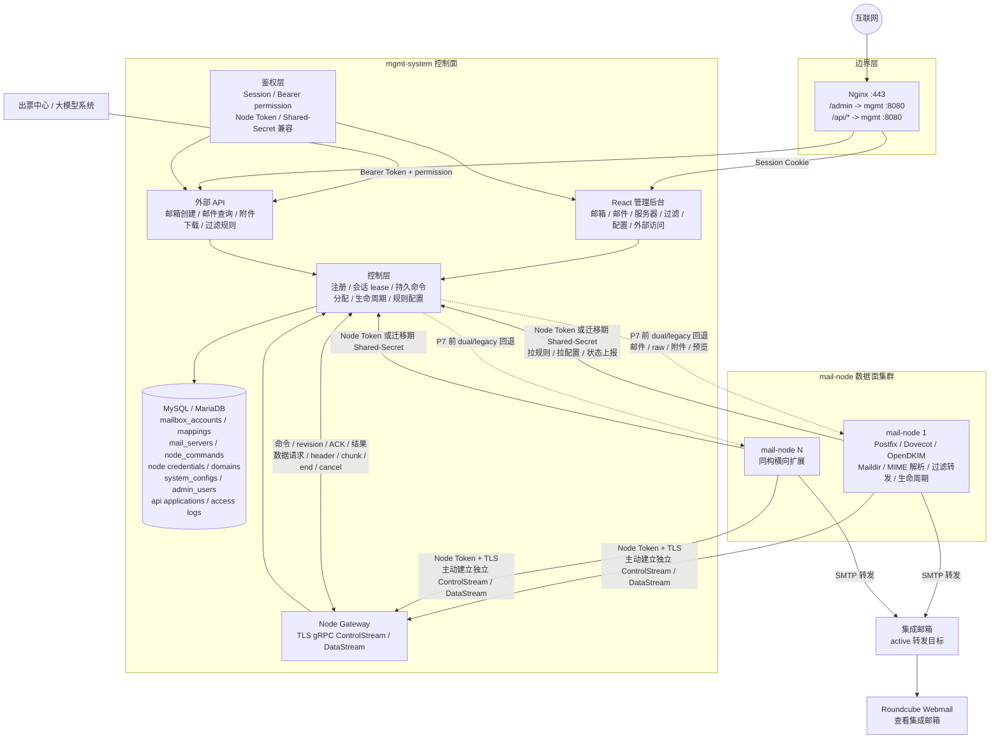
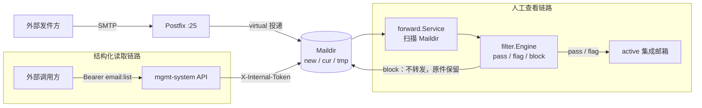
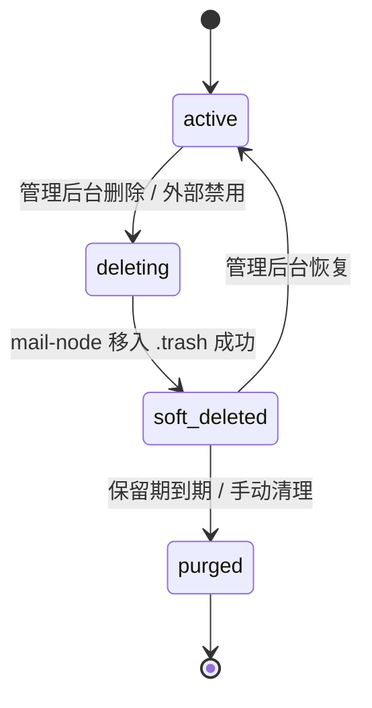

# 系统架构概览

> 版本: v1.4 | 日期: 2026-07-25 | 状态: 与当前代码实现对齐。本文是架构、数据模型和接口流向的事实源。

---

## 1. 全局架构


```mermaid
flowchart TB
    internet((互联网))

    subgraph edge["边界层"]
        nginx["Nginx :443<br/>/admin -> mgmt :8080<br/>/api/* -> mgmt :8080"]
    end

    subgraph mgmt["mgmt-system 控制面"]
        auth["鉴权层<br/>Session / Bearer permission<br/>Node Token / Shared-Secret 兼容"]
        web["React 管理后台<br/>邮箱 / 邮件 / 服务器 / 过滤 / 配置 / 外部访问"]
        api["外部 API<br/>邮箱创建 / 邮件查询 / 附件下载 / 过滤规则"]
        control["控制层<br/>注册 / 会话 lease / 持久命令<br/>分配 / 生命周期 / 规则配置"]
        gateway["Node Gateway<br/>TLS gRPC ControlStream / DataStream"]
        db[("MySQL / MariaDB<br/>mailbox_accounts / mappings<br/>mail_servers / node_commands<br/>node credentials / domains<br/>system_configs / admin_users<br/>api applications / access logs")]
    end

    subgraph nodes["mail-node 数据面集群"]
        node1["mail-node 1<br/>Postfix / Dovecot / OpenDKIM<br/>Maildir / MIME 解析 / 过滤转发 / 生命周期"]
        nodeN["mail-node N<br/>同构横向扩展"]
    end

    caller["出票中心 / 大模型系统"]
    union["集成邮箱<br/>active 转发目标"]
    roundcube["Roundcube Webmail<br/>查看集成邮箱"]

    internet --> nginx
    caller -->|"Bearer Token + permission"| api
    nginx -->|"Session Cookie"| web
    nginx --> api

    auth --> web
    auth --> api
    web --> control
    api --> control
    control --> db
    gateway --> control

    node1 -->|"Node Token + TLS<br/>主动建立独立 ControlStream / DataStream"| gateway
    nodeN -->|"Node Token + TLS<br/>主动建立独立 ControlStream / DataStream"| gateway
    control <-->|"命令 / revision / ACK / 结果<br/>数据请求 / header / chunk / end / cancel"| gateway
    control -.->|"P7 前 dual/legacy 回退<br/>邮件 / raw / 附件 / 预览"| node1
    control -.->|"P7 前 dual/legacy 回退"| nodeN
    node1 -->|"Node Token 或迁移期 Shared-Secret<br/>拉规则 / 拉配置 / 状态上报"| control
    nodeN -->|"Node Token 或迁移期 Shared-Secret"| control

    node1 -->|"SMTP 转发"| union
    nodeN -->|"SMTP 转发"| union
    union --> roundcube
```

### 接口流向

| # | 方向 | 鉴权 | 当前用途 |
|---|------|------|----------|
| 1 | 运营人员 -> mgmt-system | Session Cookie | React 后台页面和 `/api/v1/admin/*` |
| 2 | 外部业务系统 -> mgmt-system | Bearer Token + 应用权限 | 创建/查询/禁用邮箱，读取邮件和附件 |
| 3 | mail-node -> mgmt-system Node Gateway | TLS + 每节点 Token | node 主动建立独立双向 ControlStream/DataStream；控制流承载 lease、revision 和命令，数据流承载邮件与附件分块读取和取消 |
| 4 | mgmt-system -> mail-node legacy API | `X-Internal-Token` | P7 前作为 `legacy_http` 主路径和 `dual` 读取回退保留；纯 `control_stream` 业务路径不依赖 node `8081` |
| 5 | mail-node -> mgmt-system HTTPS | 每节点 Token；legacy 可用 Shared-Secret | 拉取完整过滤规则和动态配置、状态上报；通知丢失由周期拉取收敛 |
| 6 | mail-node -> 集成邮箱 | SMTP AUTH / STARTTLS | 将通过过滤的邮件转发到 active 集成邮箱 |

---

## 2. 控制面 `mgmt-system`

### 2.1 职责

| 职责 | 当前实现 |
|------|----------|
| 管理后台 | `/admin/*` React SPA；登录、Dashboard、服务器、域名、邮箱、邮件、过滤、配置页面 |
| 邮箱账号管理 | 单个/批量/CSV 创建，密码持久化，订单映射，状态追踪，回收站、恢复、清理 |
| 服务器池管理 | 邀请注册、审批、独立凭证、单活 session、lease、四维状态、容量和负载 |
| 域名池管理 | 服务器-域名绑定，远端 Postfix 虚拟域和 DKIM 同步，DNS 清单 |
| 分配策略 | 优先使用指定 `domain_id`；未指定时选择有 active/synced/healthy 绑定且负载最低的域名和服务器 |
| 邮件查询代理 | 按订单或邮箱定位数据面，代理邮件列表、正文和附件下载 |
| 持久命令 | `node_commands` 先落库后投递；sequence、ACK、deadline、重投、同步等待和 operation ID |
| 过滤规则管理 | 后台 CRUD；ControlStream revision 通知唤醒 node HTTPS 拉取，legacy 节点保留旧通知 |
| 动态配置 | `system_configs` KV 表、后台可视化配置、缓存读取、ControlStream revision 通知 |
| 集成邮箱 | 多个转发目标账号，唯一 active；激活时同步 `forward.target_address` 并通知数据面 |
| 生命周期调度 | deleting Watchdog、soft_deleted 过期标记为 purged |
| 鉴权 | Session、外部应用 Bearer Token 权限、每节点运行 Token；Shared-Secret 仅作迁移兼容 |
| 外部访问管理 | 应用命名与启停、功能授权、哈希凭证签发/轮换/撤销、调用日志 |

### 2.2 核心数据模型

| 表 | 关键字段 | 说明 |
|----|----------|------|
| `mailbox_accounts` | `email_address`, `password`, `domain_id`, `server_id`, `status`, `sync_status`, `retention_days`, `delete_requested_at` | 当前邮箱账号主表。`retention_days` 为兼容字段，实际单封邮件保留期由全局配置控制；`status` 为 `active / disabled / recycled / deleting / soft_deleted / purged`。 |
| `order_mailbox_mappings` | `order_id`, `mailbox_account_id` | 订单与邮箱绑定。当前按 1:1 使用，schema 支持后续扩展。 |
| `order_mailboxes` | legacy 邮箱字段 | 历史兼容表；启动迁移到 `mailbox_accounts` + `order_mailbox_mappings`。 |
| `mail_servers` | `node_uuid`, 四维状态, `transport_mode`, `lease_expires_at`, `desired_revision`, `applied_revision`, Agent/协议/capabilities | 数据面节点身份、连接、健康、分配意图和配置版本事实；`api_host` 仅作 legacy 兼容。 |
| `node_enrollment_tokens` / `node_enrollment_requests` / `node_credentials` | 邀请哈希、申请状态、节点凭证哈希/版本/撤销 | 节点注册、审批和独立运行凭证；完整 secret 不落库。 |
| `node_commands` | `command_id`, `server_id+sequence`, 幂等键, payload, state, deadline, ACK/结果 | P5 持久命令事实源；先提交数据库，再通过 active ControlStream 投递。 |
| `domains` | `name`, `mx_server`, `status` | 邮件域名池。 |
| `server_domains` | `server_id`, `domain_id`, `status`, `sync_status`, `postfix_status`, `dkim_status`, `dkim_selector`, `dkim_public_key` | 服务器-域名绑定和远端同步快照。 |
| `filter_rules` | `rule_type`, `pattern`, `action`, `priority`, `enabled` | 过滤规则，action 为 `pass / block / flag`。 |
| `api_applications` / `api_credentials` | 应用状态、Token 哈希、前缀、过期和最近使用信息 | 外部调用方与可轮换凭证。完整 Token 不落库。 |
| `api_permissions` / `api_resources` / `api_application_permissions` | 权限编码、method/path、应用授权 | 业务功能与自动注册接口的权限模型。 |
| `api_access_logs` | 应用、凭证、权限、状态码、IP、耗时 | 外部 API 调用审计。 |
| `system_configs` | `config_key`, `config_value`, `value_type`, `category`, `reloadable` | 动态配置源。 |
| `integrated_mailboxes` | `email_address`, `display_name`, `is_active` | 集成邮箱转发目标池；全局只有一个 active。 |
| `admin_users` | `username`, `password_hash`, `credential_version`, `status` | 管理后台数据库身份和凭据版本。 |
| `server_config_overrides` | `server_id`, `config_key`, `config_value`, `value_type` | 单节点显式配置覆盖；同一节点和键唯一。 |
| `server_config_snapshots` | `server_id`, `config_key`, `effective_value`, `source`, `applied_revision`, `boot_id`, `reported_at` | mail-node 实际配置、版本与启动身份快照。 |
| `system_state` | `key`, `value`, `updated_at` | bootstrap 等系统内部状态。 |

完整表结构及字段定义见 [控制面数据库字典](database-schema.md)。

### 2.3 对外 API

所有接口统一挂在 `/api/v1`，使用 Bearer Token 鉴权。完整契约见 [外部 API 对接文档](api/external-api.md)。

```text
POST /api/v1/mailboxes
GET  /api/v1/mailboxes/{order_id}
POST /api/v1/mailboxes/{order_id}/disable

GET  /api/v1/orders/{order_id}/emails
GET  /api/v1/mailboxes/{email}/messages
GET  /api/v1/emails/{message_id}/body?mailbox={email}
GET  /api/v1/emails/{message_id}/attachments/{index}?mailbox={email}
```

旧 `/api/v1/filters` 已退役。迁移期间仅保留 Session 鉴权的管理端 legacy CRUD 和供 mail-node 拉取的内部接口；版本化 manual/ad 策略外部 API 将按重构设计单独发布。

### 2.4 管理后台 API

以下接口挂在 `/api/v1/admin`，使用 Session 鉴权。

```text
GET    /dashboard

GET    /servers
POST   /servers
GET    /servers/{id}
PUT    /servers/{id}
DELETE /servers/{id}
GET    /servers/{id}/domains
POST   /servers/{id}/domains
DELETE /servers/{id}/domains/{domain_id}

GET    /mailboxes
POST   /mailboxes/batch
POST   /mailboxes/upload
PUT    /mailboxes/{id}
POST   /mailboxes/{id}/delete
POST   /mailboxes/{id}/restore
POST   /mailboxes/{id}/purge

GET    /emails
GET    /emails/{message_id}/body
GET    /emails/{message_id}/attachments/{index}

GET    /filters
POST   /filters
PUT    /filters/{id}
DELETE /filters/{id}

GET    /integrated-mailboxes
POST   /integrated-mailboxes
PUT    /integrated-mailboxes/{id}
DELETE /integrated-mailboxes/{id}
POST   /integrated-mailboxes/{id}/activate

GET    /configs
GET    /configs/{key}
PUT    /configs/{key}
POST   /configs/batch
POST   /configs/{key}/reset
POST   /configs/reload
```

### 2.5 内部 API（mail-node -> mgmt-system）

以下接口挂在 `/api/v1/internal`，必须带 `X-Internal-Token`。

```text
POST /servers/discover
POST /servers/heartbeat
GET  /filters
GET  /configs
POST /configs/reload
GET  /sync/deleting?server_id={id}
```

---

## 3. 数据面 `mail-node`

### 3.1 职责

| 职责 | 当前实现 |
|------|----------|
| 邮箱创建 | 创建 Maildir，写 Dovecot `users.conf`，写 Postfix `vmailbox`，执行 postmap/reload |
| 密码修改 | 更新 Dovecot 用户配置 |
| 安全删除 | 摘除 Postfix/Dovecot 配置，等待转发排空，`os.Rename` 到 `.trash/` |
| 恢复 | 从 `.trash/<domain>__<localpart>-<unix_ts>` 取最近一次删除目录恢复，并重建配置 |
| 域名管理 | 添加/移除虚拟域，生成 DKIM，写入 OpenDKIM 表 |
| 邮件存储 | Maildir：`<base>/<domain>/<localpart>/{new,cur,tmp}` |
| 邮件查询 | 扫描 `new/` 和 `cur/`；使用有界进程内 Message-ID 路径索引，冷态只扫描邮件头，正文/附件仅完整解析目标 EML |
| 过滤转发 | 后台扫描 Maildir，应用规则后转发到 active 集成邮箱 |
| inline 图片兼容 | 对 MIME part 推断真实 content-type、filename 和扩展名 |
| 运行协同 | 节点发现失败后后台退避重试；恢复身份后自动拉取节点配置、上报心跳/snapshot，并对账 deleting 任务 |

### 3.2 对内 API

以下接口挂在 `/internal`，必须带 `X-Internal-Token`。节点对所有请求体设置 16 MiB 上限；废弃的公开 `/smtp/filter` 已移除，过滤主链路使用 Maildir 异步扫描。

```text
POST   /mailboxes
DELETE /mailboxes/{email}
POST   /mailboxes/{email}/restore
PUT    /mailboxes/{email}/password

POST   /domains
GET    /domains
DELETE /domains/{domain}

GET    /mailboxes/{email}/messages
GET    /messages/{message_id}?mailbox={email}
GET    /messages/{message_id}/attachments/{index}?mailbox={email}

GET    /health
GET    /stats
POST   /filters/reload
POST   /configs/reload
```

---

## 4. 邮件处理链路


```mermaid
flowchart LR
    sender["外部发件方"] -->|"SMTP"| postfix["Postfix :25"]
    postfix -->|"virtual 投递"| maildir[("Maildir<br/>new / cur / tmp")]

    subgraph pipeA["人工查看链路"]
        scanner["forward.Service<br/>扫描 Maildir"]
        filter["filter.Engine<br/>pass / flag / block"]
        union["active 集成邮箱"]
    end

    subgraph pipeB["结构化读取链路"]
        mgmtAPI["mgmt-system API"]
        caller["外部调用方"]
    end

    maildir --> scanner
    scanner --> filter
    filter -->|"pass / flag"| union
    filter -->|"block：不转发，原件保留"| maildir

    caller -->|"Bearer email:list"| mgmtAPI
    mgmtAPI -->|"X-Internal-Token"| maildir
```

处理规则：

- `pass`：转发到集成邮箱，Subject 增加来源标识。
- `flag`：转发到集成邮箱，Subject 增加疑似标识和来源标识。
- `block`：不转发，原件仍保留在 Maildir，可通过 API 读取。
- 转发链路会注入防循环标记，并修正常见 inline 图片 MIME 头。

---

## 5. 生命周期状态机


```mermaid
stateDiagram-v2
    [*] --> active
    active --> deleting: 管理后台删除 / 外部禁用
    deleting --> soft_deleted: mail-node 移入 .trash 成功
    soft_deleted --> active: 管理后台恢复
    soft_deleted --> purged: 保留期到期 / 手动清理
    purged --> [*]
```

关键行为：

- `deleting`：mgmt 记录 `delete_requested_at`，mail-node 摘除配置并等待转发排空。
- `soft_deleted`：Maildir 已移动到 `.trash/`，后台回收站可恢复。
- `active` 恢复路径：mail-node 从 `.trash` 找最近一次匹配目录并回迁，目标路径已存在时返回冲突。
- `purged`：mgmt 侧最终态；mail-node GC 会物理删除超过 `lifecycle.trash_retention_hours` 的 `.trash` 目录。
- mail-node 启动时会调用 `/api/v1/internal/sync/deleting` 拉取未完成任务并继续删除流程。

---

## 6. 鉴权体系

| 入口 | 鉴权方式 | 失败策略 |
|------|----------|----------|
| `/admin/*` 页面 | `mgmt_session` Session Cookie | 重定向登录或返回 401 |
| `/api/v1/admin/*` | Session Cookie | 返回 JSON 错误 |
| `/api/v1/mailboxes*`、`/api/v1/orders*`、`/api/v1/emails*` | 外部应用 Bearer Token + permission | Token 无效 401，权限不足 403 |
| `mgmt-system /api/v1/internal/*` | `X-Internal-Token` | 缺失或不匹配直接拒绝 |
| `mail-node /internal/*` | `X-Internal-Token` | 缺失或不匹配直接拒绝 |

细粒度权限当前取值：

- `mailbox:create`
- `mailbox:read`
- `mailbox:disable`
- `email:list`
- `email:body`
- `email:attachment`

旧 `email:read`、`mailbox:create` 和 `*` 仅在一次性升级导入时映射为新权限；运行期只使用 `api_credentials`。新应用在管理端“外部访问”页面创建并勾选具体功能。

后台管理员由 `admin_users` 的 bcrypt hash 校验；`system_state.admin_bootstrap` 独立记录初始化状态。首次安装使用 `mgmt-server admin bootstrap`，忘记密码使用 `admin reset-password`；后台改密或 CLI 恢复会递增 `credential_version`，使旧 Session 立即失效。`config.yaml` 的 `auth.admin_user` / `auth.admin_pass` 仅保留兼容字段，不参与运行期登录。

---

## 7. 动态配置与热加载

- `system_configs` 是运行参数事实源；启动时由 `SeedDefaultConfigs` 补齐默认项。
- mgmt-system 通过类型化读取方法使用配置，并带 30 秒缓存。
- mail-node 启动时拉取全部配置，运行中通过即时 reload 与定时轮询保持最终一致。
- 过滤规则保存后，mgmt-system 会通知 mail-node `/internal/filters/reload`。
- 集成邮箱激活后，mgmt-system 同步 `forward.target_address` 并通知 mail-node 重载；SMTP 用户名/密码在发送前从 active 集成邮箱动态读取。

> 当前实现：`system_configs` 是全局默认事实源，`server_config_overrides` 保存单节点覆盖，`server_config_snapshots` 保存节点实际上报值、版本和 boot ID。管理端根据 desired/applied revision、通知/Apply 错误和启动身份统一计算 `pending_apply / pending_retry / apply_failed / pending_restart / restart_detected / restart_overdue / applied`；`mail_servers.heartbeat_interval` 仍保留为专用节点字段。

邮件保留统一使用全局配置 `general.default_retention_days`。该值对全部现有及新邮箱生效，由 mgmt 生命周期调度器运行期读取，保存后无需重启，下一轮调度按 Maildir 邮件文件时间清理。邮箱表中的 `retention_days` 与旧的 `lifecycle.message_retention_days` 节点配置仅为兼容保留，不再决定实际清理时间。

---

## 8. 当前完成状态

| 模块 | 状态 |
|------|------|
| Phase 1A 项目骨架与基础后台 | 完成 |
| Phase 1B 邮件服务器部署和收发验证 | 完成 |
| Phase 2 自动转发与 Roundcube | 完成 |
| Phase 3 T4/T5 服务器域名池、DKIM、DNS 清单 | 完成 |
| Phase 3 T6 三层鉴权 | 完成 |
| Phase 3 T7 健康检查与心跳 | 完成 |
| Phase 3 T8 MIME 结构化解析 | 完成 |
| Phase 3 T9 生命周期、回收站、恢复 | 完成 |
| Phase 3 T10 规则主动重载、message_id 兼容、TLS 部署文档 | 完成 |
| 动态配置、集成邮箱、附件下载、inline 图片兼容 | 完成 |
| Maildir 路径索引与正文/附件目标单次完整解析 | 完成 |
