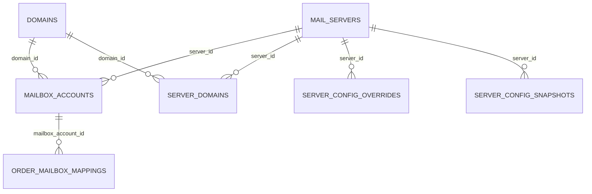

# 控制面数据库字典

> 当前版本：2026-07-11
>
> 适用组件：`mgmt-system`
>
> 数据库：MySQL 8.0 / MariaDB 10.5+，字符集 `utf8mb4`
>
> 事实来源：GORM 模型、生产 `email_mgmt` schema 与 AutoMigrate 结果

## 1. 总览

控制面当前包含 14 张表。邮件正文和附件不存数据库，仍以 Maildir EML 为事实源。

| 表名 | 中文表注释 | 用途 |
|------|------------|------|
| `admin_users` | 管理后台用户表 | 管理员身份、bcrypt 密码和凭据版本 |
| `api_tokens` | 外部API访问令牌表 | 外部调用方 Bearer Token 与 scope |
| `domains` | 邮件域名表 | 可用邮件域名基础信息 |
| `filter_rules` | 邮件过滤规则表 | 白名单、黑名单、关键词和正则规则 |
| `integrated_mailboxes` | 集成邮箱转发目标表 | union 人工兜底转发目标池 |
| `mail_servers` | 邮件服务器节点表 | mail-node 注册、容量、心跳和健康状态 |
| `mailbox_accounts` | 邮箱账号资产表 | 当前邮箱账号主表与生命周期状态 |
| `order_mailbox_mappings` | 订单与邮箱账号关联表 | 订单和邮箱账号的关联关系 |
| `order_mailboxes` | 历史订单邮箱兼容表 | 旧版 1:1 数据兼容与迁移来源 |
| `server_config_overrides` | 服务器节点配置覆盖表 | 单节点显式配置覆盖值 |
| `server_config_snapshots` | 服务器节点实际配置快照表 | mail-node 上报的实际值、来源和应用状态 |
| `server_domains` | 服务器与邮件域名绑定表 | 节点域名池及 Postfix/DKIM 同步状态 |
| `system_configs` | 系统动态配置表 | 全局动态配置 KV 与展示元数据 |
| `system_state` | 系统内部状态表 | bootstrap 等系统级内部状态 |

## 2. 关系图

`server_config_overrides` 和 `server_config_snapshots` 当前通过 `server_id` 逻辑关联 `mail_servers`，未建立数据库外键；删除节点时由业务层控制。

## 3. 表结构

### 3.1 `admin_users`

| 字段 | 类型 | 约束/默认值 | 中文注释 |
|------|------|-------------|----------|
| `id` | BIGINT UNSIGNED | PK, AUTO_INCREMENT | 主键ID |
| `username` | VARCHAR(191) | UNIQUE, NOT NULL | 管理员用户名 |
| `password_hash` | VARCHAR(255) | NOT NULL | 密码哈希 |
| `password_algo` | VARCHAR(32) | `bcrypt` | 密码哈希算法 |
| `must_change_password` | TINYINT(1) | `0` | 是否必须修改密码 |
| `credential_version` | BIGINT | `1` | 凭据版本号，用于失效旧 Session |
| `status` | ENUM | `active` | 账号状态：`active / disabled` |
| `password_changed_at` | DATETIME(3) | NULL | 密码修改时间 |
| `created_at`, `updated_at` | DATETIME(3) | NULL | 创建时间、更新时间 |

### 3.2 `api_tokens`

| 字段 | 类型 | 约束/默认值 | 中文注释 |
|------|------|-------------|----------|
| `id` | BIGINT UNSIGNED | PK, AUTO_INCREMENT | 主键ID |
| `name` | VARCHAR(128) | NOT NULL | 令牌名称 |
| `token` | VARCHAR(191) | UNIQUE, NOT NULL | 访问令牌 |
| `scopes` | VARCHAR(512) | `*` | 权限范围列表，按逗号分隔后精确匹配 |
| `enabled` | TINYINT(1) | `1` | 是否启用 |
| `created_at`, `last_used_at` | DATETIME(3) | NULL | 创建时间、最后使用时间 |

### 3.3 `domains`

| 字段 | 类型 | 约束/默认值 | 中文注释 |
|------|------|-------------|----------|
| `id` | BIGINT UNSIGNED | PK, AUTO_INCREMENT | 主键ID |
| `name` | VARCHAR(191) | UNIQUE, NOT NULL | 域名 |
| `mx_server` | VARCHAR(255) | NOT NULL | MX邮件服务器 |
| `status` | ENUM | `active` | 域名状态：`active / inactive` |
| `created_at`, `updated_at` | DATETIME(3) | NULL | 创建时间、更新时间 |

### 3.4 `filter_rules`

| 字段 | 类型 | 约束/默认值 | 中文注释 |
|------|------|-------------|----------|
| `id` | BIGINT UNSIGNED | PK, AUTO_INCREMENT | 主键ID |
| `name` | VARCHAR(128) | NOT NULL | 规则名称 |
| `rule_type` | ENUM | NOT NULL | `whitelist_sender / blacklist_sender / keyword / regex` |
| `pattern` | VARCHAR(512) | NOT NULL | 匹配模式 |
| `action` | ENUM | `pass` | `pass / block / flag` |
| `priority` | BIGINT | `0` | 匹配优先级，数值越小越优先 |
| `enabled` | TINYINT(1) | `1` | 是否启用 |
| `created_at`, `updated_at` | DATETIME(3) | NULL | 创建时间、更新时间 |

### 3.5 `integrated_mailboxes`

| 字段 | 类型 | 约束/默认值 | 中文注释 |
|------|------|-------------|----------|
| `id` | BIGINT UNSIGNED | PK, AUTO_INCREMENT | 主键ID |
| `email_address` | VARCHAR(191) | UNIQUE, NOT NULL | 邮箱地址 |
| `display_name` | VARCHAR(191) | NULL | 显示名称 |
| `is_active` | TINYINT(1) | `0`, INDEX | 是否为当前转发目标 |
| `created_at`, `updated_at` | DATETIME(3) | NULL | 创建时间、更新时间 |

凭据不存本表，通过相同 `email_address` 从 `mailbox_accounts` 获取。业务约束要求全局只有一条 `is_active=1`。

### 3.6 `mail_servers`

| 字段 | 类型 | 约束/默认值 | 中文注释 |
|------|------|-------------|----------|
| `id` | BIGINT UNSIGNED | PK, AUTO_INCREMENT | 主键ID |
| `name` | VARCHAR(128) | NOT NULL | 节点名称 |
| `api_host` | VARCHAR(255) | NOT NULL | 节点内部API地址 |
| `smtp_host`, `imap_host` | VARCHAR(255) | NOT NULL | SMTP服务地址、IMAP服务地址 |
| `public_host` | VARCHAR(255) | NULL | 公网主机名 |
| `capacity`, `current_load` | BIGINT | `5000`, `0` | 邮箱容量上限、当前邮箱数量 |
| `status` | ENUM | `healthy` | `healthy / degraded / down / draining` |
| `last_heartbeat` | DATETIME(3) | NULL | 最后心跳时间 |
| `last_probe_at`, `probe_fail_count` | DATETIME(3), BIGINT | NULL, `0` | 最后主动探测时间、连续失败次数 |
| `heartbeat_interval` | BIGINT | `30` | 心跳间隔秒数 |
| `desired_revision`, `applied_revision` | BIGINT UNSIGNED | `0` | 期望配置版本、节点确认应用版本 |
| `last_apply_error`, `last_reload_error` | TEXT | NULL | 最近 Apply 失败、即时 reload 通知失败摘要 |
| `last_boot_id` | VARCHAR(64) | NULL | 节点最近一次进程启动标识 |
| `last_started_at` | DATETIME(3) | NULL | 节点最近一次进程启动时间 |
| `config_changed_at` | DATETIME(3) | NULL | 最近一次配置 revision 推进时间 |
| `boot_id_at_change` | VARCHAR(64) | NULL | 最近配置变更发生时的节点启动标识 |
| `created_at`, `updated_at` | DATETIME(3) | NULL | 创建时间、更新时间 |

### 3.7 `mailbox_accounts`

| 字段 | 类型 | 约束/默认值 | 中文注释 |
|------|------|-------------|----------|
| `id` | BIGINT UNSIGNED | PK, AUTO_INCREMENT | 主键ID |
| `email_address` | VARCHAR(191) | UNIQUE, NOT NULL | 完整邮箱地址 |
| `local_part` | VARCHAR(128) | NOT NULL | 邮箱本地部分 |
| `password` | VARCHAR(255) | NULL | 邮箱登录密码 |
| `domain_id`, `server_id` | BIGINT UNSIGNED | FK, NOT NULL | 所属域名ID、所属服务器ID |
| `status` | ENUM | `active` | `active / disabled / recycled / deleting / soft_deleted / purged` |
| `sync_status` | ENUM | `pending` | `pending / synced / sync_failed` |
| `sync_error` | TEXT | NULL | 同步错误信息 |
| `retention_days` | BIGINT | `30` | 业务保留天数 |
| `expires_at` | DATETIME(3) | NULL | 到期时间 |
| `synced_at`, `disabled_at`, `recycled_at` | DATETIME(3) | NULL | 同步、停用、进入回收站时间 |
| `delete_requested_at` | DATETIME(3) | NULL | 删除请求时间，供 Watchdog 对账 |
| `created_at`, `updated_at` | DATETIME(3) | NULL | 创建时间、更新时间 |

### 3.8 `order_mailbox_mappings`

| 字段 | 类型 | 约束/默认值 | 中文注释 |
|------|------|-------------|----------|
| `id` | BIGINT UNSIGNED | PK, AUTO_INCREMENT | 主键ID |
| `order_id` | VARCHAR(128) | UNIQUE 组合索引, NOT NULL | 业务订单号 |
| `mailbox_account_id` | BIGINT UNSIGNED | FK, UNIQUE 组合索引 | 邮箱账号ID |
| `created_at` | DATETIME(3) | NULL | 创建时间 |

### 3.9 `order_mailboxes`

| 字段 | 类型 | 约束/默认值 | 中文注释 |
|------|------|-------------|----------|
| `id` | BIGINT UNSIGNED | PK, AUTO_INCREMENT | 主键ID |
| `order_id` | VARCHAR(128) | UNIQUE, NOT NULL | 业务订单号 |
| `email_address` | VARCHAR(191) | INDEX, NOT NULL | 完整邮箱地址 |
| `local_part` | VARCHAR(128) | NOT NULL | 邮箱本地部分 |
| `password` | VARCHAR(255) | NULL | 邮箱登录密码 |
| `domain_id`, `server_id` | BIGINT UNSIGNED | FK, NOT NULL | 所属域名ID、所属服务器ID |
| `status` | ENUM | `active` | `active / disabled / recycled` |
| `sync_status` | ENUM | `pending` | `pending / synced / sync_failed` |
| `sync_error` | TEXT | NULL | 同步错误信息 |
| `retention_days` | BIGINT | `30` | 业务保留天数 |
| `synced_at`, `expires_at` | DATETIME(3) | NULL | 同步完成时间、到期时间 |
| `disabled_at`, `recycled_at` | DATETIME(3) | NULL | 停用时间、进入回收站时间 |
| `created_at` | DATETIME(3) | NULL | 创建时间 |

新代码以 `mailbox_accounts` 和 `order_mailbox_mappings` 为事实源；本表只用于历史迁移和兼容，不应新增依赖。

### 3.10 `server_config_overrides`

| 字段 | 类型 | 约束/默认值 | 中文注释 |
|------|------|-------------|----------|
| `id` | BIGINT UNSIGNED | PK, AUTO_INCREMENT | 主键ID |
| `server_id`, `config_key` | BIGINT UNSIGNED, VARCHAR(128) | UNIQUE 组合索引 | 服务器节点ID、配置键 |
| `config_value` | TEXT | NOT NULL | 节点覆盖值 |
| `value_type` | VARCHAR(32) | NOT NULL | 配置值类型 |
| `updated_by` | VARCHAR(128) | NULL | 最后修改人 |
| `created_at`, `updated_at` | DATETIME(3) | NULL | 创建时间、更新时间 |

### 3.11 `server_config_snapshots`

| 字段 | 类型 | 约束/默认值 | 中文注释 |
|------|------|-------------|----------|
| `id` | BIGINT UNSIGNED | PK, AUTO_INCREMENT | 主键ID |
| `server_id`, `config_key` | BIGINT UNSIGNED, VARCHAR(128) | UNIQUE 组合索引 | 服务器节点ID、配置键 |
| `effective_value` | TEXT | NOT NULL | 实际生效值 |
| `source` | VARCHAR(32) | NOT NULL | `global / server_override / local_config / unknown` |
| `reloadable` | TINYINT(1) | `0` | 是否支持热加载 |
| `requires_restart` | TINYINT(1) | `0` | 是否需要重启 |
| `applied_at`, `reported_at` | DATETIME(3) | NULL, NOT NULL | 配置应用时间、节点上报时间 |
| `desired_revision`, `applied_revision` | BIGINT UNSIGNED | `0` | 上报时的期望版本、已应用版本 |
| `boot_id` | VARCHAR(64) | NULL | 确认该配置值的节点进程启动标识 |

### 3.12 `server_domains`

| 字段 | 类型 | 约束/默认值 | 中文注释 |
|------|------|-------------|----------|
| `id` | BIGINT UNSIGNED | PK, AUTO_INCREMENT | 主键ID |
| `server_id`, `domain_id` | BIGINT UNSIGNED | FK, UNIQUE 组合索引 | 服务器节点ID、邮件域名ID |
| `status` | ENUM | `active` | 绑定状态 |
| `sync_status` | ENUM | `pending` | 整体同步状态：`pending / synced / partial / sync_failed` |
| `sync_error` | TEXT | NULL | 同步错误信息 |
| `dkim_selector`, `dkim_public_key` | VARCHAR(64), TEXT | NULL | DKIM选择器和公钥 |
| `postfix_status`, `dkim_status` | ENUM | `pending` | Postfix、DKIM同步状态 |
| `synced_at`, `created_at`, `updated_at` | DATETIME(3) | NULL | 同步、创建、更新时间 |

### 3.13 `system_configs`

| 字段 | 类型 | 约束/默认值 | 中文注释 |
|------|------|-------------|----------|
| `id` | BIGINT UNSIGNED | PK, AUTO_INCREMENT | 主键ID |
| `config_key` | VARCHAR(128) | UNIQUE, NOT NULL | 配置键 |
| `config_value` | TEXT | NOT NULL | 当前配置值 |
| `value_type` | VARCHAR(32) | `string` | 配置值类型 |
| `category` | VARCHAR(64) | `general`, INDEX | 配置分类 |
| `label`, `description` | VARCHAR(128), TEXT | NULL | 配置显示名称、配置说明 |
| `default_value` | TEXT | NULL | 默认配置值 |
| `reloadable` | TINYINT(1) | `0` | 是否支持热加载 |
| `created_at`, `updated_at` | DATETIME(3) | NULL | 创建时间、更新时间 |

`system_configs` 是全局默认配置事实源；单节点差异存入 `server_config_overrides`，节点实际生效值存入 `server_config_snapshots`。

### 3.14 `system_state`

| 字段 | 类型 | 约束/默认值 | 中文注释 |
|------|------|-------------|----------|
| `key` | VARCHAR(128) | PK | 状态键 |
| `value` | TEXT | NOT NULL | 状态值 |
| `updated_at` | DATETIME(3) | NULL | 更新时间 |

当前用于记录管理员 bootstrap 等不适合暴露为普通动态配置的系统状态。

## 4. 迁移与维护

- `mgmt-system` 启动时运行 GORM `AutoMigrate`，补齐模型对应表和字段。
- `SeedDefaultConfigs` 补齐 `system_configs` 默认项，不覆盖已存在的运维配置。
- `MigrateLegacyOrderMailboxes` 将旧 `order_mailboxes` 数据迁移到当前账号和映射模型。
- 生产库 14 张表、134 个字段已于 2026-07-11 写入与本文一致的中文 COMMENT。
- 修改字段时必须保留现有类型、NULL、默认值、索引和外键；生产 DDL 前先备份 schema。
