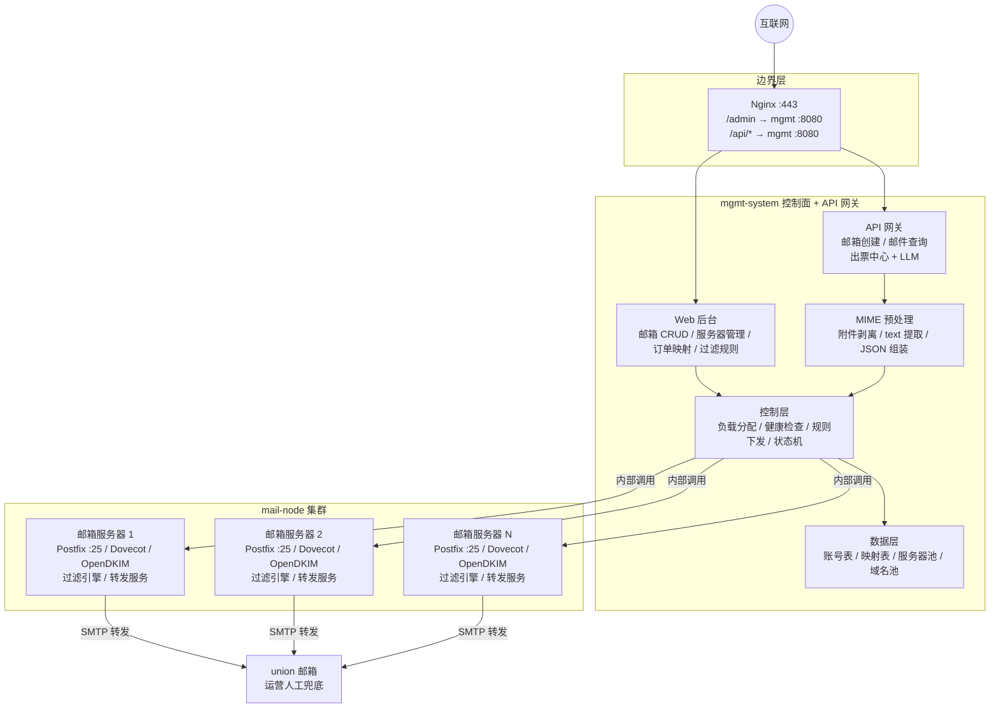
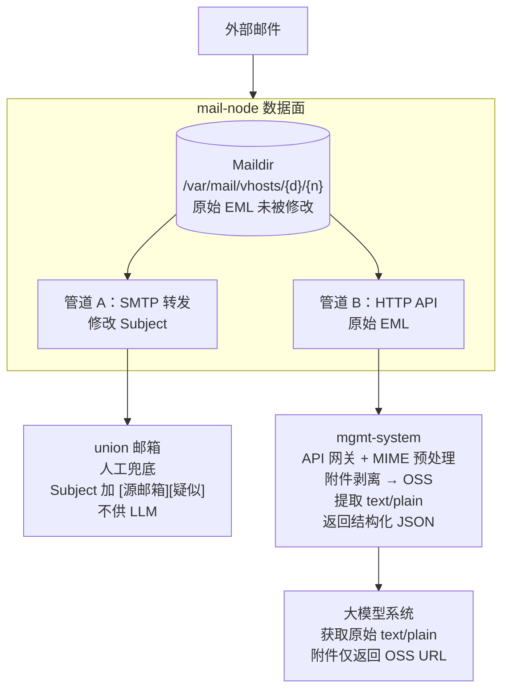
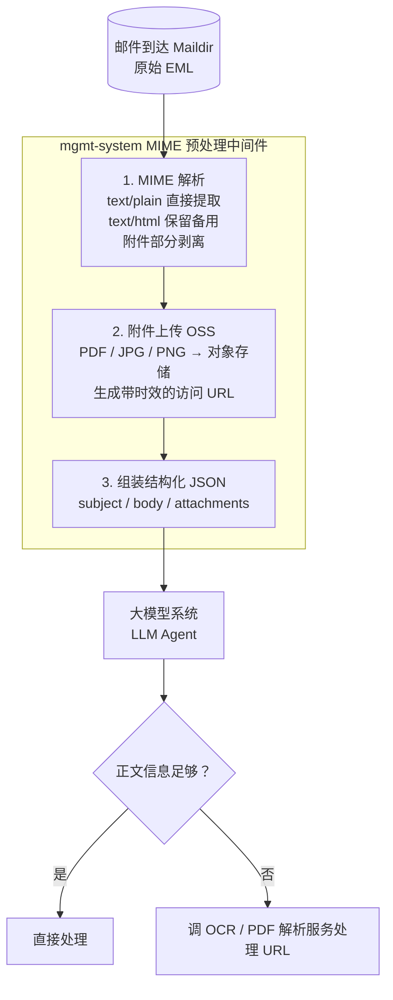
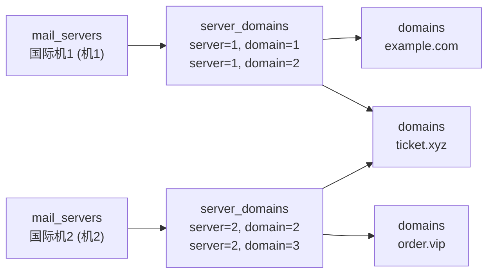
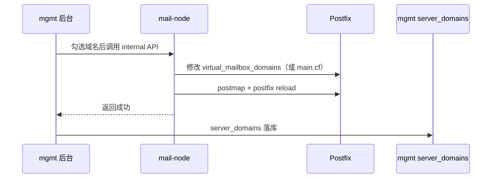
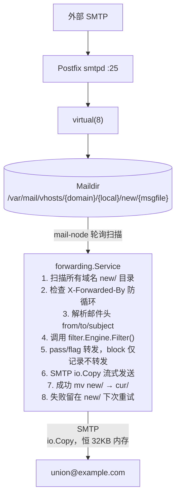
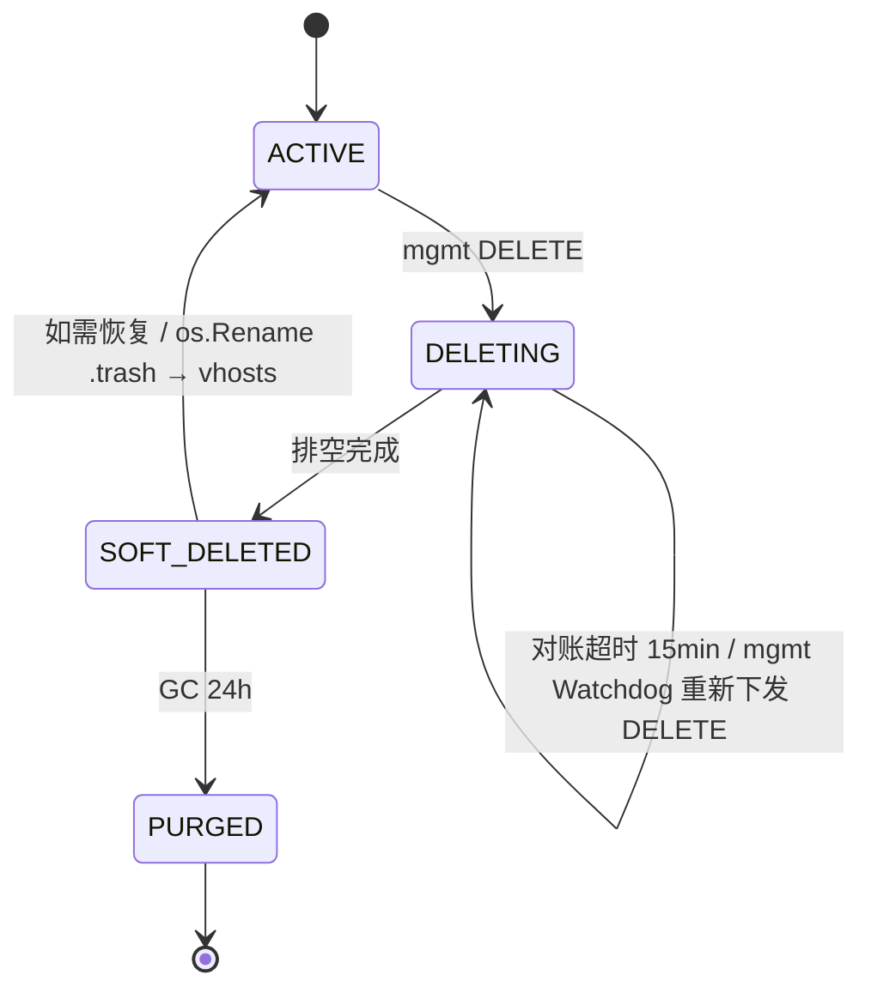
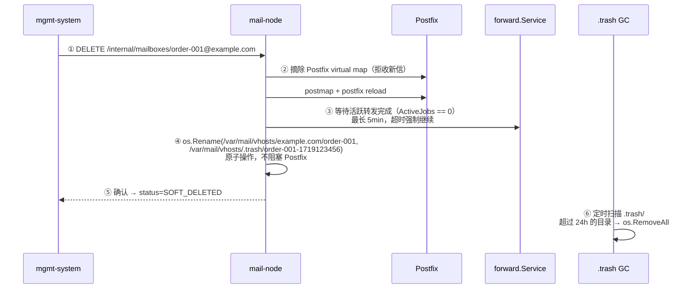

# 自动转发与邮箱生命周期 — 详细设计

> 版本: v2.2 | 日期: 2026-06-23 | 状态: 待评审
>
> v2.2 变更：修正服务器命名（国际机1/国际机2，去掉"日本机"误称，§3.5）；补全域名池→Postfix 同步闭环（§3.5.1，原设计缺口）；修正 `virtual_alias_domains` → `virtual_mailbox_domains`（配置项写错）。
> v2.1 变更：明确两条数据管道物理隔离——union（人工兜底，已修改）vs LLM API（原始 EML + MIME 预处理 + 附件剥离 OSS），LLM 绝不读 union。
> v2.0 变更：io.Copy 流式转发、X-Forwarded-By 防循环、四态生命周期、安全销毁协议、Pull 对账。

---

## 1. 目标

**收信 → 过滤 → 转发到 union，全自动、可重试、不丢邮件。同时提供可控的邮箱生命周期管理，安全销毁不拖垮 Postfix。**

---

## 2. 架构决策：Maildir 异步扫描 vs Postfix content_filter

| 方案 | 描述 | 优点 | 缺点 |
|------|------|------|------|
| A — content_filter 同步转发 | Postfix 入站时 pipe 到 mail-node，filter + 转发在同一 SMTP 事务 | 即时，可在 SMTP 层拒收垃圾 | Postfix 重配风险；转发耗时阻塞 SMTP；失败邮件丢失 |
| **B — Maildir 异步扫描** ✅ | Postfix 正常投递到 Maildir，mail-node 后台轮询 `new/` 发现新邮件后转发 | **不碰 Postfix**、转发解耦可重试、已验证投递链路 | 有轮询延迟（秒级）；垃圾邮件仍落盘 |

### 决策：选 **方案 B**，理由：

1. Postfix → Maildir 投递链路已生产验证通过，**不动它**
2. 转发失败不会阻塞收信——邮件在 `new/` 里，下轮重试
3. 实现完全在 Go 代码内，零运维侧改动
4. 轮询延迟可做到 3-5s，满足需求（< 30s）
5. content_filter 集成留到后续迭代

### 过滤引擎：自建 filter.Engine（Phase 2 可选 Rspamd 增强）

| | 自建 filter.Engine（已有） | Rspamd |
|---|---|---|
| 代码量 | 200 行，已完成 | 新装 daemon + API 封装 + 配置调优 |
| 内存开销 | 0（进程内） | ~200MB（裁减插件后） |
| 运维复杂度 | 无额外组件 | 多一个 systemd 进程 |
| MVP 匹配度 | 精准（白名单/黑名单/关键词即业务需求） | 通用反垃圾，需大量调优 |

**MVP 用自建 filter.Engine。** Rspamd 作为 Phase 2 可选增强——当邮件量达到日均千封级别、且 filter.Engine 误判率不可接受时再评估。

---

## 3. 部署拓扑与接口边界

### 3.1 组件分布（通用架构）

mgmt-system 是**独立的控制面 + API 网关**，与 N 台 mail-node 构成 1:N 关系。不受限于任何一台 mail-node 的物理位置：



| 组件 | 角色 | 数量 | 对外暴露 |
|------|------|------|---------|
| **Nginx** | TLS 终结点 + 反代 | 1 | :443（唯一公网入口） |
| **mgmt-system** | 控制面 + API 网关 | 1 | 仅 Nginx 转发（内部 :8080） |
| **mail-node** | 数据面（收信/存储/转发） | N（初期 1） | 仅 mgmt 内调（:8081） |

**Phase 1 部署说明：** 初期只有 1 台国际机（203.0.113.10），以上全部组件部署在同一台机器上。mgmt-system 调 mail-node 走 `127.0.0.1:8081`。加第二台 mail-node 时，新机只需部署 Postfix + Dovecot + mail-node + OpenDKIM，远程注册到 mgmt 即可——mgmt 架构不变。

### 3.2 两条数据管道：物理隔离，绝不混用

系统有 **两条完全独立的数据管道**，面向不同的消费者，走不同的路径，返回不同的数据格式：



| 维度 | 管道 A：union 转发 | 管道 B：LLM API |
|------|-------------------|-----------------|
| **消费者** | 运营人员（人工） | 大模型系统（程序） |
| **协议** | SMTP（mail-node 直接发） | HTTP（mgmt-system 透传代理） |
| **数据源** | Maildir 原始文件 → SMTP 转发时修改 Subject | Maildir 原始文件 → 原封不动读取 |
| **数据形态** | **已被修改**：`[源邮箱][疑似][高风险]...` 标签叠加 | **原始 EML**：发件人/标题/正文/附件均未改 |
| **附件处理** | 原始附件随邮件转发 | **附件剥离上传 OSS**，仅返回 URL |
| **过滤策略** | **宁可错放不可错杀**：默认 pass，边缘加标签转发，绝不 drop | N/A（LLM 侧自行判断，不依赖过滤结果） |
| **为什么这样** | 运营需要快速识别来源和风险等级，但**绝不漏转**——一封商务邮件的漏转可能引发订单纠纷 | LLM 对二次加工数据敏感，容易幻觉。原始数据 + 附件解耦才是正确输入 |

### 3.3 管道 B 详解：MIME 预处理（架构标准）

**核心原则：不要把附件直接给 LLM。**



**为什么这是架构标准：**

| 反模式 ❌ | 正确做法 ✅ |
|-----------|-----------|
| 把 PDF base64 塞进 Prompt | PDF → OSS → URL → Agent 按需获取 |
| 把 HTML 邮件原文丢给 LLM | 提取 text/plain，HTML 仅作保留 |
| 让 LLM 做 MIME 解析 | 系统预处理，LLM 只接触纯净文本 |
| union 转发的邮件拿来做 AI 分析 | union 已被标签污染，LLM 读原始 Maildir |

**收益：**
- **防幻觉**：LLM 只接触原始 text/plain，零二次加工痕迹
- **省 Token**：不会把 2MB 的 PDF base64 塞进 Prompt，成本差 100-1000 倍
- **解耦**：邮件解析（mgmt-system）与附件解析（OCR/PDF 服务）独立迭代
- **可审计**：附件 URL 带过期时间，访问日志可追溯

> **实施节奏**：Phase 1 MVP 先返回原始 EML 正文（text/plain 提取 + 附件文件名列表）。OSS 上传 + URL 生成列入 Phase 2——需要先确定 OSS 选型（阿里云 OSS / MinIO 自建）。

### 3.4 转发路径（不经过 mgmt）


转发在 mail-node 内部闭环，不经过 mgmt-system，不经过 Nginx。

### 3.5 管理面数据模型：服务器-域名绑定

当前 `mail_servers` 和 `domains` 是两张独立的表，没有任何关联——分配器创建邮箱时不验证目标服务器是否支持该域名。参考宝塔邮局管理器的「域名池」设计，每台邮箱服务器应绑定其支持的域名列表。

#### 新增关联表

```sql
CREATE TABLE server_domains (
    server_id BIGINT NOT NULL,
    domain_id BIGINT NOT NULL,
    PRIMARY KEY (server_id, domain_id),
    FOREIGN KEY (server_id) REFERENCES mail_servers(id),
    FOREIGN KEY (domain_id) REFERENCES domains(id)
);
```

#### 模型关系



- 一台服务器可绑多个域名（如国际机1同时处理 `example.com` 和 `ticket.xyz`）
- 一个域名可被多台服务器共享（如 `ticket.xyz` 在机1和机2上都可用，实现跨机容灾）
- 分配器创建邮箱时：**先按域名筛出可用服务器 → 再按负载选最轻的那台**

#### 影响范围

| 位置 | 改动 |
|------|------|
| `model/model.go` | 加 `ServerDomain` struct |
| `store/store.go` | 加 `BindDomain` / `UnbindDomain` / `GetServersByDomain` / `GetDomainsByServer` |
| `service/allocator.go` | 分配逻辑改为：域名 → 可用服务器列表 → 按负载排序 → 选最轻 |
| `handler/server.go` | 注册/编辑服务器时接受 `domain_ids` 字段 |
| `template/admin/servers.html` | 注册/编辑表单显示域名勾选框 |
| mail-node | Postfix `virtual_mailbox_domains` 须与绑定域名同步（见 §3.5.1） |

#### 3.5.1 域名绑定同步到 Postfix（关键闭环）

mgmt-system 表里绑了域名**还不够**——Postfix 收到未在 `virtual_mailbox_domains` 列出的域名的信会直接 reject。必须有一个下发闭环：



| 组件 | 动作 |
|------|------|
| mgmt `handler/server.go` | 绑定/解绑域名时，调 mail-node `POST /internal/domains` 同步 |
| mail-node 新增 `POST /internal/domains` | 接收域名列表 → 改 Postfix `virtual_mailbox_domains` + postmap + reload |
| mail-node `DELETE /internal/domains/{name}` | 解绑：从列表移除 + reload |

> **Phase 1 单机单域名**：example.com 已硬编码在 Postfix 配置，无需走闭环。**加第二台机或第二域名时**才必须实现此 API——纳入实施步骤 9（server_domains）一并做。

#### Phase 1 最小落地

单机单域名（国际机 + `example.com`）下此关联表不影响功能——分配器照样能工作。**表结构先建对**，后续加域名/加服务器时不需要改 schema。种子数据在服务器注册时自动写入关联记录。

> 详细设计见 `REQUIREMENTS_ANALYSIS.md` §2.1.3 和 §5。

---

## 4. 数据流



---

## 5. 新增代码

### 5.1 新模块：`mail-node/internal/forward/`

```
mail-node/internal/forward/
├── service.go      # 核心转发服务（扫描 + 过滤 + 调度）
├── smtp.go         # SMTP 流式发送封装
└── lifecycle.go    # 邮箱生命周期管理（软删除 / 销毁 / 对账）
```

### 5.2 `service.go` — 转发服务

```go
package forward

// Service 邮件转发服务
type Service struct {
    cfg       ForwardConfig
    engine    *filter.Engine      // 过滤引擎（复用，线程安全）
    mgr       *mailbox.Manager    // 用于获取 Maildir 基路径
    mu        sync.Mutex
}

// ForwardConfig 转发配置
type ForwardConfig struct {
    SMTPHost       string // smtp.example.com:587
    SMTPUser       string // union@example.com
    SMTPPass       string // password
    TargetAddress  string // union@example.com
    SubjectPrefix  string // "[源邮箱: ${source_addr}] " — ${source_addr} 运行时替换
    ScanInterval   int    // 扫描间隔（秒），默认 5
    MaxEmailSize   int64  // 单封邮件最大处理字节数，默认 10MB
}

func New(cfg ForwardConfig, engine *filter.Engine, mgr *mailbox.Manager) *Service

// Start 启动后台扫描循环（blocking，应放在 goroutine 里调用）
func (s *Service) Start(ctx context.Context)

// ScanOnce 单次扫描所有邮箱 new/ 目录，处理新邮件
// 返回处理的邮件数
func (s *Service) ScanOnce() (processed int, errors int)
```

### 5.3 `smtp.go` — SMTP 流式发送（io.Copy，恒定内存）

```go
package forward

import (
    "io"
    "net/smtp"
    "os"
)

const maxEmailSize = 10 * 1024 * 1024 // 10MB 硬上限

// sendMail 流式转发邮件到 union
// filePath: Maildir 新邮件路径（new/<filename>）
// sourceAddr: 源邮箱地址（用于构建 subject 前缀）
// action: 过滤结果动作（pass / flag）
//
// 内存策略：不调用 os.ReadFile，而是：
//   1. 先用 io.LimitReader 读取邮件头（from/subject/to），头读完即止
//   2. SMTP DATA 阶段用 io.Copy(smtpWriter, os.File) 直接管道传输
//   3. io.Copy 内部 buffer 恒定 32KB，无论附件多大内存不涨
func sendMail(cfg ForwardConfig, filePath string, sourceAddr string, action filter.Action) error {
    f, err := os.Open(filePath)
    if err != nil { return err }
    defer f.Close()

    // 1. 仅头部使用 LimitReader 读取（from/subject/to/date），读完即止
    limited := io.LimitReader(f, maxEmailSize)
    headers, _ := parseHeaders(limited)

    // 2. 构建新邮件头（修改 Subject、加 Resent-*、加 X-Forwarded-By）
    // 3. SMTP: MAIL FROM → RCPT TO → DATA
    // 4. 写入新 headers + 空行
    // 5. io.Copy(writer, f) — f 已 seek 到 body 起始，直接流式 pipe
    //    无论附件多大，内存占用恒定 ~32KB（io.Copy 默认 buffer）
    //
    // 如果读取量超过 maxEmailSize 才读完头 → 截断告警，跳过该邮件
}
```

**为什么不用 LimitReader 全量读到内存再发送？**

```
LimitReader 方案:  ReadFile/ReadAll → 内存[最多10MB] → SMTP DATA 写出    （内存峰值 10MB）
io.Copy 方案:      os.Open → io.Copy(smtpConn, file) → 网络              （内存峰值 32KB）
```

`io.Copy` 内部是一块 32KB 的 buffer 反复复用，附件再大、邮件再多，单封转发的内存开销恒定。

### 5.4 `main.go` 改动

```go
// 新增：初始化转发服务
forwardCfg := forward.ForwardConfig{
    SMTPHost:      cfg.Forward.SMTPHost,
    SMTPUser:      cfg.Forward.SMTPUser,
    SMTPPass:      cfg.Forward.SMTPPass,
    TargetAddress: cfg.Forward.TargetAddress,
    SubjectPrefix: cfg.Forward.SubjectPrefix,
    ScanInterval:  cfg.Forward.ScanInterval,
    MaxEmailSize:  10 * 1024 * 1024,
}
fwdSvc := forward.New(forwardCfg, engine, mailboxMgr)

// 启动转发服务（后台 goroutine）
ctx, cancel := context.WithCancel(context.Background())
defer cancel()
go fwdSvc.Start(ctx)
```

---

## 6. 去重 & 幂等性

| 机制 | 说明 |
|------|------|
| **Maildir 文件移动** | 转发成功后 `os.Rename(new/<file>, cur/<file>:2,S)` — Maildir `S` flag 表示 Seen。文件离开 `new/` 后下一轮扫描自然跳过 |
| **X-Forwarded-By 防循环** | 转发时强制注入 `X-Forwarded-By: mail-node`。扫描时检测到此 header → 直接跳过。多机部署、union 自身收信场景均可靠 |
| **内存 set** | 扫描时先构建当前 `new/` 的文件名 set，避免同一轮内重复处理 |
| **转发失败不移动** | 失败的文件留在 `new/`，下一轮重试。不会丢邮件 |
| **重启安全** | `cur/` 里的文件不会被扫描到，不会因重启而重复转发 |

---

## 7. SMTP 转发细节

### 7.1 转发后的邮件格式

```
X-Forwarded-By: mail-node                    ← 防循环标记
Resent-From: union@example.com
Resent-To: union@example.com
Resent-Date: Wed, 23 Jun 2026 10:30:00 +0000
From: original-sender@airline.com
To: order-xxx@example.com
Subject: [源邮箱: order-xxx@example.com] Flight Confirmation #ABC123
... (原始邮件正文和附件)
```

**防循环机制：** 扫描阶段检查邮件头，若已存在 `X-Forwarded-By: mail-node` 则直接跳过——说明该邮件已被本系统处理过。union 邮箱即使收到自己转发的邮件也不会二次转发。

### 7.2 Subject 模板替换

配置中 `subject_prefix: "[源邮箱: ${source_addr}] "` → 运行时 `${source_addr}` → 当前邮箱地址：

| 过滤结果 | 最终 Subject |
|----------|-------------|
| pass | `[源邮箱: order-001@example.com] 航班确认通知` |
| flag | `[疑似][源邮箱: order-001@example.com] 某促销邮件` |
| block | 不转发，无 Subject |

### 7.3 SMTP 认证

使用 `net/smtp` 标准库，PLAIN AUTH over STARTTLS：

```go
import "net/smtp"

host, _, _ := net.SplitHostPort(cfg.SMTPHost)
auth := smtp.PlainAuth("", cfg.SMTPUser, cfg.SMTPPass, host)
// ... TLS dial → AUTH → MAIL FROM → RCPT TO → DATA（io.Copy 写入）
```

---

## 8. 邮箱生命周期状态机

### 8.1 四态流转



| 状态 | 行为 | 触发方 |
|------|------|--------|
| **ACTIVE** | 正常收信、协程转发、API 查询全量开放 | — |
| **DELETING** | ① Postfix map 摘除该邮箱（拒收新信）；② 等待活跃转发完成；③ 拒绝新查询请求 | mgmt-system 调用 `DELETE /internal/mailboxes/{addr}` |
| **SOFT_DELETED** | Maildir 已原子移入 `.trash/`，不可见、不可查询。可恢复 | mail-node 排空后自动执行 |
| **PURGED** | `.trash/` 中超过 24h 的目录物理 `rm -rf` | mail-node 定时 GC goroutine |

### 8.2 数据库字段（mgmt-system 侧）

```sql
-- order_mailboxes 表
ALTER TABLE order_mailboxes ADD COLUMN delete_requested_at DATETIME NULL;
-- status 字段现有枚举扩展为: ACTIVE / DELETING / SOFT_DELETED / PURGED
```

mgmt-system 是状态机的 **Source of Truth**。mail-node 只执行指令和上报结果。

---

## 9. 安全销毁协议

**严禁在 mail-node 侧直接 `rm -rf`**，这会引发 Postfix 队列崩溃和并发转发丢信。

### 9.1 销毁流程



### 9.2 为什么用 `os.Rename` 而不是 `rm -rf`

| 方式 | 风险 |
|------|------|
| `rm -rf` | Postfix 可能正在投递新邮件到该目录 → 半删状态 → virtual(8) 崩溃；转发 goroutine 手持文件句柄 → 写入失败丢信 |
| **`os.Rename`** ✅ | 同文件系统内原子操作。Postfix virtual 进程和转发 goroutine 持有的 fd 不受影响，已投递和转发中的邮件正常完成 |

---

## 10. 重启自愈（Pull 对账）

mail-node 断电或重启时，内存中的排空任务会丢失。通过**重启 Pull** 补偿：

```go
// main.go 启动时自动执行
func init() {
    // GET /api/v1/internal/sync/deleting?server_id=<nodeID>
    tasks, _ := httpGet(mgmtURL + "/api/v1/internal/sync/deleting?server_id=" + nodeID)
    for _, task := range tasks {
        // 重新执行安全销毁流程（9.1 的 ②③④ 步）
        resumeDeletion(task.EmailAddress)
    }
}
```

| 方向 | 说明 |
|------|------|
| **mail-node Pull** | 每次 systemd 重启 / 进程重启，主动向 mgmt 拉取属于自己的 DELETING 状态任务并接管 |
| **mgmt Watchdog**（后续迭代） | 扫描 `status=DELETING` 且 `delete_requested_at > 15min` 的超时任务，重新下发 DELETE 指令 |

DELETE 接口保证**绝对幂等**——重复调用不会重复移动、不会报错。

---

## 11. 错误处理

### 11.1 铁律：宁可错放，不可错杀

> 一封商务邮件的漏转可能导致订单纠纷，而一封垃圾邮件漏过只增加运营噪音。
> **默认动作 `pass`，边缘邮件加标签转发，绝不直接丢弃。**

| 场景 | 处理 |
|------|------|
| SMTP 连接失败 | 日志 error，邮件留在 `new/`，下轮重试 |
| SMTP 发送失败 | 同上，不移动文件 |
| **filter 判定 block** | **不转发**，但原件 mv 到 `cur/` 保留——LLM API 仍可查。不丢邮件 |
| 邮件解析失败 | 日志 warn + 移到 `cur/`（不阻塞后续），**不丢弃** |
| 过滤规则为空 | 用 defaultAction（pass），保证不丢邮件 |
| 过滤引擎无法判断 | 按 pass 处理，加 `[疑似]` 标签转发 |
| union 邮箱不可达 | 重试，不移动文件。超过 N 次失败后告警 |
| 超过 10MB 的大邮件 | 日志告警记录 file_path，移到 `cur/` 避免重复扫描 |

### 重试策略（Phase 1 简化版）

- 不做专门的退避重试队列
- 文件留在 `new/`，每轮扫描自动重试
- 天然退避：文件越多，单文件重试间隔越长
- 后续迭代可加显式重试计数 + dead-letter

---

## 12. 配置变更

### 12.1 `config.go`

```go
type ForwardConfig struct {
    SMTPHost       string `yaml:"smtp_host"`
    SMTPUser       string `yaml:"smtp_user"`
    SMTPPass       string `yaml:"smtp_pass"`
    TargetAddress  string `yaml:"target_address"`
    SubjectPrefix  string `yaml:"subject_prefix"`
    ScanInterval   int    `yaml:"scan_interval"`    // 新增，默认 5
    MaxEmailSize   int64  `yaml:"max_email_size"`   // 新增，默认 10485760
}
```

### 12.2 `config.yaml`

```yaml
forward:
  smtp_host: "smtp.example.com:587"
  smtp_user: "union@example.com"
  smtp_pass: "change-me-later"
  target_address: "union@example.com"
  subject_prefix: "[源邮箱: ${source_addr}] "
  scan_interval: 5
  max_email_size: 10485760  # 10MB
```

---

## 13. 日志与可观测性

```go
// 正常转发
log.Printf("[forward] forwarded: %s → union (action=%s, rule=%d, latency=%dms)",
    msg.From, result.Action, result.RuleID, elapsed)

// 被拦截
log.Printf("[forward] blocked: from=%s to=%s rule=%d reason=%s",
    msg.From, msg.To, result.RuleID, result.Reason)

// SMTP 错误
log.Printf("[forward] SMTP error: %v (retry in next scan)", err)

// 生命周期
log.Printf("[lifecycle] moving to trash: %s", maildirPath)
log.Printf("[lifecycle] purged after 24h: %s", trashPath)
```

关键指标（后续接 Prometheus）：
- `forward_total{action="pass|flag|block"}` — 转发计数
- `forward_errors_total` — 失败计数
- `forward_latency_ms` — SMTP 发送延迟
- `mailbox_status{status="ACTIVE|DELETING|SOFT_DELETED|PURGED"}` — 生命周期分布

---

## 14. 实施步骤

| 步 | 内容 | 文件 |
|----|------|------|
| 1 | 新建 `forward/smtp.go` — SMTP 流式发送（io.Copy） | 新文件 |
| 2 | 新建 `forward/service.go` — 扫描 + 过滤 + 转发核心 | 新文件 |
| 3 | 新建 `forward/lifecycle.go` — 安全销毁 + GC + Pull 对账 | 新文件 |
| 4 | 修改 `mailbox/manager.go` — Delete 改为 os.Rename 到 .trash | 小改 |
| 5 | 修改 `config/config.go` — ForwardConfig 加 ScanInterval / MaxEmailSize | 小改 |
| 6 | 修改 `config.yaml` — 加新配置项 | 小改 |
| 7 | 修改 `cmd/node/main.go` — 初始化 ForwardService + 启动重启对账 | 小改 |
| 8 | 修改 mgmt-system `mailboxes` 表 — status 枚举扩展 + delete_requested_at | 小改 |
| 9 | 新增 `server_domains` 关联表 + store 方法 + allocator 改域名感知 + mail-node 域名同步 API（§3.5.1） | 中等 |
| 10 | 本地单元测试（SMTP mock + 状态机流转 + 域名绑定） | 测试文件 |
| 11 | 交叉编译 → scp 部署到国际机 | 运维 |
| 12 | 端到端验证：创建邮箱 → QQ 发信 → 自动转发到 union → 软删除 → GC 清理 | 冒烟 |

---

## 15. 风险 & 边界

| 风险 | 影响 | 缓解 |
|------|------|------|
| union 邮箱尚未创建 | 中 | 转发前确认 union 账号存在（Dovecot users.conf），不存在则日志告警不阻塞 |
| 邮件无限循环转发 | 致命 | **`X-Forwarded-By: mail-node`** header 标记。扫描阶段检测此 header → 直接跳过 |
| 大附件 OOM | 致命 | **`io.Copy` 恒定 32KB buffer**，不随附件大小增长。头解析用 LimitReader 10MB 截断保护 |
| 误判丢信 | 高 | **宁可错放不可错杀**——默认 pass、边缘加标签转发、永不直接 drop |
| Postfix 投递撞上半删目录 | 高 | **`os.Rename` 原子移动**到 `.trash/`，不阻塞 Postfix virtual 进程 |
| mail-node 断电丢排空任务 | 中 | **重启 Pull 对账**——启动时向 mgmt 拉 DELETING 任务接管 |
| 并发安全 | 低 | filter engine 已有 RWMutex；`ScanOnce` 内 build 内存 set 无跨轮竞态 |

---

## 16. 后续迭代

- [ ] Postfix content_filter 集成（在 SMTP 层拒收垃圾）
- [ ] Worker Pool 协程池（邮件量增长后启用并发转发）
- [ ] 显式重试队列 + 退避策略 + dead-letter
- [ ] mgmt Watchdog Push 巡检（超时 DELETING 任务重试下发）
- [ ] Rspamd 可选引擎增强（日均千封以上时评估）
- [ ] Prometheus metrics
- [ ] 多机部署（第二台 mail-node 注册到 mgmt）
