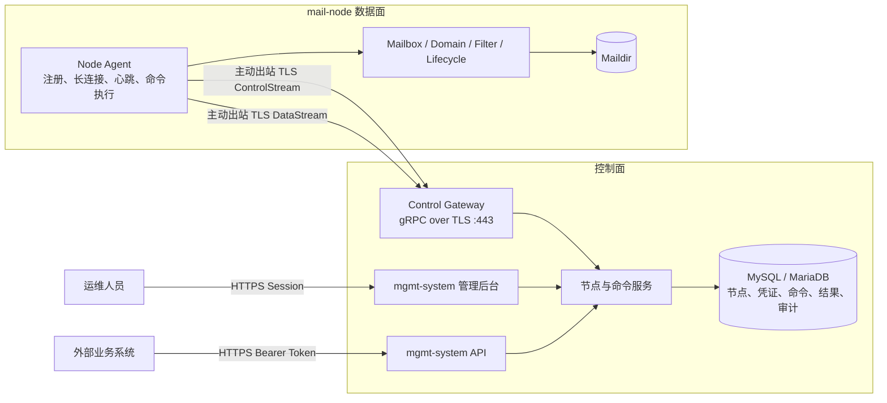

# Mail-node 注册、身份与出站控制通道设计

> 状态：已批准，待实施
>
> 日期：2026-07-24
>
> 适用范围：`mgmt-system` 控制面与 `mail-node` 数据面
>
> 目标：替代以 `api_host + 全局 shared_secret + 双向 HTTP` 为核心的节点发现方式，并保留可灰度、可回滚的迁移路径。
>
> 当前实施计划：[节点注册发现与出站控制通道实施计划](node-registration-control-channel-implementation-plan.md)

---

## 1. 结论

推荐将节点协同模型升级为：

```text
永久 node_uuid
  + 一次性 Enrollment Token
  + 节点独立凭证（本轮为 node Token，最终为 mTLS 证书）
  + mail-node 主动建立的 ControlStream / DataStream
  + 持久化命令队列
  + desired/applied revision 状态收敛
```

控制通道优先采用运行在 TLS/443 上的 gRPC 双向流。`mail-node` 只需要访问 `mgmt-system`，控制面不再要求反向访问每台节点的 `8081`。

不为 `mail-node` 开发独立的业务管理 UI。节点注册审批、状态、配置、凭证、任务和审计统一放在 `mgmt-system` 管理后台。节点侧只提供本机 CLI、日志、指标和仅绑定 loopback 的健康诊断端点。

面向安装和运维人员的目标流程见[节点注册与加入集群指南](../node-registration-guide.md)。该指南描述的是本设计实现后的操作方式，不代表当前版本已经提供对应命令和页面。

### 1.1 当前开发主线

- 本设计已批准，按实施计划从 NR-P0 开始开发。
- 节点注册发现与出站控制通道是当前 P0 主线。
- 广告过滤重构暂停在现有状态；不回滚现有能力，但不继续策略、样本和自动隔离开发。
- 本轮采用四维节点状态、域名 partial 结果和 Control/Data 流隔离。
- 命令敏感 payload 的应用层加密暂不实施；TLS、凭证哈希和日志脱敏仍为强制要求。

---

## 2. 背景与当前实现

当前链路包含两个方向：

```text
mail-node -> mgmt-system
  - POST /api/v1/internal/servers/discover
  - POST /api/v1/internal/servers/heartbeat
  - 拉取配置、过滤策略和删除任务

mgmt-system -> mail-node
  - GET /internal/health
  - 邮箱与域名管理
  - 邮件正文和附件读取
  - 配置与过滤规则重载通知
```

节点在发现请求中提交 `api_host`，管理端按该字符串查找服务器记录；未命中时创建记录。后续控制面以 `http://<api_host>/internal/*` 反向调用节点。两个方向使用同一个 `X-Internal-Token` 全局共享密钥。

该方案适合节点少、固定 IP、同一可信内网的部署，但它把多个不同问题混合成了一个“发现”动作：

1. 节点是谁：目前主要由数据库 ID 和 `api_host` 间接表达。
2. 节点是否可信：目前由所有节点共用的 `shared_secret` 表达。
3. 节点在哪里：目前由可变化的 `api_host` 表达。
4. 节点是否在线：同时依赖心跳和控制面反向 HTTP 探测。
5. 命令是否执行：主要依赖同步 HTTP 响应和后续状态字段。

这些概念必须拆分，否则动态 IP、NAT、跨云、安全凭证轮换和控制面高可用都会变得困难。

---

## 3. 当前方案的主要风险

### 3.1 地址被当成身份

`api_host` 可能因更换网卡、迁移机器、DNS 调整或端口变化而改变。用地址匹配节点会导致：

- 同一节点重复注册；
- 新机器复用旧地址时错误继承身份；
- 后台手工填写 IP、节点上报域名时无法匹配；
- `node.id` 与数据库记录不一致时心跳串到其他节点。

### 3.2 全局共享密钥扩大故障域

任意一台节点泄露 `shared_secret` 后，攻击者可能调用所有节点和管理端内部接口。当前模型难以做到：

- 单独撤销一台节点；
- 识别具体调用节点；
- 无中断轮换凭证；
- 对不同节点授予不同能力。

### 3.3 双向可达增加部署成本

控制面必须访问节点 `8081`，会带来额外的防火墙规则、公网暴露、NAT 穿透和证书管理问题。节点越多，入站规则和安全审计成本越高。

### 3.4 同步调用不等于可靠执行

HTTP 超时存在三种无法由调用方直接区分的结果：

- 节点没有收到命令；
- 节点执行成功，但响应丢失；
- 节点正在执行，调用方提前超时。

如果没有命令 ID、幂等键和持久化结果，重试可能重复创建、重复删除或产生状态漂移。

### 3.5 推送和拉取并存但缺少统一传输语义

当前已有 `desired_revision / applied_revision`，这是正确基础；但配置通知、周期拉取、业务同步调用和生命周期补偿仍走不同路径。长期应统一为“期望状态或命令持久化，节点主动取得并确认”。

---

## 4. 设计目标

### 4.1 必须实现

- 节点身份不随 IP、主机名和端口变化。
- 每台节点使用独立凭证，可单独轮换和撤销。
- 正常运行只要求 `mail-node -> mgmt-system` 出站可达。
- 未经授权的机器不能因为知道管理端地址就加入集群。
- 管理端重启、节点断线和网络抖动不会丢失变更命令。
- 命令至少一次投递，并通过幂等执行获得业务上的等效一次结果。
- 配置继续采用 `desired_revision / applied_revision` 收敛。
- 支持节点逐台迁移、双协议灰度和快速回滚。
- 邮件正文、附件等按节点读取的能力能够迁移到新通道。
- 节点状态、连接、命令、凭证和关键操作均可审计。

### 4.2 非目标

- 本设计不解决 Maildir 跨节点复制。
- 本设计不让另一台节点自动接管故障节点的本地邮箱数据。
- 本设计不替代 SMTP、IMAP、Postfix、Dovecot 和 OpenDKIM。
- 第一阶段不引入 Kafka 等重型事件平台。
- 本设计不在 `mail-node` 上建设第二套管理后台。
- 本轮不实现命令 payload 字段级加密或 Secret Manager。
- 本轮不实现内部 CA 和 mTLS 客户端证书生命周期；先使用 TLS + 每节点独立 Token。
- 本轮不继续广告过滤 detector、权重、阈值、样本回放和自动隔离开发。

---

## 5. 目标架构



关键边界：

- `mgmt-system` 是期望状态、节点台账、任务台账和审计事实源。
- `mail-node` 是本机 Maildir、Postfix/Dovecot 配置和实际执行结果的事实源。
- 控制通道负责传输，不把网络连接本身当作任务持久化。
- 数据库命令记录负责可靠性；在线会话只负责降低延迟。

---

## 6. 节点身份模型

### 6.1 永久身份

每台节点首次安装时生成随机 UUID：

```text
node_uuid = UUIDv4
```

该 UUID 写入 root-only 文件，例如：

```text
/var/lib/mail-node/identity/node-id
```

约束：

- 重启、IP 变化、域名变化和版本升级不得改变 `node_uuid`。
- 整机克隆时必须重新执行身份初始化，禁止复制私钥和 `node_uuid`。
- 数据库保留现有数值型 `mail_servers.id` 作为内部外键，同时新增唯一的 `node_uuid`。
- 所有 Agent 协议以 `node_uuid` 为身份，不能由节点自行声明数据库 `server_id`。

### 6.2 启动身份

每次进程启动继续生成 `boot_id` 和 `started_at`。它们只用于区分进程实例，不代替永久节点身份。

```text
node_uuid：这台机器是谁
boot_id：这次进程启动是谁
session_id：这次网络连接是谁
```

### 6.3 能力声明

节点连接时上报能力，而不是让控制面仅按版本号猜测：

```json
{
  "agent_version": "1.8.0",
  "protocol_versions": [1],
  "capabilities": [
    "mailbox.v1",
    "domain.v1",
    "message.read.v1",
    "attachment.stream.v1",
    "config.apply.v1"
  ]
}
```

控制面只向具备对应 capability 的节点发送命令。升级期间允许新旧能力并存。

---

## 7. 注册与审批

### 7.1 system 添加 node 时是否需要提前填写 UUID

最终的节点记录必须绑定 node 方生成的 `node_uuid`，但标准注册流程不要求管理员在创建邀请时手工填写 UUID。

推荐将“添加节点”拆成两个对象：

```text
注册邀请（尚未对应具体机器）
  -> node 携带 UUID 和机器指纹申请加入
  -> 管理员核对并批准
  -> 正式节点记录绑定该 UUID
```

原因是 UUID 应由 node 在本地生成并由节点独立凭证绑定。让管理员从终端复制 UUID 到后台作为所有场景的前置步骤，会增加抄错、重复录入和错绑机器的概率。

提供两种注册模式：

| 模式 | 创建邀请时是否填写 UUID | 适用场景 |
|---|---:|---|
| 标准审批注册 | 否 | 常规新增节点；node 申请后由管理员核对 UUID、请求信息和主机信息 |
| 严格预绑定注册 | 是 | 受监管机房、自动化资产系统或必须提前锁定机器身份的环境 |

严格模式下，运维人员先在 node 执行 `mail-node identity init/show`，再将 UUID 填入 system。该邀请只能由匹配 UUID 的节点使用；但 system 仍需校验 Enrollment Token、请求信息和运行凭证，不能因为 UUID 字符串相同就跳过认证。

无论哪种模式，`api_host` 都不再是身份，UUID 也不能由 system 随意生成后通过普通配置下发给 node。

### 7.2 创建 Enrollment Token

管理员在 `mgmt-system` 创建一次性注册令牌，指定：

- 显示名称或名称前缀；
- 所属环境、区域或标签；
- 有效期，建议 15 至 60 分钟；
- 最大使用次数，默认 1；
- 是否自动批准，生产环境默认关闭。

完整 Token 只展示一次，数据库只保存哈希、可识别前缀、过期时间和使用状态。

### 7.3 节点本地初始化

建议提供命令：

```bash
mail-node enroll \
  --management-url https://mailhub.example.com \
  --token-file /run/secrets/mailhub_enrollment_token \
  --ca-file /etc/mail-node/management-ca.pem \
  --name mail-node-a
```

命令执行：

1. 校验管理端 TLS 证书或指定 CA，禁止明文注册。
2. 生成 `node_uuid`。
3. 使用 Enrollment Token 提交注册请求和节点元数据。
4. 获得只用于轮询审批结果的 request secret。
5. 等待管理员批准。
6. 批准后一次性领取该节点独立的运行 Token，并写入 root-only 身份目录。

### 7.4 管理端审批

待审批记录至少显示：

- 节点名称、`node_uuid`、来源 IP；
- 主机名、操作系统、架构和 Agent 版本；
- 注册邀请前缀、Token 创建人和请求标识；
- 首次申请时间、最后重试时间；
- 申请携带的区域和标签。

管理员批准后，`mail_servers.enrollment_state` 从 `pending` 变为 `approved`，并签发节点独立凭证。

### 7.5 重装与身份恢复

- 保留身份目录的普通升级：沿用原 `node_uuid` 和凭证。
- 系统重装但确认是原机器：后台创建“恢复令牌”，重新绑定原 `node_uuid`，必须审计。
- 无法证明原身份：按新节点注册，旧节点标记 `revoked`，不得直接复用地址认领。

---

## 8. 凭证与传输安全

### 8.1 本轮交付模型

本轮先使用 TLS + 每节点独立 Token：

- system 服务端证书证明连接的是合法控制面。
- 每个节点拥有独立高熵 Token，数据库只保存哈希和可识别前缀。
- Token 与 `node_uuid`、server 记录强绑定。
- 撤销一台节点凭证不影响其他节点。
- ControlStream、DataStream 和 node 出站 HTTPS 使用同一节点身份，但可以独立轮换连接。
- 支持新旧 Token 短期重叠完成无中断轮换。

### 8.2 最终加固模型

推荐使用 mTLS：

- 服务端证书证明连接的是合法 `mgmt-system`。
- 客户端证书证明连接的是具体 `node_uuid`。
- 证书 Subject/SAN 或自定义扩展绑定 `node_uuid`。
- 控制面仍需从证书映射数据库节点，不能信任消息体自报身份。

### 8.3 证书轮换

- 节点证书使用短周期，例如 30 至 90 天。
- 到期前自动申请新证书。
- 允许新旧证书短时间重叠，完成无中断切换。
- 管理端可按节点撤销凭证并立即断开现有会话。
- CA 轮换采用双信任窗口，不能一次性替换整个集群。

证书签发和轮换不在本轮实施计划内。本轮节点 Token 模型完成并稳定后，再单独实施内部 CA、CSR、短周期证书、双信任窗口和撤销。

---

## 9. 出站控制通道

### 9.1 协议选择

首选 gRPC 双向流，原因：

- 适合命令和结果的双向多路复用；
- 支持流式附件传输；
- Protobuf 提供明确的协议版本和兼容规则；
- 可运行在标准 TLS/443 上；
- Go 客户端和服务端实现成熟。

部署入口必须确认反向代理支持 HTTP/2 和长连接。若现有入口不支持，应增加专用 node-control 域名或端口，不在应用层降级为另一套长轮询协议。

本轮不实现长轮询备选，而是建立两条由 node 主动发起的独立 gRPC 双向流：

```text
ControlStream：握手、心跳、命令、ACK、结果、revision 通知
DataStream：邮件正文、raw EML、附件、预览、隔离区原件
```

完整配置、过滤 bundle、配置快照和过滤事件继续使用 node 主动发起的 HTTPS 请求。长连接负责实时性，HTTPS 拉取负责较大结构化数据和 revision 最终收敛。

### 9.2 建连握手

节点建立 TLS 连接并通过节点 Token 鉴权后发送 `Hello`：

```json
{
  "node_uuid": "b542fd12-...",
  "boot_id": "92bc...",
  "started_at": "2026-07-24T08:00:00Z",
  "agent_version": "1.8.0",
  "protocol_versions": [1],
  "capabilities": ["mailbox.v1", "message.read.v1"],
  "last_acked_command_seq": 1082,
  "desired_revision": 42,
  "applied_revision": 42
}
```

控制面从节点 Token 映射 server，并验证其与 `node_uuid` 一致后返回 `Welcome`：

```json
{
  "session_id": "3d871...",
  "protocol_version": 1,
  "heartbeat_interval_seconds": 30,
  "server_time": "2026-07-24T08:00:01Z",
  "desired_revision": 42,
  "next_command_seq": 1083
}
```

不支持共同协议版本时，控制面拒绝连接并给出可观察的升级原因。

### 9.3 保活和状态

节点按控制面下发的间隔发送 `Heartbeat`，至少包含：

- `node_uuid / boot_id / session_id`；
- 当前邮箱数量、磁盘容量和关键本地组件状态；
- `desired_revision / applied_revision / last_apply_error`；
- 最后完成的命令序号；
- Postfix、Dovecot、OpenDKIM 的本机自检摘要。

状态定义建议拆分为：

| 维度 | 示例值 | 含义 |
|---|---|---|
| enrollment | pending / approved / revoked | 身份是否被控制面接受 |
| connection | connected / disconnected | 是否存在有效控制通道 |
| readiness | ready / degraded / failed | 节点自检是否允许承接新业务 |
| allocation | active / draining / disabled | 是否参与新邮箱分配 |

不要再用一个 `status` 字段同时表示身份、网络、健康和调度意图。

---

## 10. 命令模型

### 10.1 基本原则

网络层无法提供严格的 exactly-once。目标是：

```text
持久化命令 + 至少一次投递 + 幂等执行 + 持久化结果
  = 业务上的等效一次
```

### 10.2 命令信封

```json
{
  "command_id": "0190f4...",
  "sequence": 1083,
  "node_uuid": "b542fd12-...",
  "type": "mailbox.create.v1",
  "idempotency_key": "mailbox:create:user@example.com",
  "created_at": "2026-07-24T08:10:00Z",
  "deadline_at": "2026-07-24T08:15:00Z",
  "payload": {},
  "trace_id": "9bc1..."
}
```

节点依次返回：

```text
received -> running -> succeeded
                    -> failed
                    -> rejected
```

`received` 只证明命令已进入节点执行队列，不能当成业务成功。最终结果必须包含命令 ID、结果码、错误分类、完成时间和必要的结果数据。

### 10.3 幂等规则

- `mailbox.create`：邮箱已存在且属性一致时返回成功；冲突时返回明确冲突结果。
- `mailbox.delete`：目标已处于相同或更后续删除状态时返回成功。
- `domain.apply`：按期望完整状态重建，不依赖重复追加。
- `config.apply`：仅接受不小于已观察版本的 revision；旧版本拒绝覆盖新版本。
- `message.read`：只读请求可重试，但必须限制过期时间。

节点持久化最近的命令结果或幂等键，重启后收到重复命令时直接返回原结果。不能只在内存中去重。

### 10.4 离线策略

| 命令类型 | 节点离线时行为 |
|---|---|
| 配置和规则更新 | 排队，节点重连后收敛到最新 revision |
| 邮箱创建、删除、恢复 | 持久化为 pending，按业务 API 契约返回同步失败或异步受理 |
| 邮件列表、正文查询 | 快速返回节点离线，不排长期任务 |
| 附件下载 | 快速返回 503，不在数据库保存二进制内容 |
| 健康诊断 | 标记不可用，不排队 |

外部 API 如果继续保持同步语义，可以在短超时内等待命令结果；超时后必须通过业务状态查询确认，不能假设失败。长期更推荐为变更类接口提供 `operation_id`。

---

## 11. 配置状态收敛

现有 `desired_revision / applied_revision` 应保留并成为新通道核心语义。

```text
管理员保存配置
  -> mgmt 事务内写配置并推进 desired_revision
  -> 创建 config.apply 命令或发送 revision 通知
  -> node 拉取该 revision 对应的完整期望配置
  -> node 校验并执行各组件 Apply
  -> 全部成功后提交 applied_revision
  -> 上报实际快照与来源
```

要求：

- 命令只负责唤醒，完整期望状态仍可由节点按 revision 拉取。
- 通知丢失不影响最终一致性，重连和周期对账会再次发现 revision 差异。
- 任一组件 Apply 失败时不推进 `applied_revision`。
- 控制面显示 desired、applied、错误和最后尝试时间，不能只显示“通知已发送”。

---

## 12. 邮件查询和附件传输

当前管理端需要反向调用节点读取 Maildir。关闭节点 `8081` 前，必须迁移这条同步数据路径。

### 12.1 小响应

邮件列表、正文元数据等小响应可以作为带 deadline 的请求命令通过控制通道返回。

### 12.2 大响应和附件

附件不应完整写入命令表。推荐流程：

1. `mgmt-system` 发送短期 `attachment.open.v1` 请求。
2. 节点校验邮箱、Message-ID、附件索引和大小限制。
3. 节点通过关联 `request_id` 的 gRPC server stream 分块返回。
4. 管理端边接收边转发给外部调用方，不整包缓存在内存。
5. 客户端断开时取消上游 context，节点停止读取 Maildir。
6. 全链路保留最大附件、总时长、空闲超时和速率限制。

控制通道必须对控制消息和大文件流设置独立并发限制，避免一个附件下载阻塞心跳和关键命令。

---

## 13. 数据模型建议

### 13.1 `mail_servers` 扩展

建议新增：

| 字段 | 说明 |
|---|---|
| `node_uuid` | 永久节点身份，唯一索引 |
| `enrollment_state` | pending / approved / revoked |
| `agent_version` | 最近上报的 Agent 版本 |
| `protocol_version` | 当前协商协议版本 |
| `capabilities_json` | 当前能力快照 |
| `last_connected_at` | 最近连接时间 |
| `last_disconnected_at` | 最近断开时间 |
| `credential_version` | 当前凭证代次 |
| `transport_mode` | legacy_http / dual / control_stream |

迁移期间 `api_host` 保留，但不再作为身份唯一键；完全切换后仅作为兼容或诊断字段。

### 13.2 `node_enrollment_tokens`

关键字段：Token 哈希、前缀、创建人、约束标签、过期时间、最大使用次数、已使用次数、撤销时间。完整 Token 永不落库。

### 13.3 `node_credentials`

本轮关键字段：节点 ID、Token 哈希和前缀、签发时间、过期时间、撤销时间、凭证代次。未来 mTLS 阶段再增加证书序列号；私钥不得写入控制面数据库。

### 13.4 `node_commands`

关键字段：

- `command_id` UUID，唯一；
- `server_id / node_uuid`；
- 单调递增 `sequence`；
- `command_type / schema_version`；
- `idempotency_key`，节点范围唯一；
- `payload` 或 payload 引用；
- `state`；
- `attempt_count`；
- `deadline_at`；
- `received_at / started_at / finished_at`；
- `result_code / result_payload / error_message`；
- `trace_id / requested_by`。

状态转换必须使用条件更新，防止并发会话重复推进。

### 13.5 `node_events`

记录注册、批准、拒绝、连接、断开、凭证签发/撤销、命令状态和管理员操作。事件用于审计，不代替当前状态表。

---

## 14. 控制面高可用

单实例阶段可以由当前进程持有节点会话映射：

```text
node_uuid -> active stream
```

多实例后，同一节点可能连接任意网关实例，需要增加会话路由。可选方案：

1. 使用 Redis 保存短期连接所有权，并由内部 RPC 转发请求。
2. 引入 NATS 作为命令通知和实例间路由，数据库仍是命令事实源。
3. 将 Control Gateway 独立部署，业务实例统一调用网关。

不建议一开始引入 Kafka。当前任务需要低延迟请求/响应、定向节点路由和流式附件，Kafka 并不是最直接的工具。

无论采用哪种路由，命令必须先提交数据库，再通知在线会话，不能先发流再补写数据库。

---

## 15. UI 决策

### 15.1 不开发 node 独立管理 UI

原因：

1. **避免两个事实源**：如果 node UI 也能编辑邮箱、域名和配置，管理端数据库与本地状态会出现所有权冲突。
2. **减少攻击面**：mail-node 持有 Maildir、Dovecot 用户文件、Postfix 和 DKIM 权限，不应额外暴露管理登录页面。
3. **避免重复建设鉴权**：独立 UI 需要用户、Session、RBAC、审计、CSRF、防暴力破解和升级维护。
4. **保持运维入口统一**：多节点环境下，运维人员不应逐台登录不同页面。
5. **适配出站架构**：目标设计本身就是不要求外部访问 node 管理端口。

### 15.2 应在 mgmt-system 增加的 UI

服务器池页面承担统一节点管理，新增：

- “注册节点”操作：生成一次性 Enrollment Token；
- “待审批”视图：批准、拒绝和查看指纹；
- 节点详情：永久 UUID、版本、能力、启动身份、连接状态；
- 健康状态：Agent、磁盘、Postfix、Dovecot、OpenDKIM；
- 配置状态：desired/applied revision 和 Apply 错误；
- 命令记录：排队、执行中、成功、失败、重试；
- 凭证管理：到期时间、轮换、撤销和恢复注册；
- 维护操作：draining、禁用分配、重新对账；
- 审计记录：谁在何时批准节点或执行了敏感操作。

### 15.3 node 本机应提供的能力

建议提供 CLI：

```text
mail-node enroll       首次注册或恢复注册
mail-node status       显示身份、连接、版本和 revision
mail-node doctor       检查 DNS、管理端 TLS、磁盘和邮件组件
mail-node rotate-cert  手工触发凭证轮换
mail-node reset-id     受保护的灾难恢复操作，需要明确确认
```

诊断端点建议仅绑定 `127.0.0.1` 或 Unix Socket：

```text
/healthz   进程存活
/readyz    本机依赖是否就绪
/metrics   Prometheus 指标，可由本机 Agent 或受控采集器读取
```

这不是 UI，也不能修改业务状态。生产诊断以 `systemctl status`、`journalctl`、CLI 和集中指标为主。

### 15.4 何时才考虑 node 本地 UI

只有设备处于长期离线、现场人员无法访问控制面且必须本机维护时，才考虑只绑定 localhost 的只读诊断页面。它仍不应提供邮箱、域名、配置和凭证编辑能力。当前项目不满足这一必要条件，因此不纳入实现范围。

---

## 16. 兼容迁移方案

### Phase 0：固定身份并加固现有 HTTP

- 为 `mail_servers` 增加唯一 `node_uuid`。
- 节点生成并持久化 UUID，发现接口按 UUID 匹配，`api_host` 只更新地址。
- 增加 pending/approved/revoked 注册状态。
- 将全局 shared secret 迁移为每节点 Token。
- 对当前内部 HTTP 接口增加 TLS、节点身份审计和幂等键。

此阶段仍保留 B 到 A 的 `8081`，但先解决身份和凭证问题。

### Phase 1：抽象节点传输层

在 `mgmt-system` 引入统一接口，例如：

```go
type NodeTransport interface {
    Execute(ctx context.Context, nodeID uint64, command Command) (Result, error)
    OpenStream(ctx context.Context, nodeID uint64, request Request) (io.ReadCloser, error)
}
```

先实现 `LegacyHTTPTransport`，让现有 handler 通过传输抽象调用节点。业务代码不能继续自行拼接 `http://api_host/internal/*`。

### Phase 2：注册与节点独立凭证

- 实现 Enrollment Token、审批、每节点 Token 签发、轮换和撤销。
- 新节点只允许走新注册流程。
- 老节点逐台领取永久 UUID 和独立凭证。
- 后台显示迁移状态和凭证到期时间。

### Phase 3：控制流与命令队列

- 实现 gRPC Control Gateway。
- 实现 `node_commands`、投递、ACK、结果和重连补偿。
- 先迁移心跳、配置通知、现有过滤 revision 通知和健康状态。
- 再迁移邮箱、域名和生命周期变更命令。

### Phase 4：DataStream 读取链路

- 迁移邮件列表、正文、raw EML、附件、预览和隔离区原件读取。
- 实现独立 DataStream、分块传输、取消和限流。
- 验证大附件不会阻塞 ControlStream 心跳和命令。
- 对比 legacy HTTP 与新通道结果，完成灰度验证。

### Phase 5：关闭反向访问

- 节点 `transport_mode` 切换为 `control_stream`。
- 防火墙关闭控制面对节点 `8081` 的访问。
- 删除 `api_host` 身份语义和全局 shared secret。
- 保留有限版本的回滚开关，达到约定窗口后移除 legacy HTTP。

---

## 17. 灰度与回滚

每台节点独立设置：

```text
legacy_http   仅旧链路
dual          新旧链路并存，新链路主用或影子验证
control_stream 仅新链路
```

要求：

- 不能一次切换所有节点。
- `dual` 模式下变更命令只能有一个主执行通道，另一通道只做只读校验，禁止双写。
- 回滚传输方式不能回滚节点身份、撤销状态和已经推进的配置 revision。
- 数据库迁移先增加兼容字段，旧字段的删除必须延后到所有节点完成迁移后。
- 每个阶段都必须保留旧二进制、配置和数据库备份。

---

## 18. 可观测性

### 18.1 指标

建议至少提供：

```text
mailhub_node_sessions_connected
mailhub_node_session_reconnects_total
mailhub_node_heartbeat_age_seconds
mailhub_node_commands_queued
mailhub_node_command_duration_seconds
mailhub_node_command_failures_total
mailhub_node_config_revision_lag
mailhub_node_credential_expiry_seconds
mailhub_node_stream_bytes_total
```

### 18.2 日志与追踪

- 所有命令携带 `command_id` 和 `trace_id`。
- mgmt 接收外部请求、创建命令、节点执行和结果返回必须可以串成一条链路。
- 日志不能记录 Enrollment Token、私钥、完整节点 Token、邮箱密码和附件内容。
- 注册拒绝、凭证撤销、节点身份冲突必须产生安全审计事件。

### 18.3 告警

- 节点断线超过阈值；
- 节点配置 revision 长期落后；
- 命令队列积压或失败率升高；
- 节点凭证即将到期且轮换失败；
- 同一 `node_uuid` 同时从不同机器指纹建立连接；
- 磁盘容量、Maildir 或邮件组件自检异常。

---

## 19. 测试与验收

### 19.1 身份与安全

- 相同 `api_host` 的不同 UUID 不会自动继承旧节点身份。
- 同一 UUID 使用其他节点 Token 无法连接。
- Enrollment Token 过期、撤销或重复使用均被拒绝。
- 撤销单节点凭证不会影响其他节点。
- Token 轮换期间连接不中断或可自动恢复。

### 19.2 网络与恢复

- 节点位于 NAT 后且不开放入站端口时可完整工作。
- 断网后命令保持 queued，重连后继续投递。
- mgmt 重启后能从数据库恢复未完成命令。
- 节点重启后重复收到命令不会重复产生业务副作用。
- 心跳和控制消息不被大附件流长期阻塞。

### 19.3 配置一致性

- 通知丢失后，周期对账仍能推进到最新 revision。
- Apply 失败不会推进 applied revision。
- 连续多次配置修改只收敛到最新合法期望状态。
- 旧 revision 不能覆盖新 revision。

### 19.4 业务回归

- 邮箱创建、密码修改、删除、恢复与现有行为一致。
- 域名、Postfix 和 DKIM 同步结果一致。
- 邮件列表、正文、原始 EML、附件和预览结果一致。
- 节点离线时外部 API 返回明确、稳定且可观测的错误。
- legacy、dual 和 control_stream 三种模式均有集成测试。

### 19.5 完成标准

满足以下条件后才能关闭节点 `8081`：

1. 所有生产节点均具有永久 UUID 和独立有效凭证。
2. 变更命令在断线、重启、超时和重复投递场景通过测试。
3. 邮件读取和附件流已完全迁移并完成压力测试。
4. 管理后台可以查看连接、命令、revision、凭证和审计状态。
5. 已进行至少一次逐节点灰度和一次受控回滚演练。
6. 防火墙关闭 `8081` 后完整业务验收通过。

---

## 20. 其他方案评估

| 方案 | 能解决什么 | 不足 | 结论 |
|---|---|---|---|
| 保持 `api_host + shared_secret` | 最低开发成本 | 身份、安全、NAT、轮换和可靠命令问题仍在 | 仅适合短期 |
| Consul / etcd / DNS-SRV | 服务地址发现 | 不直接解决节点审批、凭证、命令结果和附件流 | 不作为核心方案 |
| VPN / WireGuard + 当前 HTTP | 简化双向网络和传输保护 | 地址身份和可靠执行问题仍需解决 | 可作为过渡网络层 |
| gRPC 出站控制流 | 单向网络、低延迟、双向请求和流式数据 | 需要实现会话、重连和命令持久化 | 推荐 |
| NATS / RabbitMQ | 异步任务、跨实例通知 | 附件流和同步读取仍需单独通道 | 规模扩大后引入 |
| Kafka | 大规模事件流与长期保留 | 定向 RPC、低延迟结果和二进制流不够直接，运维重 | 当前不采用 |

---

## 21. 决策状态

本轮已经确认：

1. 控制通道使用 gRPC，不实现 HTTPS 长轮询备选。
2. 使用独立 ControlStream 和 DataStream。
3. 本轮使用 TLS + 每节点 Token；mTLS 和内部 CA 后续单独加固。
4. 变更类外部 API 暂时保持同步语义；命令仍有 operation/request ID 用于超时对账。
5. 节点离线时不接受新的同步邮箱创建为成功；已有持久化命令按 deadline 和幂等规则处理。
6. 单实例阶段直接实现数据库命令队列。
7. 控制面多实例、Redis/NATS 路由不在本轮范围。
8. 敏感 payload 应用层加密不在本轮范围，最低 TLS 和日志脱敏仍强制执行。
9. 广告过滤开发暂停，只验证现有功能在 transport 迁移后不回归。

仍需在对应实施阶段确定的参数型事项：节点本地幂等记录保留时间、单节点 DataStream 并发、chunk 大小和命令结果保留期。这些属于可测试配置，不改变总体架构。
