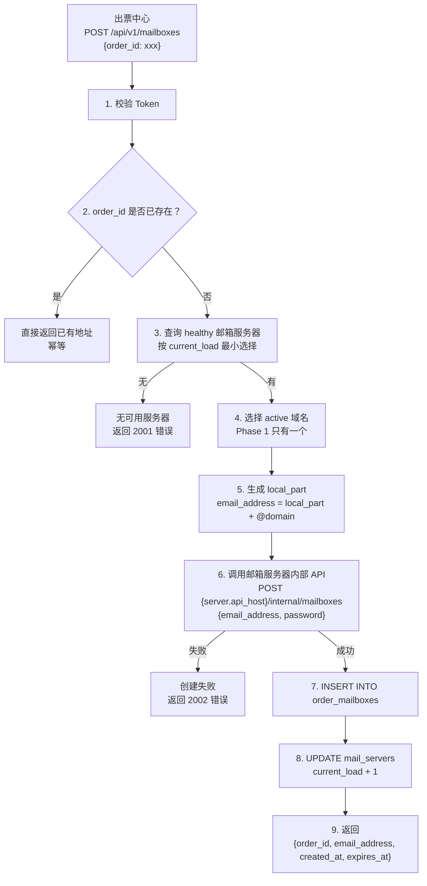
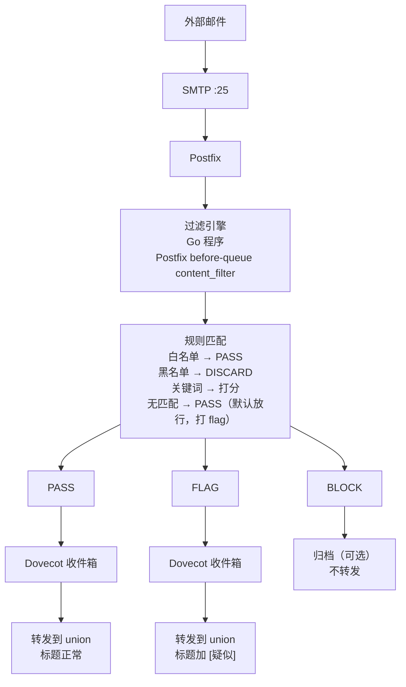
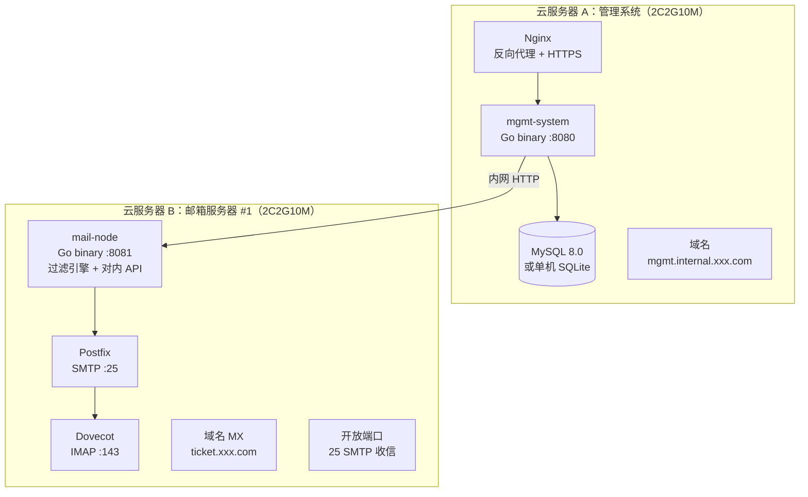

# Phase 1 详细设计

> 版本: v1.0 | 日期: 2026-06-17 | 状态: 待评审

---

## 1. Phase 1 目标

**一句话：出票中心能生成邮箱，航司邮件能收到，关键邮件能转发到 union，运营能在后台看到基本数据。**

### 1.1 范围

| 子系统 | Phase 1 做 | Phase 1 不做 |
|--------|-----------|-------------|
| 管理系统 | 邮箱生成 API、单域名管理、单台服务器管理、订单映射存储、邮件查询 API、简易 Web 后台 | 多域名、多服务器池、复杂负载策略 |
| 邮箱服务器 | Postfix+Dovecot 部署、Catch-All 收信、过滤引擎（可配置规则）、转发到 union、对内 API | 高可用、邮件归档、复杂过滤 |

### 1.2 实施顺序

```
Phase 1A — 管理系统（1.5 周）
  ├── 项目骨架 + 数据库
  ├── 邮箱生成 API
  ├── 订单-邮箱映射
  ├── 邮箱服务器管理（单台注册/心跳）
  └── 简易 Web 后台

Phase 1B — 邮箱服务器（1 周）
  ├── Postfix + Dovecot 部署配置
  ├── 过滤引擎
  ├── 对内 API
  └── 转发到 union

Phase 1C — 联调打通（0.5 周）
  ├── 管理系统 ↔ 邮箱服务器 联调
  ├── 出票中心 ↔ 管理系统 API 联调
  └── 端到端验证：创建邮箱 → 收信 → 过滤 → 转发 → union
```

---

## 2. 管理系统设计

### 2.1 技术栈

```
语言：Go 1.22+
框架：gin（HTTP路由） + gorm（ORM）
数据库：MySQL 8.0 / PostgreSQL 15（二选一，推荐 MySQL）
缓存：Redis（可选，Phase 1 可用内存 map 替代）
前端：Go template + htmx（无需前后端分离，简单够用）
部署：go build → 单二进制 → systemd
```

### 2.2 目录结构

```
mgmt-system/
├── cmd/
│   └── server/
│       └── main.go              # 入口
├── internal/
│   ├── config/
│   │   └── config.go            # 配置加载
│   ├── model/
│   │   ├── mailbox.go           # 订单邮箱模型
│   │   ├── server.go            # 邮箱服务器模型
│   │   ├── domain.go            # 域名模型
│   │   └── filter_rule.go       # 过滤规则模型
│   ├── store/
│   │   ├── mysql.go             # 数据库操作
│   │   └── migrate.go           # 自动建表
│   ├── handler/
│   │   ├── mailbox.go           # 邮箱生成/查询 API
│   │   ├── email.go             # 邮件内容查询 API
│   │   ├── server.go            # 服务器管理 API
│   │   ├── domain.go            # 域名管理 API
│   │   ├── filter.go            # 过滤规则管理 API
│   │   └── admin.go             # Web 后台页面
│   ├── service/
│   │   ├── allocator.go         # 邮箱分配逻辑
│   │   ├── forwarder.go         # 邮件查询代理（透传到邮箱服务器）
│   │   └── heartbeat.go         # 服务器健康检查
│   └── middleware/
│       └── auth.go              # Token 鉴权
├── template/
│   └── admin/                   # 后台页面模板
├── config.yaml                  # 配置文件
├── go.mod
├── go.sum
└── Makefile
```

### 2.3 数据库设计

```sql
-- 域名表（支持多域名，Phase 1 至少一个）
CREATE TABLE domains (
    id          BIGINT AUTO_INCREMENT PRIMARY KEY,
    name        VARCHAR(255) NOT NULL UNIQUE,     -- e.g. 'ticket.xxx.com'
    mx_server   VARCHAR(255) NOT NULL,            -- MX 记录指向
    status      ENUM('active','inactive') DEFAULT 'active',
    created_at  DATETIME NOT NULL DEFAULT NOW(),
    updated_at  DATETIME NOT NULL DEFAULT NOW() ON UPDATE NOW()
);

-- 邮箱服务器表（Phase 1 一台，后续扩展）
CREATE TABLE mail_servers (
    id              BIGINT AUTO_INCREMENT PRIMARY KEY,
    name            VARCHAR(128) NOT NULL,          -- 标识名：'mail-node-01'
    api_host        VARCHAR(255) NOT NULL,          -- 内网API地址：'10.0.0.2:8081'
    smtp_host       VARCHAR(255) NOT NULL,          -- SMTP 地址
    imap_host       VARCHAR(255) NOT NULL,          -- IMAP 地址
    capacity        INT NOT NULL DEFAULT 5000,      -- 容量上限
    current_load    INT NOT NULL DEFAULT 0,         -- 当前邮箱数
    status          ENUM('healthy','degraded','down','draining') DEFAULT 'healthy',
    last_heartbeat  DATETIME,
    created_at      DATETIME NOT NULL DEFAULT NOW(),
    updated_at      DATETIME NOT NULL DEFAULT NOW() ON UPDATE NOW()
);

-- 订单邮箱映射表（核心）
CREATE TABLE order_mailboxes (
    id              BIGINT AUTO_INCREMENT PRIMARY KEY,
    order_id        VARCHAR(128) NOT NULL,          -- 订单号
    email_address   VARCHAR(255) NOT NULL,          -- 完整邮箱地址
    local_part      VARCHAR(128) NOT NULL,          -- @前面那部分
    domain_id       BIGINT NOT NULL,                -- 所属域名
    server_id       BIGINT NOT NULL,                -- 所在服务器
    status          ENUM('active','disabled','recycled') DEFAULT 'active',
    retention_days  INT NOT NULL DEFAULT 30,        -- 保留天数（可动态调整）
    created_at      DATETIME NOT NULL DEFAULT NOW(),
    expires_at      DATETIME,                       -- 预计过期时间
    disabled_at     DATETIME,
    recycled_at     DATETIME,
    UNIQUE KEY uk_order (order_id),
    INDEX idx_email (email_address),
    INDEX idx_server (server_id),
    INDEX idx_status (status),
    FOREIGN KEY (domain_id) REFERENCES domains(id),
    FOREIGN KEY (server_id) REFERENCES mail_servers(id)
);

-- 过滤规则表（可配置）
CREATE TABLE filter_rules (
    id              BIGINT AUTO_INCREMENT PRIMARY KEY,
    name            VARCHAR(128) NOT NULL,
    rule_type       ENUM('whitelist_sender','blacklist_sender','keyword','regex') NOT NULL,
    pattern         VARCHAR(512) NOT NULL,          -- 匹配模式
    action          ENUM('pass','block','flag') NOT NULL DEFAULT 'pass',
    priority        INT NOT NULL DEFAULT 0,         -- 优先级，数字越小越先匹配
    enabled         TINYINT(1) NOT NULL DEFAULT 1,
    created_at      DATETIME NOT NULL DEFAULT NOW(),
    updated_at      DATETIME NOT NULL DEFAULT NOW() ON UPDATE NOW(),
    INDEX idx_type_enabled (rule_type, enabled)
);

-- API Token 表（鉴权）
CREATE TABLE api_tokens (
    id              BIGINT AUTO_INCREMENT PRIMARY KEY,
    name            VARCHAR(128) NOT NULL,          -- 调用方名称：'出票中心' / '大模型系统'
    token           VARCHAR(256) NOT NULL UNIQUE,
    scopes          VARCHAR(512) NOT NULL DEFAULT '*',  -- 权限范围
    enabled         TINYINT(1) NOT NULL DEFAULT 1,
    created_at      DATETIME NOT NULL DEFAULT NOW(),
    last_used_at    DATETIME,
    INDEX idx_token (token)
);
```

### 2.4 API 设计

#### 2.4.1 邮箱生成（出票中心调用）

```
POST /api/v1/mailboxes
Authorization: Bearer <ticket_center_token>
Content-Type: application/json

Request:
{
    "order_id": "INTL-20260617-00001"
}

Response 200:
{
    "code": 0,
    "message": "success",
    "data": {
        "order_id": "INTL-20260617-00001",
        "email_address": "intl-20260617-00001@ticket.xxx.com",
        "created_at": "2026-06-17T10:30:00Z",
        "expires_at": "2026-07-17T10:30:00Z"
    },
    "request_id": "uuid"
}

Response 200 (已存在，幂等):
{
    "code": 0,
    "message": "already_exists",
    "data": {
        "order_id": "INTL-20260617-00001",
        "email_address": "intl-20260617-00001@ticket.xxx.com",
        "created_at": "2026-06-17T10:30:00Z",
        "expires_at": "2026-07-17T10:30:00Z"
    }
}

错误码：
  1001 - order_id 为空
  2001 - 无可用邮箱服务器
  2002 - 邮箱服务器创建失败
  5000 - 系统内部错误
```

#### 2.4.2 邮件查询（大模型系统调用）

```
GET /api/v1/orders/{order_id}/emails?page=1&size=20
Authorization: Bearer <llm_system_token>

Response 200:
{
    "code": 0,
    "data": {
        "order_id": "INTL-20260617-00001",
        "email_address": "intl-20260617-00001@ticket.xxx.com",
        "total": 3,
        "page": 1,
        "size": 20,
        "messages": [
            {
                "message_id": "abc123",
                "from": "noreply@airline.com",
                "from_name": "XX航空",
                "subject": "行程确认单 / Itinerary Confirmation",
                "received_at": "2026-06-17T11:00:00Z",
                "size": 35840,
                "has_attachments": true,
                "attachments": [
                    {"name": "itinerary.pdf", "size": 20480, "content_type": "application/pdf"}
                ],
                "filter_result": "pass"    // pass / blocked / flagged
            }
        ]
    }
}

GET /api/v1/emails/{message_id}/body
Authorization: Bearer <llm_system_token>

Response 200:
{
    "code": 0,
    "data": {
        "message_id": "abc123",
        "from": "noreply@airline.com",
        "subject": "行程确认单",
        "date": "2026-06-17T10:55:00Z",
        "text_body": "尊敬的旅客...",         // 纯文本正文（已解码）
        "html_body": "<html>...</html>",     // HTML正文（已解码，可能为空）
        "headers": {...}                     // 完整邮件头
    }
}
```

#### 2.4.3 邮箱服务器管理

```
POST /api/v1/admin/servers          # 注册新服务器
GET  /api/v1/admin/servers          # 服务器列表
GET  /api/v1/admin/servers/{id}     # 单台详情
PUT  /api/v1/admin/servers/{id}     # 修改（标记 draining 等）

POST /api/v1/admin/domains          # 添加域名
GET  /api/v1/admin/domains          # 域名列表

GET  /api/v1/admin/filters          # 过滤规则列表
POST /api/v1/admin/filters          # 新增规则
PUT  /api/v1/admin/filters/{id}     # 修改规则
DELETE /api/v1/admin/filters/{id}   # 删除规则

GET  /api/v1/admin/mailboxes?order_id=xxx&status=active&page=1  # 邮箱列表
```

#### 2.4.4 Web 后台

```
GET /admin/                         # 仪表盘（服务器状态、今日创建数、活跃邮箱数）
GET /admin/servers                  # 服务器管理页
GET /admin/domains                  # 域名管理页
GET /admin/filters                  # 过滤规则页
GET /admin/mailboxes                # 邮箱查询页
GET /admin/mailboxes/{id}/emails    # 某订单的邮件列表
```

### 2.5 核心流程

#### 邮箱生成流程



---

## 3. 邮箱服务器设计

### 3.1 技术栈

```
邮件服务：Postfix（SMTP/MTA） + Dovecot（IMAP/MDA）
过滤引擎：Go 程序，通过 Postfix content_filter 集成
对内 API：Go 程序（与过滤引擎同一进程）
邮件存储：Maildir 格式（/var/mail/vhosts/{domain}/{local_part}/）
操作系统：CentOS 7+ / Ubuntu 20.04+
```

### 3.2 邮件处理流水线



### 3.3 过滤引擎设计

```go
// 过滤器接口
type Filter interface {
    // Name returns the filter name
    Name() string
    // Process checks an email and returns action
    Process(msg *EmailMessage) FilterResult
}

type FilterResult struct {
    Action  string   // "pass", "block", "flag"
    Reason  string   // 命中原因，如 "whitelist: sender=@airline.com"
    Score   int      // 评分（供后续复杂规则使用）
}

type FilterEngine struct {
    rules    []FilterRule     // 从 DB 加载的规则
    mu       sync.RWMutex     // 规则热更新用读写锁
    lastLoad time.Time
}

// 每 N 秒从管理系统拉一次最新规则
func (e *FilterEngine) ReloadRules() { ... }

// 过滤入口
func (e *FilterEngine) Filter(msg *EmailMessage) FilterResult {
    e.mu.RLock()
    defer e.mu.RUnlock()

    for _, rule := range e.rules {
        if result := rule.Match(msg); result.Action != "" {
            return result
        }
    }
    // 默认：放行但标记
    return FilterResult{Action: "pass", Reason: "default"}
}
```

**规则类型：**

```go
// 发件人白名单
type WhitelistSenderRule struct {
    patterns []string  // ["@airline.com", "@ota.com", "noreply@supplier.cn"]
}

// 发件人黑名单
type BlacklistSenderRule struct {
    patterns []string  // ["@promotion.com", "newsletter@"]
}

// 标题/正文关键词
type KeywordRule struct {
    keywords   []string  // ["行程单", "确认", "变更", "取消", "退票", "PNR", "票号"]
    matchField string    // "subject" / "body" / "both"
    action     string    // "pass" / "block" / "flag"
}
```

**与管理系统的同步：**
```
管理系统（规则主存储）→ 邮箱服务器定时拉取（每 30s）
                       或
管理系统（规则变更）→ 通知邮箱服务器立即更新
```

### 3.4 对内 API（管理系统 ↔ 邮箱服务器）

```
POST /internal/mailboxes
  body: {email_address, password}
  动作: 在 Dovecot 创建邮箱（userdb + passwd）+ Postfix virtual_alias

DELETE /internal/mailboxes/{email}
  动作: 标记邮箱为禁用，保留邮件数据

GET /internal/mailboxes/{email}/messages?page=1&size=20
  动作: 通过 IMAP 查询邮件列表，返回摘要

GET /internal/messages/{message_id}/body
  动作: 获取完整邮件（headers + text_body + html_body + attachment_meta）

GET /internal/health
  响应: {status: "ok", load: 1234, capacity: 5000, disk_usage: "45%", uptime: 123456}

POST /internal/filters/reload
  动作: 立即从管理系统拉取最新规则
```

### 3.5 Postfix 配置要点

```conf
# /etc/postfix/main.cf

# 虚拟域名
virtual_mailbox_domains = ticket.xxx.com
virtual_mailbox_base = /var/mail/vhosts
virtual_mailbox_maps = hash:/etc/postfix/vmailbox

# 所有地址都接收（Catch-All）
virtual_alias_maps = hash:/etc/postfix/virtual

# 过滤引擎集成（before-queue 模式）
smtpd_milters = inet:127.0.0.1:8899   # 或使用 content_filter
# content_filter = filter:127.0.0.1:10025

# 开放中继防护
smtpd_relay_restrictions = permit_mynetworks, permit_sasl_authenticated, reject_unauth_destination
mynetworks = 127.0.0.1, 10.0.0.0/8
```

### 3.6 Dovecot 配置要点

```conf
# /etc/dovecot/dovecot.conf

mail_location = maildir:/var/mail/vhosts/%d/%n

# 用户认证通过静态文件（我们程序管理）
passdb {
    driver = passwd-file
    args = /etc/dovecot/users.conf
}
userdb {
    driver = static
    args = uid=vmail gid=vmail home=/var/mail/vhosts/%d/%n
}
```

---

## 4. 部署拓扑（Phase 1）



---

## 5. 配置文件示例

```yaml
# mgmt-system/config.yaml
server:
  port: 8080
  mode: release  # debug | release

database:
  driver: mysql
  dsn: "user:password@tcp(127.0.0.1:3306)/email_mgmt?charset=utf8mb4&parseTime=true"

auth:
  tokens:
    - name: "出票中心"
      token: "sk-ticket-xxxx"
      scopes: ["mailbox:create", "mailbox:read"]
    - name: "大模型系统"
      token: "sk-llm-xxxx"
      scopes: ["email:read"]

domains:
  - name: "ticket.xxx.com"

default_retention_days: 30

filter:
  reload_interval: 30s                     # 邮箱服务器拉取规则间隔
  default_action: "pass"                   # 无匹配时的默认动作
  default_flag_subject_prefix: "[疑似]"    # flag 邮件的标题前缀
```

---

## 6. 待确认

- [ ] 出票中心的 Token 用什么格式？谁生成？（建议我们来生成，给到出票中心）
- [ ] 大模型系统目前是否存在？需要我们主动去对接还是他们来对接我们？
- [ ] 统一汇总邮箱地址 `union@xxx.com` 具体的邮箱全址确定了吗？
- [ ] 服务器操作系统有偏好吗？CentOS 7+ / Ubuntu 20.04+？
- [ ] 云服务器之间是否在同一 VPC 内网？（影响管理系统 ↔ 邮箱服务器的通信方式）
