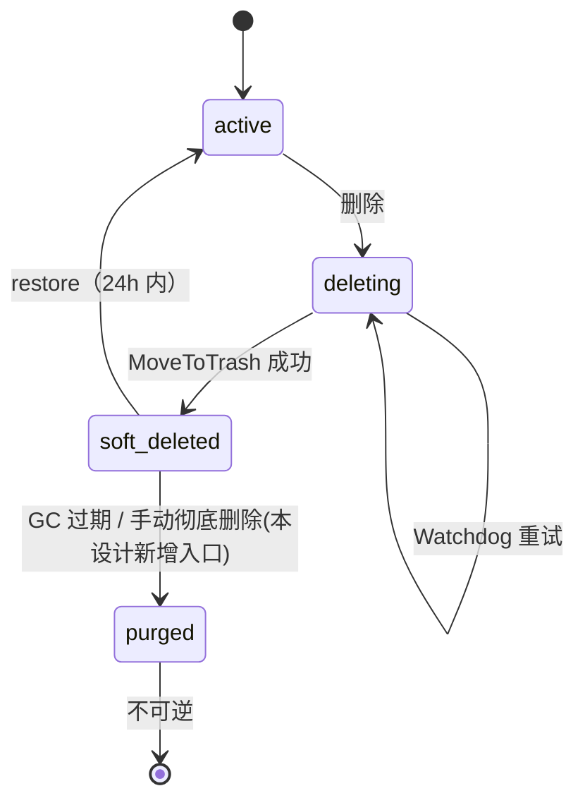

# 邮箱回收站（Recycle Bin）设计文档

> 版本: v0.2 | 状态: 已实现并发布（2026-07-06） | 最后校准：2026-07-11
> 依据：用户需求「邮箱管理增加回收站，删除的可恢复邮箱进回收站单独展示」、`docs/design/t9-restore-design.md`、`docs/design/t9-lifecycle-design.md §5.4`、本次代码核查
> 范畴：仅前端展示分离 + 一个手动彻底删除端点。删除（→`soft_deleted`）、恢复（→`active`）、lifecycle GC（→`purged`）链路均已交付，零改动。

> **阅读说明：** 下文“唯一缺口”是实现前背景。邮箱集合与回收站状态已分离，恢复和 purge 操作均已接通。

---

## 1. 背景与动机

四态删除链路与 restore 逆操作已双侧接通并部署（commit `b60ace3` / `c40e5fd`）：

- 删除：mgmt `executeDeletion`（`handler/mailbox.go:253`）→ mail-node `MoveToTrash` → `ConfirmDeletion` 落 `soft_deleted`
- 恢复：`RestoreMailbox`（`handler/mailbox.go:340`）+ store `RestoreMailbox`（`store.go:582`，带 `status=soft_deleted` 守卫）
- GC：mail-node `.trash` 24h 物理清除；mgmt `FindExpiredSoftDeleted`（`store.go:610`）按 retention 标 `purged`

**实现前唯一缺口是展示层**：邮箱管理页 `MailboxesPage`（`handler/admin.go:66`）默认 `status=""`（全部）查询，`ListMailboxesWithFilter`（`store.go:473`）仅支持「等于单状态」、无排除能力，导致 `soft_deleted`/`purged` 邮箱与正常 `active` 邮箱混排在同一台账。运维无法一眼区分"在用"与"已删除可恢复"。

### 1.1 运维价值

- 正常台账只看"在用"邮箱，回收站态单独归口，降低误判与误操作。
- 回收站内集中展示可恢复邮箱及其删除时间，一键恢复或彻底删除。
- 明确向运维传达真实可恢复窗口（远端 `.trash` 24h，非 DB retention 30 天），避免对超期邮箱发起注定失败的恢复。

---

## 2. 目标 / 非目标

**目标**：
1. 邮箱管理页新增「回收站」Tab，与「账号集合」「创建邮箱」并列。
2. 「账号集合」默认排除 `soft_deleted`/`purged`；「回收站」只展示这两个状态。
3. 回收站内：`soft_deleted` 行提供「恢复」+「彻底删除」；`purged` 行只读。
4. 新增 `POST /api/v1/admin/mailboxes/:id/purge` 端点（手动彻底删除）。

**非目标**：
- 不改删除链路、不改 GC 周期、不改远端 `.trash` 行为。
- 不实现 `purged → active`（不可逆）。
- 不调远端做"立即物理清除"——`.trash` 由 mail-node 24h GC 自然回收，手动彻底删除仅收敛 DB 终态。
- 不改 JSON API `GET /mailboxes` 默认行为（保持向后兼容）。

---

## 3. 关键决策

| 决策 | 选择 | 理由 |
|------|------|------|
| **D1. 回收站形式** | 邮箱管理页内 Tab（非独立侧边栏页） | 与「账号集合/创建邮箱」一致，回收站与账号资产强关联，聚合更自然；用户已确认 |
| **D2. 手动彻底删除语义** | 仅 DB `MarkPurged`，不调远端 | 删除时 Maildir 已 `MoveToTrash` 进 `.trash`（`callNodeDeleteMailbox`），远端 24h GC 自然物理清除；无需新增远端接口，最小改动 |
| **D3. 可恢复窗口口径** | 向用户传达 **24h**（非 30 天） | DB `retention_days`（默认 30）只决定 `soft_deleted → purged` 的 DB GC；真正可恢复性取决于远端 `.trash` 是否还在（24h）。超期 DB 仍 `soft_deleted` 但恢复会失败（`errRestoreWindowExpired`，`mailbox.go:373`）——须在 UI 文案讲清，避免误导 |
| **D4. 过滤扩展方式** | `MailboxListFilter` 加 `Statuses`/`ExcludeStatuses`，空切片不影响现有查询 | 比"加 view 枚举到 store"更通用；handler 层把 view 映射为过滤条件，store 保持无业务语义 |
| **D5. normal 视图 status 下拉** | 去掉 `soft_deleted`/`purged` 选项 | 这两态已归回收站；保留会让用户选了却因 `ExcludeStatuses` 查不到，产生困惑 |

---

## 4. 状态机（无变化，仅标注回收站归属）

回收站视图 = `{soft_deleted, purged}`；账号集合视图 = 其余状态。

**手动彻底删除迁移合法性**：`soft_deleted → purged` ✅（本设计新增）；`purged → purged` 幂等返回 ✅；其余状态拒绝。

---

## 5. 改动点

### 5.1 store 层 — `internal/store/store.go`
- `MailboxListFilter`（`store.go:459`）新增 `Statuses []string`（`IN`）、`ExcludeStatuses []string`（`NOT IN`）。
- `ListMailboxesWithFilter`（`store.go:473`）按字段非空追加 `q.Where("status IN ?", ...)` / `q.Where("status NOT IN ?", ...)`。空切片不改变查询。

### 5.2 handler 层
- `internal/handler/mailbox.go` 新增 `PurgeMailbox`：`GETMailboxByID` → 幂等守卫（已 `purged` 直接成功）→ 校验 `soft_deleted` → `MarkPurged` → 返回 `{status:"purged"}`。注册 `POST /mailboxes/:id/purge` 到 `RegisterAdminRoutes`（`mailbox.go:583`）。
- `internal/handler/admin.go` `MailboxesPage`（`admin.go:66`）：读 `view`（`trash` / 默认 `normal`）→ normal 置 `ExcludeStatuses=[soft_deleted,purged]`，trash 置 `Statuses=[soft_deleted,purged]` → 模板注入 `view`，回收站视图调整 summary 文案。

### 5.3 前端 — `template/admin/mailboxes.html`
- Tab 栏（`mailboxes.html:337`）加「回收站」；账号集合/回收站由 URL `?view=` 驱动整页渲染，创建邮箱保持前端切换。
- `#tab-list` 按 `{{.view}}` 条件渲染：trash 视图加「删除时间（`recycled_at`）」列、顶部 24h 可恢复说明条；`soft_deleted` 行带「恢复」+「彻底删除」，`purged` 行灰只读。normal 视图 status 下拉去 `soft_deleted`/`purged`。
- 新增 `requestPurge(id,email)` JS（仿 `requestDelete`，`mailboxes.html:684`）。

---

## 6. 兼容性
- JSON API `GET /api/v1/admin/mailboxes` 默认行为不变；`Statuses`/`ExcludeStatuses` 仅在显式使用时生效。
- 侧边栏导航不变，回收站为邮箱管理页内 Tab。
- 删除/恢复/lifecycle 链路零改动。

## 7. 验证
1. `cd mgmt-system && go build ./...`
2. `go test ./...`（补 `ExcludeStatuses`/`Statuses` 与 `PurgeMailbox` 拒绝非 `soft_deleted` 用例）
3. E2E：创建→删除→账号集合不可见→回收站可见→恢复（24h 内）/彻底删除→`purged` 灰只读；JSON API `?status=soft_deleted` 仍正常。
