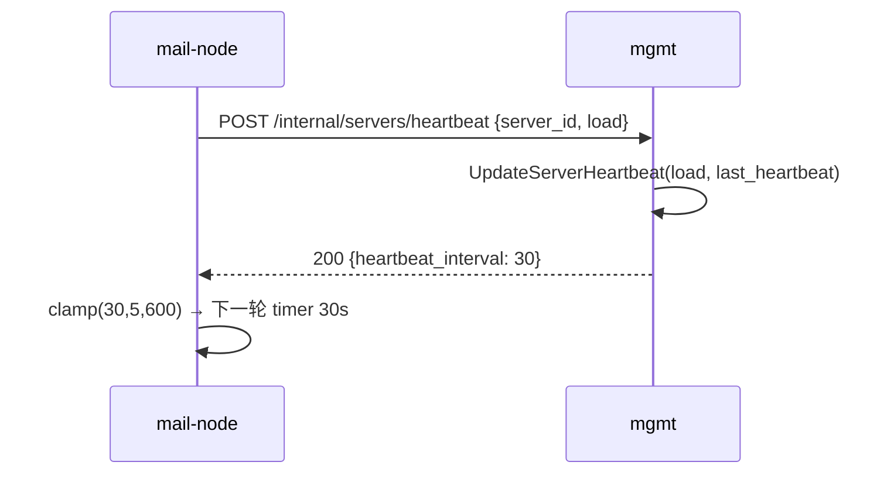

# 服务器管理体验打磨设计文档

> 状态：待评审 | 日期：2026-06-29 | 决策摘要：SP-1 注册时 SMTP/IMAP 自动推导、SP-2 编辑弹窗保留可选覆盖、SP-3 列表 SMTP/IMAP 两列换为「关联域名」一列、SP-4 域名列只展示 active 绑定并折叠、SP-5 ListServers 批量查询避免 N+1、SP-6' 心跳间隔迁到 mgmt 动态下发（默认 30，后台可调）、SP-7 interval clamp 5–600s 防异常值 | 依据：`context.md`「下次会话」当前待办、`memory/phase2-forward-status.md`、`server.go` / `servers.html` / `store.go` 现状

---

## 1. 背景与目标

### 1.1 问题

T9 四态生命周期 + 节点自动发现上线后，双节点已稳定在线。但「服务器管理」控制台仍有三处体验短板，均非功能缺口，属 UX/可观测性打磨：

| 短板 | 现状（代码证据） | 影响 |
|------|------------------|------|
| 注册要手填 SMTP/IMAP | `RegisterServer`（`server.go:54`）不推导，`servers.html:79-85` 表单要求填写 | SMTP/IMAP 几乎总等于 api_host 的 host 部分，手填是噪声；而自动发现路径 `DiscoverServer`（`server.go:376-377`）已经会用 `extractHost(api_host)` 推导，两条注册路径不一致 |
| 列表看不到域名归属 | `ListServers`（`store.go:120`）返回纯 `[]MailServer`，不带域名；`servers.html` 列表无域名列 | 运营要知道「某服务器挂了哪些域」必须逐台点进域名池页（`/admin/servers/:id/domains`），域名池可见性差 |
| SMTP/IMAP 列信息冗余 | 列表有独立 SMTP/IMAP 两列（`servers.html:102`） | 推导后 ≈ api_host，占位却低价值；列表已达 11 列，挤 |
| 心跳间隔写死配置 | `heartbeat_interval` 仅在 mail-node `config.yaml`（`main.go:213` 固定 ticker），`beat()` 丢弃响应（`main.go:247`） | 改值需登录机器改文件并重启；国际机 60/临时机 30 不一致；无法在后台在线调整节拍 |

### 1.2 目标

1. 手动注册与自动发现走同一套 host 推导逻辑，注册表单不再强制 SMTP/IMAP。
2. 服务器列表直接展示每台服务器绑定的域名（active），不必逐台点进。
3. 列表列布局更合理：用「关联域名」列替换冗余的 SMTP/IMAP 两列。
4. 心跳间隔事实源迁到 mgmt，后台可在线动态调整，默认 30s（双节点随之统一，无需改配置重启）。

### 1.3 非目标

- 不改自动发现（`DiscoverServer`）已正确工作的逻辑，仅复用其推导函数。
- 不做域名增删 CRUD（域名池页 `/admin/servers/:id/domains` 已闭环）。
- 不改健康检查 / 主动探测语义（T7 已定）。
- 不清理 `mailbox_accounts` 中 `@ticket.example.com` 历史污染数据（独立数据清理项）。
- 不改对外邮箱创建 API、不改鉴权。

---

## 2. 设计决策

| 编号 | 决策 | 状态 | 说明 |
|------|------|------|------|
| SP-1 | 注册时 SMTP/IMAP 自动从 `api_host` 推导 | 提议 | 复用已有 `extractHost`；`RegisterServer` 与 `DiscoverServer` 共用一个 `deriveHostDefaults` 辅助函数，消除两条路径分歧 |
| SP-2 | 编辑弹窗保留 SMTP/IMAP 可选覆盖 | 提议 | 少数场景 SMTP 主机与 API 主机不同（如 SMTP 走 `mail.domain`、API 走 `IP:8081`），保留输入框但 placeholder 标注「留空则从 API 地址推导」；`UpdateServer` 收到空值时不覆盖既有值（现状已如此，`server.go:293-298`） |
| SP-3 | 列表移除 SMTP/IMAP 两列，换为「关联域名」一列 | 提议 | SMTP/IMAP 推导后信息冗余；域名归属对运维决策更有价值。编辑弹窗仍保留 SMTP/IMAP，只是列表不单独展示 |
| SP-4 | 域名列只展示 `status=active` 绑定 | 已实现 | inactive（已移除）绑定不进列；tag 形式展示全部 active 域名（CSS `inline-block` 自动换行）。>3 折叠暂未做：单服务器实际绑定数少，收益低 |
| SP-5 | ListServers 一次批量查询组装 domains | 提议 | 新增 `ListActiveServerDomains()` 单次查全部 active 绑定（preload Domain），handler 按 `server_id` 分组装入 MailServer 的 transient 字段，避免每台服务器一次查询的 N+1 |
| SP-6' | 心跳间隔事实源迁到 mgmt，动态下发 | 提议 | `mail_servers` 加 `heartbeat_interval`（per-server，默认 30）；mgmt 在心跳响应里返回期望间隔；mail-node 每轮跟随，本地 config 降为冷启动/断连兜底。取代「改配置文件统一 30s」，既统一默认值又能在线调 |
| SP-7 | interval clamp 区间保护 | 提议 | mail-node 对 mgmt 下发值 clamp 到 [5, 600] 秒；0/负/异常值不采纳、沿用上一周期，防狂跳或停摆。mgmt 侧编辑弹窗也做同样校验 |

> 备选（已否决）：(a) 注册表单完全删除 SMTP/IMAP 输入——否决，编辑场景仍需覆盖能力（SP-2）。(b) 列表同时保留 SMTP/IMAP + 新增域名列——否决，列数已达 11，再加会溢出。(c) 给 `MailServer` 建真实 has-many 关系落库——否决，绑定关系已由 `server_domains` 承载，无需重复建模，用 transient 字段即可。

---

## 3. 方案设计

### 3.1 后端：注册 host 推导

`server.go` 抽取共用辅助函数，`RegisterServer` 与 `DiscoverServer` 都调用：

```go
// deriveHostDefaults 在 SMTP/IMAP 为空时从 api_host 推导，统一两条注册路径。
func deriveHostDefaults(srv *model.MailServer) {
    if srv.SMTPHost == "" {
        srv.SMTPHost = extractHost(srv.APIHost)
    }
    if srv.IMAPHost == "" {
        srv.IMAPHost = extractHost(srv.APIHost)
    }
}
```

- `RegisterServer`（`server.go:54`）：在 `CreateServer` 前调用 `deriveHostDefaults(&srv)`。
- `DiscoverServer`（`server.go:373-380`）：把内联的 `SMTPHost/IMAPHost: extractHost(...)` 改为构造后调 `deriveHostDefaults(srv)`，行为不变但去重。

### 3.2 后端：列表带域名（批量组装，无 N+1）

模型加 transient 字段（不落库、不影响迁移与其他 preload）：

```go
// model.go MailServer
Domains []Domain `gorm:"-" json:"domains,omitempty"`
```

store 新增批量查询：

```go
// ListActiveServerDomains 一次查出所有 active 绑定（preload Domain），供列表组装。
func (s *Store) ListActiveServerDomains() ([]model.ServerDomain, error) {
    var list []model.ServerDomain
    err := s.db.Preload("Domain").
        Where("status = ?", "active").
        Order("server_id ASC, id ASC").Find(&list).Error
    return list, err
}
```

handler `ListServers`（`server.go:80`）组装：

```go
list, err := h.store.ListServers()
// ... err 处理 ...
bindings, _ := h.store.ListActiveServerDomains()
bucket := make(map[uint64][]model.Domain, len(list))
for _, b := range bindings {
    bucket[b.ServerID] = append(bucket[b.ServerID], b.Domain)
}
for i := range list {
    list[i].Domains = bucket[list[i].ID] // 空则 nil，omitempty 隐藏
}
success(c, "success", list)
```

> 兼容性：`Domains` 带 `omitempty`，未填充时不出现在 JSON；旧消费者无感。`FindServerByEmailDomain` / `GetHealthyServerForDomain` 等返回 `MailServer` 的地方 `Domains` 为 nil，不影响。

### 3.3 前端：servers.html

**(a) 注册表单**（`servers.html:77-86`）：删除 SMTP/IMAP 两个 `.form-group`，注册只提交 `name / api_host / capacity`。`submitAdd`（`servers.html:275-281`）不再带 `smtp_host/imap_host`（后端会推导）。

**(b) 列表表头**（`servers.html:102`）：

```
前: ID | 名称 | API | SMTP | IMAP | 负载 | 状态 | 心跳 | 探测 | 失败 | 操作   (11 列)
后: ID | 名称 | API | 关联域名 | 负载 | 状态 | 心跳 | 探测 | 失败 | 操作       (10 列)
```

**(c) 两套渲染都要改**（这是最容易遗漏的点）：
- 服务端模板 `{{range .servers}}`（`servers.html:105-123`）：把 SMTP/IMAP 两个 `<td>` 换成一个域名 `<td>`，`{{range .Domains}}` 输出 tag。
- JS `renderServerTable`（`servers.html:220-236`）：同步改，读 `s.domains`。

域名渲染（SP-4，模板 `{{range .Domains}}` 与 JS `renderDomainTags` 共用）：空显示「-」；否则全部 active 域名以 tag 展示，`.tag { display:inline-block }` 自动换行。单服务器绑定数实际很少，未做 >3 折叠。

**(d) 编辑弹窗**（`servers.html:147-156`）：SMTP/IMAP 输入框**保留**，placeholder 改「留空则从 API 地址推导」。`UpdateServer` 现有逻辑（空值不覆盖，`server.go:293-298`）已满足 SP-2，无需后端改动。

### 3.4 心跳间隔动态化（SP-6'/SP-7）

事实源从 mail-node 本地 config 迁到 mgmt：mgmt 在每次心跳响应里下发期望 `heartbeat_interval`，mail-node 每轮跟随；本地 config 值降为冷启动首次与断连兜底。

**mgmt 侧**：
- `mail_servers` 加列 `HeartbeatInterval int default 30`（per-server）；老 server 迁移后自动得 30，国际机从 60 降为 30，达成统一。
- `Heartbeat` handler（`server.go:391`）：现仅调 `UpdateServerHeartbeat` 并返回 nil data；改为读取该 server 的 `HeartbeatInterval`，响应 data 带 `{heartbeat_interval: <n>}`。
- 后台编辑弹窗加「心跳间隔(秒)」输入框；`UpdateServer` 放行该字段，校验 5–600。

**mail-node 侧**（`main.go:212 startHeartbeat`）：
- `beat()` 不再丢弃响应：解析 body 取 `heartbeat_interval`，返回给调度循环。
- 调度从固定 `time.NewTicker`（`main.go:254`）改为每轮按返回值重建的 `time.NewTimer`；首轮用本地 config 值，之后跟随 mgmt 下发值。
- 区间保护（SP-7）：返回值 clamp 到 [5, 600] 秒；非法值不采纳，沿用上一周期值。



**不在本次范围**：mgmt→node 的主动健康探测（healthcheck scheduler，固定 30s）是另一通道，本次只动态化 node 被动心跳；探测间隔若需在线调整另开。

---

## 4. 数据 / 接口变更清单

| 类型 | 位置 | 变更 |
|------|------|------|
| 模型 | `model.MailServer` | 加 `Domains []Domain` transient（`gorm:"-"`）；加 `HeartbeatInterval int`（落库，default 30） |
| store | `store.go` | 新增 `ListActiveServerDomains()` |
| handler | `server.go RegisterServer` | 调 `deriveHostDefaults` |
| handler | `server.go DiscoverServer` | 改用 `deriveHostDefaults`（去重） |
| handler | `server.go ListServers` | 批量组装 domains |
| handler | `server.go Heartbeat` | 响应 data 带 `heartbeat_interval`（读 server 字段） |
| handler | `server.go UpdateServer` | 放行 `HeartbeatInterval` 更新（校验 5–600） |
| 辅助 | `server.go` | 新增 `deriveHostDefaults` |
| 前端 | `servers.html` | 注册表单删 SMTP/IMAP；列表换域名列（模板 + JS 两处）；编辑弹窗 placeholder + 「心跳间隔(秒)」输入框 |
| mail-node | `main.go startHeartbeat` | 解析响应 interval，固定 `NewTicker` → 每轮 `NewTimer` 动态调度 + clamp |

API 响应：`GET /api/v1/admin/servers` 每个 server 对象多一个可选 `domains: [{id,name,...}]` 数组，向后兼容。

---

## 5. 验证清单

- [ ] `mgmt-system go test ./...` 通过；新增 `server_test.go` 用例：`RegisterServer` 空 SMTP/IMAP 时落库值 = `extractHost(api_host)`；`ListServers` 返回的 domains 与 `server_domains` active 绑定一致。
- [ ] `mgmt-system go build` 通过。
- [ ] 国际机部署：备份 mgmt binary + `servers.html`，发布，重启 `mgmt-system`。
- [ ] 国际机发布 mgmt + mail-node 新 binary（**不改 config.yaml**）；AutoMigrate 给现有 server 补 `heartbeat_interval=30`。
- [ ] 后台 `/admin/servers`：列表出现「关联域名」列，mail-node-intl 行显示 `asadad.bond` tag；SMTP/IMAP 列已移除。
- [ ] 注册一台测试服务器（只填 name + api_host），列表/详情确认 SMTP/IMAP 自动填充为 api_host 的 host。
- [ ] 编辑弹窗 SMTP 留空保存 → 既有值不变；填入新值 → 覆盖生效。
- [ ] 后台编辑某 server 心跳间隔 30→15 保存，mail-node 日志 1–2 周期内节拍变 15s（无需重启）；DB 改异常值（0）→ mail-node 沿用上一周期不狂跳。

---

## 6. 风险与回滚

| 风险 | 评估 | 缓解 |
|------|------|------|
| transient `Domains` 字段影响 gorm 迁移或其他 preload | 低 | `gorm:"-"` 不建列、不参与 preload；已分析 `MailboxAccount.Server` / `ServerDomain.Server` 等关联不受影响 |
| 列表 API 响应体积增大 | 极低 | 服务器数量个位数、每台域名数个位数；`omitempty` 空时不出现 |
| 域名列 tag 过多撑乱布局 | 低 | SP-4 折叠规则 >3 只显前 2 + 「+N」 |
| 部署后模板未同步 | 中 | binary + `servers.html` 必须一起发；参照 T8 发布流程 |
| 动态调整有一周期延迟 | 低 | 新间隔在下次心跳响应后才生效（最坏 ≈ 旧 interval）；timer 每轮重建保证最终收敛 |
| mgmt 下发异常 interval | 中 | SP-7 双侧 clamp（mail-node 兜底 + mgmt 编辑校验）；老 server 迁移 default 30 |

回滚：还原 mgmt binary + `servers.html`，`config.yaml` heartbeat 改回 60。无 schema 变更，无需数据库回滚。
