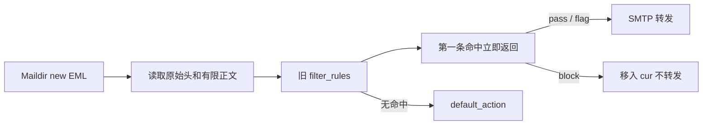
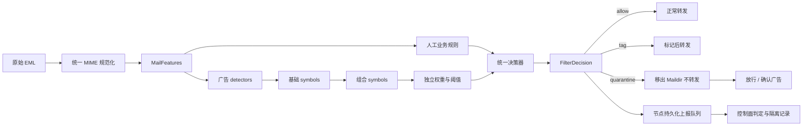
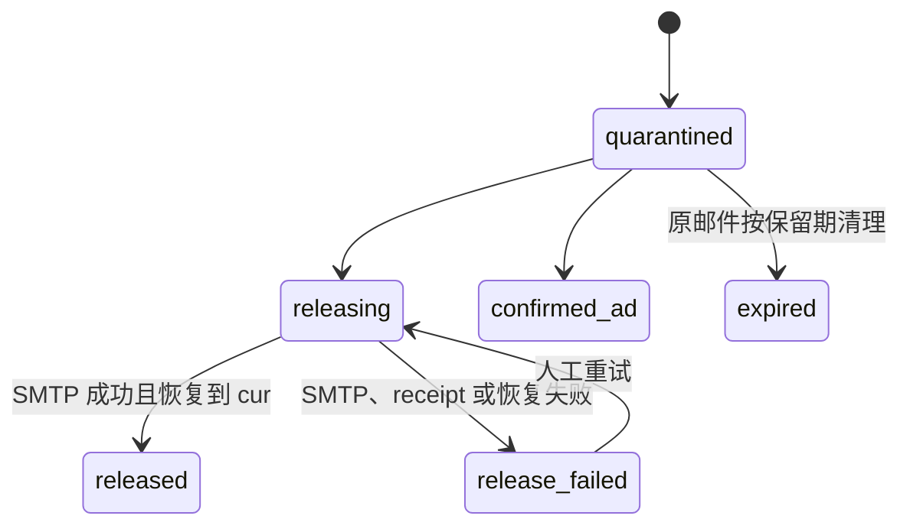
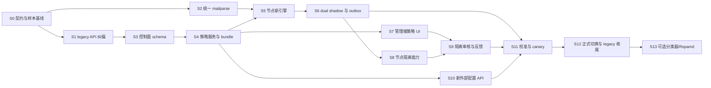

# 广告邮件过滤系统重构设计

> 版本：v0.4
>
> 日期：2026-07-20
>
> 状态：实现前评审稿
>
> 目标版本：P0-P4 分阶段交付，P5 统计分类器与 Rspamd 仅保留为后续候选

本文把现有单条件字符串规则器升级为可解释、可回滚、可观测的邮件策略系统。文中“当前事实”来自现有代码；“一期基线”是建议按此实施的默认决策；P0-P4 未完成前，不应把本文描述为已上线能力。

---

## 1. 结论摘要

本次重构不是给现有 `filter_rules` 增加几个字段，而是同时重做七条链路：

1. 把原始 EML 规范化为稳定的 `MailFeatures`。
2. 保留一套由管理员维护的人工业务规则，用于明确 allow、tag 和 quarantine。
3. 新增一套自动广告识别器，把检测逻辑、symbol、权重和组合规则分层，不与人工规则混表。
4. 用两套独立的不可变版本完成整批校验、原子发布和快速回滚。
5. 为每次判定保存人工规则命中、广告分数、原因、双版本和解析警告。
6. 将隔离 EML 物理移出 Dovecot 可见目录，普通查询和 Roundcube 均不可见。
7. 建立管理端隔离查看、人工放行、确认广告和操作审计。

一期明确不做：

- SMTP 会话阶段拒收；
- 自动永久删除邮件；
- 任意脚本条件；
- 未确认可信来源的 SPF/DKIM/DMARC 条件；
- Rspamd 正式动作接管；
- 统计分类器自动训练或直接决定隔离；
- MinIO 或独立对象存储；
- 按 server/domain/mailbox 的差异化策略执行。

一期目标是先把全局策略、shadow、隔离恢复和审计闭环做正确，再扩展作用域和外部评分源。

---

## 2. 当前事实与纠偏

### 2.1 当前过滤链路



当前代码事实：

- `mgmt-system` 按 `priority ASC, id ASC` 下发启用的 `filter_rules`。
- `mail-node/internal/filter.Engine` 顺序遍历，第一条命中后返回。
- `whitelist_sender` 和 `blacklist_sender` 使用同一个不区分大小写的子串算法。
- `keyword` 和 `regex` 只检查 Subject 与正文预览字符串。
- 无效正则在节点编译失败后被静默保留为永不匹配的规则。
- `block` 不删除 EML，只是不转发并把文件移入 `cur/`。
- 管理页仍是 `rule_type + pattern + action + priority + enabled` 的单表 CRUD。
- 现有引擎没有判定记录、隔离记录、策略版本、命中统计或人工恢复状态。

### 2.2 已发布 legacy 外部接口的纠偏

提交 `4381564` 暴露的 `/api/v1/filters` 直接复用了旧 `FilterRule` CRUD。它不具备本文要求的版本、条件组、shadow、分数、判定或隔离语义，因此不能作为新过滤系统的外部契约。

生产当前没有应用获得 `filter:read/create/update/delete` 权限，可以在没有调用方迁移成本的情况下纠正：

1. P0 退役外部 `/api/v1/filters` 四条路由及对应权限元数据。
2. 撤回把 legacy 字段写成正式外部契约的文档内容。
3. 管理端 `/api/v1/admin/filters` 暂时保留，仅用于旧规则迁移和回滚。
4. 新外部 API 只管理人工规则和广告策略的草稿/发布版本；判定和隔离邮件仅开放给 Session 鉴权的管理端，见第 10 节。

退役 legacy 外部接口不删除 `filter_rules` 数据，也不改变当前邮件处理行为。

### 2.3 Gmail 与开源规则的事实边界

Gmail 没有开源其生产环境使用的垃圾邮件或 Promotions 分类规则、模型权重和训练数据。Gmail API 中的 filters 是用户自定义收件规则，不是 Gmail 的广告分类器；Google 公开的机器学习框架和研究材料也不能等同于 Gmail 线上模型。

截至 2026-07-20 的 GitHub 检索中，未找到超过 1000 stars、专门复刻 Gmail Promotions 或只识别商业广告邮件的成熟开源项目。以下高关注项目解决的是 spam/junk 或完整邮件系统问题，不应把它们的标签直接等同于本文的“商业广告/低价值订阅”：

| 项目 | GitHub 快照 | 可借鉴内容 | 不能直接解决的问题 |
|------|-------------|------------|--------------------|
| [Rspamd](https://github.com/rspamd/rspamd) | 2491 stars，独立过滤引擎 | multimap 区分 SMTP/MIME 来源；模块产生 symbols；分值、composites 和 action thresholds 分层；支持 Bayes、neural、fuzzy 和反馈学习 | 默认目标偏 spam 风险，规则、默认分值和 reject 阈值不适用于合法商业广告 |
| [Stalwart](https://github.com/stalwartlabs/stalwart/tree/main/crates/spam-filter) | 13745 stars，内置过滤器的邮件服务器 | IP、认证、Header、地址、域名、URL、MIME、HTML、规则和分类器分别产生 tags，再由独立表映射分值和动作 | SMTP 阶段 reject/discard 与本系统 Maildir 异步隔离语义不同 |
| [mailcow](https://github.com/mailcow/mailcow-dockerized) | 13133 stars，邮件系统套件 | 使用 Rspamd；分别维护 Envelope From、MIME From 和收件人名单；通过 learnspam/learnham 与 Redis Bayes 建立运营反馈闭环 | 它是集成实践而非新的广告分类算法，强白名单和自动学习不能原样复制 |
| [Apache SpamAssassin](https://github.com/apache/spamassassin) | GitHub 镜像不足 1000 stars，但属于长期维护的事实参考 | 可读规则、正负分、组合条件和阈值 | GitHub stars 不能反映其历史采用度；规则老化、语言和业务场景差异明显 |

主要事实核对入口包括 [Rspamd multimap](https://rspamd.com/modules/multimap/)、[Rspamd actions](https://github.com/rspamd/rspamd/blob/master/conf/actions.conf)、[Rspamd composites](https://github.com/rspamd/rspamd/blob/master/conf/composites.conf)、[Stalwart score pipeline](https://github.com/stalwartlabs/stalwart/blob/main/crates/spam-filter/src/analysis/score.rs)、[Stalwart classifier](https://github.com/stalwartlabs/stalwart/blob/main/crates/spam-filter/src/modules/classifier.rs)、[mailcow multimap](https://github.com/mailcow/mailcow-dockerized/blob/master/data/conf/rspamd/local.d/multimap.conf) 和 [mailcow statistic](https://github.com/mailcow/mailcow-dockerized/blob/master/data/conf/rspamd/local.d/statistic.conf)。

stars 只用于满足本次调研的关注度筛选，不作为技术质量或许可证结论；实现前仍要固定上游版本并单独完成许可证审查。

### 2.4 从成熟方案采用的设计原则

本文采用这些项目反复验证过的结构，而不复制其 spam 规则和生产阈值：

1. **来源明确**：Envelope From、MIME From、Reply-To、URL domain 和投递邮箱分别提取，不能把整段 Header 当成一个发件人字符串。
2. **检测与权重分离**：detector 只输出稳定 symbol；weight 表决定 symbol 当前版本贡献多少分，调分不改检测条件。
3. **先产生事实，再组合语义**：基础 symbol 描述单一事实，composite 通过受限的 all/any/none 组合表达“多个弱信号同时出现”。
4. **所有贡献可解释**：保存命中 symbol、原始权重、组合抑制、最终贡献和阈值结果，不只保存总分。
5. **分类器只是一个信号源**：未来 Bayes、FTRL、Rspamd 或其他模型只能产生版本化 symbol/置信度，不能绕过统一决策器直接隔离。
6. **反馈先沉淀再训练**：确认广告和误判放行形成标注数据；一期不因单封邮件实时改权重或自动训练。

明确不照搬：Rspamd 默认 `greylist/add_header/reject` 阈值、mailcow 的超大名单分值、Stalwart 的 SMTP reject/discard，以及任何会让广告白名单绕过病毒或钓鱼检测的行为。

经过许可证和适用性审查的开源规则只能转成 detector seed，必须标明来源、固定上游引用并先进入 shadow，通过本地样本和人工标注验证。不得以“Gmail 也这样做”或“上游默认启用”作为规则上线依据。

---

## 3. 一期设计基线

以下默认值用于把方案收敛为可实施范围。评审若无异议，P0 开始时将其转为正式决策。

| 议题 | 一期基线 | 原因 |
|------|----------|------|
| 识别范围 | 商业广告和低价值订阅，不承诺病毒/钓鱼检测 | 避免把内容评分误当安全网关 |
| 处理位置 | Maildir 异步处理 | 保持 SMTP 收信链路简单可靠 |
| 永久删除 | 禁止 | 误判必须可恢复 |
| 过滤体系 | 人工业务规则 + 自动广告识别两套独立版本 | 两类规则的所有者、语义和调优方式不同 |
| 隔离存储 | 同一磁盘上的 `/var/mail/mailhub-quarantine`，物理移出 Dovecot Maildir | 普通查询和 Roundcube 天然不可见，仍可原子移动 |
| 隔离可见性 | 仅 MailHub 管理端通过隔离专用接口展示 | 不改造 Roundcube，也不污染普通邮件查询契约 |
| 隔离保留期 | 服从全局邮件保留天数 | 避免出现两套 GC 语义 |
| 策略作用域 | 一期只执行 `global` | 先验证引擎与运营闭环 |
| 新策略默认模式 | `shadow` | 先观察再改变邮件动作 |
| 外部认证信号 | 一期不启用 `auth_result` 条件 | `Authentication-Results` 的可信边界尚未确认 |
| 语言 | UTF-8、常见中文编码和英文内容 | 覆盖当前主要业务邮件 |
| 自动识别结构 | detector -> symbol -> composite -> weight -> threshold | 复用成熟方案的可解释评分结构，同时保持广告语义独立 |
| 分类器 | 一期不实现；P5 必须沿 provider symbol/weight 边界扩展 | 先建立可靠标注、版本和回放能力，避免提前冻结未经评审的模型契约 |
| Rspamd | 不进入一期关键路径 | 先完成本地可解释闭环 |

数据模型预留 `server/domain/mailbox` scope，但一期 API 对非 `global` scope 返回 400，不允许“字段存在但实际忽略”。

---

## 4. 目标架构



模块边界：

| 模块 | 所属 | 职责 |
|------|------|------|
| `mailparse` | mail-node | MIME 解码、正文规范化、地址/URL/附件特征抽取 |
| `manualfilter` | mail-node | 人工规则 bundle 校验、条件编译和确定性动作 |
| `adfilter` | mail-node | 编译 detectors/composites/weights，产出 symbol 贡献并执行阈值动作 |
| `filterdecision` | mail-node | 捕获两套版本快照、执行优先级和生成统一决策 |
| `filteroutbox` | mail-node | 判定事件落盘、失败重试、幂等上报 |
| `filter policy service` | mgmt-system | 草稿编辑、校验、发布、回滚和节点状态 |
| `quarantine service` | mgmt-system + mail-node | 隔离列表、放行、确认广告和对账 |
| `filter audit` | mgmt-system | 策略变更、发布和人工操作审计 |

现有 `mail-node/internal/handler/message_parser.go` 已能通过 enmime 解析正文和附件，但它位于 HTTP handler 包且类型未导出。P1 应把可复用部分提取到独立领域包，邮件查询和过滤共同调用，不能维护两套 MIME 解析器。

---

## 5. 邮件规范化

### 5.1 结构化特征

```go
type MailFeatures struct {
    MessageKey            string
    MessageID             string
    Mailbox               string
    ServerID              uint64
    HeaderFrom            MailAddress
    EnvelopeFrom          *MailAddress
    ReplyTo               []MailAddress
    Subject               string
    Text                  string
    HTMLText              string
    Headers               map[string][]string
    URLs                  []URLFeature
    Attachments           []AttachmentFeature
    ListUnsubscribe       bool
    ListID                string
    Precedence            string
    FromReplyToDomainMatch *bool
    TrackingPixelCount    int
    SizeBytes             int64
    ParseWarnings         []string
}
```

`EnvelopeFrom` 一期从 `Return-Path` 尽力提取；缺失时记录 warning，不伪造值。`Message-ID` 只作为邮件元数据，不作为唯一主键。

### 5.2 稳定消息标识

`MessageKey` 使用以下字段生成 SHA-256：

```text
server_id + NUL + mailbox + NUL + maildir_unique_name + NUL + size_bytes
```

`maildir_unique_name` 去掉 `:2,flags`，因此文件经历 `new -> quarantine -> cur` 后标识不变。同一节点、邮箱下 Maildir 唯一名不得重复。

### 5.3 规范化要求

- RFC 2047 Subject 解码；
- Base64 和 quoted-printable 解码；
- multipart/alternative、mixed、related 遍历；
- text/plain 与 text/html 可见文本提取；
- HTML entity 解码，不执行脚本或加载外部资源；
- UTF-8、GBK、GB18030 等常见字符集转 UTF-8；
- Header From、Reply-To、Return-Path 结构化解析；
- Header 名统一转小写；`List-Unsubscribe` 仅在存在非空可解析值时置 true；`Precedence` 只规范化为 `bulk/list/junk` 枚举；
- `FromReplyToDomainMatch` 在任一可解析 Reply-To 域名与 Header From 域名相同时为 true，全部不同时为 false，任一侧缺失时为 nil；
- URL host、链接 occurrence 数量、附件名称/类型/大小提取；URL 只解析邮件已有内容，不发起网络请求；
- 疑似 tracking pixel 只根据 HTML 中显式 1x1/隐藏图片属性统计，不下载图片、不把单次命中视为强证据；
- 正文和特征设置显式大小上限；
- 单个 part 解析失败只产生 warning，不默认隔离整封邮件。

解析失败时仍保留原始 EML，并用已成功提取的字段继续判定。若无法获得任何可用正文和地址特征，默认动作是 `allow`，同时记录 `parse_warnings`。

---

## 6. 两套过滤与决策语义

### 6.1 人工业务规则

人工规则由管理员或明确授权的外部系统维护，用于表达已经确认的业务意图，不参与广告分数调优。

| action | 语义 | 是否终止 |
|--------|------|----------|
| `allow` | 明确放行业务发件人或域名 | 是，最终 action 固定为 allow |
| `quarantine` | 明确拦截发件人、域名或内容 | 是，最终 action 固定为 quarantine |
| `tag` | 人工要求至少标记，但仍交给广告识别继续判断 | 否 |

规则按 `priority ASC, logical_id ASC` 排序，第一条命中的 enforce 规则生效。保留首条命中是人工规则的显式冲突解决方式，不适用于广告弱信号。

人工 `allow` 只表示绕过自动广告识别，不表示绕过未来的病毒、恶意附件或钓鱼安全引擎。

一期继续支持管理员熟悉的发件人、关键词和正则表达方式，但保存时必须转成结构化条件。白名单/黑名单不能继续共享任意子串算法。

### 6.2 自动广告识别

自动广告识别采用成熟过滤器常见的 symbol pipeline，但 symbol 语义只服务于“商业广告/低价值订阅”：

```text
MailFeatures
  -> detectors 产生基础 symbols
  -> composites 产生组合 symbols，并可抑制直接输入的重复计分
  -> weights 把 enforce symbols 映射为正分、负分或 0 分
  -> 汇总 contribution 得到 ad_score
  -> thresholds 得到 ad_action
```

各层职责固定：

| 层 | 输入 | 输出 | 约束 |
|----|------|------|------|
| detector | 规范化字段和结构化条件 | 一个基础 symbol + 脱敏 evidence | 不保存分值；同一 symbol 每封邮件最多产生一次贡献 |
| composite | 已产生的 symbols | 一个组合 symbol | 使用结构化 `all_of / any_of / none_of`，不执行任意表达式或脚本 |
| weight | symbol | `[-100, 100]` 内的分值 | 与检测逻辑分表；允许负分和显式 0 分 |
| threshold | `ad_score` | `allow / tag / quarantine` | 只负责分档，不知道具体 detector 条件 |

detector 的全部 conditions 为 AND，不同 detector 独立执行。一个 detector 即使在多个 Header、URL 或正文位置命中，其唯一输出 symbol 也只计分一次；原始 occurrence 数量只进入解释信息，防止重复内容放大分数。

composite 用数组表达组合关系：`all_of` 中所有 symbol 必须存在，`any_of` 至少一个存在，`none_of` 必须全部不存在。空数组或缺失组表示不施加该组约束，但 `all_of` 和 `any_of` 至少一个必须非空，禁止只靠“某 symbol 不存在”产生分数。composite 之间组成有向无环图，发布时拒绝未知 symbol、循环引用、超过 5 层或超过 20 个直接输入的组合。detector 和 composite 的输出 symbol 在同一 revision 内全局唯一。

composite 的 `score_policy` 支持：

| policy | 语义 |
|--------|------|
| `keep_inputs` | 保留直接输入贡献，再叠加组合 symbol 的权重 |
| `suppress_direct_inputs` | 仍记录直接输入命中，但其 contribution 置 0，只计算组合 symbol，避免强相关弱信号重复加分 |

当多个已命中的 composite 抑制同一个直接输入时，抑制集合取并集；评分顺序不影响结果。每个 symbol 的结果必须记录 `matched / weight / suppressed_by / contribution / evidence`。

所有 enforce symbol 完成贡献计算后再分档：

```text
score < tag_threshold                         => allow
tag_threshold <= score < quarantine_threshold => tag
score >= quarantine_threshold                => quarantine
```

默认分数为 0，默认动作为 `allow`。自动广告层一期不提供直接 accept/reject/discard 的 producer；确定性放行或隔离必须进入人工规则层。来自 Rspamd、Stalwart、SpamAssassin 或人工经验的规则只能作为 detector seed，不能直接复制上游分值和阈值。

### 6.3 执行顺序

每封邮件开始处理时，节点一次性捕获当前人工规则 revision 和广告策略 revision，整封邮件始终使用同一对版本：

1. 规范化 EML，一次性生成 `MailFeatures`。
2. 评估人工规则，包括 shadow 命中。
3. 运行 enforce detectors，去重产生基础 symbols。
4. 按拓扑序运行 enforce composites，确定抑制集合。
5. 查 weight 表计算每个 symbol 的 contribution 和 `ad_score`，再执行 threshold 分档。
6. 独立运行 shadow 图，记录 candidate symbols、would-score 和 would-action，不影响真实分数。
7. 人工 `allow/quarantine` 是最终动作，不被广告分数覆盖。
8. 人工 `tag` 与广告动作取更严格者，严重度为 `allow < tag < quarantine`。
9. 没有人工 enforce 命中时，使用广告识别结果。

这样既能保证业务白名单和明确黑名单的确定性，也能持续看到“如果没有人工覆盖，广告识别会怎样判断”。

### 6.4 模式

人工规则、广告 detector 和 composite 分别支持：

| mode | 行为 |
|------|------|
| `shadow` | 执行匹配并记录“若生效会产生的结果”，不影响真实动作或分数 |
| `enforce` | 参与真实决策 |
| `disabled` | 不编译、不执行 |

所有新人工规则、detector 和 composite 都默认 `shadow`。weight 自身没有 mode，由产生该 symbol 的 producer mode 决定是否进入真实分数。enforce composite 只能引用 enforce producer；shadow composite 可以引用 enforce 或 shadow producer，但只在独立 shadow 图中计算。shadow 结果单独存入 `shadow_results`，不能混入真实 `reasons` 或 `ad_score`。

### 6.5 一期条件集合

同一人工规则或 detector 内条件为 AND；跨 detector 的关系只能通过 composite 表达。

| field | operator | value | 人工规则 | 广告 detector | 说明 |
|-------|----------|-------|----------|-----------------|------|
| `header_from.address` | `eq` | 标准邮箱地址 | 是 | 是 | 完整地址精确匹配 |
| `header_from.domain` | `eq / suffix` | 标准域名 | 是 | 是 | `suffix` 按域名 label 边界匹配 |
| `envelope_from.address` | `eq` | 标准邮箱地址 | 是 | 是 | 从本机 MTA 写入的 Return-Path 提取，缺失时不匹配 |
| `envelope_from.domain` | `eq / suffix` | 标准域名 | 是 | 是 | 与展示用 Header From 分开配置和解释 |
| `reply_to.domain` | `eq / suffix` | 标准域名 | 是 | 是 | 多值任一匹配 |
| `mailbox.address` | `eq` | 标准邮箱地址 | 是 | 否 | 使用实际投递邮箱，不依赖 To header |
| `subject` | `contains / regex` | UTF-8 文本 | 是 | 是 | 对解码后的标题匹配 |
| `text` | `contains / regex` | UTF-8 文本 | 是 | 是 | 对规范化可见正文匹配 |
| `headers` | `exists` | 规范化 header 名 | 是 | 是 | 如 `list-unsubscribe` |
| `list_unsubscribe` | `eq` | 布尔值 | 否 | 是 | 规范化后的退订头事实，只是弱信号 |
| `list_id` | `exists` | 无 | 否 | 是 | 是否存在可解析的 List-ID |
| `precedence` | `eq` | `bulk / list / junk` | 否 | 是 | 只接受枚举值，不匹配任意原始 Header |
| `from_reply_to_domain_match` | `eq` | 布尔值 | 否 | 是 | Reply-To 缺失时条件不匹配，并记录 unknown |
| `has_attachment` | `eq` | 布尔值 | 是 | 是 | 是否有附件 |
| `attachment.filename` | `suffix / regex` | 文件名模式 | 是 | 是 | 任一附件文件名匹配 |
| `size_bytes` | `gte / lte` | 非负整数 | 是 | 是 | 原始 EML 大小 |
| `url_count` | `gte` | 非负整数 | 否 | 是 | URL 数量阈值 |
| `tracking_pixel_count` | `gte` | 非负整数 | 否 | 是 | 规范化 HTML 中疑似跟踪像素数量，只是弱信号 |

一期不解析 Gmail 搜索语法或任意布尔表达式。人工规则需要 OR 时创建多条同动作规则；detector 需要 OR 时拆成多个基础 symbols，再由 composite `any_of` 组合；需要 NOT 时使用单条件 `negated`。管理端始终提交结构化条件，不把查询字符串交给节点解释。

限制：

- 正则使用 Go RE2，保存和发布时都编译校验；
- 单个 condition value 最大长度 2 KiB；
- 单条规则或 detector 最多 20 个条件；
- 人工规则和 detector 各最多 500 条，composite 最多 200 条；
- 不允许任意脚本、反向引用或网络查询条件；
- `auth_result` 等条件在可信来源决策前不开放。

### 6.6 一期 seed symbol 与校准

P2 必须交付独立、版本化的 `ad-seed-v1`，不能让生产策略从空白配置或开发者临时关键词开始。首批 seed 至少覆盖以下证据族，全部以 shadow 发布：

| 证据族 | 基础 symbol 示例 | 极性 | 约束 |
|--------|-----------------|------|------|
| 邮件列表事实 | `AD_LIST_UNSUBSCRIBE`、`AD_LIST_ID`、`AD_PRECEDENCE_BULK` | 弱正向 | 单独出现不得达到 quarantine；事务通知也可能具备这些 Header |
| 促销内容 | `AD_PROMO_SUBJECT`、`AD_PROMO_TEXT` | 正向 | 中英文词库分别版本化，必须保留命中摘要和误判样本 |
| 链接与跟踪 | `AD_URL_DENSE`、`AD_TRACKING_PIXEL` | 弱正向 | 不能仅凭单个 URL 或普通内嵌图片判断广告 |
| 身份不一致 | `AD_REPLY_DOMAIN_MISMATCH` | 弱正向 | Reply-To 缺失或解析失败不得当作 mismatch |
| 事务反证 | `AD_TRANSACTIONAL_SUBJECT`、`AD_TRANSACTIONAL_TEXT` | 负向 | 航班、验证码、账单等反证仍需本地样本验证 |
| 组合证据 | `AD_BULK_PROMOTION_COMPOSITE` | 强正向 | 由列表事实、促销内容和链接证据组合，优先使用 `suppress_direct_inputs` |

文档不预设生产权重和阈值。首次发布前使用脱敏历史邮件建立 `ad / transactional / other` 三类人工标注集，按时间和发件域切分训练、校准、验证样本，避免同一群发活动同时出现在调参与验收数据中。权重和 threshold 的选择顺序是：先满足业务确认的误隔离率上限，再优化广告召回率；未达到门槛时只允许 shadow 或 tag。

`confirm_ad` 形成正样本；人工释放并标记“误判”形成负样本；普通释放但未选择原因时标记为 `uncertain`，不得进入训练集。一期只沉淀标注并支持离线回放，不自动改 weight。P5 的 Bayes/FTRL/Rspamd 结果必须通过新增的 provider producer 注册为独立 symbol，经校准后才能进入权重表；provider 表和 bundle schema 属于 P5 单独评审范围，不在一期数据库中预建空表。

### 6.7 决策结果

```go
type FilterDecision struct {
    DecisionKey     string
    MessageKey      string
    ManualRevision  uint64
    AdRevision      uint64
    ManualAction    string
    AdAction        string
    FinalAction     string
    AdScore         float64
    Reasons         []DecisionReason
    AdSymbols       []AdSymbolResult
    ShadowResults   []ShadowResult
    ParseWarnings   []string
    EvaluatedAt     time.Time
}
```

`DecisionReason` 保存人工规则 logical ID、名称、动作、命中字段和脱敏摘要；`AdSymbolResult` 保存 producer logical ID、symbol、weight、suppressed_by、contribution、occurrence count 和脱敏 evidence。两者都不得复制完整正文、完整 HTML 或认证凭据。

---

## 7. 数据模型

两套过滤分别发布、分别回滚。每个版本都是不可变快照，不能让节点在同一 revision 下拉到不同内容。

### 7.1 `manual_filter_revisions`

| 字段 | 说明 |
|------|------|
| `id / revision` | 人工规则单调递增版本 |
| `status` | `draft / published / retired` |
| `base_revision` | 草稿来源版本 |
| `checksum` | canonical JSON 的 SHA-256 |
| `created_by / published_by` | 操作者 |
| `created_at / published_at` | 时间 |

### 7.2 `manual_filter_rules`

| 字段 | 说明 |
|------|------|
| `revision_id` | 所属人工规则版本 |
| `logical_id` | 跨版本稳定 UUID，与 revision 组成唯一键 |
| `name` | 规则名称 |
| `scope_type / scope_id` | 一期仅允许 `global / NULL` |
| `action` | `allow / tag / quarantine` |
| `priority` | 人工规则冲突顺序 |
| `mode` | `shadow / enforce / disabled` |
| `source` | `manual / legacy_migration / external` |

### 7.3 `manual_filter_conditions`

保存 `rule_id / field / operator / value_text / negated / position`，受第 6.5 节人工规则列约束。

### 7.4 `ad_filter_revisions`

| 字段 | 说明 |
|------|------|
| `id / revision` | 广告策略单调递增版本 |
| `status / base_revision` | 草稿、已发布、已退役及来源版本 |
| `tag_threshold` | 标记阈值，必须满足 `0 < tag_threshold` |
| `quarantine_threshold` | 隔离阈值，必须满足 `tag_threshold < quarantine_threshold <= 10000` |
| `schema_version` | bundle 与 symbol result schema 版本 |
| `checksum` | canonical JSON 的 SHA-256 |
| `created_by / published_by` | 操作者 |
| `created_at / published_at` | 时间 |

### 7.5 `ad_filter_detectors`

| 字段 | 说明 |
|------|------|
| `revision_id / logical_id` | 所属版本和跨版本稳定 UUID |
| `symbol` | 稳定机器标识，匹配 `^AD_[A-Z0-9_]{2,60}$`，与 composite symbol 在 revision 内全局唯一 |
| `name` | detector 展示名称 |
| `mode` | `shadow / enforce / disabled` |
| `source` | `local / rspamd_seed / stalwart_seed / spamassassin_seed / external` |
| `source_reference` | 可选的上游规则或版本引用 |

### 7.6 `ad_filter_conditions`

保存 `detector_id / field / operator / value_text / negated / position`，受第 6.5 节广告 detector 列约束。

### 7.7 `ad_filter_composites` 与 `ad_filter_composite_terms`

composite 保存 `revision_id / logical_id / symbol / name / mode / score_policy`，其 symbol 与 detector symbol 共用唯一命名空间。term 按 `composite_id / group_kind / input_symbol / position` 保存，其中 `group_kind` 只能是 `all_of / any_of / none_of`。数据库不保存可执行表达式字符串；发布时构建 DAG 并校验引用、层数和循环。

### 7.8 `ad_filter_symbol_weights`

按 `revision_id + symbol` 唯一保存 `score`。score 使用最多三位小数的定点值，范围为 `[-100, 100]`，拒绝 NaN、Infinity 和超精度输入。每个 detector/composite 输出 symbol 必须有且只有一条 weight，允许显式 0 分作为 composite 的中间事实；禁止孤立 weight 和隐式默认 weight。

人工 revision 和广告 revision 发布后都不可修改。回滚不是让 revision 数字倒退，而是复制历史版本形成更大的新 revision 后发布。

### 7.9 `filter_decisions`

| 字段 | 说明 |
|------|------|
| `decision_key` | 幂等唯一键 |
| `message_key / message_id` | 稳定标识和可选 Message-ID |
| `mailbox_account_id / node_id` | 邮箱和节点 |
| `manual_revision / ad_revision` | 使用的两套版本 |
| `manual_action / ad_action / final_action` | 分层结果和最终动作 |
| `ad_score` | 广告总分 |
| `reasons_text` | 版本化 JSON 文本 |
| `ad_symbols_text` | symbol、weight、抑制关系、贡献分和 evidence 的版本化 JSON 文本 |
| `shadow_results_text` | shadow 结果 JSON 文本 |
| `parse_warnings_text` | 解析警告 JSON 文本 |
| `evaluated_at` | 判定时间 |

为兼容 MariaDB 10.5，JSON 载荷使用 LONGTEXT 并由应用层做 schema version 校验，不依赖 MySQL 专有 JSON 行为。

### 7.10 `filter_quarantines`

| 字段 | 说明 |
|------|------|
| `decision_id` | 唯一关联判定 |
| `status` | `quarantined / releasing / released / release_failed / confirmed_ad / expired` |
| `quarantine_key` | 节点隔离文件稳定键 |
| `original_maildir_key` | 放行时恢复到源邮箱的定位信息 |
| `expires_at` | 按全局保留期计算 |
| `reviewed_by / reviewed_at` | 人工处理信息 |
| `feedback_label` | `confirmed_ad / false_positive / uncertain / NULL` |
| `review_note / last_error` | 说明和失败摘要 |
| `release_operation_id / release_receipt_text` | 幂等放行操作与节点持久 receipt |

### 7.11 `filter_active_states`

按 `policy_kind=manual/ad` 保存两行单例状态：`active_revision / checksum / changed_at / changed_by`。发布事务必须同时冻结对应 revision 和更新对应 active 指针，不能通过“最近一条 published 记录”猜测生效版本。

### 7.12 `filter_node_states`

按 `node_id + policy_kind` 唯一，分别记录两套过滤的 `desired_revision / applied_revision / checksum / boot_id / last_error / applied_at`。它们也与节点配置 v3 revision 分开。

### 7.13 `filter_audits`

记录两套草稿创建、规则、detector、composite 或 weight 修改、发布、回滚、放行、反馈标签和白名单建议等操作。审计只保存字段差异和引用 ID，不保存正文。

---

## 8. 策略发布、同步与回滚

```text
创建 manual 或 ad draft
  -> 服务端完整校验
  -> 事务内冻结 snapshot + 生成 checksum + 发布 revision
  -> 更新对应 policy_kind 的 active/desired revision
  -> 通知所有健康节点
  -> 节点拉取对应完整 bundle
  -> 节点在候选内存中校验/编译全部策略
  -> 全部成功后 atomic pointer swap
  -> 上报 policy_kind + applied revision/checksum
  -> 周期拉取兜底
```

发布校验必须覆盖：

- revision 状态和单调性；
- 广告策略的 threshold 关系和分值范围；
- scope 是否在当前版本开放；
- 人工规则 action、detector symbol/mode、composite DAG/score policy 和 weight 类型约束；
- condition field/operator/value 类型；
- 域名和邮箱标准化；
- 所有正则可编译；
- producer symbol 与 weight 一一对应、无孤立引用；
- 数量、长度和总 bundle 大小上限；
- 定点分值按三位小数规范化，detector/composite/weight 按稳定键排序；
- canonical JSON checksum。

任一规则、detector、composite、term 或 weight 失败时，节点拒绝对应整批 bundle，继续使用该 policy kind 的最后有效版本，并上报可展示的错误。禁止同一 bundle 部分生效。

人工规则和广告策略可以独立更新。邮件开始评估时一次性读取两个 immutable pointer；即使其中一套在评估期间完成热切换，该邮件仍使用开始时捕获的 revision pair。

回滚流程：

1. 在人工规则或广告策略中选择目标历史 published revision。
2. 服务端复制为新的 draft。
3. 重新执行当前版本校验。
4. 以新的单调 revision 发布。
5. 节点按正常发布流程原子切换。

---

## 9. 判定上报与隔离状态机

### 9.1 判定上报

邮件处理不能依赖 mgmt-system 实时可用。mail-node 使用两阶段本地 outbox：

```text
/var/lib/mail-node/filter-outbox/staged/<decision_key>.json
/var/lib/mail-node/filter-outbox/ready/<decision_key>.json
```

处理顺序：

1. 原子写入 staged decision intent。
2. 执行 SMTP 或 Maildir 状态变更。
3. 把实际动作结果写回事件，并原子 rename 到 ready。
4. uploader 只发送 ready 事件；mgmt-system 按 `decision_key` 幂等 upsert。
5. 上报 2xx 后删除 ready 文件。
6. 节点重启时对 staged 事件和 EML 状态做恢复，不直接上报未完成 intent。

队列需要大小上限、失败退避和积压告警。若磁盘或 outbox 无法持久写入，不允许执行 quarantine；该邮件必须 fail-open 为转发并记录高优先级错误，避免出现控制面不可见、无法放行的隔离。mgmt 暂时不可用时，已落盘的 ready 事件可持续重试，不阻塞后续收信。

### 9.2 隔离

`quarantine` 动作：

1. 原始 EML 从邮箱 `new/` 移到同一磁盘的专用隔离根目录，不转发。
2. 生成 decision 和 quarantine 事件写入 outbox。
3. 立即失效该 MessageKey 在普通邮件路径索引中的缓存。
4. 控制面通过隔离专用内部接口读取该 EML，展示正文、附件、分数、原因和解析警告。

`confirmed_ad` 只改变审核状态并写入 `feedback_label=confirmed_ad`，一期不物理删除邮件、不在线训练。

隔离目录建议：

```text
/var/mail/vhosts/<domain>/<local>/{new,cur,tmp}     # Dovecot 可见
/var/mail/mailhub-quarantine/<domain>/<local>/     # 仅 mail-node 可见
```

要求：

- `quarantine_base` 必须位于 Dovecot mail namespace 之外；
- 默认与 `maildir_base` 位于同一文件系统，使用原子 rename；
- 目录权限只允许 mail-node 服务账号访问；
- 启动时拒绝把 quarantine_base 配到任一邮箱 Maildir 内；
- 若运维配置成跨文件系统，只能使用 copy + fsync + atomic rename + 删除源文件的安全路径；
- 普通消息列表、正文、附件和 Roundcube 都不得扫描或解析 quarantine_base；
- 即使调用方知道 Message-ID，普通查询接口对未放行隔离邮件也返回 404；
- 管理端隔离接口是查看未放行邮件的唯一入口。

Roundcube 不新增插件、虚拟文件夹或 Dovecot namespace 配置。隐藏能力由“文件不在 Dovecot 可见 Maildir”保证，而不是依赖前端过滤、标签或查询时临时排除。

现有消息 GC 只扫描邮箱 `new/cur`，因此 P3 必须增加 quarantine_base 专用 GC。它使用同一个全局保留天数，根据原始收件时间清理隔离 EML，并幂等把控制面记录更新为 `expired`；不能因为移出 Maildir 就永久绕过保留策略。

### 9.3 放行



放行必须：

- 使用行锁或条件更新保证同一记录只有一个 releasing 操作；
- 调用节点内部 release API 时携带唯一 `operation_id`；
- 从隔离目录读取原始 EML，并转发到当前 active 集成邮箱；
- SMTP 成功后先写原子 release receipt，再把原始 EML 恢复到源邮箱 `cur/`；
- 恢复完成后失效隔离索引并预热普通邮件路径索引；
- 只有 SMTP receipt 和 Maildir 恢复都完成后才把状态置为 released；
- 重试遇到相同 operation ID 时直接返回既有结果，不能重复转发；
- SMTP 成功但恢复失败时，重试只继续恢复文件，不再次发送 SMTP；
- 响应丢失时可通过 receipt 和目标路径对账；
- 放行失败保留 EML 和错误，不回到普通扫描队列。

“加入白名单并放行”是管理端组合操作：从隔离邮件生成精确邮箱或精确域名的人工 allow 草稿，再执行放行。生成的规则仍默认为 shadow，绝不因一次人工操作自动发布到生产；草稿成功但放行失败时，两部分结果必须分别展示。确认广告也只记录人工反馈，一期不自动训练或改写策略。

放行完成后：

- 源邮箱的普通查询接口可以再次列出并读取该邮件；
- 源邮箱通过 IMAP/Roundcube 可以看到恢复到 `cur/` 的原件；
- active 集成邮箱通过正常 SMTP 收到转发副本；
- 文件位于隔离状态期间不会出现在上述任何普通入口。

---

## 10. API 设计

### 10.1 内部 API

内部接口继续使用 `X-Internal-Token`：

| Method | Path | 用途 |
|--------|------|------|
| GET | `/api/v1/internal/filter-bundles/:policy_kind` | 节点分别拉取 manual/ad active bundle |
| POST | `/api/v1/internal/filter-node-states` | 节点按 policy kind 上报 applied revision/checksum/error |
| POST | `/api/v1/internal/filter-decisions` | 节点幂等上报判定与隔离事件 |
| GET | `mail-node /internal/filter-quarantines/:quarantine_key/message` | 管理端读取隔离邮件详情 |
| GET | `mail-node /internal/filter-quarantines/:quarantine_key/attachments/:index` | 管理端读取隔离附件 |
| POST | `mail-node /internal/filter-quarantines/:quarantine_key/release` | 控制面请求节点放行 |
| GET | `mail-node /internal/filter-quarantines/:quarantine_key/release-status` | 放行超时后的 receipt 对账 |

manual bundle 包含 revision、完整 rules、checksum 和 schema version；ad bundle 包含 revision、thresholds、完整 detectors、conditions、composites、composite terms、symbol weights、checksum 和 schema version。节点必须整批编译后原子切换，不能分别拉取这些子资源。

### 10.2 管理端 API

管理端使用 Session 鉴权：

| Method | Path | 用途 |
|--------|------|------|
| GET/POST | `/api/v1/admin/manual-filter-revisions` | 人工规则版本列表、创建草稿 |
| GET/PUT | `/api/v1/admin/manual-filter-revisions/:revision` | 查看、更新人工规则 draft |
| POST | `/api/v1/admin/manual-filter-revisions/:revision/rules` | 新增人工规则 |
| PUT/DELETE | `/api/v1/admin/manual-filter-revisions/:revision/rules/:logical_id` | 修改、删除人工规则 |
| POST | `/api/v1/admin/manual-filter-revisions/:revision/validate` | 校验人工规则草稿 |
| POST | `/api/v1/admin/manual-filter-revisions/:revision/publish` | 发布人工规则版本 |
| POST | `/api/v1/admin/manual-filter-revisions/:revision/clone` | 从历史人工版本创建回滚草稿 |
| GET/POST | `/api/v1/admin/ad-filter-revisions` | 广告策略版本列表、创建草稿 |
| GET/PUT | `/api/v1/admin/ad-filter-revisions/:revision` | 查看、更新阈值和 draft |
| POST | `/api/v1/admin/ad-filter-revisions/:revision/detectors` | 新增广告 detector |
| PUT/DELETE | `/api/v1/admin/ad-filter-revisions/:revision/detectors/:logical_id` | 修改、删除 detector |
| POST | `/api/v1/admin/ad-filter-revisions/:revision/composites` | 新增组合 symbol |
| PUT/DELETE | `/api/v1/admin/ad-filter-revisions/:revision/composites/:logical_id` | 修改、删除 composite |
| PUT/DELETE | `/api/v1/admin/ad-filter-revisions/:revision/weights/:symbol` | 设置、删除 symbol weight |
| POST | `/api/v1/admin/ad-filter-revisions/:revision/validate` | 校验广告策略草稿 |
| POST | `/api/v1/admin/ad-filter-revisions/:revision/publish` | 发布广告策略版本 |
| POST | `/api/v1/admin/ad-filter-revisions/:revision/clone` | 从历史广告版本创建回滚草稿 |
| GET | `/api/v1/admin/filter-decisions` | 判定列表和筛选 |
| GET | `/api/v1/admin/filter-decisions/:decision_key` | 判定详情 |
| GET | `/api/v1/admin/filter-quarantines` | 隔离列表 |
| GET | `/api/v1/admin/filter-quarantines/:id` | 隔离邮件正文、原因和附件元数据 |
| GET | `/api/v1/admin/filter-quarantines/:id/attachments/:index` | 隔离附件下载/安全预览 |
| POST | `/api/v1/admin/filter-quarantines/:id/confirm-ad` | 确认广告并写正样本标签 |
| POST | `/api/v1/admin/filter-quarantines/:id/release` | 放行，可选提交 `false_positive / uncertain` 反馈标签 |
| POST | `/api/v1/admin/filter-quarantines/:id/allow-draft` | 生成精确邮箱/域名 allow 草稿 |

发布和放行接口支持 `Idempotency-Key`，重复请求返回同一操作结果。

### 10.3 外部 API

外部调用只管理两套过滤配置，不查询未放行邮件、隔离记录或隔离附件。写操作必须先创建 draft，再显式 publish：

| Method | Path | Permission |
|--------|------|------------|
| GET | `/api/v1/manual-filter-revisions/active` | `manual-filter:read` |
| POST | `/api/v1/manual-filter-revisions` | `manual-filter:draft` |
| GET | `/api/v1/manual-filter-revisions/:revision` | `manual-filter:read` |
| POST | `/api/v1/manual-filter-revisions/:revision/rules` | `manual-filter:draft` |
| PUT/DELETE | `/api/v1/manual-filter-revisions/:revision/rules/:logical_id` | `manual-filter:draft` |
| POST | `/api/v1/manual-filter-revisions/:revision/validate` | `manual-filter:draft` |
| POST | `/api/v1/manual-filter-revisions/:revision/publish` | `manual-filter:publish` |
| GET | `/api/v1/ad-filter-revisions/active` | `ad-filter:read` |
| POST | `/api/v1/ad-filter-revisions` | `ad-filter:draft` |
| GET | `/api/v1/ad-filter-revisions/:revision` | `ad-filter:read` |
| POST | `/api/v1/ad-filter-revisions/:revision/detectors` | `ad-filter:draft` |
| PUT/DELETE | `/api/v1/ad-filter-revisions/:revision/detectors/:logical_id` | `ad-filter:draft` |
| POST | `/api/v1/ad-filter-revisions/:revision/composites` | `ad-filter:draft` |
| PUT/DELETE | `/api/v1/ad-filter-revisions/:revision/composites/:logical_id` | `ad-filter:draft` |
| PUT/DELETE | `/api/v1/ad-filter-revisions/:revision/weights/:symbol` | `ad-filter:draft` |
| POST | `/api/v1/ad-filter-revisions/:revision/validate` | `ad-filter:draft` |
| POST | `/api/v1/ad-filter-revisions/:revision/publish` | `ad-filter:publish` |

约束：

- 两套过滤分别授权，默认只授予 read；
- `publish` 是高权限能力，单独展示和审计；
- 外部 API 不提供 decisions、quarantines、正文或附件端点；
- 普通邮件查询 API 继续只扫描源邮箱 Maildir，隔离期间无法查询；
- legacy `/api/v1/filters` 与 `filter:*` 权限不在新契约中。

### 10.4 请求示例

人工规则：

```json
{
  "logical_id": "cf4dd635-b0ae-4cb8-936e-b488135699c9",
  "name": "放行航司通知域名",
  "scope_type": "global",
  "action": "allow",
  "mode": "shadow",
  "priority": 10,
  "conditions": [
    {
      "field": "header_from.domain",
      "operator": "eq",
      "value": "airline.example"
    }
  ]
}
```

广告 detector：

```json
{
  "logical_id": "3ae8588d-0a1b-47b6-8143-aa19f5c16b3f",
  "name": "存在标准退订头",
  "symbol": "AD_LIST_UNSUBSCRIBE",
  "mode": "shadow",
  "source": "local",
  "conditions": [
    {
      "field": "list_unsubscribe",
      "operator": "eq",
      "value": true
    }
  ]
}
```

组合 symbol：

```json
{
  "logical_id": "78f48035-eb4b-4700-9777-768a64fd0c87",
  "name": "群发促销组合证据",
  "symbol": "AD_BULK_PROMOTION_COMPOSITE",
  "mode": "shadow",
  "score_policy": "suppress_direct_inputs",
  "all_of": ["AD_LIST_UNSUBSCRIBE"],
  "any_of": ["AD_PROMO_SUBJECT", "AD_PROMO_TEXT"],
  "none_of": ["AD_TRANSACTIONAL_TEXT"]
}
```

symbol weight：

```json
{
  "symbol": "AD_BULK_PROMOTION_COMPOSITE",
  "score": 3.0
}
```

---

## 11. 管理端信息架构

过滤页面拆成五个一级视图，不在卡片中继续嵌套完整页面：

1. **概览**：action 数量、shadow 命中、隔离积压、放行率、节点版本状态。
2. **人工规则**：类似 Gmail filters 的条件构建器、动作、优先级、版本和发布。
3. **广告策略**：detectors、symbol 图、composites、独立 weights、阈值、来源、shadow 对比、版本和发布。
4. **隔离区**：列表、专用详情、正文、附件、symbol 贡献、放行、确认广告和误判反馈。
5. **命中分析**：人工规则命中、symbol 原始权重/抑制/最终贡献、shadow 对比和人工纠正。

策略编辑器需要：

- 受控 field/operator 控件；
- 条件 AND 的自然语言摘要；
- detector 条件、composite 关系和 symbol weight 分离编辑；人工 action 不与广告 score 混用；
- symbol 引用选择器只展示当前 revision 已定义项，并可视化未知引用、循环和抑制关系；
- 正则即时校验；
- 保存 draft，不直接影响生产；
- 发布前展示差异、校验错误、预计 action 变化和节点状态；
- 最长值、长邮箱地址和移动端无溢出。

UI 中旧 `block=直接丢弃` 必须先改为“不转发并保留原件”，迁移完成后统一使用 `quarantine=隔离`。

---

## 12. 迁移、上线与回滚

### 12.1 迁移原则

不能把旧规则自动转换后直接 enforce，因为旧发件人子串、关键词和动作组合可能本身不安全。

| legacy 类型 | 迁移建议 |
|-------------|----------|
| whitelist_sender | 能解析为精确邮箱或 `@domain` 时生成人工 allow shadow |
| blacklist_sender | 能解析为精确邮箱或 `@domain` 时生成人工 quarantine shadow |
| keyword | 按旧 action 生成人工规则 shadow |
| regex | 编译成功后按旧 action 生成人工规则 shadow，失败则标记 migration error |
| pass / flag / block | 建议映射为 allow / tag / quarantine，不自动 enforce |

迁移工具只输出人工规则 draft 和逐条 warning，不修改 legacy 表、不推进 active revision。广告策略从版本化 `ad-seed-v1` 的 detector/symbol/weight 库开始，不把人工 legacy 关键词伪装成自动广告 symbol。

### 12.2 双轨阶段

引入 `filter.engine_mode`：

| mode | 行为 |
|------|------|
| `legacy` | 只执行旧引擎 |
| `dual_shadow` | 旧引擎决定真实动作，新引擎只记录对比 |
| `dual_filter` | 人工规则 + 广告识别共同决定动作，旧引擎保留用于快速回退 |

另设独立运行期开关 `filter.auto_quarantine_enabled`，默认 `false`。它只限制自动广告层：关闭时，threshold 算出的 `ad_action=quarantine` 在最终决策中降级为 `tag`，同时记录 `auto_quarantine_disabled` 原因和原始 would-quarantine 结果；人工规则明确产生的 `quarantine` 不受该开关影响。开启 `dual_filter` 不得隐式打开此开关。

上线顺序：

1. P0 退役错误的 legacy 外部 API，修正文档和 UI 语义。
2. 新表 AutoMigrate，建立 schema 备份。
3. 上线规范化器和新引擎，但保持 `legacy`。
4. 迁移旧规则形成人工 draft；另行创建全 shadow 广告策略 draft。
5. 切到 `dual_shadow`，收集历史邮件试跑和真实流量对比。
6. 达到验收门槛后，只把经过确认的策略改为 enforce。
7. canary 后切到 `dual_filter`。
8. 保留 legacy 数据和回退开关至少一个完整邮件保留周期。

### 12.3 回滚边界

- 新策略发布错误：复制上一个 published revision 为新 revision 并发布。
- 节点 bundle 编译失败：节点自动保留最后有效版本。
- 新引擎行为异常：切回 `legacy`，不需要恢复数据库。
- 隔离上报异常：EML 仍在专用 quarantine_base，通过 outbox 和对账补记录。
- 数据库迁移回滚：不得只回滚 binary；应停止服务并恢复匹配的 schema/数据备份。

---

## 13. 失败处理、安全与隐私

| 场景 | 必须行为 |
|------|----------|
| MIME 部分解析失败 | 记录 warning，使用已提取特征，默认不隔离 |
| bundle 下载失败 | 继续使用最后有效版本 |
| manual/ad bundle 任一规则、detector、composite 或 weight 非法 | 拒绝对应整批 bundle，不部分切换 |
| mgmt 暂时不可用 | ready 事件留在本地 outbox 重试，不阻塞收信 |
| outbox 不可写或达到硬上限 | 禁止不可见 quarantine，降级为转发并发出高优先级错误 |
| 判定上报重复 | 按 decision key 幂等 |
| 放行响应丢失 | 按 operation ID 和 receipt 对账，不重复 SMTP |
| EML 已按保留期清理 | quarantine 标记 expired，不返回伪成功 |
| 分类 provider 或 Rspamd 不可用 | 一期无依赖；后续版本不产生对应 provider symbol，记录 warning 并使用本地 symbols，不得因错误提高分数 |

安全要求：

- 外部 API 继续使用 Bearer Token 和精确 permission；
- publish/review 权限最小化授权；
- 所有策略写入、发布和人工操作进入审计；
- regex、数量、长度、bundle 和请求体均有限制；
- 原因摘要脱敏，不保存完整正文；
- 条件不执行脚本、不访问网络、不读取任意 header 以外的系统数据；
- `allow` 目前只覆盖广告评分，不应被描述为反病毒或反钓鱼白名单。

---

## 14. 可观测性

一期至少提供以下事实：

- 人工规则与广告策略各自的 desired/applied revision、checksum、节点错误和更新时间；
- normalize 成功、部分成功、失败数量；
- allow/tag/quarantine 数量；
- shadow would-allow/would-tag/would-quarantine 数量、would-score 分布和真实/候选动作差异；
- 每个 detector/composite 的 symbol 产生数、weight、抑制数和最终贡献分；
- tag/quarantine threshold 附近的分数分布，防止大量邮件堆积在边界；
- 判定 P50/P95 耗时；
- outbox 待上报数量和最老事件年龄；
- quarantine 积压、释放成功/失败、`confirmed_ad / false_positive / uncertain` 和 expired 数量；
- 按策略 revision 统计标注集的 precision、recall、false-positive rate 和混淆矩阵；
- revision 从发布到所有健康节点收敛的耗时。

日志必须包含 `message_key`、`decision_key`、`manual_revision`、`ad_revision`、`final_action` 和耗时，不记录正文、Token、邮箱密码或完整附件名。

---

## 15. 测试与验收

### 15.1 单元测试

- RFC 2047、Base64、quoted-printable、multipart、HTML、GBK/GB18030；
- 精确邮箱、域名 label 边界、子域名、Reply-To 多值；
- contains、RE2 regex、header exists、列表 Header、URL count、跟踪像素和 From/Reply-To 域名关系；
- detector 条件 AND、negated、同 symbol 去重和 evidence 脱敏；
- composite all/any/none、DAG 拓扑顺序、未知引用、循环、深度和输入数限制；
- `keep_inputs / suppress_direct_inputs`、重复抑制集合以及评分顺序无关性；
- symbol-weight 一一对应、显式 0 分、正负分、分值范围和阈值边界；
- 人工规则冲突优先级及 allow/quarantine 终止语义；
- 人工 tag 与广告 action 的严重度合并；
- `filter.auto_quarantine_enabled=false` 只降级自动广告 quarantine，不覆盖人工 quarantine；
- enforce composite 不能引用 shadow producer，shadow 图不影响真实 symbol、score 或 action；
- parse warning 默认不隔离；
- 两套 bundle checksum、独立整批拒绝、atomic swap 和 revision pair 捕获；
- revision 单调性和 rollback clone；
- decision/outbox 幂等；
- quarantine 状态机和 release receipt。

### 15.2 集成测试

- 原始 EML -> normalize -> decision -> forward/quarantine；
- `ad-seed-v1` -> detector symbols -> composites -> weights -> 可解释 score/action；
- 同一历史样本在相同 revision 下重复回放产生完全一致的 symbols、抑制关系和分数；
- mgmt 分别发布人工/广告版本 -> 两节点拉取 -> 两套 applied state 收敛；
- mgmt 下线期间 outbox 积压与恢复；
- 隔离放行 SMTP 成功、失败、超时后重试；
- Maildir `new -> quarantine -> cur` 全过程 MessageKey 稳定；
- 隔离期间普通列表/正文/附件均不可见，管理端隔离接口可见，放行后普通入口恢复；
- 消息 GC 与 quarantine expired 对账；
- legacy、dual_shadow、dual_filter 三模式切换；
- 管理端和外部 API 权限矩阵。

### 15.3 生产启用门槛

自动 quarantine 前必须同时满足：

1. 所有健康节点的人工规则与广告策略 applied revision/checksum 分别一致。
2. shadow 期间无未解释的业务邮件 would-quarantine 样本。
3. `ad / transactional / other` 标注集按时间和发件域隔离，样本量与覆盖范围达到评审约定。
4. 放行链路和重复请求幂等验证通过。
5. outbox 断网恢复验证通过。
6. rollback revision 与 `legacy` 开关均演练通过。
7. 误隔离率目标由业务方书面确认。
8. 当前 revision 的 symbol 贡献、阈值选择和 false-positive 样本均可追溯。

未达到门槛时，只允许 shadow 或 tag，不允许自动 quarantine。

---

## 16. 分阶段交付

### P0：纠偏和 legacy 安全底线

- 退役 `4381564` 引入的 legacy 外部路由、权限和错误契约文档；
- 保留管理端 legacy CRUD 供迁移；
- 修正 block UI 语义；
- mgmt 保存时校验类型、动作、长度和正则；
- 补齐旧引擎优先级、严格域名和无效正则测试；
- 将本文评审通过版本纳入 Git。

### P1：统一 MIME 规范化

- 抽取 `mailparse` 领域包；
- 邮件查询与过滤复用同一解析器；
- 产出 `MailFeatures`、MessageKey、列表 Header、身份关系、URL/跟踪特征和 parse warnings；
- 覆盖编码、HTML、URL、地址、列表 Header 和附件特征测试。

### P2：两套版本化过滤和 dual shadow

- 新增 manual revisions/rules、ad revisions/detectors/conditions/composites/terms/weights、node states、audits；
- 实现两套 bundle 校验、checksum、独立 atomic swap、revision pair 和状态上报；
- 实现人工 allow/tag/quarantine + symbol 去重、组合、抑制、广告 score 和独立 shadow 图；
- 交付全 shadow 的版本化 `ad-seed-v1` 和离线确定性回放工具；
- 新增 decisions、节点 outbox 和 legacy 对比；
- 管理端上线概览、人工规则、广告策略和各自版本历史。

### P3：隔离与人工复核

- 新增 quarantines 和状态机；
- 实现 Maildir 外专用隔离目录、release receipt、恢复到 cur、放行、确认广告、误判反馈和 expired 对账；
- 管理端上线隔离区和命中分析；
- 验证普通查询与 Roundcube 隔离期间不可见、放行后可见；
- 完成历史邮件试跑和生产 shadow 验收。

### P4：新外部 API 与正式切换

- 发布第 10.3 节的新外部 API 和权限；
- 完成完整权限矩阵、审计和幂等测试；
- canary 启用 enforce；
- 达标后切换 `dual_filter`，保留 legacy 快速回退。

### P5：统计分类器与 Rspamd 候选评估

- 使用已审核标注离线评估 Bayes/FTRL，并明确模型、特征和训练集版本；
- Rspamd 只在单节点 shadow 接入，映射允许列表内的 symbols，不接收其 action；
- 对比本地确定性策略、分类器、Rspamd 和人工判断；
- 评估误判、漏判、漂移、资源、DNS 和运维成本；
- 达到独立验收标准后，输出才可作为 provider symbol 参与分数，不能接管最终动作。

---

## 17. 仍需业务确认的事项

以下事项不阻塞 P0-P2 的基础设施开发，但会阻塞自动 quarantine：

1. 可接受的业务邮件误隔离率。
2. shadow 最低时长和最低样本量。
3. “商业广告/低价值订阅”的人工标注准则。
4. 二期优先扩展 domain、mailbox 还是 server scope。
5. 是否允许使用现有 Maildir 做脱敏离线评估。
6. 首版 `ad-seed-v1` 的 symbol 目录、权重和阈值评审负责人。

认证结果可信来源和 Rspamd 是否引入属于后续安全设计，不在一期默认决策内。

---

## 18. 实施步骤与进度记录

本节是实现阶段的执行清单。第 16 节定义阶段目标，本节进一步固定依赖顺序、代码落点、默认行为和验收证据。状态只允许 `pending / in_progress / completed / blocked`；没有对应测试、回放或环境证据时不得标记 `completed`。

### 18.1 实施原则

1. 每一步保持单一功能边界，可以独立测试和回滚；数据库、节点引擎、管理端和正式动作不在一个不可拆分变更中同时上线。
2. 新表、新 API 和新节点代码先以 additive 方式上线；`filter.engine_mode` 默认保持 `legacy`，发布新 binary 不得自动改变邮件动作。
3. mgmt-system 先具备 schema 和 bundle 服务，mail-node 后具备拉取能力；节点未上报一致的 revision/checksum 前不得启用 `dual_shadow` 或 `dual_filter`。
4. `dual_shadow` 只记录新引擎结果，不移动邮件、不改变 Subject、不影响 SMTP；真实动作仍由 legacy 引擎决定。
5. quarantine、外部配置 API 和自动 quarantine 分别过门槛，不能因为前一能力完成就顺带开放后一能力。
6. 每完成一步，同一变更中更新本节状态和进度日志，记录 commit/PR、测试命令、样本 revision 或生产验证证据。

### 18.2 依赖顺序



S7 和 S8 可以并行开发，但 S9 必须等待两者完成。S10 可以在 shadow 期间开发，但在权限矩阵、审计和 P0 纠偏完成前不得授予任何外部应用。

### 18.3 总任务表

| ID | 阶段 | 状态 | 主要交付物 | 默认行为 | 完成证据 |
|----|------|------|------------|----------|----------|
| S0 | P0 | completed | v1 schema、canonical JSON 规则、golden EML、标注准则草案 | 不改运行行为 | schema/fixture 评审记录，golden 测试可执行 |
| S1 | P0 | completed | 退役 legacy 外部 filters API，保留管理端迁移入口 | legacy 邮件行为不变 | 旧外部路由不可用、权限元数据退役、无现有授权方 |
| S2 | P1 | completed | `mailparse` 领域包和完整 `MailFeatures` | 查询和转发结果不变 | 新旧解析 golden 对比、编码/MIME/URL 测试通过 |
| S3 | P2 | completed | 新策略、判定、节点状态和隔离表及约束 | 无 active revision | MariaDB 10.5 副本迁移、重复启动、备份恢复通过 |
| S4 | P2 | completed | draft/validate/publish/clone、active pointer、internal bundle | 只允许创建 shadow 草稿 | 事务并发、checksum、整批校验和权限测试通过 |
| S5 | P2 | completed | manual/ad 编译器、symbol DAG、atomic snapshot、状态上报 | 节点保持 `legacy` | 单元测试、bundle 故障保留最后版本、双客户端 checksum 一致 |
| S6 | P2 | completed | `dual_shadow`、统一决策记录、本地两阶段 outbox、回放工具 | legacy 决定真实动作 | shadow 零副作用、断网恢复、同 revision 确定性回放通过 |
| S7 | P2 | completed | 概览、人工规则、广告策略、命中分析和版本历史 UI | 只编辑 draft | UI contract、i18n、构建和 API 权限测试通过 |
| S8 | P3 | completed | Maildir 外 quarantine、索引失效、节点查看/放行/receipt、GC | 自动 quarantine 关闭 | 路径边界、原子移动、崩溃恢复、普通查询不可见测试通过 |
| S9 | P3 | completed | 管理端隔离区、放行、confirm_ad、误判标签和审计 | 仅人工审核 | 幂等放行、附件代理、反馈标签、expired 对账通过 |
| S10 | P4 | completed | manual/ad 新外部配置 API 和独立权限 | 默认无应用授权 | registry、Bearer 权限、审计、隔离数据不可访问测试通过 |
| S11 | P4 | in_progress | `ad-seed-v1`、历史回放、阈值报告、canary | 先 shadow/tag，禁止自动 quarantine | 第 15.3 节全部证据和业务签字 |
| S12 | P4 | pending | `dual_filter` 正式切换、监控和 legacy 回退/收尾 | canary 逐步扩容 | 完整保留周期、回滚演练、生产指标达标 |
| S13 | P5 | pending | Bayes/FTRL/Rspamd provider shadow 评估 | 不接管最终动作 | 独立离线/在线 shadow 报告和资源成本评审 |

### 18.4 详细实施清单

#### S0：冻结契约与测试基线

- 为 manual/ad bundle、`FilterDecision`、outbox event 和 release receipt 定义带 `schema_version` 的 Go DTO 与 canonical JSON fixture。
- 在仓库增加脱敏 EML 测试集，至少覆盖广告、事务通知、其他正常邮件、解析失败、重复 Header、多 URL、内嵌图片和大附件边界。
- golden 结果必须包含 `MessageKey`、features、symbols、suppressed_by、contribution、score 和 action；fixture 中不保存真实邮箱密码、Token 或未脱敏正文。
- 固定小数规范化、排序、空值、unknown 和错误码语义。此步骤不决定生产权重和 threshold。

#### S1：完成 P0 纠偏

- 在 `mgmt-system/cmd/server/main.go` 停止调用 legacy `RegisterExternalRoutes`，删除 `filter:*` 外部资源注册和对应错误契约；保留 `/api/v1/admin/filters` 与 `/api/v1/internal/filters` 供迁移和 legacy 节点使用。
- 调整 `mgmt-system/internal/handler/filter_external_test.go`，从“路由存在”改为验证 legacy 外部路由已退役且现有 API 应用没有残留 grant。
- legacy 管理端保存时补齐 rule type、action、pattern 长度和 regex 校验；严格域名匹配若改变现网结果，必须单独评估并通过 shadow/样本验证后启用。
- P0 部署前备份 mgmt binary、数据库和 API registry；部署后验证邮件节点仍可从 internal legacy 端点同步规则。

#### S2：抽取统一 `mailparse`

- 从 `mail-node/internal/handler/message_parser.go` 抽取 `mail-node/internal/mailparse`，导出查询模型与 `MailFeatures`，继续复用 enmime，不维护第二套 MIME parser。
- 第一小步只移动代码并保持消息列表、正文、附件索引和 fallback Message-ID 输出一致；第二小步再增加 Envelope From、Reply-To、列表 Header、URL、tracking pixel、附件和 parse warnings 特征。
- `mail-node/internal/handler` 改为调用共享 parser；S2 只为 `mail-node/internal/forward/service.go` 提供新 parser API，legacy 路径继续使用原始 preview 以避免行为漂移。到 S6 接入新引擎时，新引擎只消费 `MailFeatures`；旧 preview 随 legacy engine 在 S12 后续收尾时删除。
- 保留显式正文、part、URL 和附件数量上限；部分解析失败返回已提取特征，不把 parser warning 当成广告 symbol。

#### S3：新增控制面 schema 与 store

> 完成记录（2026-07-20）：新增 14 张 P2/P3 基础表和独立 store 原语；判定 JSON 使用 LONGTEXT 并在写入前校验 schema/version，分数使用千分位定点整数。迁移测试先构造 legacy 结构，再在 `10.5.29-MariaDB` 上验证首次迁移、重复启动、恢复后再次迁移、唯一索引、空 active pointer、策略图读写和 decision 幂等；全程未创建 active revision。

- 建议新增 `mgmt-system/internal/model/filter_policy.go` 和 `mgmt-system/internal/store/filter_policy_store.go`，避免继续扩张 legacy `FilterRule` CRUD。
- 把第 7 节模型加入 `store.New` 的 AutoMigrate；唯一索引、发布状态约束、active pointer 和 MariaDB 10.5 无法由 AutoMigrate 安全表达的部分使用显式幂等 migration。
- published revision 与 active pointer 必须在同一数据库事务提交；按 revision/symbol 建立唯一约束，LONGTEXT JSON 在写入前执行应用层 schema 校验。
- 在生产结构副本验证首次迁移、重复启动、旧 binary 读取旧表以及从备份恢复；此时不得创建 active revision。

#### S4：实现策略服务与 bundle

> 完成记录（2026-07-21）：将 filter contract 抽为控制面与节点共用的独立 Go 模块，补齐条件类型、规范化地址/域名、producer、weight、bundle 大小和 composite DAG 整批校验；新增 manual/ad 草稿编辑、克隆、校验、并发幂等发布、审计、active pointer、节点 desired/applied 状态、收敛查询及 internal bundle API。`ad-seed-v1` 作为仓库内显式导入的全 shadow 资源，不在启动时自动创建草稿或 active revision。发布事务使用 revision 行锁并在同一事务冻结快照、切换 active、推进所有节点 desired revision 和写审计；published revision 的后续写入被拒绝。相同工作流已在 `10.5.29-MariaDB` 与现网同代 `5.5.64-MariaDB` 上验证，两路并发重复 publish 最终只有一个 active pointer，checksum 与拉取 bundle 一致。

- 建议新增 `mgmt-system/internal/handler/filter_policy.go`，store 只提供持久化原语，handler/service 负责 draft 状态机、完整校验、clone、publish 和审计。
- 实现 manual/ad 两套独立 active pointer、canonical checksum、internal bundle、节点 desired/applied state 和发布收敛查询。
- 将 `ad-seed-v1` 作为仓库内版本化资源加载为 shadow draft；导入是显式管理操作，启动时不得自动覆盖已有草稿或 active revision。
- 所有写接口拒绝修改 published revision；并发 publish 使用行锁或 compare-and-swap，失败不得产生两个 active revision。

#### S5：实现 mail-node 新引擎

> 完成记录（2026-07-21）：新增共享条件匹配器以及独立 manual/ad 编译快照，覆盖 v1 全部字段、域名 label 边界、unknown/negated、首条 enforce、shadow、symbol 去重、composite DAG、direct input suppression 和定点计分。manual/ad bundle 分别构建候选并 atomic swap，坏 bundle 保留最后有效快照并上报错误；两个独立客户端同步同一 bundle 后 revision/checksum 完全一致。节点运行模式仍默认为 `legacy`。

- 新增 `mail-node/internal/manualfilter`、`adfilter` 和 `filterdecision`；legacy `mail-node/internal/filter` 在迁移期原样保留。
- manualfilter 编译结构化条件并按 priority 首条命中；adfilter 编译 detector、DAG、mode、weight 和 threshold，启动/热切换都执行与控制面相同的整批校验。
- 节点分别拉取 manual/ad bundle，在候选内存构建完整 snapshot；成功后 atomic swap，失败继续使用该 policy kind 最后有效版本并上报错误。
- 邮件开始时捕获 revision pair，整封邮件禁止中途换版本；评分使用定点规范化输入并验证重复执行结果一致。

#### S6：接入 dual shadow、decision 与 outbox

> 完成记录（2026-07-21）：增加默认 `legacy` 的 `filter.engine_mode` 和默认 `false` 的 `filter.auto_quarantine_enabled`，在 forward 链路捕获同一 revision pair；直接 Maildir 集成测试证明 `dual_shadow` 记录候选 allow 时，legacy block 仍决定真实移动且不改变 Subject/SMTP，processing result 的 attempted/actual action 均记录 legacy 实际分支。两阶段 outbox 使用 staged/ready、文件与目录 fsync、原子 rename、容量上限、启动恢复和失败重试，控制面严格接收并幂等保存结构化证据；离线回放对相同 EML/bundle 产出 byte-for-byte 一致的 canonical decision。

- 在 `mgmt-system/internal/configschema/schema.go`、mail-node remote config 和 runtime snapshot 增加 `filter.engine_mode` 与 `filter.auto_quarantine_enabled`；前者只允许 `legacy / dual_shadow / dual_filter` 且默认 `legacy`，后者默认 `false`。
- 在 `forward.Service.processFile` 中同时运行 legacy 与新引擎；`dual_shadow` 下只把新结果写入 decision，不允许它影响 block、Subject 或 SMTP 分支。
- 新增 `mail-node/internal/filteroutbox`，按第 9.1 节实现 staged/ready、fsync、原子 rename、重试、容量上限和启动恢复。
- 回放工具读取 EML 与指定 revision bundle，输出 canonical decision；相同输入重复运行必须 byte-for-byte 一致，时间字段除外。

#### S7：实现策略管理 UI

> 完成记录（2026-07-21）：管理端过滤页拆出 Legacy 入口并上线概览、人工规则、广告策略、命中分析和 Legacy 五个页签；支持 revision 创建/克隆/选择、结构化 condition、detector/composite/weight/threshold 编辑、持久校验结果、相对 base diff、动作面预览、发布和节点 desired/applied/checksum/error 收敛状态。命中详情展示 reasons、symbols（含 contribution/suppressed_by）、shadow results 和 parse warnings；只有 draft 可编辑。UI contract、864 个三语键检查、Vite 生产构建及管理端全量 API/权限回归测试通过。

- 在现有 `mgmt-system/web/src/pages/FiltersPage.jsx` 基础上拆分策略子组件，避免继续把 legacy 单表表单扩成一个超大组件；同步更新 `web/src/api.js` 和三套 i18n 文案。
- 先交付 revision 列表、diff、validate 和 publish，再交付 detector/composite/weight 编辑器；所有新增 producer 默认 shadow，weight 不设置 mode。
- UI 必须展示 desired/applied/checksum、未知引用、DAG 循环、suppressed contribution 和发布前预计动作变化。
- legacy 页在迁移期保留清晰标识，不允许把 legacy `block` 展示成“删除”。

#### S8：实现节点隔离能力

> 完成记录（2026-07-21，本地 working tree）：新增 Maildir 外 `filterquarantine` 持久层和 `filter.quarantine_base` 重启配置，覆盖目录边界、权限、同盘 rename、跨盘 copy/fsync/rename、staging 恢复、outbox 联合恢复、稳定 key、release receipt、SMTP 成功后仅恢复、GC 与索引失效/预热。节点内部接口提供隔离详情、附件、release、receipt status 和 GC；`dual_filter` 的新引擎 quarantine 才搬出 Maildir，legacy block 保持原行为，默认仍为 `legacy/false`。集成测试证明隔离期间普通 Message-ID 查询 404、专用接口可读、重复放行只 SMTP 一次、恢复后普通查询重新可见，并覆盖“已恢复到 cur 但 completed receipt 尚未写入”的崩溃窗口。

- 在 config schema、mail-node config 和启动校验增加 `filter.quarantine_base` 与 outbox 路径；拒绝空路径、Maildir 内路径、符号链接逃逸和权限不符合要求的目录。
- 新增 `mail-node/internal/filterquarantine`，实现同文件系统原子 rename；跨文件系统只走 copy、fsync、atomic rename、删除源文件的显式降级路径。
- 扩展 `mail-node/internal/handler/node.go` 的 internal routes，提供隔离详情、附件、release 和 receipt status；所有路径使用稳定 quarantine key，不接受调用方传任意文件路径。
- 隔离或放行时同步失效 `messagePathIndex`；新增 quarantine GC，按全局邮件保留期与控制面对账。
- 此步骤只提供能力，`filter.engine_mode` 保持 `legacy`，`filter.auto_quarantine_enabled` 保持 `false`。

#### S9：实现管理端审核和反馈闭环

> 完成记录（2026-07-21，本地 working tree）：ready decision 与 quarantine 事实原子落库；控制面增加列表/详情、原件和附件节点代理、数据库条件状态机、operation ID、receipt 超时对账、`confirmed_ad / false_positive / uncertain` 反馈、expired 对账和审计。管理端新增三语“隔离审核”页签，支持状态筛选、原件/附件查看、确认广告、误判放行，以及按精确邮箱或精确域名创建 shadow allow 草稿后独立放行；组合操作分别返回草稿与放行结果且绝不自动发布。桌面 1440px 与移动 390px 浏览器验收无 body/抽屉横向溢出。

- 新增 quarantine/decision store 与 handler，管理端只通过节点专用内部接口代理正文和附件，不把隔离 EML 复制到数据库。
- release 使用 operation ID、数据库条件更新和节点 receipt 保证幂等；SMTP 已成功时重试只能继续 Maildir 恢复。
- `/confirm-ad` 写 `confirmed_ad`；release 未提交标签时服务端写 `uncertain`，明确选择误判时写 `false_positive`。
- “加入白名单并放行”只创建 shadow manual draft，不自动 publish；两个子操作分别返回结果和审计记录。

#### S10：开放新外部配置 API

> 完成记录（2026-07-22，本地 working tree）：通过 `apiregistry` 注册第 10.3 节全部 21 条 manual/ad 外部配置路由，使用六项独立精确权限并保持默认零 grant；active 只返回对应 canonical bundle，外部路由不包含 decision、quarantine、正文、附件、放行或反馈。外部应用身份进入策略审计 actor 和 API 访问日志；revision 非正整数、超长 `Idempotency-Key`、逐路由越权、重复 publish 及隔离路径 404 均有契约覆盖。公开 API 文档已更新。认证、handler、registry race 与三个 Go 模块全量 test/vet、Web test/build 均通过。

- 在 `mgmt-system/cmd/server/main.go` 通过 `apiregistry` 注册第 10.3 节路由，权限固定为 `manual-filter:*` 和 `ad-filter:*`，不复用 legacy `filter:*`。
- 外部写入仍受 draft/validate/publish 状态机约束；外部 API 不注册 decision、quarantine、正文、附件或反馈端点。
- `apiregistry.Sync` 后核对新资源默认没有应用 grant；授权必须由管理员逐项完成并进入审计。
- 更新外部 API 文档和契约测试，覆盖 URL 参数、重复 publish、越权访问和幂等错误响应。

#### S11-S12：校准、canary 与正式切换

> S11 进展（2026-07-22，本地 working tree）：`filter-replay` 增加严格 manifest 批量模式，可从全 shadow graph 生成 label×action 矩阵、脱敏发件域分层、时间/域 split 泄漏检查、阈值邻近样本和 would-quarantine 清单。报告不输出 EML 路径、正文、Message-ID 或真实发件域。合成三类样本、uncertain 排除、shadow score、泄漏检测和脱敏回归测试通过；生产历史样本、双人复核、shadow 观测、业务签字和 canary 尚未执行，因此 S11 保持 in_progress。

- 先对脱敏历史 Maildir 做离线回放，再在 `dual_shadow` 收集真实流量；报告按 revision 输出三类混淆矩阵、发件域分层结果、阈值附近分布和 would-quarantine 样本。
- 业务确认误隔离率、shadow 时长、最小样本量和 `ad-seed-v1` 后，只允许通过 server override 选定的 canary 节点进入 `dual_filter`；一期策略没有 mailbox scope。未达到第 15.3 节门槛时，`filter.auto_quarantine_enabled` 必须保持 false，最多启用 tag。
- 发布顺序固定为：数据库备份与迁移 -> mgmt additive 能力 -> mail-node legacy 模式 -> shadow bundle -> `dual_shadow` -> quarantine 人工链路 -> canary `dual_filter` -> 分批扩容。
- 每次扩容前确认所有健康节点 applied revision/checksum 一致、outbox 无异常积压、release 可用；异常时先切回 `legacy`，再回滚策略 revision，禁止直接回退数据库 schema。
- 至少保留一个完整邮件保留周期后，才评审删除 legacy engine、表和管理入口；删除动作不属于首次正式切换提交。

#### S13：可选分类器和 Rspamd

- P5 单独设计 provider producer 表与 bundle schema，不在 P0-P4 表中塞入未使用字段。
- Bayes/FTRL 使用固定训练集、特征版本和模型 checksum；Rspamd 固定版本并只映射允许列表内的 symbols。
- provider 首先只进入 shadow，故障时不产生 symbol 且不得提高广告分；达到独立门槛后也只能通过 weight 表参与统一分数。

### 18.5 验证命令与环境证据

本地每个相关步骤至少执行：

```text
cd filter-contract
go test ./...

cd mail-node
go test ./...

cd ../mgmt-system
go test ./...

cd web
npm test
npm run build
```

涉及 schema 的步骤还必须在 MariaDB 10.5 生产结构副本执行迁移、重复启动和恢复演练；涉及 Maildir 的步骤必须使用临时 `new/cur/tmp/quarantine/outbox` 目录完成崩溃点测试。生产证据至少记录 binary SHA-256、schema 备份位置、策略 revision/checksum、节点 applied 状态、smoke 结果和回滚点，但不得把密码、Token 或原始邮件正文写进文档。

### 18.6 进度日志

进度只追加不覆盖；一个步骤可有多条记录。代码尚未完成时，即使设计或测试 fixture 已提交，也不能把整个步骤标成 completed。

| 日期 | 步骤 | 状态 | Commit/PR | 验证证据 | 备注 |
|------|------|------|-----------|----------|------|
| 2026-07-20 | PLAN | completed | - | 文档 fence、表格、JSON 示例、路由去重和旧术语检查通过 | v0.4 记录实施顺序；S0-S13 代码均未开始 |
| 2026-07-20 | S0 | completed | working tree | `mail-node go test ./...`、`mgmt-system go test ./...`、`web npm test`、`web npm run build` 通过；canonical/checksum、8 类 EML/golden、4096-byte attachment 测试通过 | 冻结 filter contract v1 与标注准则草案；不接入运行链路，不决定生产权重和阈值 |
| 2026-07-20 | S1 | in_progress | working tree | 外部 `/api/v1/filters` 四方法 404、admin/internal 路由保留、失效 grant 清理、保存校验、priority/invalid-regex 回归测试通过；两个 Go 模块全量测试及 web test/build 通过 | 代码纠偏完成；待部署前备份、生产 registry/grant 核对、部署后 internal 拉取 smoke。严格域名匹配保持 legacy 基线，等待 shadow/样本证据后启用 |
| 2026-07-20 | S1 | completed | `fbae266` | 生产四种 legacy 外部方法及公网 GET 均为 404；四项权限 inactive、四条资源 retired、filter grant 为 0；admin/internal 鉴权入口保留；两节点启动后完成规则同步且 healthy | 回滚点：主机 `/opt/mgmt-system/backups/filter-p0-fbae266-20260720-074337`，节点 2 `/root/mailhub-backups/filter-p0-fbae266-20260720-074137`；完整 DB dump 含 20 张表。严格域名匹配未改变 legacy 行为，留待 dual shadow 评估 |
| 2026-07-20 | S2 | completed | working tree | `mail-node go test -mod=readonly -count=1 ./...`、`go vet -mod=readonly ./...` 通过；8 类 EML 的 `MailFeatures` 与 v1 golden 完全一致，GB18030、身份关系和 URL 上限测试通过 | handler 查询改用共享 parser，fallback Message-ID、正文、附件 index 回归通过；legacy forward 继续使用原始 preview，不改变过滤和转发动作 |
| 2026-07-20 | S2 | completed | working tree | 双节点 mail-node SHA256 均为 `58ccff7e1203580def25d8bc2e4b8d8ab28bca849729199db20f655ee05d87e5`；authenticated health 200、规则同步完成、当前 PID 错误日志为 0；控制面 ready 200，节点 revision `4/4` 与 `3/3` | 节点 2 回滚点 `/root/mailhub-backups/filter-p1-s2-20260720-093055`，主节点回滚点 `/opt/mgmt-system/backups/filter-p1-s2-20260720-093517`；主节点真实邮件列表 200、账号仍为 14/14，节点 2 仍为 0/0；mgmt 未重启 |
| 2026-07-21 | S4 | completed | working tree | `filter-contract`、`mail-node`、`mgmt-system` 全量 `go test -mod=readonly -count=1 ./...` 与 `go vet` 通过；MariaDB `10.5.29`、`5.5.64` 均通过 seed draft、整批校验、两路并发重复 publish、active/desired、bundle checksum、不可变写保护和 clone 测试 | 未部署、未创建生产草稿或 active revision；一次性数据库和 Docker 服务已清理。P2 尚余 S5-S7，下一步进入 S5，节点继续保持 legacy |
| 2026-07-21 | S4 | completed | `56f7fb7` | 仅发布 mgmt binary；生产 SHA256 `369a98ec9d0e75c0ef8d8f828813179a01aadde0c18251df7c49dea006276edf`，PID `7047 -> 15144`，health/ready 200，新 PID 错误日志 0；manual/ad revision、active state、filter node state 仍全为 0；新 admin/internal 路由未鉴权 401，带内部鉴权且无 active bundle 404，legacy internal 200、legacy external 404 | 回滚点 `/opt/mgmt-system/backups/filter-p2-s4-56f7fb7-20260721-025723`，完整 dump 71,749 字节、SHA256 `843516ce63a283767d1df09c52401d328e5fdad9c44537e0a2bdbb6444e0ff36`；两台 mail-node 未替换，PID `809` / `11613`、SHA256 `58ccff7e1203580def25d8bc2e4b8d8ab28bca849729199db20f655ee05d87e5` 不变，均 healthy 且 revision `4/4`、`3/3` |
| 2026-07-21 | S5 | completed | working tree | manual/ad/filtermatch/filterdecision/filterpolicy 单元测试通过；坏 bundle 保留最后有效快照并上报错误，两个独立客户端同步后的 revision/checksum 一致；mail-node 全量 test/vet 通过 | 未部署；运行模式默认并保持 `legacy`，legacy 引擎未删除 |
| 2026-07-21 | S6 | completed | working tree | `dual_shadow` Maildir 集成测试验证 legacy block 动作不变；outbox 两阶段持久化、目录 fsync、断网保留、启动恢复和容量测试通过；回放输出 byte-for-byte 一致；decision 严格入站与结构化证据回归通过 | 未部署、未切换生产配置；`auto_quarantine_enabled=false` |
| 2026-07-21 | S7 | completed | working tree | 五页签/策略生命周期/Legacy UI contract、864 个三语键、Vite build、mgmt-system 全量 test/vet 通过；版本 diff、动作面预览、节点收敛和 decision evidence 已覆盖 | 未部署；UI 只允许编辑 draft，Legacy 页面继续保留 |
| 2026-07-21 | S5-S7 | completed | `3793d08` | 三个 Go 模块全量 test/vet、P2 关键包 race、Web 864 个三语键/UI contract/build 及 diff check 通过；生产 mgmt/mail-node/replay SHA256 分别为 `32d95386b45ffe057667e6fd0a1b73c8b13d93ad74e595e9182ef5e99250c954`、`61b1cb62cb50783ef0b11b9b75ea4b3fc75d7540a71eb80a61c6b2ce11aa28ad`、`24665b6327dba62af963494b69a6e6247c8f69ef36cee546ea9e73da387c1e41`，第二节点 canary 后再发布主机，双节点 authenticated health 200、outbox 存在、当前 PID 错误计数 0；公网 index/JS/CSS 200 | 主机回滚点 `/opt/mgmt-system/backups/filter-p2-s5-s7-3793d08-20260721-063501`（DB dump 71,888 字节，SHA256 `719cf8f417a1ed8176373edcac49c90b615a27955d34402f782338a04375a0e1`），第二节点回滚点 `/root/mailhub-backups/filter-p2-s5-s7-3793d08-20260721-063506`；mgmt PID `15144 -> 32269`，主节点 PID `809 -> 32326`，第二节点最终 PID `19333 -> 19466`。验收发现两个运行配置仅在 schema 声明、未写入 `system_configs`，节点 fallback 仍安全保持 `legacy/false`，随后由 `79b8e97` 修复种子 |
| 2026-07-21 | S6 | completed | `79b8e97` | 从干净提交构建的 mgmt binary 为 21,975,150 字节，SHA256 `57d91dfcd63cff738a3da19c895934bf270faf49fd60fd1077bd7961ddd4e44d`，build info 为 `vcs.revision=79b8e97776fd481355563ed86d5d2fdffd43072c / vcs.modified=false`；生产 PID `32269 -> 1503`，health/ready 200，当前 PID 错误计数 0。`system_configs` 已显式包含 `filter.engine_mode=legacy`、`filter.auto_quarantine_enabled=false`，两节点均上报相同 `global` 快照；manual/ad revision、active state、decision 均为 0，4 条 node state 的 desired/applied/error 均为 0 | 小修复回滚点 `/opt/mgmt-system/backups/filter-p2-seed-79b8e97-20260721-145900`；两台 mail-node 未替换，PID `32326` / `19466`、SHA256 均为 `61b1cb62cb50783ef0b11b9b75ea4b3fc75d7540a71eb80a61c6b2ce11aa28ad`，authenticated health 200、outbox 存在、错误计数 0，节点配置 revision 保持 `4/4` 与 `3/3`。路由验收：admin/internal 无鉴权 401、带鉴权且无 active manual/ad bundle 404、legacy internal 200、legacy external 404；生产未切换 `dual_shadow` 或 `dual_filter` |
| 2026-07-21 | S8 | completed | working tree | `filterquarantine`、节点 handler/forward/outbox 定向与全量 test/vet 通过；P3 节点高风险包 race 通过；集成覆盖 Maildir 不可见、隔离专用读取、幂等放行、恢复可见、GC、联合崩溃恢复和 receipt 崩溃窗口 | 尚未提交、部署或启用；`filter.engine_mode=legacy`、`filter.auto_quarantine_enabled=false` 的生产安全边界不变 |
| 2026-07-21 | S9 | completed | working tree | 控制面 store/service/handler/lifecycle 全量 test/vet 与 P3 关键包 race 通过；Web 896 个三语键、UI contract、Vite build 通过；Chrome 1440px/390px 隔离审核抽屉均无横向溢出 | 尚未提交、部署、创建 active 策略或执行生产 shadow/历史邮件试跑；组合白名单操作只创建 shadow draft |
| 2026-07-21 | S8-S9 | completed | `0318ea2` + `d57b3af` | 实现与 canary 修复均已推送；干净构建的 mgmt 为 22,115,648 字节、SHA256 `289fbd89d7d474904b4380eaee9119263403f4478a65a079da700e7a7424de06`、`vcs.revision=0318ea2`，mail-node 为 16,537,194 字节、SHA256 `8dc5ab42bc18dca107261d0c294598e1a7a40d3adc900808703566a05e205501`、`vcs.revision=d57b3af`，两者均 `vcs.modified=false`。mgmt/admin-app 先发布，第二节点 canary 后发布主节点；mgmt PID `1503 -> 9937`，主节点 `32326 -> 12500`，第二节点首次 canary 因 `/var/mail` 父目录 symlink 被安全检查拒绝并自动恢复旧 binary（PID `19466 -> 30782`），`d57b3af` 在节点 Linux 定向测试通过后重新 canary 至 PID `32708`。最终 mgmt/mail-node 均 active，health/ready 200，两节点 healthy 且 revision `4/4`、`3/3`，三个新 PID error 日志为 0；新 admin/internal 路由无鉴权 401、legacy external 404、JS/CSS 200 | 主机回滚点 `/opt/mgmt-system/backups/filter-p3-s8-s9-0318ea2-20260721-084902`，DB dump 77,301 字节、SHA256 `086dba39ecac60c421b226945e5993e2d13c1beb9ce2bc037f0076a43aaa1d58`；第二节点最终回滚点 `/root/mailhub-backups/filter-p3-s8-s9-0318ea2-20260721-091643`，首次 canary 备份 `/root/mailhub-backups/filter-p3-s8-s9-0318ea2-20260721-085215` 保留。`filter.quarantine_base=/var/mail/mailhub-quarantine` 在两节点解析到 `/var/spool/mail/mailhub-quarantine` 且权限为 0700；生产继续保持 `legacy/false`，manual/ad draft 各 1、active/decision/quarantine 均为 0，未执行真实 shadow、历史邮件试跑或自动隔离 |
| 2026-07-22 | S10 | completed | working tree | 21 条外部策略路由逐项权限测试、无 decision/quarantine 路由、revision/幂等键边界和外部 actor 测试通过；认证/handler/registry race、三个 Go 模块全量 test/vet、Web 909 个三语键/UI contract/build 通过 | 尚未提交或部署；registry 同步不会自动创建应用 grant，未创建或发布策略版本，未修改生产 `legacy/false`。S11/S12 继续等待历史样本、shadow 报告、业务签字和 canary 证据 |
| 2026-07-22 | S11 | in_progress | working tree | `filter-replay --manifest` 合成三类/uncertain、全 shadow candidate score、label×action 矩阵、时间/域隔离、域哈希、阈值邻近、would-quarantine、敏感内容不出报告及 byte-for-byte 确定性测试通过；mail-node 全量 test/vet 与 replay race 通过 | 工具和操作文档完成；尚无生产脱敏 manifest、真实报告、双人复核或业务签字，未发布 active revision，未切换 `dual_shadow/dual_filter`，未启用自动隔离 |

---

## 19. 完成定义

只有同时满足以下条件，才能把“广告邮件过滤重构”标记为完成：

- 新引擎使用统一规范化特征，不再直接匹配原始 MIME 预览；
- 人工规则和广告策略物理分层、分别版本化、可校验、可原子应用和回滚；
- detector、symbol、composite、weight 和 threshold 已分层，全部贡献可解释且评分顺序确定；
- `ad-seed-v1` 可版本化发布并对历史样本确定性回放，shadow 不影响真实动作；
- quarantine 只在管理端可查询，可放行、可对账且不永久删除；
- 隔离期间普通查询与 Roundcube 均不可见，放行后恢复可见并转发；
- 每次判定可解释并同时记录 manual/ad revision；
- 节点和控制面短暂故障不导致邮件或判定记录静默丢失；
- 管理端五个视图和新外部 API 契约完整；
- legacy 外部接口已退役，legacy 引擎只作为迁移期回退；
- 本地、集成、权限、迁移、canary 和生产验收证据齐全。
