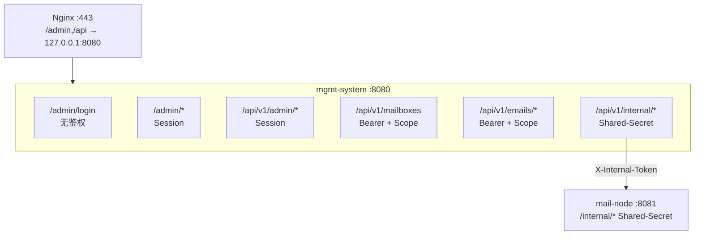

# T6 鉴权体系设计文档

> 状态：已实现 | 日期：2026-06-26 | 分支：feature/t6-auth

---

## 1. 背景与目标

### 1.1 问题

T6 实施前，mgmt-system 存在严重的鉴权缺口：

| 层级 | T6 前状态 | 风险 |
|------|----------|------|
| 管理后台页面 `/admin/*` | 零鉴权，任何人可访问 | 密码明文暴露、服务器可删、域名可操作 |
| 管理后台 API `/api/v1/admin/*` | Token 中间件显式绕过 | 同上，且可通过 API 批量操作 |
| 内部接口 `/api/v1/internal/*` (mgmt) | 零鉴权 | 任意调用者可控心跳/规则 |
| 内部接口 `/internal/*` (mail-node) | 零鉴权 | 任意调用者可创建/删除邮箱、查看所有邮件 |
| `RequireScope` 中间件 | 定义但未接线，有类型断言 panic bug | 外部 API Token 不校验 Scope |
| Shared-Secret | 硬编码 `internal-proxy-token`，mail-node 不校验 | 伪鉴权 |

### 1.2 目标

建立三层鉴权体系，覆盖全部 API 和页面：

1. **Admin Session** — 管理后台页面 + 管理 API（运维人员登录）
2. **Bearer Token + Scope** — 外部 API（出票中心、大模型系统）
3. **Shared-Secret** — 内部 API（mgmt ↔ mail-node 互信）

附带补齐：**账号密码编辑**功能（前端弹窗 → mgmt PUT API → mail-node users.conf 更新）。

---

## 2. 架构概览



---

## 3. Admin Session 设计

### 3.1 方案选择

- **存储**：内存 map（`SessionManager`），非 Redis/DB
- **理由**：2C2G 低配服务器，运维人员 ≤ 3 人，session 量极小；重启丢失可接受
- **Cookie**：`mgmt_session`，HttpOnly，**Path=/**，24h 过期
  - ⚠️ Path 必须为 `/`（不能是 `/admin`）：admin API 在 `/api/v1/admin/*`，cookie 需同时覆盖页面 `/admin/*` 和 API 路径。早期误设 `/admin` 导致后台所有 AJAX 401（部署期发现并修复）
- **凭证**：配置文件 `auth.admin_user` / `auth.admin_pass`

### 3.2 SessionManager

**文件**：`mgmt-system/internal/middleware/session.go`

- `CreateSession(username) → token`：crypto/rand 生成 32 字节 hex token
- `ValidateSession(token) → *Session`：查 map + 过期检查（过期自动清理）
- `DestroySession(token)`：登出时删除
- GC goroutine：每 30 分钟扫描清理过期 session

### 3.3 登录流程

```
GET /admin/login
  → 已有有效 session → 302 /admin/
  → 无 session → 渲染 login.html（含 next 参数）

POST /admin/login
  → constant-time compare username + password
  → 匹配 → CreateSession → SetCookie → 302 next|/admin/
  → 不匹配 → 重新渲染 login.html + 错误提示

GET|POST /admin/logout
  → DestroySession → ClearCookie → 302 /admin/login
```

### 3.4 AdminAuthRequired 中间件

- 页面请求（`/admin/*`）：无 session → 302 `/admin/login?next=<原url>`
- API 请求（`/api/v1/admin/*`）：无 session → 401 JSON

### 3.5 配置

```yaml
auth:
  admin_user: "admin"
  admin_pass: "change-me-admin-password"
```

---

## 4. Shared-Secret 内部鉴权

### 4.1 方案

- mgmt 与 mail-node 共享同一个 `shared_secret` 字符串
- 通过 `X-Internal-Token` header 传递
- 双方均用 `crypto/subtle.ConstantTimeCompare` 防时序攻击
- `shared_secret` 为空时 **fail-closed**（拒绝所有内部请求）

### 4.2 中间件

**mgmt 侧**：`mgmt-system/internal/middleware/auth.go` → `InternalAuthRequired(sharedSecret)`

**mail-node 侧**：`mail-node/internal/middleware/auth.go` → `InternalAuthRequired(sharedSecret)`

### 4.3 受保护路由

| 系统 | 路由组 | 中间件 |
|------|--------|--------|
| mgmt | `/api/v1/internal/*` | `InternalAuthRequired` |
| mail-node | `/internal/*` | `InternalAuthRequired` |

`/smtp/filter`（deprecated）不加鉴权，保留向后兼容。

### 4.4 出站调用

所有 mgmt → mail-node 的出站 HTTP 调用改为从配置读取 shared_secret：

- `ServerHandler.callNodeAddDomain` / `callNodeRemoveDomain`
- `MailboxCreator.createRemote`
- `MailboxHandler.callNodeUpdatePassword`（新增）
- `proxyToServer`（email 代理查询用）
- `EmailHandler` 代理请求

### 4.5 配置

两模块 config.yaml 均需配置相同值：

```yaml
shared_secret: "change-me-in-production-use-long-random-string"
```

---

## 5. Scope 方案

### 5.1 修复

`RequireScope` 中间件原类型断言使用匿名 struct，与 `c.Set("api_token", token)` 存入的 `*model.ApiToken` 不匹配，运行时会 panic。已修复为 `*model.ApiToken`。

### 5.2 路由映射

| 路由 | 方法 | 所需 Scope |
|------|------|-----------|
| `/api/v1/mailboxes` | POST | `mailbox:create` |
| `/api/v1/mailboxes/:order_id` | GET | `mailbox:read` |
| `/api/v1/mailboxes/:order_id/disable` | POST | `mailbox:create` |
| `/api/v1/orders/:order_id/emails` | GET | `email:read` |
| `/api/v1/emails/:message_id/body` | GET | `email:read` |

### 5.3 Token 配置示例

```yaml
auth:
  tokens:
    - name: "出票中心"
      token: "sk-ticket-xxx"
      scopes: ["mailbox:create", "mailbox:read"]
    - name: "大模型系统"
      token: "sk-llm-xxx"
      scopes: ["email:read"]
```

Scope 存储为逗号分隔字符串，检查逻辑：`scopes == "*"` 通配 或 `strings.Contains(scopes, scope)` 精确匹配。

---

## 6. 密码编辑设计

### 6.1 全链路

```
前端改密弹窗
  → PUT /api/v1/admin/mailboxes/:id {password}
  → mgmt handler 校验（≥6字符 + 邮箱存在）
  → 调 mail-node PUT /internal/mailboxes/:email/password
  → mail-node 原子更新 /etc/dovecot/users.conf（.tmp → rename）
  → doveadm reload
  → mgmt 更新本地 DB（password + sync_status=pending）
  → 前端 toast + 自动刷新
```

### 6.2 远端失败策略

**先远端、后本地**：远端 mail-node 更新失败时不写本地 DB，避免密码不同步。

### 6.3 mail-node 原子写入

```go
// 读 users.conf → 替换匹配行 → 写 .tmp → os.Rename → doveadm reload
```

使用 `os.Rename`（同文件系统原子操作）防止并发写导致 `users.conf` 损坏。

### 6.4 前端

- 「操作」列 + 「改密」按钮
- Modal 弹窗：显示邮箱地址（只读）+ 新密码输入框
- fetch() PUT JSON，成功后 toast + 自动刷新

---

## 7. 安全考量

| 考量 | 措施 |
|------|------|
| 密码比较防时序 | `crypto/subtle.ConstantTimeCompare` |
| Shared-Secret 防时序 | 同上 |
| Shared-Secret 空值 | fail-closed，拒绝所有内部请求 |
| Session 劫持 | HttpOnly cookie，24h 过期 |
| users.conf 并发写 | 原子 rename（.tmp → users.conf） |
| 密码不同步 | 远端失败不落本地 DB |
| 登出 | 服务端销毁 session + 清 cookie |

---

## 8. 部署变更清单

### 8.1 mgmt-system 配置新增

```yaml
auth:
  shared_secret: "<与 mail-node 一致的随机字符串>"
  admin_user: "admin"
  admin_pass: "<强密码>"
```

### 8.2 mail-node 配置新增

```yaml
shared_secret: "<与 mgmt 一致的随机字符串>"
```

### 8.3 部署步骤

> ⚠️ **模板与 binary 必须一起同步**：gin 启动时 `LoadHTMLGlob("template/admin/*.html")` 从磁盘读模板。T6 新增的 `login.html` 必须随 binary 一起 scp 到 `/opt/mgmt-system/template/admin/`，否则渲染报 `login.html is undefined`、页面空白。改配置/模板后需 `systemctl restart mgmt-system` 才生效。

1. 更新 `/opt/mgmt-system/config.yaml`（国际机）
2. 更新 `/etc/mail-node/config.yaml`（国际机）
3. 替换 `/opt/mgmt-system/mgmt-server` binary
4. 替换 `/usr/local/bin/mail-node` binary
5. `systemctl restart mgmt-system`
6. `systemctl restart mail-node`
7. 浏览器访问 `https://mail.asadad.bond/admin/` → 应跳转登录页
8. 用 admin_user/admin_pass 登录 → 验证各页面正常
9. 测试改密 → 验证 Roundcube 可用新密码登录

### 8.4 Nginx

无需改动。现有反代配置 `/admin` `/api` `/static` → `127.0.0.1:8080` 不变。

---

## 9. 版本记录

| 日期 | 变更 | 作者 |
|------|------|------|
| 2026-06-26 | 初始版本，三层鉴权 + 密码编辑 | Claude |
| 2026-06-26 | 部署期修复：cookie Path `/admin`→`/`（admin API 401）；补模板同步部署清单 | yezi |
