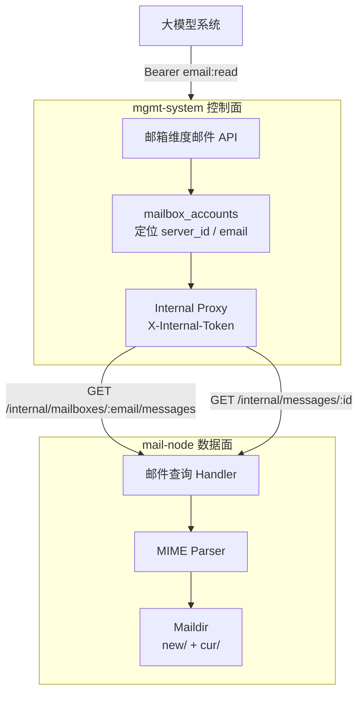

# T8 MIME 结构化预处理设计文档

> 状态：已评审，待实现 | 日期：2026-06-27 | 决策已确认：D-1 邮箱维度主线、D-2 mail-node 就地解析、D-3 mgmt 外部 API 收口、D-4 引入 enmime、D-5 附件仅返回元数据、D-6 `html_body` 可选返回、D-7 fallback message_id 使用相对路径 + size + mtime hash | 依据：`REQUIREMENTS_ANALYSIS.md` §2.1.4 / §2.2.4、`docs/design/phase3-mgmt-completion-plan.md` §4.3、`context.md` T8 续接顺序

---

## 1. 背景与目标

### 1.1 问题

T7 后，mgmt 与 mail-node 的控制链路已经具备可上线基础：账号创建、域名池、鉴权、心跳和主动健康检查均已闭环。当前阻塞大模型系统稳定消费邮件数据的主要缺口是：邮件查询 API 仍然依赖 mail-node 对 `.eml` 文件做简单字符串拆分，无法可靠处理真实邮件中的 MIME 结构、编码和附件。

| 能力 | 当前状态 | 风险 |
|------|----------|------|
| Header 解析 | 字符串按行查找 `Subject/From/Date/Message-ID` | 不支持折叠行、RFC 2047 编码，中文标题/发件人可能乱码 |
| Body 解析 | 按 `\r\n\r\n` 分离 headers/body | multipart 邮件返回的是 MIME 原文，不是干净正文 |
| 编码处理 | base64 / quoted-printable 仍是 TODO | 航司/OTA 常见中文邮件正文不可读 |
| 附件 | 仅用字符串判断 `Content-Disposition: attachment` | 无附件文件名、类型、大小等元数据 |
| 查询维度 | 历史存在订单查询入口 | T8 主线应按邮箱维度提供邮件数据，订单维度仅保留兼容 |

### 1.2 目标

1. 对 Maildir 中的原始 `.eml` 做 MIME 结构化预处理，返回稳定 JSON。
2. 对外主线 API 收敛为**按邮箱维度查询**，供大模型系统直接拉取某个邮箱收到的邮件。
3. 保留既有订单维度接口作为兼容入口，但不在 T8 扩展订单-邮箱 N:M 语义。
4. 返回 LLM 可直接消费的 `text_body`，并提供附件元数据，不把大附件内联到 JSON。
5. 保证 MIME 解析失败不影响其他邮件查询；单封异常邮件返回可观测错误或降级字段。
6. 管理后台增加可视化邮件查询页，便于运营/联调按邮箱查看邮件列表、结构化正文和附件元数据。

### 1.3 非目标

- 不实现订单-邮箱 N:M 映射，不新增订单映射页面。
- 不做 OSS 上传；附件先只返回元数据和后续可扩展的下载标识。
- 不做邮件全文索引、搜索、去重和语义分类。
- 不改 union 转发链路；union 邮箱仍只供人工兜底，不供 LLM 消费。
- 不把附件内容 base64 内联在邮件详情响应中。
- 不做复杂 Webmail；管理端只提供查询和结构化预览，不提供回复、转发、标记已读等邮箱客户端能力。

---

## 2. 设计决策

| 编号 | 决策 | 状态 | 说明 |
|------|------|------|------|
| D-1 | T8 主线按邮箱维度查询 | 已确认 | `GET /api/v1/mailboxes/:email/messages` 为主入口；订单查询只兼容保留 |
| D-2 | MIME 解析放在 mail-node | 提议 | mail-node 拥有 Maildir 本地文件，可直接解析原件和附件；mgmt 保持控制面/API 网关职责 |
| D-3 | mgmt 负责外部 API 合约和鉴权 | 提议 | 大模型系统只访问 mgmt，Bearer `email:read` scope 继续生效 |
| D-4 | 引入 `github.com/jhillyerd/enmime` | 已确认 | 用成熟库处理嵌套 multipart、RFC 2047、附件等真实邮件复杂场景，避免手写 MIME 解析风险 |
| D-5 | 附件不内联 JSON，T8 不做下载端点 | 已确认 | T8 响应仅返回 `filename/content_type/size/disposition/index` 等元数据；附件下载后续单独评审 |
| D-6 | `text/plain` 优先，`html_body` 可选返回 | 已确认 | 有 `text/plain` 用原文；只有 HTML 时提取可读文本作为 `text_body`；对外返回 `html_body` 但该字段可为空/缺省 |
| D-7 | 缺失 `Message-ID` 使用 fallback ID | 已确认 | 使用 `sha256(relative_maildir_path + file_size + mtime)`，不暴露绝对路径，避免为生成 ID 二次读取大文件 |
| D-8 | 管理端增加邮件查询可视界面 | 已确认 | 后台按邮箱维度查询邮件列表和详情，展示 `text_body/html_body/attachments`，用于运营和联调 |

> 注：`phase3-mgmt-completion-plan.md` §4.3 曾建议在 mgmt 侧处理 MIME。T8 详细设计建议调整为 mail-node 就地解析、mgmt 代理收口，原因是附件和 Maildir 原件天然在数据面，避免把大原文跨节点传输到 mgmt 后再解析。外部消费者看到的职责不变：仍通过 mgmt API 获取结构化数据。

---

## 3. 架构概览



---

## 4. API 合约

### 4.1 邮箱维度邮件列表（主线）

**外部 API**

```http
GET /api/v1/mailboxes/:email/messages?page=1&size=20
Authorization: Bearer <token with email:read>
```

**mgmt 内部转发**

```http
GET /internal/mailboxes/:email/messages?page=1&size=20
X-Internal-Token: <shared-secret>
```

**响应**

```json
{
  "code": 0,
  "message": "success",
  "request_id": "...",
  "data": {
    "email_address": "order-001@asadad.bond",
    "page": 1,
    "size": 20,
    "total": 2,
    "messages": [
      {
        "message_id": "<abc@example.com>",
        "subject": "航变通知",
        "from": "Airline <notice@example.com>",
        "date": "2026-06-27T10:20:30Z",
        "text_preview": "您的航班时间已变更...",
        "has_attachments": true,
        "attachments_count": 1,
        "mailbox": "order-001@asadad.bond",
        "received_at": "2026-06-27T10:20:31Z"
      }
    ]
  }
}
```

### 4.2 邮件详情（结构化正文）

**外部 API**

```http
GET /api/v1/emails/:message_id/body?mailbox=order-001@asadad.bond
Authorization: Bearer <token with email:read>
```

**mgmt 内部转发**

```http
GET /internal/messages/:message_id?mailbox=order-001@asadad.bond
X-Internal-Token: <shared-secret>
```

**响应**

```json
{
  "code": 0,
  "message": "success",
  "request_id": "...",
  "data": {
    "message_id": "<abc@example.com>",
    "mailbox": "order-001@asadad.bond",
    "subject": "航变通知",
    "from": "Airline <notice@example.com>",
    "to": ["order-001@asadad.bond"],
    "cc": [],
    "date": "2026-06-27T10:20:30Z",
    "text_body": "您的航班时间已变更...",
    "html_body": "<html>...</html>",
    "attachments": [
      {
        "index": 0,
        "filename": "itinerary.pdf",
        "content_type": "application/pdf",
        "size": 234567,
        "disposition": "attachment",
        "content_id": "",
        "inline": false
      }
    ],
    "parse_status": "ok",
    "parse_error": ""
  }
}
```

### 4.3 订单维度兼容入口

现有接口保留：

```http
GET /api/v1/orders/:order_id/emails?page=1&size=20
```

兼容语义：
- 仅按当前既有 1:1 / 历史 `order_id -> mailbox` 查到邮箱后，再复用邮箱维度查询。
- 不在 T8 新增 N:M 映射能力。
- 不承诺“订单严格隔离邮件内容”的新语义。
- 文档与接口说明必须标注：推荐新消费者使用邮箱维度 API。

### 4.4 管理端邮件查询页面

新增后台页面：

```http
GET /admin/emails?mailbox=order-001@asadad.bond
```

页面能力：
- 按邮箱地址查询邮件列表，默认 page=1、size=20。
- 列表展示标题、发件人、时间、正文预览、附件数量。
- 点击邮件后调用管理端 API 获取详情，展示 `text_body`、可选 `html_body` 和附件元数据。
- 不提供附件下载、回复、转发、删除等 Webmail 操作。
- 该页面走现有后台 Session 鉴权，不对外开放。

---

## 5. 数据面改动（mail-node）

### 5.1 新增 MIME parser 模块

建议新增：

```text
mail-node/internal/mimeparse/
├── parser.go
├── types.go
└── parser_test.go
```

核心类型：

```go
type ParsedMessage struct {
    MessageID        string       `json:"message_id"`
    Mailbox          string       `json:"mailbox"`
    Subject          string       `json:"subject"`
    From             string       `json:"from"`
    To               []string     `json:"to"`
    Cc               []string     `json:"cc"`
    Date             *time.Time   `json:"date"`
    TextBody         string       `json:"text_body"`
    HTMLBody         string       `json:"html_body,omitempty"`
    Attachments      []Attachment `json:"attachments"`
    ParseStatus      string       `json:"parse_status"`
    ParseError       string       `json:"parse_error,omitempty"`
}

type Attachment struct {
    Index       int    `json:"index"`
    Filename    string `json:"filename"`
    ContentType string `json:"content_type"`
    Size        int64  `json:"size"`
    Disposition string `json:"disposition"`
    ContentID   string `json:"content_id,omitempty"`
    Inline      bool   `json:"inline"`
}
```

### 5.2 解析策略

推荐使用 `enmime`：

```go
env, err := enmime.ReadEnvelope(file)
```

处理规则：
- `subject/from/to/cc` 使用库解析后的解码值。
- `date` 优先 `Date` header，失败则为空；后续可用 Maildir 文件 mtime 兜底。
- `text_body` 优先 `env.Text`。
- 无 `text/plain` 时，从 `env.HTML` 提取文本。可先用保守 HTML strip，后续再换更完整库。
- 附件来自 `env.Attachments`，inline 资源来自 `env.Inlines`，两者都转成元数据。
- 单封邮件解析失败时，返回 `parse_status=failed` 和有限 header 信息；不让整个列表接口失败。

### 5.3 列表解析与性能

列表接口不应读取和返回完整正文：
- 解析 header + MIME envelope，用于 `subject/from/date/attachments_count`。
- `text_preview` 截断到 300 字符以内。
- 单封邮件大小仍受 `max_email_size` 限制，默认 10MB。
- 分页应先对文件列表排序和切片，再解析当前页，避免邮箱邮件量大时每次全量解析。

排序建议：
- 默认按 Maildir 文件 mtime 倒序。
- 后续如需要，可补 `sort=date|received_at`。

### 5.4 Message-ID 兼容

当前 `message_id` 直接来自 header，可能包含尖括号、斜杠或 URL 需要编码的字符。T8 处理规则：
- 响应中保留原始 `Message-ID` 字符串。
- 路由入参使用 URL path escape 后的值；服务端比较前做 URL unescape。
- 若邮件缺失 `Message-ID`，生成稳定 fallback ID：基于相对 Maildir 路径或文件内容 hash。
- 不把绝对文件路径暴露给外部 API。

---

## 6. 控制面改动（mgmt-system）

### 6.1 新增邮箱维度外部路由

在 `EmailHandler.RegisterRoutes` 增加：

```go
r.GET("/mailboxes/:email/messages", h.GetMailboxMessages)
```

行为：
1. 校验邮箱格式。
2. 通过 `store.GetMailboxByEmail(email)` 定位账号和 server。
3. 检查账号状态，非 active 返回业务错误。
4. 代理到目标 mail-node `/internal/mailboxes/:email/messages`。
5. 统一注入 `request_id`，保持响应信封一致。

### 6.2 详情接口继续保留

`GET /api/v1/emails/:message_id/body?mailbox=...` 保留，内部响应结构升级为 T8 的结构化正文。

### 6.3 订单兼容入口调整

`GetOrderEmails` 不删除，但实现上改为复用邮箱维度查询路径：
- 先按既有逻辑 `order_id -> mailbox`。
- 调 `GetMailboxMessages` 共用代理/响应处理逻辑。
- 响应中可继续注入 `order_id`，但文档标明兼容用途。

### 6.4 鉴权

- 外部邮箱查询和详情接口继续要求 Bearer Token。
- 需要 `email:read` scope。
- mgmt 到 mail-node 继续使用 `X-Internal-Token`。
- 不新增公开匿名附件下载接口。

### 6.5 管理端可视界面

新增 `/admin/emails` 页面和对应后台 API：
- 页面路由：`GET /admin/emails`，使用现有后台 Session 鉴权。
- 页面初始数据：邮箱地址来自 query 参数；如未提供则展示查询表单和空状态。
- 后台 API：复用或新增 `/api/v1/admin/emails`、`/api/v1/admin/emails/:message_id/body`，同样走 Session 鉴权，内部复用 EmailHandler 的 mail-node 代理逻辑。
- 导航栏增加“邮件查询”入口。

---

## 7. 错误处理与降级

| 场景 | 处理 |
|------|------|
| 邮箱不存在 | mgmt 返回 404 / 业务错误码 |
| server 不存在或 down | mgmt 返回外部依赖错误，包含可读 message |
| mail-node 不可达 | mgmt 返回 `ErrCodeExternalFail`，记录 server_id/email/request_id |
| 单封 MIME 解析失败 | 列表跳过该封或返回 `parse_status=failed`；详情返回有限 header + `parse_error` |
| 邮件过大 | 返回 `parse_status=failed` 或 413 风格业务错误，不读取超限内容 |
| Message-ID 缺失 | 使用 fallback ID，详情查询可通过 fallback ID 命中 |
| 附件文件名为空 | 返回 `attachment-<index>` 作为展示名，保留 content_type/size |

日志要求：
- mgmt 代理失败日志包含 `request_id/server_id/email/message_id`。
- mail-node 解析失败日志包含 `mailbox/message_id/file_basename/error`，不得打印完整正文或附件内容。

---

## 8. 测试计划

### 8.1 单元测试（mail-node）

样本覆盖：
- plain text 邮件。
- multipart/alternative，优先 `text/plain`。
- 只有 HTML 的邮件，能生成 `text_body`。
- quoted-printable 中文正文。
- base64 中文正文。
- RFC 2047 编码 Subject / From / 附件名。
- PDF/JPG/PNG 附件元数据。
- inline image 与普通 attachment 区分。
- 缺失 Message-ID 的 fallback ID。
- header folding。

### 8.2 Handler 测试（mail-node）

- `GET /internal/mailboxes/:email/messages` 返回分页列表。
- `GET /internal/messages/:message_id?mailbox=...` 返回结构化详情。
- page/size 参数越界有默认值和上限。
- URL escape 后的 Message-ID 能正确匹配。

### 8.3 mgmt 测试

- `GET /api/v1/mailboxes/:email/messages` 能定位账号并代理到正确 server。
- 缺少/错误 Bearer Token 被拒绝。
- 缺少 `email:read` scope 返回 403。
- 订单兼容接口仍可用，但复用邮箱维度结果。

### 8.4 联调验证

- 给国际机真实邮箱发送一封带中文标题、中文正文、PDF 附件的邮件。
- 通过 mgmt 邮箱维度 API 拉取列表和详情。
- 验证 `text_body` 可读、附件元数据完整、union 转发链路不受影响。

---

## 9. 实施步骤

1. 新增 `docs/design/t8-mime-preprocessing-design.md` 并评审确认。
2. mail-node 引入 MIME parser 模块和样本单测。
3. 改造 mail-node 邮件列表/详情 handler，分页后解析当前页。
4. mgmt 增加邮箱维度邮件列表 API，并把订单兼容入口复用到邮箱维度逻辑。
5. mgmt 增加后台邮件查询页面，按邮箱查看列表和详情。
6. 补外部 API scope 接线确认，保持 `email:read` 保护。
7. 本地执行 `go test ./...`（mgmt-system、mail-node）。
8. 部署国际机并用真实邮件样本验证。
9. 更新 `REQUIREMENTS_ANALYSIS.md`、`context.md` 和部署记录。

---

### 10. 已确认评审结论

1. **MIME 解析库**：确认引入 `github.com/jhillyerd/enmime`，放在 mail-node 侧就地解析。
2. **附件下载端点**：T8 暂不纳入，只返回附件元数据；如后续大模型系统需要拉取附件原文，再单独设计下载或 OSS URL。
3. **`html_body` 字段**：对外返回但作为可选字段处理；不是所有邮件都有 HTML 正文，消费者应以 `text_body` 为主。
4. **缺失 `Message-ID` fallback**：按本文建议，使用 `sha256(relative_maildir_path + file_size + mtime)` 生成稳定 ID，不暴露绝对文件路径。
5. **管理端可视界面**：纳入 T8，新增后台邮件查询页，按邮箱查看结构化邮件列表与详情。
