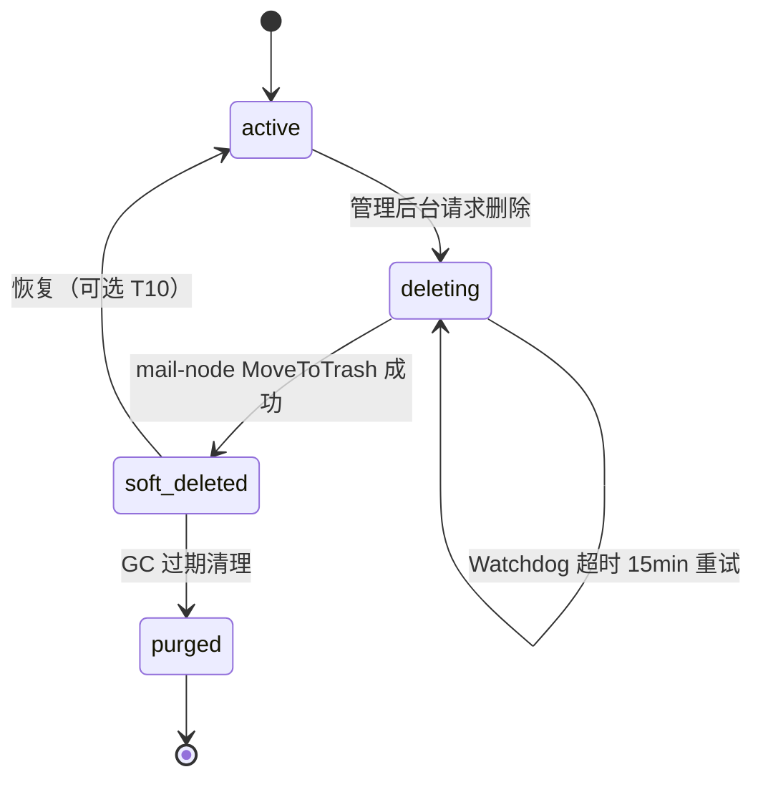

    # T9 邮箱生命周期对接 — 设计文档

> 版本: v1.0 | 日期: 2026-06-27 | 状态: 待评审
> 依赖: T6 鉴权 / T7 心跳 / T8 邮件查询

---

## 1. 背景与动机

mail-node 侧 `forward/lifecycle.go` 已完整实现安全删除协议：

- `MoveToTrash`: 摘除 Postfix/Dovecot → 等待排空(≤5min) → os.Rename 到 `.trash/`
- `StartGC`: 每小时扫描 `.trash/`，清理 >24h 的目录
- `PullDeletingTasks`: 启动时 `GET /api/v1/internal/sync/deleting?server_id=<nodeID>` 恢复未完成的删除任务

但 mgmt 侧存在三个缺口：

| 缺口 | 现象 | 影响 |
|------|------|------|
| `/api/v1/internal/sync/deleting` 未实现 | mail-node 重启 Pull 返回 404 | 重启丢排空任务，无法自愈 |
| `DisableMailbox` 只写 DB | 管理员停用账号后 mail-node 不知情 | 邮箱继续收信转发，生命周期形同虚设 |
| 无 GC 调度器 | `FindExpiredMailboxes`/`RecycleMailbox` 写了从不调用 | 过期邮箱不会自动回收 |

---

## 2. 目标

闭环 `ACTIVE → DELETING → SOFT_DELETED → PURGED` 四态流转：

1. 管理员删除/停用 → mgmt 下发 mail-node 执行安全销毁
2. mail-node 重启自动恢复中断的删除任务
3. 定时 GC 清理过期软删除邮箱

---

## 3. 状态机设计

### 3.1 四态流转图



### 3.2 状态行为

| 状态 | mgmt 行为 | mail-node 行为 |
|------|-----------|---------------|
| `active` | 正常分配、查询 | 正常收信、转发 |
| `deleting` | 记录 `delete_requested_at`，等待 mail-node 回调 | 摘除 Postfix/Dovecot → 等待排空 → os.Rename 到 `.trash/` |
| `soft_deleted` | 标记 `recycled_at`，不再分配、不可查询 | Maildir 已在 `.trash/`，GC goroutine 倒计时 |
| `purged` | 最终态，仅历史记录 | `.trash/` 目录已 `rm -rf` |

### 3.3 与旧三态的映射

| 旧状态 | 新状态 | 迁移 SQL |
|--------|--------|----------|
| `active` | `active` | 不变 |
| `disabled` | `deleting` | `UPDATE SET status='deleting' WHERE status='disabled'` |
| `recycled` | `soft_deleted` | `UPDATE SET status='soft_deleted' WHERE status='recycled'` |

---

## 4. DB Schema 变更

### 4.1 `mailbox_accounts` 表

```sql
-- 扩展 status enum（保留旧值兼容）
ALTER TABLE mailbox_accounts MODIFY COLUMN status
  ENUM('active','disabled','recycled','deleting','soft_deleted','purged')
  NOT NULL DEFAULT 'active';

-- 新增 Watchdog 超时判定列
ALTER TABLE mailbox_accounts ADD COLUMN delete_requested_at DATETIME NULL;

-- 数据迁移
UPDATE mailbox_accounts SET status = 'deleting' WHERE status = 'disabled';
UPDATE mailbox_accounts SET status = 'soft_deleted' WHERE status = 'recycled';
```

### 4.2 GORM Model 变更

`MailboxAccount`:
- `Status`: enum 扩展增加 `deleting`/`soft_deleted`/`purged`
- `DeleteRequestedAt *time.Time`: 新增字段，Watchdog 超时基准

---

## 5. API 设计

### 5.1 新增: `GET /api/v1/internal/sync/deleting`

| 项目 | 说明 |
|------|------|
| 用途 | mail-node 重启 PullDeletingTasks 调用 |
| 鉴权 | Shared-Secret（internal group） |
| 参数 | `?server_id=<nodeID>` |
| 响应 | `{"code":0, "data": [{"id":1, "email_address":"..."}]}` |

### 5.2 改造: `POST /api/v1/mailboxes/:order_id/disable`（外部 API）

改造原有 `DisableMailbox` 流程：

1. `store.RequestDeletion(id)` → status=`deleting` + `delete_requested_at=now`
2. 调 mail-node `DELETE /internal/mailboxes/{email}` (proxyToServer)
3. 成功 → `store.ConfirmDeletion(id)` → status=`soft_deleted` + `recycled_at=now`
4. 失败 → 保持 `deleting`，记录日志（Watchdog 会重试）

### 5.3 新增: `POST /api/v1/admin/mailboxes/:id/delete`（管理后台）

与 5.2 同一逻辑，但以 mailbox ID 而非 order_id 定位。

### 5.4 新增: `POST /api/v1/admin/mailboxes/:id/restore`（可选，T10 范围）

恢复 `soft_deleted` 邮箱回 `active`，需 mail-node 配合 os.Rename 回原 Maildir 路径。

---

## 6. GC Scheduler 设计

### 6.1 组件结构

新建 `mgmt-system/internal/lifecycle/scheduler.go`，参考 `healthcheck/scheduler.go` 模式。

```
lifecycle.Scheduler
├── Watchdog: 扫描 deleting 超时 >15min 的任务 → 重新下发 mail-node DELETE
└── Purge:    扫描 soft_deleted 且 recycled_at + retention_days 已过期 → mark purged
```

### 6.2 执行周期

- 启动立即执行一次
- 之后每 **5 分钟** 定时执行
- 由 `context.Context` 控制优雅退出（与 healthScheduler 并行）

### 6.3 main.go 集成

```go
lifecycleScheduler := lifecycle.NewScheduler(db, cfg.Auth.SharedSecret, 5*time.Minute)
go lifecycleScheduler.Start(ctx)
```

### 6.4 幂等性保障

- Watchdog 重发 DELETE：mail-node `MoveToTrash` 检查 Maildir 是否存在再操作（已实现）
- Purge 标记：`WHERE status='soft_deleted'` 条件保证只处理一次

---

## 7. Store 新增方法

| 方法 | 说明 |
|------|------|
| `ListDeletingByServer(serverID)` | 按 server_id 查 deleting 状态，供 sync/deleting |
| `RequestDeletion(id)` | 置 deleting + delete_requested_at |
| `ConfirmDeletion(id)` | 置 soft_deleted + recycled_at |
| `MarkPurged(id)` | 置 purged |
| `FindStuckDeleting(timeout)` | 查超时 deleting 任务（Watchdog） |
| `FindExpiredSoftDeleted()` | 查过期 soft_deleted（GC Purge） |

---

## 8. 管理后台适配

`mailboxes.html` 改动：

- 状态标签增加 `deleting` / `soft_deleted` / `purged` 三种样式
- 行操作区增加「删除」按钮（`POST /api/v1/admin/mailboxes/:id/delete`）
- `soft_deleted` 行显示「恢复」按钮（灰显，提示 T10 可用）

---

## 9. 不改的部分

| 组件 | 原因 |
|------|------|
| mail-node `forward/lifecycle.go` | MoveToTrash / StartGC / PullDeletingTasks 已完整实现 |
| mail-node `DELETE /internal/mailboxes/:email` | 已有，mgmt 直接调用 |
| mail-node `StartGC` goroutine | 已在运行，清理 .trash >24h |
| 外部 `POST /api/v1/mailboxes/:order_id/disable` | 保持兼容，内部走同一套下发逻辑 |

---

## 10. 验证方案

| 步骤 | 操作 | 预期 |
|------|------|------|
| 1 | 启动 mgmt，检查启动日志 | `[schema] lifecycle migration applied successfully` |
| 2 | `curl /api/v1/internal/sync/deleting?server_id=1` | 200 + 空数组或 deleting 列表 |
| 3 | 管理后台点击删除某邮箱 | mgmt 日志: `proxyToServer DELETE` → mail-node 日志: `[lifecycle] moved to trash` → `.trash/` 目录出现 |
| 4 | 杀 mail-node 后重启 | 日志: `[lifecycle] pull deleting tasks from...` → 恢复执行删除 |
| 5 | 手动改 `recycled_at` 为 30 天前 | 等 GC tick → 状态变为 `purged` |

---

## 11. 版本记录

| 日期 | 变更 |
|------|------|
| 2026-06-27 | 初版：四态状态机、API 设计、GC Scheduler、Store 方法 |
