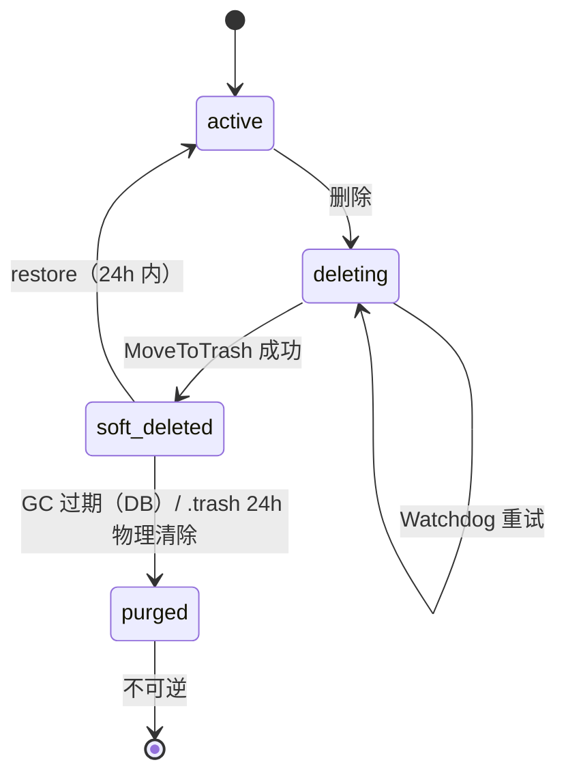

# T9 邮箱恢复（restore）设计文档

> 版本: v0.2（已评审，RS-1~RS-5 确认） | 日期: 2026-06-30
> 依据：`context.md:426/329/182/298/325`（restore 为 T9 唯一缺口、当前最优先实施①）、`docs/design/t9-lifecycle-design.md §5.4`、本次代码核查
> 范畴：补全 `t9-lifecycle-design.md` 四态状态机中标"可选"的 `soft_deleted → active` 回迁路径。T9 删除闭环（active→deleting→soft_deleted→purged）已完整交付（commit `6f538c5`），本设计只补其逆操作。

---

## 1. 背景与动机

四态删除链路已双侧接通并部署：

- mgmt：`executeDeletion`（`handler/mailbox.go:252`）`RequestDeletion` → 下发 mail-node DELETE → `ConfirmDeletion`
- mail-node：`forward.Lifecycle.MoveToTrash`（`forward/lifecycle.go:45`）摘除 Postfix/Dovecot → 排空 → `os.Rename` 到 `.trash/`
- GC：mail-node `.trash` 24h 物理清除（`forward/lifecycle.go:106`）；mgmt `FindExpiredSoftDeleted`（`store.go:568`）按 retention 标 purged

**唯一缺口**：`soft_deleted → active` 完全未实现。`t9-lifecycle-design.md:120` 将其标为"可选，T10 范围"，但生命周期四态若只能单向（删得掉、找不回），运维误删后 24h 内无法自救——故补齐为正式能力。

### 1.1 运维价值

管理员误删邮箱后，在 `.trash` 物理清除（24h）前可一键恢复：邮件数据原样回迁 + Dovecot/Postfix 记录重建 + 原密码恢复，邮箱立即可用。`purged` 之后不可逆。

---

## 2. 目标 / 非目标

**目标**：
1. mgmt 新增 `POST /api/v1/admin/mailboxes/:id/restore`，仅对 `soft_deleted` 状态生效，恢复为 `active`。
2. mail-node 新增 `.trash` 回迁能力，把误删 Maildir 搬回原路径并重建 Dovecot/Postfix 配置。
3. restore 仅在 24h 物理窗口内有效；`.trash` 已被 GC 时返回明确的"不可恢复"，状态不变。

**非目标**：
- 不实现 `purged` 的恢复（物理目录已 `rm -rf`，不可逆）。
- 不改删除链路、不改 GC 周期、不改鉴权。
- 不解决 mgmt 30天 retention 与 mail-node 24h GC 的对齐（见 §6 决策 RS-1，本期用"探测存在性"规避，不动 retention）。

---

## 3. 现状约束（代码核查结论，决定方案形态）

| 约束 | 代码证据 | 对 restore 的影响 |
|------|----------|-------------------|
| **A. `.trash` 目录名带时间戳，域隔离** | `forward/lifecycle.go:80`：`trashName = "<domain>__<localpart>-<unix_ts>"`，原路径是 `<base>/<domain>/<localpart>` | 回迁时不知道时间戳后缀，须扫 `.trash/` 找 `<domain>__<localpart>-*` 并取 ts 最大（最新）；`localpart` 可能含 `-`，按"最后一个 `-` 后为 ts"解析，复用 `parseTrashTimestamp` |
| **B. 删除时配置被摘除** | `forward/lifecycle.go:63` `RemoveFromConfigs` 删了 Postfix `vmailbox` + Dovecot `users.conf` 行 | restore 不是单纯 `os.Rename`，还须重建这两行（Dovecot 密码行从 mgmt 下发）+ chown + postmap/reload |
| **C. 原Ⓠ码可取** | `model.MailboxAccount.Password`（`model.go:42`）保留明文密码 | mgmt 可在 restore 请求里把原密码下发 mail-node，实现"原样恢复"，无需重设 |
| **D. 24h 物理窗口 vs 30天 retention 不对齐** | mail-node GC 24h（`forward/lifecycle.go:33`）；mgmt 标 purged 用 `recycled_at + retention_days`（默认 30，`store.go:572`） | 删除 24h~30天之间：DB 仍 `soft_deleted` 但 `.trash` 已物理删除 → restore 会失败。本期不强行对齐，靠 mail-node 探测 `.trash` 存在性返回明确错误（RS-1） |

---

## 4. 状态机（补 restore 边）



**迁移合法性**：
- `soft_deleted → active` ✅（本设计新增）
- `deleting → active` ❌（删除进行中，让 Watchdog 先收尾或超时；如确需撤销，未来可扩展"取消删除"，本期不做）
- `purged → active` ❌（不可逆）
- `active → active` ❌（无意义，拒绝）

---

## 5. 方案设计

### 5.1 mail-node：`RestoreFromTrash(email, password)`

新增 `forward.Lifecycle.RestoreFromTrash`（`forward/lifecycle.go`，`MoveToTrash` 旁），是 `MoveToTrash` 的逆操作：

```
① 扫 .trash/ 找 <domain>__<localpart>-<unix_ts> 目录，取 ts 最大者（最新一次删除）
   - 无匹配 → 返回 "not in trash"（调用方据此时序判定，见 RS-1）
② os.Rename(.trash/<domain>__<localpart>-<ts>, <base>/<domain>/<localpart>)
   - 目标已存在（极少数：删除后又新建同名）→ 返回冲突错误，不覆盖
③ 重建配置（复用 mailbox.Manager 的写配置能力，幂等——Dovecot/Postfix 行异常残留时不重复追加）：
   - Dovecot users.conf 追加 "<email>:{PLAIN}<password>::::::"
   - Postfix vmailbox 追加 "<email> <domain>/<localpart>/"
   - postmap + postfix reload + doveadm reload
④ chown 回迁目录树为 vmailUID:vmailGID（与 Create 一致）
⑤ 删除成功后返回新 Maildir 路径
```

> 复用点：写配置/chown 的逻辑与 `mailbox.Manager.Create`（`mailbox/manager.go:83`）高度重合，抽 `Manager.ReinstallConfigs(email, password)` 或在 Lifecycle 调 mgr 的细粒度方法，避免重复实现。

### 5.2 mail-node：HTTP 接口

新增 `NodeHandler.RestoreMailbox`（`handler/node.go`，`DeleteMailbox:73` 旁）：

| 项 | 值 |
|----|----|
| 路由 | `POST /internal/mailboxes/:email/restore`（`node.go:381` 旁注册） |
| Body | `{"password": "..."}`（mgmt 下发原密码） |
| 成功 | 200 `{code:0, message:"restored", data:{maildir_path}}` |
| `.trash` 无此邮箱 | 409 `{code:..., message:"not in trash or already purged"}`（mgmt 据此判定窗口已过） |
| 鉴权 | `X-Internal-Token`（与 DELETE 一致） |

### 5.3 mgmt：store 方法

新增 `RestoreMailbox(id)`（`store.go:557` `MarkPurged` 旁），对称于 `ConfirmDeletion`：

```go
// RestoreMailbox 将 soft_deleted 邮箱恢复为 active，清空删除相关时间戳。
func (s *Store) RestoreMailbox(mailboxID uint64) error {
    return s.db.Model(&model.MailboxAccount{}).
        Where("id = ? AND status = ?", mailboxID, "soft_deleted").
        Updates(map[string]interface{}{
            "status":              "active",
            "recycled_at":         nil,
            "delete_requested_at": nil,
            "sync_status":         "synced",   // 远端已重建配置
        }).Error
}
```

> `WHERE status='soft_deleted'` 保证只对合法状态生效；非 soft_deleted 时 `RowsAffected=0`，调用方据此返回状态错误。

### 5.4 mgmt：handler

新增 `MailboxHandler.RestoreMailbox`（`mailbox.go:246` `RequestDelete` 旁），与 `executeDeletion` 镜像：

```
① GetMailboxByID(id)
② 校验 status == soft_deleted（否则 2xxx 业务错误）
③ GetServer(mb.ServerID)
④ callNodeRestoreMailbox(apiHost, email, mb.Password)
   - 409 (not in trash) → 返回明确"恢复窗口已过/已被物理清除"，状态不变
   - 其他失败 → 不改状态，返回错误（可重试）
⑤ 成功 → RestoreMailbox(id) → active
```

路由：`mailbox.go:453` `RegisterAdminRoutes` 加 `r.POST("/mailboxes/:id/restore", h.RestoreMailbox)`。

### 5.5 前端

`mailboxes.html`：`soft_deleted` 行原"恢复"按钮当前灰显（t9 设计 §8 注"T10 可用"）。本期启用：绑定 `POST /api/v1/admin/mailboxes/:id/restore`，成功后该行状态刷新为 active；`purged` 行不显示恢复按钮（不可逆）。

---

## 6. 设计决策

| 编号 | 决策 | 状态 | 说明 |
|------|------|------|------|
| RS-1 | 不强行对齐 24h/30天，靠 mail-node 探测 `.trash` 存在性 | 提议 | 约束 D 的折中：restore 时若 `.trash` 已 GC，mail-node 返回 409，mgmt 提示"已过恢复窗口"。避免改动 retention 影响现有 GC/purge 语义。对齐 retention → 24h 作为**后续**独立优化项 |
| RS-2 | 密码原样恢复（mgmt 下发 `mb.Password`） | 提议 | 约束 C：`MailboxAccount.Password` 已存，restore 不强制重设。密码为空（历史账号无密码）时降级为生成临时密码并返回前端 |
| RS-3 | 同名多次删除取最新 `.trash/<localpart>-<ts>` | 提议 | 约束 A：ts 最大者即最近一次删除，符合直觉。其余旧 trash 目录由 GC 自然清除 |
| RS-4 | restore 仅接 `soft_deleted`，不接 `deleting` | 提议 | deleting 是进行中态，由 Watchdog 收尾；撤销删除属另一能力，本期不做 |
| RS-5 | 目标 Maildir 已存在则拒绝（不覆盖） | 提议 | 删除后又新建同名邮箱的极少数场景，restore 不可静默覆盖现有数据，返回冲突错误 |

> 备选（已否决）：(a) 把 mgmt retention 收紧到 24h 让 DB 与物理一致——否决，影响面大（GC/purge 语义、保留期业务含义），留作 RS-1 后续。(b) restore 时强制重设密码——否决，rs-2 原样恢复更顺。

---

## 7. 数据 / 接口变更清单

| 类型 | 位置 | 变更 |
|------|------|------|
| mail-node lifecycle | `forward/lifecycle.go` | 新增 `RestoreFromTrash(email, password)`（扫 .trash 取最新 → rename 回 → 重建配置 → chown） |
| mail-node manager | `mailbox/manager.go` | 新增 `ReinstallConfigs(email, password)`（写 Dovecot+Postfix 行，复用 Create 的 chown 逻辑） |
| mail-node handler | `handler/node.go` | 新增 `RestoreMailbox` + 路由 `POST /internal/mailboxes/:email/restore` |
| mgmt store | `store.go:557` 旁 | 新增 `RestoreMailbox(id)` |
| mgmt handler | `mailbox.go:246` 旁 | 新增 `RestoreMailbox`（校验 soft_deleted → 下发 → RestoreMailbox） |
| mgmt 路由 | `mailbox.go:453` | `r.POST("/mailboxes/:id/restore", h.RestoreMailbox)` |
| 前端 | `mailboxes.html` | 启用 soft_deleted 行恢复按钮，绑定 restore API |

**无 DB schema 变更**：复用现有 `status` enum 与 `recycled_at/delete_requested_at` 字段；`RestoreMailbox` 仅 UPDATE 现有行。

---

## 8. 验证清单

- [ ] `mail-node go test ./...`：新增 `RestoreFromTrash` 用例（建邮箱→MoveToTrash→Restore→断言 Maildir 回原位 + Dovecot/Postfix 行重建 + 密码一致；`.trash` 无匹配返回明确错误）
- [ ] `mgmt-system go test ./...`：新增 `RestoreMailbox` store 用例（soft_deleted→active + 时间戳清空；非 soft_deleted `RowsAffected=0`）
- [ ] mgmt 交叉编译 linux binary；国际机部署备份 mgmt+mail-node binary
- [ ] 后台删除一个测试邮箱 → 状态 soft_deleted + `.trash` 出现目录
- [ ] 点恢复 → 状态回 active + `.trash` 目录消失（已回迁）+ Dovecot 可用原密码登录 + Postfix 能收信
- [ ] 手动让 `.trash` 过期（改目录名 ts 为 25h 前）触发 GC 后再 restore → 返回"恢复窗口已过"，状态保持
- [ ] 对 `deleting` / `purged` / `active` 调 restore → 拒绝（状态不变）

---

## 9. 风险与回滚

| 风险 | 评估 | 缓解 |
|------|------|------|
| restore 后邮箱收不到信（配置未重建） | 中 | 验证清单明确验证 Postfix vmailbox + Dovecot users.conf 行存在；复用 Create 成熟逻辑 |
| 回迁目录与新建同名邮箱冲突 | 低 | RS-5 拒绝覆盖，返回冲突错误 |
| `.trash` 24h~30天间 restore 误报可用 | 中 | RS-1：mail-node 探测 `.trash` 实际存在性，409 明确返回；mgmt 前端提示窗口已过 |
| 密码为空的历史账号 | 低 | RS-2 降级生成临时密码并返回 |
| 重建配置失败导致半恢复状态 | 中 | mail-node 先 rename 回再写配置；写配置失败时回滚 rename 或明确报错让管理员介入（不静默） |

**回滚**：还原 mgmt + mail-node binary。无 schema 变更，无 DB 回滚。已恢复的邮箱本身就是 active，无需特殊处理。

---

## 10. 版本记录

| 日期 | 变更 |
|------|------|
| 2026-06-30 | v0.1 初版：双侧 restore 链路、24h 窗口探测（RS-1）、原样恢复密码（RS-2）、迁移合法性、验证清单 |
| 2026-06-30 | v0.2 评审修订：trash 格式修正为 `domain__localpart-ts`（域隔离）、移除 legacy fallback（P1 修复）、ReinstallConfigs 全幂等（P2 修复）、RS-1~RS-5 决策确认 |
