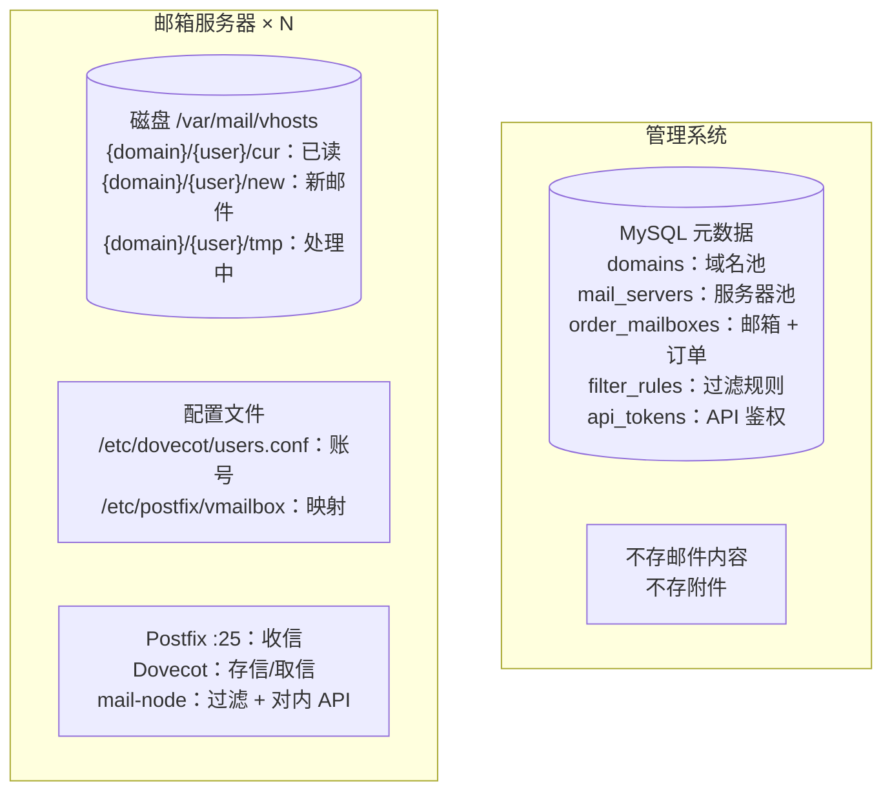
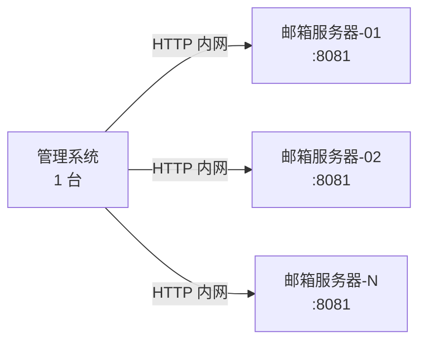
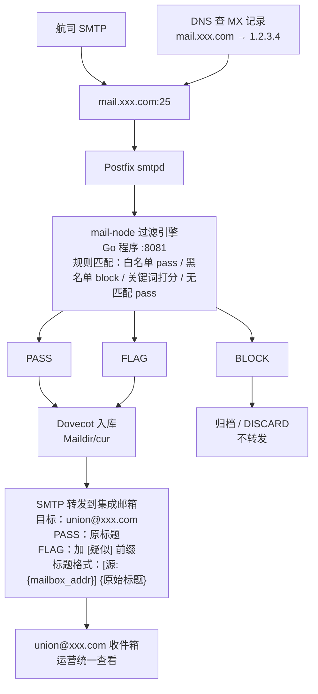
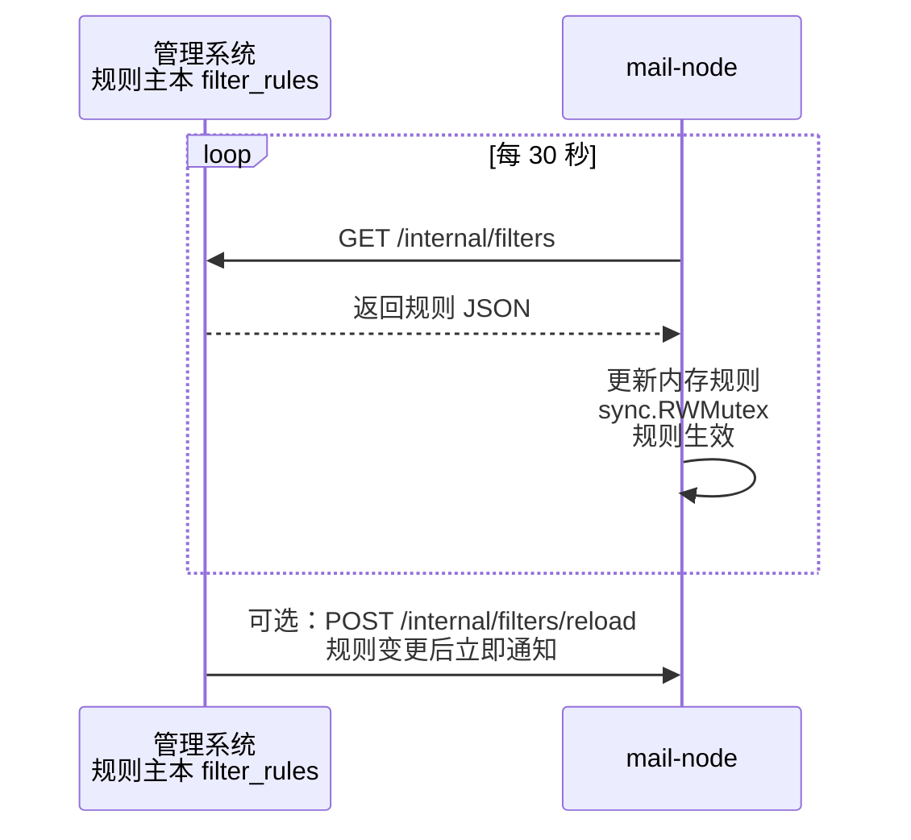
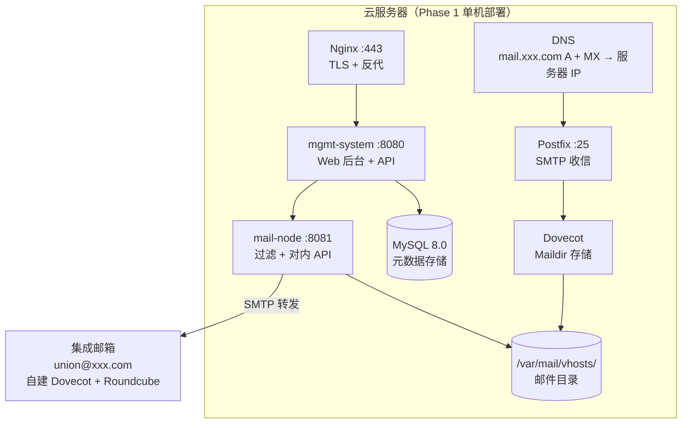

# 技术实现方案

> 版本: v1.1 | 日期: 2026-06-17 | 状态: Phase 1A 已实现，本稿为历史设计参考。当前架构见 `docs/architecture-overview.md`

---

## 1. 概述

本文档描述国际订单邮箱系统的跨服务器技术实现：管理系统如何远程调用邮箱服务器、如何在目标服务器上创建邮箱账号、以及邮件的收发链路。

---

## 2. 数据分布



---

## 3. 跨服务器通信

### 3.1 通信模型



### 3.2 短信协议

- **协议**: HTTP/1.1
- **格式**: JSON
- **内容格式**: `Content-Type: application/json`
- **鉴权**: 内部固定 Token（`X-Internal-Token` 请求头），不对外暴露
- **超时**: 10 秒 (创建账号、查询邮件)；3 秒 (健康检查)

### 3.3 管理系统 → 邮箱服务器 API

| 方法 | 路径 | 说明 | 权重 |
|------|------|------|------|
| POST | `/internal/mailboxes` | 创建邮箱账号 | 核心 |
| DELETE | `/internal/mailboxes/:email` | 删除/回收邮箱 | |
| GET | `/internal/mailboxes/:email/messages` | 获取邮件列表 | |
| GET | `/internal/messages/:id` | 获取单封邮件完整内容 | |
| GET | `/internal/health` | 健康检查 + 负载信息 | 核心 |
| GET | `/internal/filters` | 拉取最新过滤规则 | |
| POST | `/internal/filters/reload` | 强制重载规则 | |

### 3.4 内部 API 请求/响应格式

#### POST /internal/mailboxes — 创建邮箱

```
Request:
{
    "email_address": "airline-cz-001@mail.xxx.com",
    "password": "aB3xKp9m"
}

Response 201:
{
    "code": 0,
    "message": "created",
    "data": {
        "email_address": "airline-cz-001@mail.xxx.com",
        "domain": "mail.xxx.com",
        "local_part": "airline-cz-001",
        "maildir_path": "/var/mail/vhosts/mail.xxx.com/airline-cz-001"
    }
}
```

#### GET /internal/health — 健康检查

```
Response 200:
{
    "code": 0,
    "data": {
        "status": "ok",
        "load": 342,           // 当前邮箱数
        "capacity": 5000,
        "disk_usage": "23%",
        "uptime": 86400,
        "node_id": 1,
        "node_name": "mail-node-01"
    }
}
```

---

## 4. 邮箱账号创建流程（端到端）

### 4.1 单账号创建

```mermaid
flowchart TB
    form["运营在 Web 后台提交<br/>邮箱前缀：airline-cz-001<br/>域名：mail.xxx.com<br/>密码：留空自动生成<br/>目标服务器：auto"]
    validate["Step 1：管理系统校验<br/>检查前缀 + 域名是否已存在<br/>检查域名是否 active<br/>auto 时选择健康且负载最小服务器"]
    call["Step 2：调用邮箱服务器<br/>POST http://{server.api_host}/internal/mailboxes<br/>X-Internal-Token<br/>Body: email_address + password"]
    remote["Step 3：邮箱服务器本地操作<br/>创建 Maildir<br/>chown vmail:vmail<br/>追加 Dovecot users.conf<br/>追加 Postfix vmailbox<br/>postmap + postfix reload"]
    db["Step 4：管理系统写本地记录<br/>INSERT order_mailboxes<br/>UPDATE mail_servers current_load + 1"]
    resp["Step 5：返回结果<br/>{code: 0, data: email_address, created_at}"]
    fail["失败：返回错误<br/>不写入本地 DB"]

    form --> validate --> call
    call -->|"成功"| remote --> db --> resp
    call -->|"失败"| fail
```

### 4.2 批量创建

```
运营上传 CSV 文件:
  airline-cz-001,
  airline-cz-002,
  airline-cz-003,mypass123

管理系统逐行处理:
  for each row in CSV:
    ├ password = row.password || autoGenerate()
    ├ 验重: 查询 order_mailboxes 是否已有
    ├ 分配: 按当前负载选服务器
    ├ 下发: HTTP POST → 邮箱服务器
    └ 记录: INSERT 到 order_mailboxes

  → 返回汇总:
    {total: 3, success: 3, failed: 0,
     results: [{prefix, email, server, status}, ...]}
```

### 4.3 密码处理

- 创建时不传密码 → 自动生成 16 位随机密码
- 密码明文写入 Dovecot `users.conf`（Phase 1 不加密，后续可改 `{SHA512-CRYPT}`）
- 密码仅存储于邮箱服务器本地，管理系统的 MySQL 不存密码

---

## 5. 邮件收发链路

### 5.1 收信（航司 → 邮箱服务器）



### 5.2 Postfix content_filter 配置

```conf
# /etc/postfix/master.cf
# 定义过滤服务
filter    unix  -       n       n       -       10      pipe
  flags=Rq user=filter argv=/usr/local/bin/filter-postfix
  http://127.0.0.1:8081/smtp/filter

# /etc/postfix/main.cf  
content_filter = filter:127.0.0.1:10025
```

> `filter-postfix` 是一个轻量 shell 脚本（或 Go 编译的小工具），把 Postfix 传来的原始邮件内容 POST 到 mail-node 的 `/smtp/filter` 端点，等到过滤结果后决定放行/拒绝。

### 5.3 发信（可选，Phase 1 不做）

Phase 1 仅收信 + 转发。如需邮件服务器主动发信（如自动回复），在 Phase 2 扩展。

---

## 6. 过滤规则热更新



或者规则变更后，管理系统主动 POST `/internal/filters/reload` 通知立即更新。

---

## 7. 管理系统 → 邮箱服务器故障处理

| 故障场景 | 处理策略 |
|----------|---------|
| 邮箱服务器不可达 (超时 10s) | 返回错误，不写入本地 DB；下次创建时自动选择其他健康服务器 |
| 邮箱服务器创建成功但本地 DB 写入失败 | 回滚：调用邮箱服务器 DELETE 删除刚创建的账号 |
| 邮箱服务器返回错误（前缀已存在等） | 透传错误给前端，不做本地记录 |
| 邮箱服务器心跳超时 N 次 | 管理系统标记该服务器状态为 `degraded`，暂停分配新邮箱 |
| 邮箱服务器宕机 | 状态自动变为 `down`，触发告警；已有邮件不受影响（发件方 SMTP 会重试） |

---

## 8. Phase 1 部署形态



Phase 2 扩容时只需新增云服务器，装上 Postfix + Dovecot + mail-node，在后台注册即可纳入管理。

---

## 9. 安全性

| 关注点 | 实现 |
|--------|------|
| 管理系统 → 邮箱服务器通信 | 内网 IP + `X-Internal-Token` 固定密钥（非公网暴露） |
| API 对外暴露 | `Authorization: Bearer <token>` + Token 存储在 DB 可轮换 |
| SMTP 开放中继防护 | `mynetworks = 127.0.0.1, 10.0.0.0/8`，其他全部 reject |
| SMTP TLS | Phase 2 启用（Let's Encrypt 证书） |
| 邮箱密码存储 | Phase 1 明文存 Dovecot users.conf（Phase 2 改 SHA512-CRYPT） |

---

## 10. 版本记录

| 日期 | 变更 | 作者 |
|------|------|------|
| 2026-06-17 | 初版 | Claude |
