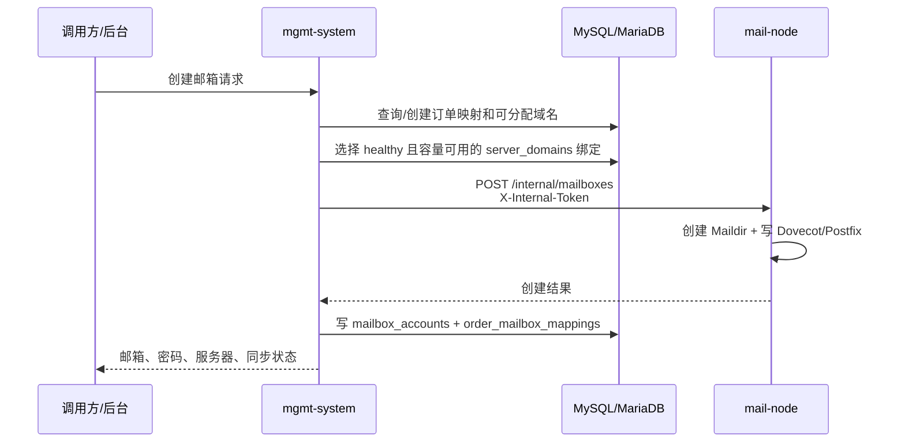
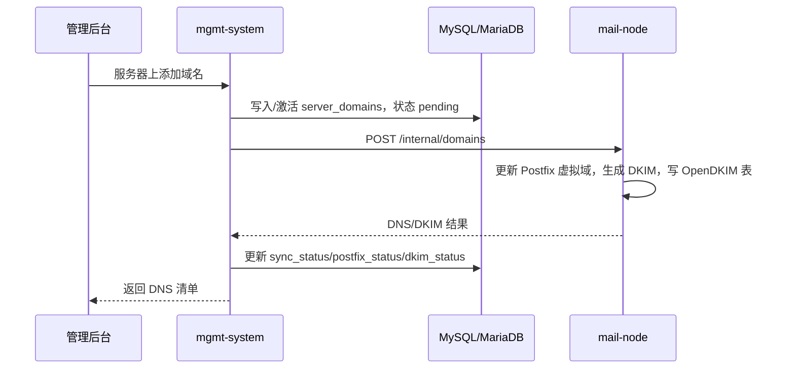
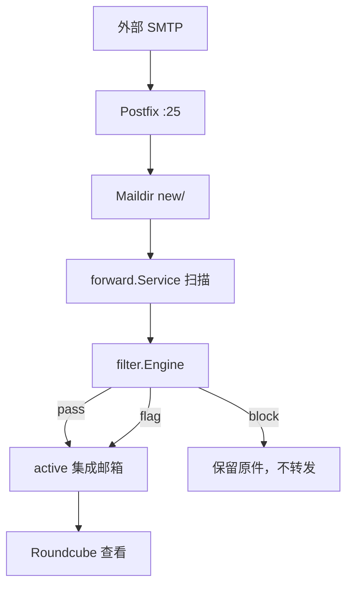
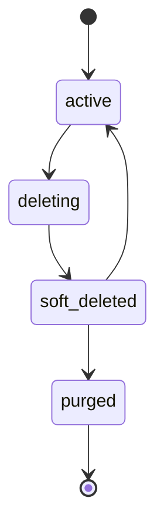

# 技术实现方案

> 版本: v2.0 | 日期: 2026-07-08 | 状态: 与当前代码实现对齐。更完整的架构事实源见 `docs/architecture-overview.md`，外部接口事实源见 `docs/api/external-api.md`。

---

## 1. 实现边界

MailHub 当前由两个 Go 服务组成：

| 服务 | 边界 | 主要职责 |
|------|------|----------|
| `mgmt-system` | 控制面 | 后台、外部 API、内部编排、数据库、健康检查、生命周期调度、动态配置 |
| `mail-node` | 数据面 | Postfix/Dovecot/OpenDKIM 落地、Maildir、过滤转发、MIME 解析、附件下载、软删除恢复 |

控制面不直接投递 SMTP，也不直接读本机 Maildir。所有邮件数据读取都由控制面通过内部 API 代理到对应 mail-node。

---

## 2. 数据存储

### 2.1 控制面数据库

`mgmt-system` 使用 MySQL / MariaDB + GORM。启动时执行 AutoMigrate，并做以下迁移和种子动作：

- 补齐 `system_configs` 默认配置。
- 补齐 `integrated_mailboxes` 默认记录，并同步 active 集成邮箱到 `forward.target_address`。
- 扩展 `mailbox_accounts.status` 生命周期枚举。
- 将历史 `order_mailboxes` 迁移到 `mailbox_accounts` + `order_mailbox_mappings`。

核心表：

```text
domains
mail_servers
server_domains
mailbox_accounts
order_mailbox_mappings
order_mailboxes              # 历史兼容
filter_rules
api_tokens
system_configs
integrated_mailboxes
admin_users
system_state
server_config_overrides
server_config_snapshots
```

完整表结构、字段语义、关系和生产中文 COMMENT 见 [控制面数据库字典](../database-schema.md)。

### 2.2 数据面文件

`mail-node` 管理以下本机文件或目录：

```text
<maildir_base>/<domain>/<localpart>/{new,cur,tmp}
<maildir_base>/.trash/<domain>__<localpart>-<unix_ts>
/etc/dovecot/users.conf
/etc/postfix/vmailbox
/etc/postfix/virtual_domains
/etc/opendkim/SigningTable
/etc/opendkim/KeyTable
<dkim_key_dir>/<domain>/
```

`mail-node` 对 Maildir 的删除使用同文件系统 `os.Rename`，先移入 `.trash`，再由 GC 物理清理。

---

## 3. 通信协议

### 3.1 外部 API

- 基础路径：`/api/v1`
- 鉴权：`Authorization: Bearer <token>`
- Scope：`mailbox:create`、`mailbox:read`、`email:read`、`*`
- JSON 响应：统一 `{code,message,data,request_id}` 信封
- 例外：附件下载成功响应直接返回二进制流

### 3.2 管理后台

- 页面入口：`/admin/*`
- 静态资源：`/static/admin-app/*`
- 后台 API：`/api/v1/admin/*`
- 鉴权：`mgmt_session` Session Cookie

### 3.3 服务间 API

双向服务间调用都使用 `X-Internal-Token`：

```text
mgmt-system -> mail-node: http://<api_host>/internal/*
mail-node -> mgmt-system: <management.api_url>/api/v1/internal/*
```

所有内部接口缺少或不匹配 `X-Internal-Token` 时直接拒绝。

---

## 4. 邮箱创建流程


```mermaid
sequenceDiagram
    participant C as 调用方/后台
    participant M as mgmt-system
    participant DB as MySQL/MariaDB
    participant N as mail-node

    C->>M: 创建邮箱请求
    M->>DB: 查询/创建订单映射和可分配域名
    M->>DB: 选择 healthy 且容量可用的 server_domains 绑定
    M->>N: POST /internal/mailboxes<br/>X-Internal-Token
    N->>N: 创建 Maildir + 写 Dovecot/Postfix
    N-->>M: 创建结果
    M->>DB: 写 mailbox_accounts + order_mailbox_mappings
    M-->>C: 邮箱、密码、服务器、同步状态
```

关键规则：

- 外部创建接口按 `order_id` 幂等复用已有邮箱。
- `domain_id` 可由调用方指定；未指定时由分配器选择可投递域名。
- 分配器只选择 `server_domains.status=active`、`postfix_status=synced`、服务器 `status=healthy` 且容量未满的绑定。
- 创建成功后密码保存在控制面账号表，并写入数据面 Dovecot 配置。

---

## 5. 域名同步流程


```mermaid
sequenceDiagram
    participant UI as 管理后台
    participant M as mgmt-system
    participant DB as MySQL/MariaDB
    participant N as mail-node

    UI->>M: 服务器上添加域名
    M->>DB: 写入/激活 server_domains，状态 pending
    M->>N: POST /internal/domains
    N->>N: 更新 Postfix 虚拟域，生成 DKIM，写 OpenDKIM 表
    N-->>M: DNS/DKIM 结果
    M->>DB: 更新 sync_status/postfix_status/dkim_status
    M-->>UI: 返回 DNS 清单
```

`server_domains` 记录的是添加/移除域名时的远端同步快照，不是实时探测结果。节点可用性由健康检查维护。

---

## 6. 邮件接收与转发

当前主链路是 Maildir 异步扫描，不使用 Postfix `content_filter` 作为主路径。


```mermaid
flowchart TB
    smtp["外部 SMTP"] --> postfix["Postfix :25"]
    postfix --> maildir["Maildir new/"]
    maildir --> scanner["forward.Service 扫描"]
    scanner --> filter["filter.Engine"]
    filter -->|"pass"| union["active 集成邮箱"]
    filter -->|"flag"| union
    filter -->|"block"| keep["保留原件，不转发"]
    union --> roundcube["Roundcube 查看"]
```

实现要点：

- `forward.scan_interval` 默认 5 秒，可通过动态配置调整。
- 过滤规则从 mgmt 拉取，保存后可主动 reload。
- `pass` 和 `flag` 转发到 active 集成邮箱；`block` 不转发但保留 Maildir 原件。
- 转发前修正常见 inline 图片 MIME 头，避免 Roundcube 把正文图片显示为无后缀附件。
- 发送前动态读取 active 集成邮箱 SMTP 凭据，切换目标不需要重启 mail-node。

---

## 7. 邮件查询与附件下载

外部调用方只访问 mgmt-system：

```text
GET /api/v1/orders/{order_id}/emails
GET /api/v1/mailboxes/{email}/messages
GET /api/v1/emails/{message_id}/body?mailbox={email}
GET /api/v1/emails/{message_id}/attachments/{index}?mailbox={email}
```

mgmt-system 根据订单或邮箱定位 mail-node，然后调用：

```text
GET /internal/mailboxes/{email}/messages
GET /internal/messages/{message_id}?mailbox={email}
GET /internal/messages/{message_id}/attachments/{index}?mailbox={email}
```

实现要点：

- mail-node 扫描 `new/` 和 `cur/`，按文件修改时间倒序分页。
- MIME 解析使用 `enmime`。
- `message_id` 支持精确匹配、去尖括号/引号的规范化匹配，以及 fallback id 兼容匹配。
- 附件下载成功时直接返回字节流，设置 `Content-Type` 与 RFC 5987 兼容的 `Content-Disposition`。
- inline 图片按 `Content-ID`、HTML `cid:` 引用、文件魔数和原始 MIME 头推断 content-type 与文件名。

---

## 8. 生命周期


```mermaid
stateDiagram-v2
    [*] --> active
    active --> deleting
    deleting --> soft_deleted
    soft_deleted --> active
    soft_deleted --> purged
    purged --> [*]
```

### 8.1 删除

1. mgmt-system 将账号置为 `deleting`，记录 `delete_requested_at`。
2. mgmt-system 调用 mail-node `DELETE /internal/mailboxes/{email}`。
3. mail-node 先摘除 Postfix/Dovecot 配置，拒收新信。
4. mail-node 等待活跃转发任务排空，最长由 `lifecycle.drain_timeout_minutes` 控制。
5. mail-node 将 Maildir 移入 `.trash`。
6. mgmt-system 确认后将状态置为 `soft_deleted`。

### 8.2 恢复

1. 仅允许 `soft_deleted -> active`。
2. mgmt-system 调用 mail-node `POST /internal/mailboxes/{email}/restore` 并下发原密码。
3. mail-node 在 `.trash` 中查找最近一次匹配目录。
4. 目标 Maildir 已存在时返回 409，不覆盖现有邮箱。
5. 回迁成功后重建 Dovecot/Postfix 配置。

### 8.3 Watchdog 与清理

- mgmt-system 定时扫描超时 `deleting` 任务并重新下发 DELETE。
- mail-node 启动时拉取 `/api/v1/internal/sync/deleting` 恢复未完成删除任务。
- mail-node GC 清理超过 `lifecycle.trash_retention_hours` 的 `.trash` 目录。
- mgmt-system 按全局 `general.default_retention_days` 请求 mail-node 删除超过收件期限的单封邮件，不删除邮箱账号；人工删除账号后的 `soft_deleted → purged` 状态收敛改用 `.trash` 保留窗口。
- 全局邮件保留天数对全部现有及新邮箱生效；mgmt 调度器每轮读取，保存后无需重启。邮箱 `retention_days` 和旧的 `lifecycle.message_retention_days` 仅兼容保留。

---

## 9. 健康检查与心跳

| 链路 | 默认间隔 | 作用 |
|------|----------|------|
| mgmt-system 主动探测 `GET /internal/health` | `healthcheck.probe_interval_seconds=30` | 决定 `healthy / degraded / down` |
| mail-node 心跳 `POST /api/v1/internal/servers/heartbeat` | `heartbeat.interval_fallback=60`，可由 mgmt 响应调整 | 刷新 `last_heartbeat` 和 `current_load` |

健康状态由 mgmt 主动探测决定。mail-node 心跳只证明节点进程存活和 node -> mgmt 方向可达，不覆盖主动探测结论。

---

## 10. 动态配置

`system_configs` 覆盖转发、过滤、生命周期、健康检查、心跳、会话、数据库、Maildir 和通用参数。读取规则：

- mgmt-system 从数据库读取，带 30 秒缓存。
- mail-node 启动时拉取全量配置。
- 后台保存配置后，mgmt-system 可通知 mail-node `/internal/configs/reload`。
- `reloadable=true` 表示该项设计为运行时可重载；非 reloadable 项需要重启相关服务才完整生效。

---

## 11. 安全约束

| 项目 | 当前实现 |
|------|----------|
| 后台登录 | Session Cookie，默认名 `mgmt_session` |
| 外部 API | Bearer Token，scope 精确匹配 |
| 内部 API | `X-Internal-Token` Shared-Secret |
| 附件下载 | 成功响应为二进制；错误仍返回 JSON 信封 |
| HTML 预览 | 仅允许安全的 `cid:` 映射资源，危险脚本和外链图片由上层预览逻辑处理 |
| SMTP 转发 | 使用 SMTP AUTH / STARTTLS 参数；TLS 行为由动态配置控制 |

---

## 12. 与历史方案的差异

| 历史表述 | 当前实现 |
|----------|----------|
| Go template + htmx 后台 | React + Vite SPA |
| Postfix `content_filter` 作为主过滤路径 | Maildir 异步扫描为主路径，`/smtp/filter` 仅保留兼容 |
| `order_mailboxes` 为主表 | `mailbox_accounts` + `order_mailbox_mappings` 为主，`order_mailboxes` 只做历史兼容 |
| 早期 T8/T9/T10 状态 | MIME 解析、生命周期、规则热加载和 message_id 兼容均已落地 |
| 附件只返回元数据 | 已支持附件二进制下载 |
| 集成邮箱写死在 YAML | active 集成邮箱由后台管理并热加载 |
