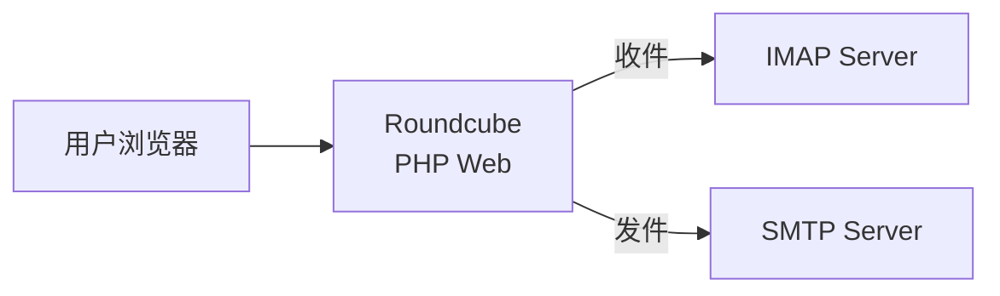
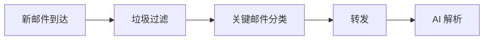
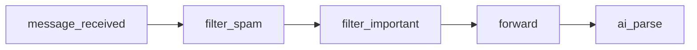

# Roundcube 1.7.1 参考分析

> 分析目的：理解成熟邮件系统的架构模式，提取可复用的设计思路，明确我们与它的差异。

---

## 1. Roundcube 是什么

**一个基于 PHP 的 Webmail 客户端**（IMAP 前端），不是邮件服务器。

- 版本：1.7.1，要求 PHP ≥8.1
- 许可证：GPL-3.0
- 技术栈：PHP + MySQL/PgSQL + IMAP + SMTP



它不存储邮件——邮件始终在 IMAP 服务器上。自己只存用户配置、会话、缓存、通讯录。

---

## 2. 核心架构

### 2.1 目录结构

```
roundcubemail/
├── public_html/          # Web 入口（HTTP 可访问）
│   └── index.php         # 单入口
├── program/
│   ├── include/          # 业务层（rcmail 主类、sendmail、action）
│   └── lib/Roundcube/    # 基础库（IMAP、SMTP、MIME、DB、插件引擎）
├── config/               # 配置（defaults.inc.php + config.inc.php）
├── plugins/              # 插件（acl、managesieve、markasjunk 等）
├── SQL/                  # 数据库迁移脚本（MySQL/PgSQL/SQLite）
├── skins/                # 前端皮肤
├── temp/                 # 临时文件
└── logs/                 # 日志
```

### 2.2 核心类职责

| 类 | 文件 | 职责 |
|----|------|------|
| `rcmail` | `program/include/rcmail.php` | 应用主类，继承 `rcube`。持有 storage/output/user/plugins 等全局实例 |
| `rcube_imap_generic` | `program/lib/Roundcube/rcube_imap_generic.php` | **纯 PHP 的 IMAP 客户端协议实现**。不依赖 PHP imap 扩展，直接 socket 通信 |
| `rcube_imap` | `program/lib/Roundcube/rcube_imap.php` | IMAP 高层封装：fetch/list/search/set_flag/copy/move |
| `rcube_storage` | `program/lib/Roundcube/rcube_storage.php` | 存储抽象基类。定义统一接口 |
| `rcube_smtp` | `program/lib/Roundcube/rcube_smtp.php` | SMTP 发送客户端。基于 PEAR Net_SMTP |
| `rcmail_sendmail` | `program/include/rcmail_sendmail.php` | 邮件撰写与发送的业务逻辑（compose/deliver/save） |
| `rcube_message` | `program/lib/Roundcube/rcube_message.php` | 邮件消息的**逻辑模型**：headers、body、parts、attachments |
| `rcube_mime` | `program/lib/Roundcube/rcube_mime.php` | MIME 解析/编码、地址解析 |
| `rcube_plugin_api` | `program/lib/Roundcube/rcube_plugin_api.php` | 插件引擎：加载、注册 hook、执行 hook |
| `rcube_plugin` | `program/lib/Roundcube/rcube_plugin.php` | 插件基类 |

### 2.3 数据库设计（MySQL）

```
users                   → username, mail_host, preferences
session                 → sess_id, ip, vars
cache / cache_index / cache_thread / cache_messages → 缓存层
identities              → user_id, email, name, signature（一个用户可有多个身份）
contacts / contactgroups / contactgroupmembers → 通讯录
responses               → 邮件回复模版（canned responses）
collected_addresses     → 自动收集的收件人地址
searches                → 保存的搜索
filestore               → 文件存储
dictionary              → 拼写检查词典
uploads                 → 上传文件元数据
system                  → 版本号等
```

⚠️ **邮件不存数据库**，只在 IMAP 服务器上。

### 2.4 插件系统（Hook 机制）

这是 Roundcube 最值得借鉴的设计：

```php
// 插件注册 hook
$this->add_hook('storage_init', [$this, 'set_flags']);

// 核心执行 hook，允许插件修改数据
$plugin = $this->rcmail->plugins->exec_hook('message_outgoing_body', [
    'body' => $body,
    'type' => $isHtml ? 'html' : 'plain',
    'message' => $MAIL_MIME,
]);
$body = $plugin['body'];  // 插件可能已修改
```

**关键 Hook 点：**
- `startup` — 请求初始化
- `authenticate` — 登录验证
- `storage_init` — IMAP 连接初始化
- `message_outgoing_body` — 邮件发送前修改正文
- `smtp_connect` — SMTP 连接参数
- `message_load` / `message_ready` — 邮件加载
- `identity_select` — 发件人身份选择

这种**过滤器链模式**非常适合我们的邮件处理管道：接收 → 过滤 → AI解析 → 转发，每个环节都可以是一个可插拔的处理器。

---

## 3. 对我们项目有参考价值的部分

### 3.1 ✅ IMAP 协议层 — 可以直接借鉴

`rcube_imap_generic.php`（约2000行）是一个完整的、纯 PHP 的 IMAP 客户端实现。如果我们的系统需要从 IMAP 服务器拉取邮件（比如轮询新邮件），这个模式直接可用：

- socket 连接管理
- TLS/SSL 支持
- IMAP command tag 机制
- FETCH / SEARCH / STORE / COPY / APPEND 命令
- 邮件头解析

### 3.2 ✅ MIME 解析 — 对 LLM 输入至关重要

`rcube_message.php` + `rcube_mime.php` 处理：
- multipart/alternative（HTML + Plain Text）
- 字符集转换（各种编码 → UTF-8）
- 附件提取
- TNEF（winmail.dat）解码
- Content-Transfer-Encoding 解码（base64/quoted-printable）

LLM 需要的是**清洗后的纯文本**——这一层我们绕不开。

### 3.3 ✅ 插件/管道架构 — 我们的过滤链

我们的邮件处理管道：



可以建模为一串 Hook：


每一步都是可配置、可替换的处理器，和 Roundcube 插件系统同构。

### 3.4 ✅ SMTP 发送 — 转发邮件

`rcube_smtp.php` + `rcmail_sendmail.php::deliver_message()` 展示了完整的 SMTP 发送流程，包括：
- DSN（送达状态通知）
- 连接异常处理
- 退避重试

我们的转发功能需要这一层。

---

## 4. Roundcube 没有的（我们需要自己构建）

| 能力 | 说明 |
|------|------|
| **邮箱地址生成** | Roundcube 假设用户已存在。我们需要 API 驱动的动态邮箱创建 |
| **邮件服务器** | Roundcube 只是客户端。我们需要 IMAP/SMTP 服务器或托管服务（如 Haraka、Postfix+Dovecot 或云邮件服务） |
| **自动转发引擎** | Roundcube 是人工操作，没有自动转发。我们需要守护进程/定时任务来执行"收到→过滤→转发"流程 |
| **内容过滤** | Roundcube 有 markasjunk 插件但依赖外部学习驱动（如 SpamAssassin）。我们需要自己的过滤规则引擎 |
| **LLM 集成** | 完全没有。需要全新构建 API 调用层 + Prompt 管理 + 结构化输出解析 |
| **邮件模版化** | Roundcube 的 `responses` 表是人工的邮件回复模版。我们需要的是 AI 驱动的邮件内容 → 结构化数据的转换 |

---

## 5. 关键结论

1. **不要 fork Roundcube。** 我们是邮件处理自动化系统，Roundcube 是人工 webmail。两者的核心流程完全不同。

2. **可以借的模式：**
   - 纯 PHP IMAP 客户端（如果你用 PHP）
   - MIME 解析逻辑
   - Hook/插件管道架构（用于邮件处理链）
   - SMTP 发送/重试机制

3. **Roundcube 的存在说明一件事：** 成熟的邮件系统都是「IMAP 服务器 + 前端/客户端」两层架构。我们的系统应该也遵循这个分层——**邮件存储用标准 IMAP 服务器（自建或托管），业务逻辑作为客户端层构建在它之上。**

4. **不必重复造轮子的部分：** MIME 解码、IMAP 协议通信有大量成熟库可用（Go: `go-imap`，Python: `imaplib`+`email`，Java: `jakarta.mail`），不必像 Roundcube 那样从 socket 开始写。
